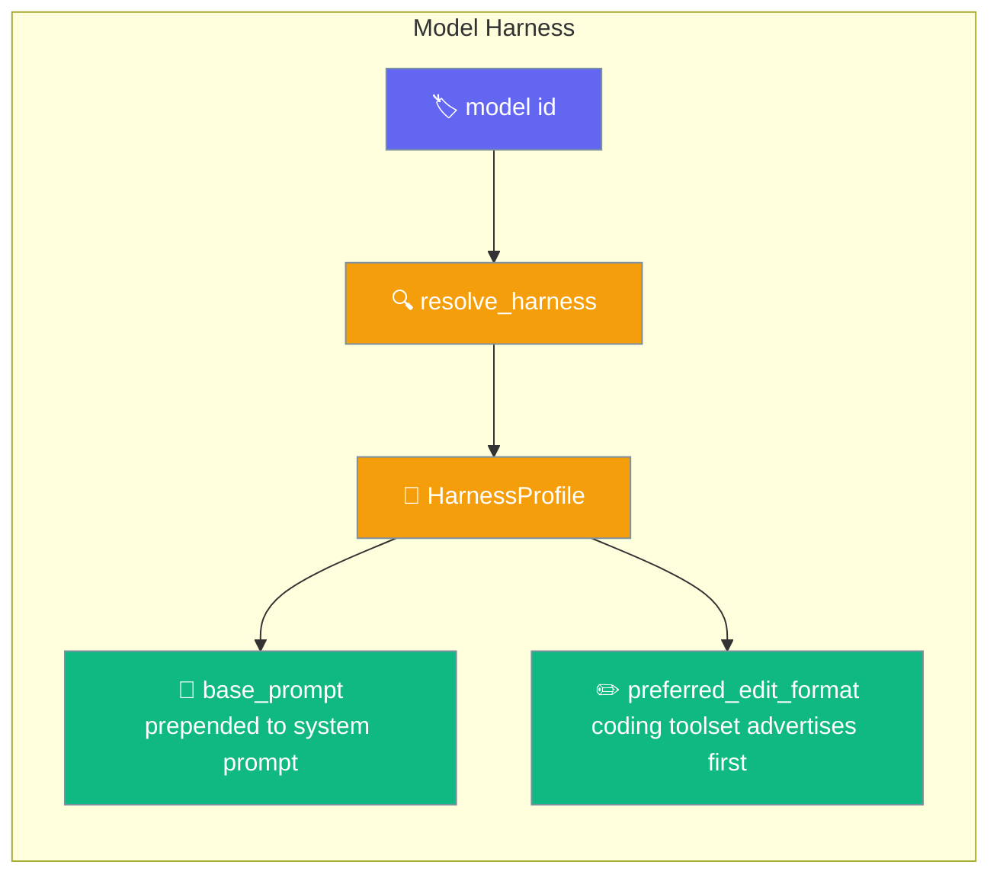
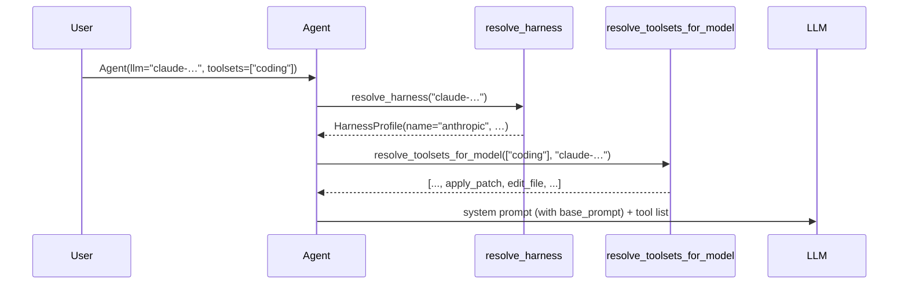
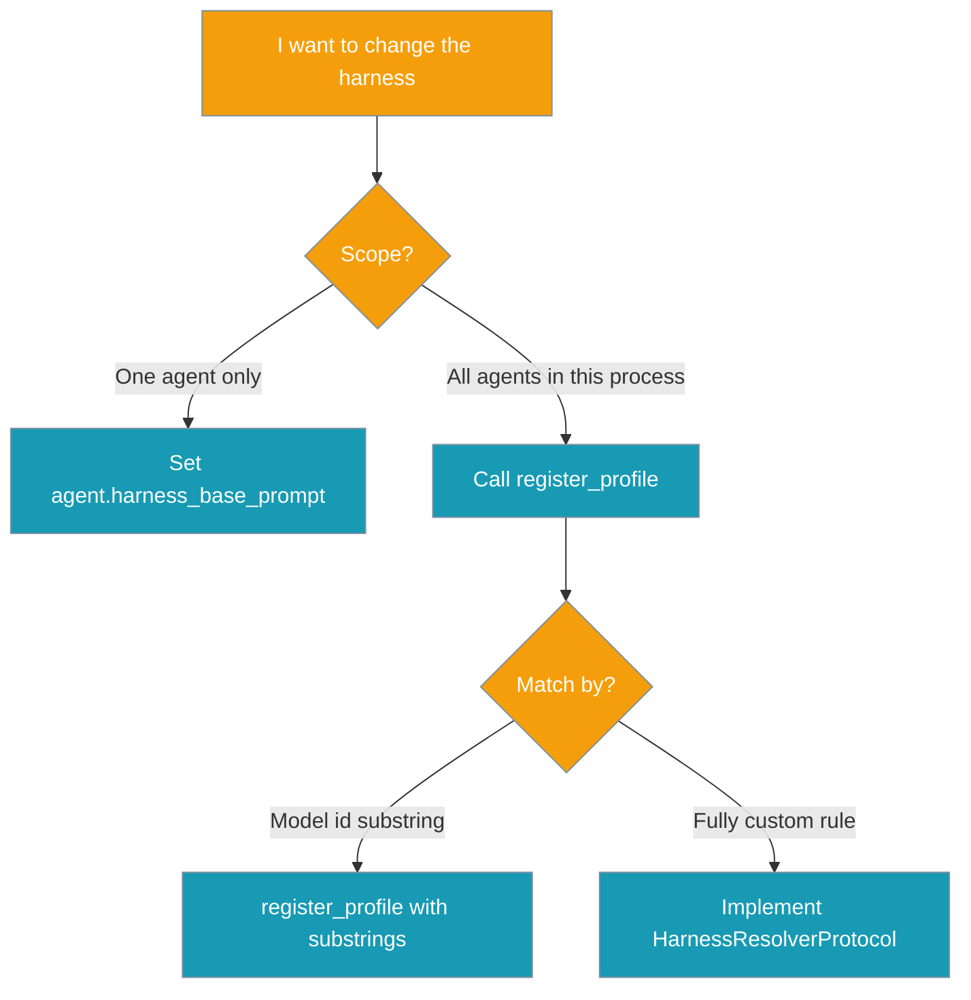

The model-family harness picks a small system-prompt fragment and the preferred file-edit tool that suit the model you're using — set no config to keep today's behaviour, or opt in by naming a supported model.

```python
from praisonaiagents import Agent

# Claude family → harness prepends patch-first guidance,
# coding toolset advertises apply_patch before edit_file.
agent = Agent(
    name="coder",
    llm="claude-opus-4",
    toolsets=["coding"],
)
agent.start("Refactor UserService to AccountService across src/")
```

The agent sets `llm="claude-opus-4"`; the harness resolves the anthropic profile and shapes both the system prompt and the coding toolset automatically.



<Note>
Unknown or non-string model ids resolve to the default profile — the system prompt and toolset order stay byte-for-byte identical to earlier versions. Adopting the harness requires no config change.
</Note>

## Quick Start

<Steps>
<Step title="Zero config (default profile — behaviour unchanged)">
```python
from praisonaiagents import Agent

agent = Agent(
    name="Coder",
    instructions="Write Python.",
)
agent.start("Write a hello-world script")
```
</Step>

<Step title="Opt in — Anthropic family">
```python
from praisonaiagents import Agent

agent = Agent(
    name="Coder",
    instructions="Edit files in this repo.",
    llm="claude-opus-4",
    toolsets=["coding"],
)
agent.start("Rename `run_all` to `run_pipeline` in src/")
```

On this agent, `apply_patch` is advertised before `edit_file`, and the system prompt gains: *"When editing files, prefer patch-style edits: use apply_patch to create or rewrite files and edit_file for targeted changes."*
</Step>

<Step title="Opt in — OpenAI family">
```python
from praisonaiagents import Agent

agent = Agent(
    name="Coder",
    instructions="Edit files in this repo.",
    llm="gpt-4o",
    toolsets=["coding"],
)
```

Here `edit_file` is advertised first, with a matching prompt fragment.
</Step>

<Step title="Inspect the resolved profile">
```python
from praisonaiagents import resolve_harness

profile = resolve_harness("claude-opus-4")
print(profile.name)                    # "anthropic"
print(profile.preferred_edit_format)   # "apply_patch"
print(profile.base_prompt)             # "When editing files, prefer patch-style edits: …"

profile = resolve_harness("gpt-4o")
print(profile.name)                    # "openai"
print(profile.preferred_edit_format)   # "edit_file"

profile = resolve_harness("mistral-large")
print(profile.name)                    # "default" (unknown → behaviour-preserving)
```
</Step>

<Step title="Register a custom family profile">
```python
from praisonaiagents import HarnessProfile, register_profile

register_profile(
    ["my-open-model", "myco/"],
    HarnessProfile(
        name="my_family",
        base_prompt="When editing files, always use apply_patch.",
        preferred_edit_format="apply_patch",
    ),
)
```
</Step>

<Step title="Override on a single agent">
```python
from praisonaiagents import Agent

agent = Agent(name="coder", llm="claude-opus-4", toolsets=["coding"])
agent.harness_base_prompt = ""   # disable the fragment for this agent only
```
</Step>
</Steps>

---

## How It Works

The agent resolves a profile from the model id at prompt-build time, then prepends the fragment and reorders the edit tools.



| Step | What happens |
|------|--------------|
| `Agent.__init__` | Reads `self.llm` (only when it's a `str`) and calls `resolve_toolsets_for_model(toolsets, model_id)` to reorder edit primitives. |
| `_build_system_prompt` | Calls `_resolve_harness_base_prompt()`; if the profile has a `base_prompt`, it's prepended as `f"{harness_prompt}\n\n{system_prompt}"`. |
| Override | An explicit `harness_base_prompt` attribute on the Agent wins over resolver output. Any error path collapses to no fragment (default profile). |
| Fallback | Falsy, unknown, or object-based model ids → default profile, no change |

---

## Which override do I need?



### Precedence

Resolution follows a fixed order, from most specific to the behaviour-preserving fallback:

> `Agent.harness_base_prompt` (explicit override)  >  `register_profile(...)` (user-registered, most recent wins)  >  built-in matchers (`anthropic`, `openai`)  >  `DEFAULT_PROFILE`

---

## Configuration Options

Import the harness API from the top level (all lazy — no import-time cost):

```python
from praisonaiagents import HarnessProfile, resolve_harness, register_profile
```

Or from the submodule for the full surface:

```python
from praisonaiagents.model_harness import (
    HarnessProfile,
    HarnessResolverProtocol,
    resolve_harness,
    register_profile,
    DEFAULT_PROFILE,
)
```

### `HarnessProfile` fields

| Field | Type | Default | Description |
|-------|------|---------|-------------|
| `name` | `str` | `"default"` | Profile identifier (e.g. `"default"`, `"anthropic"`, `"openai"`) |
| `base_prompt` | `Optional[str]` | `None` | Prompt fragment prepended to the system prompt. `None` = no fragment (behaviour-preserving) |
| `preferred_edit_format` | `Optional[str]` | `None` | Preferred edit primitive — `"apply_patch"` or `"edit_file"`. `None` = keep exposing both primitives in their current order |

### Built-in registry

First match wins; matching is case-insensitive substring on the model id.

| Match substrings (case-insensitive) | Profile name | `base_prompt` | `preferred_edit_format` |
|--------------------------------------|--------------|---------------|-------------------------|
| `claude`, `anthropic` | `anthropic` | "When editing files, prefer patch-style edits: use apply_patch to create or rewrite files and edit_file for targeted changes." | `apply_patch` |
| `gpt`, `openai`, `o1`, `o3`, `o4` | `openai` | "When editing files, prefer targeted string-replacement edits: use edit_file to modify existing files precisely." | `edit_file` |
| *(no match / falsy id)* | `default` | `None` | `None` |

### Functions

| Function | Signature | Behaviour |
|----------|-----------|-----------|
| `resolve_harness` | `resolve_harness(model: Optional[str]) -> HarnessProfile` | Case-insensitive substring match, first match wins. Falsy or unknown model → `DEFAULT_PROFILE` |
| `register_profile` | `register_profile(matchers: List[str], profile: HarnessProfile) -> None` | Prepends a `(matchers, profile)` mapping so caller profiles take precedence. Process-global and thread-safe |

Toolset helpers for advanced users composing custom coding toolsets:

```python
from praisonaiagents import resolve_toolsets_for_model
from praisonaiagents.toolsets import (
    ToolsetRegistry,  # .resolve_toolset_for_model / .resolve_toolsets_for_model
    resolve_toolsets_for_model,
)
```

---

## Common Patterns

Pass the model id and the resolver does the rest — no extra configuration required.

- **All-Claude team** — do nothing; naming a `claude-…` model activates the profile automatically.
- **Mixed models via a router** — leave `llm` unset per agent and pass the model id per call. The resolver reads `self.llm` at prompt build-time, so a mid-run model swap picks up the new profile each turn.
- **Local Ollama model treated like Claude** — register a profile at startup:

    ```python
    from praisonaiagents import HarnessProfile, register_profile

    register_profile(
        ["ollama/my-coder"],
        HarnessProfile(
            name="my",
            preferred_edit_format="apply_patch",
            base_prompt="Prefer patch-style edits.",
        ),
    )
    ```

- **Team on Llama or Mistral** — register once at startup so every downstream agent gets the family hint:

    ```python
    from praisonaiagents import HarnessProfile, register_profile

    register_profile(
        ["llama", "mistral"],
        HarnessProfile(name="open-weights", preferred_edit_format="edit_file"),
    )
    ```

- **Strip the auto fragment on one agent** — set `agent.harness_base_prompt = ""`.

### Add a house-style opener for every model

Register a profile whose matcher hits every model id the agent may see:

```python
from praisonaiagents import HarnessProfile, register_profile

register_profile(
    ["gpt", "claude", "gemini", "llama"],
    HarnessProfile(
        name="house_style",
        base_prompt="Follow the team style guide. Keep diffs small.",
    ),
)
```

### YAML usage

Nothing new to configure — the harness reads the `llm` field on the agent block, so YAML paths get the improvement automatically:

```yaml
agents:
  coder:
    role: Coding Assistant
    llm: claude-opus-4      # → anthropic profile picked up automatically
    toolsets: [coding]
```

### CLI usage

No new flag — `praisonai run` picks up the profile from the model id:

```bash
praisonai run "Refactor src/" --toolset coding --model claude-opus-4
```

### End-to-end examples

```python
from praisonaiagents import Agent, resolve_harness, register_profile, HarnessProfile

# 1) Default behaviour — no model id set → default profile, unchanged.
Agent(name="a1", toolsets=["coding"])

# 2) Claude family — patch-first harness, apply_patch advertised first.
Agent(name="a2", llm="claude-opus-4", toolsets=["coding"])

# 3) GPT family — replace-first harness, edit_file advertised first.
Agent(name="a3", llm="gpt-4o", toolsets=["coding"])

# 4) Inspect the resolver.
resolve_harness("claude-opus-4").preferred_edit_format   # "apply_patch"
resolve_harness("gpt-4o").preferred_edit_format          # "edit_file"
resolve_harness("some-unknown").preferred_edit_format    # None

# 5) Register a custom family.
register_profile(
    ["my-open-model"],
    HarnessProfile(name="my_family",
                   base_prompt="Prefer apply_patch for all edits.",
                   preferred_edit_format="apply_patch"),
)

# 6) Per-agent opt-out.
agent = Agent(name="a4", llm="claude-opus-4", toolsets=["coding"])
agent.harness_base_prompt = ""
```

---

## User Interaction Flow

A user creates an `Agent(llm="claude-opus-4", toolsets=["coding"])` and types `"Refactor src/user.py"`. The harness resolver sees `"claude-opus-4"`, picks the **anthropic** profile, prepends the patch-first guidance to the agent's system prompt, and advertises `apply_patch` before `edit_file` in the `coding` toolset. The agent reaches for `apply_patch` first — no config touched.

The same user later switches to `llm="gpt-4o"`. Same code, same toolset — the resolver now picks the **openai** profile, and the agent reaches for `edit_file` first. Still no config touched.

---

## Best Practices

<AccordionGroup>
<Accordion title="Trust the default. Ship first, tune later.">
The default profile is byte-for-byte identical to pre-harness behaviour — verified by `test_coding_toolset_unknown_model_is_byte_for_byte`. Recognised families gain tuned guidance automatically; everything else stays the same.
</Accordion>

<Accordion title="Register profiles at boot, not per-request.">
The registry is process-global. Call `register_profile` once during application startup — registering inside request handlers repeatedly prepends duplicate mappings.

```python
def setup_harness():
    register_profile(["my-open-model"], HarnessProfile(name="my_family"))
```
</Accordion>

<Accordion title="Match on stable substrings.">
Matchers are case-insensitive substring hits against the model id, first match wins. Keep them short and stable — `"claude"`, `"gpt"` — so new model versions in the same family match without edits. Registrations *prepend*, so a custom mapping overrides the built-in defaults.
</Accordion>

<Accordion title="Don't rely on tool ordering being enforced.">
Both edit primitives remain available; the model can still call the non-preferred one. Ordering is a hint, not a constraint.
</Accordion>

<Accordion title="Pass the model id as a string when you want the harness on.">
Object-based LLMs resolve to the default profile by design, so custom LLM wrappers don't silently pick up an unrelated family's guidance. Pass a string `llm=` model id to opt in.
</Accordion>
</AccordionGroup>

---

<Warning>
**Backward compatibility:** Default behaviour is unchanged. Agents that don't set a supported `llm` string, don't set `toolsets`, or use a non-string LLM object continue producing byte-for-byte identical system prompts and tool orderings.
</Warning>

---

## Related

<CardGroup cols={2}>
<Card title="Toolsets" icon="toolbox" href="/docs/features/toolsets">
  The coding toolset whose edit-primitive order the harness reorders.
</Card>
<Card title="File Editing" icon="file-pen" href="/docs/features/file-editing">
  The `edit_file` and `apply_patch` primitives themselves
</Card>
<Card title="Rules" icon="scroll" href="/docs/features/rules">
  The other lever that shapes the assembled system prompt
</Card>
<Card title="Prompt Cache Optimization" icon="database" href="/docs/features/prompt-cache-optimization">
  The fragment is prepended, so it participates in cache-key ordering
</Card>
<Card title="Models" icon="robot" href="/docs/models">
  The model id you pass is the trigger for profile resolution.
</Card>
</CardGroup>
