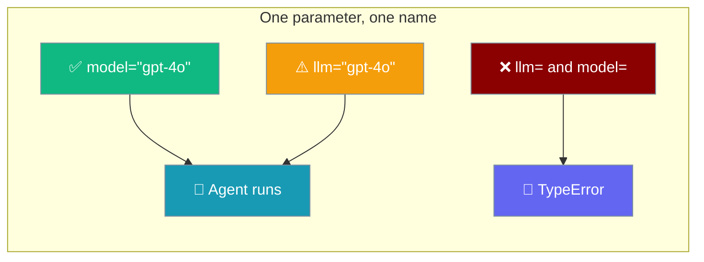
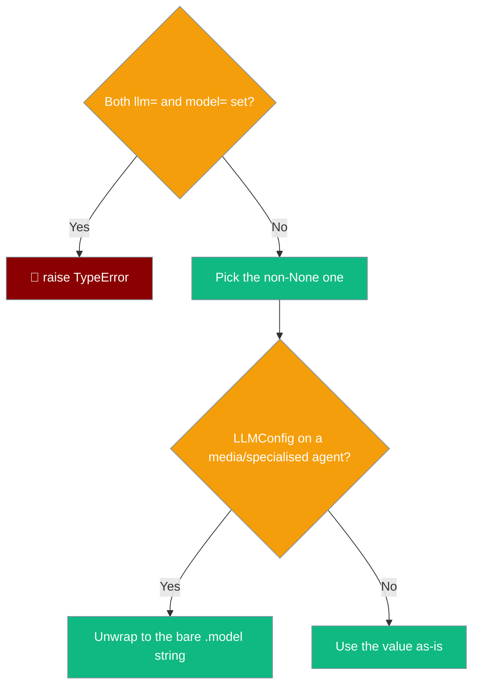

`model=` is the canonical name for the model on every agent class; `llm=` is a deprecated alias for it.



## Quick Start

<Steps>
<Step title="Use the canonical name">
```python
from praisonaiagents import Agent

agent = Agent(
    instructions="Summarise the given article in three bullets.",
    model="gpt-4o",
)

agent.start("<article text>")
```
</Step>

<Step title="The deprecated alias still works">
```python
from praisonaiagents import Agent

agent = Agent(
    instructions="Summarise the given article.",
    llm="gpt-4o",
)
```

<Note>
`llm=` still works but emits a `DeprecationWarning`. Move to `model=` at your convenience.
</Note>
</Step>

<Step title="Passing both is refused">
```python
from praisonaiagents import Agent

# ❌ Passing both is refused
Agent(instructions="…", llm="gpt-4o", model="gpt-3.5-turbo")
# TypeError: Agent() received both llm= and model=. They are the same
#   parameter, so passing both is ambiguous. Pass only one; model= is
#   the canonical name (llm= is a deprecated alias).
```
</Step>
</Steps>

---

## How It Works

Every agent class routes `llm=` and `model=` through one resolver so the rule is identical everywhere.



| Call | Result |
|------|--------|
| `Agent(model="gpt-4o")` | ✅ Canonical. Preferred everywhere. |
| `Agent(llm="gpt-4o")` | ⚠️ Deprecated alias. Works, emits a `DeprecationWarning`. |
| `Agent(llm="gpt-4o", model="gpt-3.5-turbo")` | ❌ `TypeError` — same parameter, so passing both is ambiguous. |
| `Agent(model=LLMConfig(model="gpt-4o", …))` | ✅ Accepted. Media/specialised agents unwrap it to the bare model string. |

---

## Where It Applies

The `llm=` / `model=` pair resolves the same way on every class below.

| Class | Accepts `model=` | Accepts `llm=` (deprecated) |
|-------|:---:|:---:|
| `Agent` | ✅ | ✅ |
| `AgentTeam` | ✅ | ✅ |
| `AgentFlow` | ✅ | ✅ |
| `VisionAgent` | ✅ | ✅ |
| `AudioAgent` | ✅ | ✅ |
| `OCRAgent` | ✅ | ✅ |
| `VideoAgent` | ✅ | ✅ |
| `EmbeddingAgent` | ✅ | ✅ |
| `ImageAgent` | ✅ | ✅ |
| `ContextAgent` | ✅ | ✅ |
| `CodeAgent` | ✅ | ✅ |
| `RealtimeAgent` | ✅ | ✅ |

<Note>
`manager_llm=` on `AgentTeam` / `AgentFlow` is **separate** and unchanged — it is the hierarchical manager's model and never touches the members.
</Note>

```python
from praisonaiagents import Agent, AgentTeam, Task

# Default model for members that did not name one themselves
team = AgentTeam(
    agents=[Agent(instructions="Researcher"), Agent(instructions="Writer")],
    tasks=[Task(description="Write a two-paragraph brief on quantum sensing.")],
    model="gpt-4o-mini",
)

team.start()
```

---

## Migration

<AccordionGroup>
<Accordion title="I use llm= in every example">
No code change is required — `llm=` still works. Move to `model=` at your convenience; it is the canonical name.
</Accordion>

<Accordion title="I pass both llm= and model= today">
Pick one. `model=` is the canonical name. Passing both now raises `TypeError` because the two are the same parameter and guessing a winner could change which vendor is billed.
</Accordion>

<Accordion title="I pass an LLMConfig to a specialised agent">
On `VisionAgent`, `AudioAgent`, `OCRAgent`, `VideoAgent`, `EmbeddingAgent`, `CodeAgent`, `RealtimeAgent`, `ImageAgent`, and `ContextAgent` you no longer need to unwrap an `LLMConfig` yourself. The class stores its `.model` string and keeps its own `base_url=` / `api_key=`.
</Accordion>

<Accordion title="I use CodeAgent(llm=…), RealtimeAgent(llm=…), AgentTeam(llm=…), or AgentFlow(llm=…)">
Those four now also accept `model=` (canonical). The alias `llm=` still works.
</Accordion>
</AccordionGroup>

---

## Related

<CardGroup cols={2}>
<Card title="LLM Config" icon="sliders" href="/features/llm-config">
  Pass an `LLMConfig` object to `model=` for `base_url`, `api_key`, and fallbacks.
</Card>
<Card title="Legacy Agent Parameters" icon="arrow-right-arrow-left" href="/features/agent-legacy-params">
  Other deprecated `Agent()` parameters and their replacements.
</Card>
</CardGroup>
