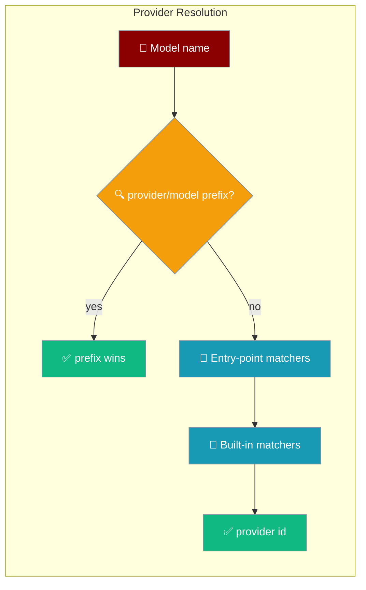
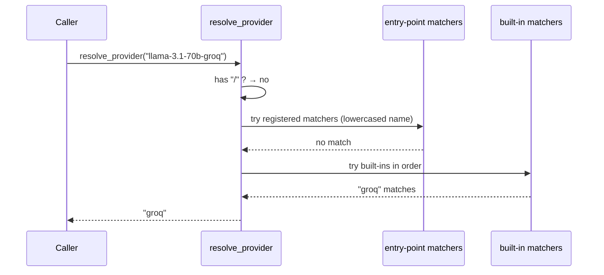

Model provider plugins map a bare model name (`llama-3.1-70b`, `claude-sonnet-4-6`, `custom-model`) to its canonical provider id (`groq`, `anthropic`, ...) so runtime and config resolution work for every vendor — not just three hard-coded ones.

```python
from praisonaiagents.llm import resolve_provider

resolve_provider("claude-sonnet-4-6")   # "anthropic"
resolve_provider("openai/gpt-4o")        # "openai"  (explicit prefix wins)
resolve_provider("llama-3.1-70b-groq")   # "groq"
```

Your agent picks a model by name; PraisonAI resolves the provider so `providers.<name>.runtime_default` applies automatically.



## Quick Start

<Steps>
<Step title="Resolve a built-in provider">
```python
from praisonaiagents.llm import resolve_provider

print(resolve_provider("gemini-1.5-pro"))   # "google"
print(resolve_provider("deepseek-chat"))     # "deepseek"
print(resolve_provider("grok-2"))            # "xai"
```
</Step>

<Step title="Use it from YAML runtime config">
```yaml
framework: praisonai

providers:
  groq:
    runtime_default: praisonai   # applies to any groq model

agents:
  fast:
    role: Responder
    goal: Answer quickly
    instructions: "Answer in one sentence"
    llm: llama-3.1-70b-groq       # resolves to provider "groq"
```
</Step>
</Steps>

---

## How It Works

`resolve_provider(model_name)` returns the provider id in a fixed precedence.



| Step | Rule |
|------|------|
| 1. Explicit prefix | `provider/model` → text before the first `/`, lowercased (`openai/gpt-4o` → `openai`). |
| 2. Entry-point matchers | Callables registered under `praisonaiagents.model_providers`; the entry-point **name** is the returned provider id. Registered matchers run **before** built-ins, so a plugin can override built-in detection. |
| 3. Built-in matchers | The shipped table below, tried in order. |

Returns `None` when nothing matches.

### Built-in providers

| Provider id | Match rule |
|-------------|-----------|
| `anthropic` | `"claude"` anywhere in the name (cloud-vendored forms like `us.anthropic.claude-3-5-sonnet` still resolve) |
| `openai` | starts with `gpt-`, `o1-`, `o3-`, `o4-`, `chatgpt-` |
| `google` | starts with `gemini-`, `gemma-` |
| `groq` | starts with `llama-`, `mixtral-`, `gemma2-` **and** contains `groq` |
| `cohere` | starts with `command-`, `c4ai-` |
| `mistral` | starts with `mistral-`, `codestral-`, `open-mistral-`, `open-mixtral-` |
| `ollama` | starts with `ollama/` |
| `deepseek` | starts with `deepseek-` |
| `xai` | starts with `grok-` |
| `perplexity` | starts with `pplx-`, `sonar-` |

---

## Publish a Plugin

Register a vendor out-of-tree — pip-installable, no PraisonAI code changes.

<Steps>
<Step title="Declare the entry point">
```toml
# your-plugin/pyproject.toml
[project.entry-points."praisonaiagents.model_providers"]
bedrock = "my_plugin.matchers:is_bedrock_model"
```

The entry-point **name** (`bedrock`) is the provider id `resolve_provider(...)` returns on a match — it must equal the key you use under `providers:` in YAML.
</Step>

<Step title="Write the matcher">
```python
# my_plugin/matchers.py
def is_bedrock_model(model_name_lowercased: str) -> bool:
    return (
        model_name_lowercased.startswith("bedrock/")
        or ".anthropic.claude-" in model_name_lowercased
    )
```

The matcher receives the **already-lowercased** model name and returns `bool`.
</Step>

<Step title="Use it">
```python
# after `pip install your-plugin`
from praisonaiagents.llm import resolve_provider

resolve_provider("bedrock/claude-3")   # "bedrock"
```
</Step>
</Steps>

<Note>
**Registered matchers take precedence over built-ins.** Register a matcher named `anthropic` to override the built-in `claude` detection, for example.
</Note>

<Warning>
**Failure isolation.** A broken plugin — import error, load error, or a matcher that raises — is skipped silently, so provider inference never falls over on a third-party bug. If your plugin seems ignored, test the matcher import directly.
</Warning>

---

## What Consumes This

`praisonai_adapter._resolve_agent_runtime` calls `resolve_provider(agent_model)` to pick `providers.<name>.runtime_default`. When no provider matches, a `logger.debug` line explains the miss and the provider-scoped default is not consulted:

```
runtime resolution: no provider registered for model '<model>'; provider-scoped 'runtime_default' not consulted
```

See [Runtime Selection](/features/runtime-selection) for the full resolution order.

---

## Public API

```python
# lazy re-export (preferred)
from praisonaiagents.llm import resolve_provider

# canonical module
from praisonaiagents.llm.model_providers import resolve_provider
```

| Symbol | Signature | Description |
|--------|-----------|-------------|
| `resolve_provider` | `(model_name: str) -> Optional[str]` | Returns the canonical provider id, or `None` if no matcher hits. |

---

## Best Practices

<AccordionGroup>
<Accordion title="Match the entry-point name to your provider key">
`resolve_provider(...)` returns the entry-point **name**. Name it exactly what you use under `providers:` in YAML, or `runtime_default` won't apply.
</Accordion>

<Accordion title="Accept the lowercased name">
Matchers receive the model name already lowercased. Don't re-lowercase or compare against mixed-case constants — write your checks in lowercase.
</Accordion>

<Accordion title="Keep matchers cheap and total">
Matchers run on every unprefixed model name. Use simple `startswith` / `in` checks and never raise — a raising matcher is skipped, and slow ones tax every resolution.
</Accordion>

<Accordion title="Prefer explicit prefixes for one-offs">
For a single model, `provider/model` in YAML (`bedrock/claude-3`) resolves without any plugin — reserve entry points for whole vendor families.
</Accordion>
</AccordionGroup>

---

## Related

<CardGroup cols={2}>
<Card title="Runtime Selection" icon="play" href="/features/runtime-selection">
  Choose which runtime executes each model, per provider or per agent
</Card>
<Card title="Integration Registry" icon="puzzle-piece" href="/features/integration-registry">
  Same static-map + entry-point + built-ins-win pattern for integrations
</Card>
</CardGroup>
