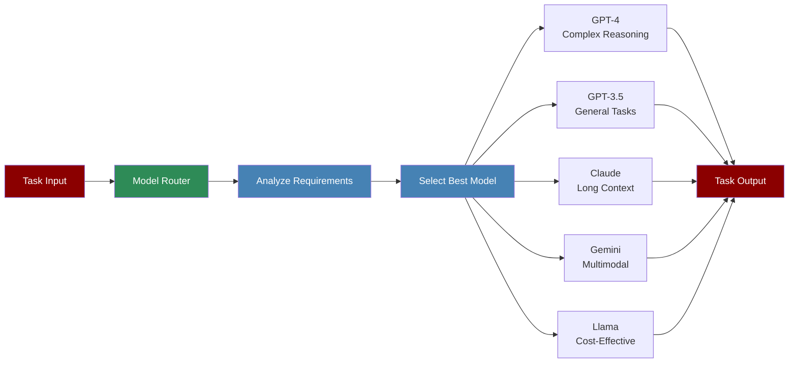

The Model Router System intelligently selects the most appropriate LLM for each task based on requirements, capabilities, and cost considerations, ensuring optimal performance and resource utilization.

## Quick Start

<Steps>
    <Step title="Install Package">
        First, install the PraisonAI Agents package:
        ```bash
        pip install praisonaiagents
        ```
    </Step>

    <Step title="Set API Keys">
        Set your API keys as environment variables:
        ```bash
        export OPENAI_API_KEY=your_openai_key_here
        export ANTHROPIC_API_KEY=your_anthropic_key_here
        export GOOGLE_API_KEY=your_google_key_here
        ```
    </Step>

    <Step title="Create a file">
        Create a new file `model_router_example.py`:
        ```python
        from praisonaiagents import Agent, Task, Agents
        from praisonaiagents.llm import ModelRouter

        # Initialize the model router
        router = ModelRouter()

        # Analyze task complexity and select appropriate model
        task_description = "Calculate the sum of 15 + 27"
        complexity = router.analyze_task_complexity(task_description)
        selected_model = router.select_model(task_description)

        print(f"Task complexity: {complexity}")
        print(f"Selected model: {selected_model}")

        # Create an agent with the selected model
        smart_agent = Agent(
            name="Smart Assistant",
            role="Adaptive AI Assistant",
            goal="Complete tasks using the most appropriate model",
            instructions="Analyze task requirements and provide accurate results",
            llm=selected_model  # Use the model selected by router
        )

        # Create a simple task
        simple_task = Task(
            name="simple_calculation",
            description=task_description,
            expected_output="The numerical result",
            agent=smart_agent
        )

        # Create and run workflow
        workflow = Agents(
            agents=[smart_agent],
            tasks=[simple_task]
        )

        print("Starting Model Router Workflow...")
        print("=" * 50)

        results = workflow.start()
        print("Done!")
        ```
    </Step>

    <Step title="Run the Example">
        Execute your model router example:
        ```bash
        python model_router_example.py
        ```
    </Step>
</Steps>

<Note>
  **Requirements**
  - Python 3.10 or higher
  - API keys for the models you want to use
  - Basic understanding of different LLM capabilities
</Note>


## YAML-Based Model Configuration

You can configure custom models directly in your `agents.yaml` or `workflow.yaml` files. This allows you to define model profiles with costs, capabilities, and complexity levels without writing Python code.

### Basic Configuration

Add a `models` section to your YAML file:

```yaml
# agents.yaml or workflow.yaml
name: My Workflow

# Custom models configuration
models:
  cheap-fast:
    provider: openai
    complexity: [simple]
    cost_per_1k: 0.0001
    capabilities: [text]
    context_window: 16000
  
  balanced:
    provider: openai
    complexity: [moderate]
    cost_per_1k: 0.001
    capabilities: [text, function-calling]
    context_window: 128000
  
  premium:
    provider: anthropic
    complexity: [complex, very_complex]
    cost_per_1k: 0.015
    capabilities: [text, vision, function-calling]
    context_window: 200000
    strengths: [reasoning, analysis, code-generation]

agents:
  researcher:
    name: Researcher
    role: Research Analyst
    goal: Research topics
    llm: balanced  # Use specific model
```

### Model Configuration Fields

| Field | Type | Description |
|-------|------|-------------|
| `provider` | string | Provider name: `openai`, `anthropic`, `google`, `openrouter`, etc. |
| `complexity` | list | Complexity levels: `simple`, `moderate`, `complex`, `very_complex` |
| `cost_per_1k` | float | Cost per 1,000 tokens in USD |
| `capabilities` | list | Model capabilities: `text`, `vision`, `function-calling`, `streaming` |
| `context_window` | int | Maximum context window size in tokens |
| `supports_tools` | bool | Whether the model supports tool/function calling |
| `supports_streaming` | bool | Whether the model supports streaming responses |
| `strengths` | list | Model strengths: `reasoning`, `code-generation`, `analysis`, etc. |

### Per-Agent LLM Configuration

Each agent can specify its own LLM configuration:

```yaml
agents:
  # Fixed model assignment
  classifier:
    name: Classifier
    role: Request Classifier
    goal: Classify requests
    llm: cheap-fast  # Always use cheap model
  
  # Auto-routing based on task complexity
  researcher:
    name: Researcher
    role: Research Analyst
    goal: Research topics
    llm_routing: auto  # Enable auto-routing
    llm_models: [balanced, premium]  # Models to choose from
  
  # Premium model for quality output
  writer:
    name: Writer
    role: Content Writer
    goal: Write high-quality content
    llm: premium  # Always use premium
```

### Routing Strategies

Configure routing strategy in the workflow section:

```yaml
workflow:
  verbose: true
  router: true  # Enable model routing
  routing_strategy: cost-optimized  # Options: auto, cost-optimized, performance-optimized
```

| Strategy | Description |
|----------|-------------|
| `auto` | Automatically select based on task complexity |
| `cost-optimized` | Prefer cheaper models while meeting requirements |
| `performance-optimized` | Prefer more capable models for quality |

### Complete Example

```yaml
name: Cost-Optimized Model Routing Workflow
description: Uses custom models with automatic routing

models:
  gpt-4o-mini:
    provider: openai
    complexity: [simple, moderate]
    cost_per_1k: 0.00075
    capabilities: [text, function-calling]
  
  claude-3-5-sonnet:
    provider: anthropic
    complexity: [moderate, complex, very_complex]
    cost_per_1k: 0.009
    capabilities: [text, vision, function-calling]
    strengths: [reasoning, code-generation, analysis]

workflow:
  verbose: true
  router: true
  routing_strategy: cost-optimized

agents:
  classifier:
    name: Classifier
    role: Request Classifier
    goal: Classify incoming requests
    llm: gpt-4o-mini

  researcher:
    name: Researcher
    role: Research Analyst
    goal: Research topics thoroughly
    llm_routing: auto
    llm_models: [gpt-4o-mini, claude-3-5-sonnet]

steps:
  - agent: classifier
    action: "Classify: {{input}}"
    
  - name: routing
    route:
      simple: [researcher]
      complex: [researcher]
      default: [researcher]
```

### CLI Usage

Create a workflow from template:

```bash
praisonai workflow create --template model-routing --output my_workflow.yaml
```

Run with the `--router` flag for automatic model selection:

```bash
praisonai "Your task here" --router
praisonai "Your task here" --router --router-provider anthropic
```

## Understanding Model Router

<Card title="What is Model Router?" icon="question">
  The Model Router:
  - Automatically selects the best LLM for each task
  - Considers task complexity, context length, and requirements
  - Optimizes for performance and cost
  - Supports fallback options if primary model fails
  - Provides detailed routing history and analytics
</Card>

## Features

<CardGroup cols={2}>
  <Card title="Intelligent Selection" icon="brain">
    Analyzes task requirements to choose the optimal model.
  </Card>
  <Card title="Cost Optimization" icon="dollar-sign">
    Balances performance needs with cost considerations.
  </Card>
  <Card title="Capability Matching" icon="puzzle-piece">
    Matches task requirements with model capabilities.
  </Card>
  <Card title="Fallback Support" icon="shield">
    Automatically switches to backup models if needed.
  </Card>
</CardGroup>

## Configuration Options

```python
# Initialize router with custom configuration
router = ModelRouter(
    config={
        # Model selection preferences
        "prefer_cost_effective": True,
        "max_cost_per_token": 0.001,
        
        # Model capabilities
        "model_capabilities": {
            "gpt-4": {
                "max_tokens": 128000,
                "strengths": ["reasoning", "coding", "analysis"],
                "cost_per_1k_tokens": 0.03
            },
            "gpt-3.5-turbo": {
                "max_tokens": 16000,
                "strengths": ["general", "fast"],
                "cost_per_1k_tokens": 0.001
            },
            "claude-3-sonnet": {
                "max_tokens": 200000,
                "strengths": ["long_context", "writing"],
                "cost_per_1k_tokens": 0.015
            }
        },
        
        # Routing rules
        "routing_rules": {
            "complex_reasoning": ["gpt-4", "claude-3-opus"],
            "simple_tasks": ["gpt-3.5-turbo", "llama-3"],
            "long_context": ["claude-3-sonnet", "gpt-4-turbo"],
            "coding": ["gpt-4", "deepseek-coder"],
            "multimodal": ["gpt-4-vision", "gemini-pro-vision"]
        },
        
        # Fallback configuration
        "fallback_enabled": True,
        "fallback_models": ["gpt-3.5-turbo", "llama-3"]
    }
)

# Use router with specific task hints
result = router.route_task(
    task_description="Analyze complex financial data",
    requirements={
        "complexity": "high",
        "domain": "finance",
        "expected_tokens": 2000
    }
)
```

## Advanced Usage

### Custom Routing Logic

```python
from praisonaiagents.llm import ModelRouter, RoutingCriteria

class CustomRouter(ModelRouter):
    def custom_routing_logic(self, task, criteria):
        # Add custom logic for specific use cases
        if "legal" in task.description.lower():
            return "claude-3-opus"  # Better for legal documents
        
        if criteria.urgency == "high":
            return "gpt-3.5-turbo"  # Fastest response
        
        return super().route(task, criteria)

# Use custom router
custom_router = CustomRouter()
```

### Routing Analytics

```python
# Get routing statistics
stats = router.get_statistics()
print(f"Total tasks routed: {stats['total_tasks']}")
print(f"Model usage breakdown: {stats['model_usage']}")
print(f"Average cost per task: ${stats['avg_cost']}")
print(f"Performance metrics: {stats['performance']}")

# Export routing history
router.export_history("routing_history.json")
```

## Model Selection Criteria

The router considers multiple factors when selecting models:

<CardGroup cols={2}>
  <Card title="Task Complexity" icon="brain">
    - Simple calculations → Cost-effective models
    - Complex reasoning → Advanced models
    - Creative tasks → Specialized creative models
  </Card>
  
  <Card title="Context Length" icon="file-lines">
    - Short context → Standard models
    - Medium context → Enhanced context models
    - Long context → Specialized long-context models
  </Card>
  
  <Card title="Response Time" icon="clock">
    - Real-time needs → Fast models
    - Batch processing → Optimized for throughput
    - Quality priority → Best performing models
  </Card>
  
  <Card title="Cost Constraints" icon="money-bill">
    - Budget limits → Cost-effective options
    - Quality/cost balance → Optimal value models
    - Premium requirements → Top-tier models
  </Card>
</CardGroup>

## Best Practices

<AccordionGroup>
  <Accordion title="Define Clear Requirements">
    Provide specific task requirements to help the router make better decisions:
    ```python
    task = Task(
        description="...",
        requirements={
            "complexity": "high",
            "context_length": 10000,
            "domain": "technical",
            "quality_priority": 0.8
        }
    )
    ```
  </Accordion>

  <Accordion title="Monitor Performance">
    Regularly review routing decisions and performance:
    ```python
    # Enable detailed logging
    router = ModelRouter(output="verbose", log_decisions=True)
    
    # Review performance after execution
    performance_report = router.generate_performance_report()
    ```
  </Accordion>

  <Accordion title="Set Cost Limits">
    Configure budget constraints to control costs:
    ```python
    router = ModelRouter(
        max_cost_per_task=0.50,
        daily_budget=100.00,
        alert_on_threshold=True
    )
    ```
  </Accordion>
</AccordionGroup>

## Troubleshooting

<CardGroup cols={2}>
  <Card title="Routing Issues" icon="triangle-exclamation">
    If wrong models are selected:
    - Review task requirements
    - Check routing rules configuration
    - Enable verbose logging
    - Verify model availability
  </Card>

  <Card title="Performance Problems" icon="gauge">
    If performance is suboptimal:
    - Analyze routing history
    - Adjust selection criteria
    - Update model capabilities
    - Consider custom routing logic
  </Card>
</CardGroup>

## Next Steps

<CardGroup cols={2}>
  <Card title="Model Capabilities" icon="star" href="./model-capabilities">
    Deep dive into model-specific capabilities and features
  </Card>
  <Card title="Router Agent" icon="robot" href="./routing">
    Learn about the RouterAgent for dynamic task routing
  </Card>
</CardGroup>

<Note>
  The Model Router System continuously learns from usage patterns to improve selection accuracy over time. Regular monitoring and adjustment of routing rules ensures optimal performance.
</Note>