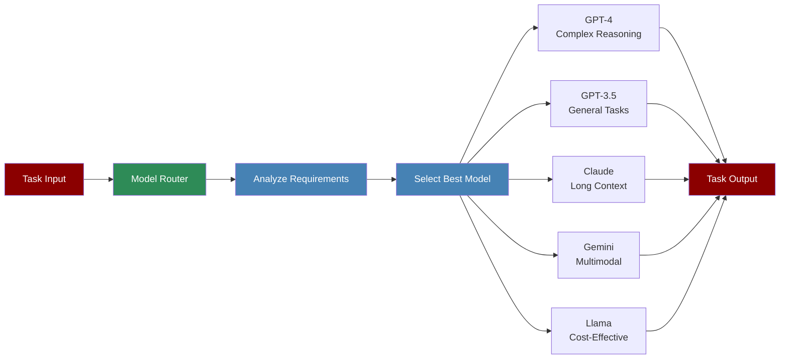

The Model Router System intelligently selects the most appropriate LLM for each task based on requirements, capabilities, and cost considerations, ensuring optimal performance and resource utilization.

## Quick Start

<Steps>
    <Step title="Install Package">
        First, install the PraisonAI Agents package:
        ```bash
        pip install praisonaiagents
        ```
    </Step>

    <Step title="Set API Keys">
        Set your API keys as environment variables:
        ```bash
        export OPENAI_API_KEY=your_openai_key_here
        export ANTHROPIC_API_KEY=your_anthropic_key_here
        export GOOGLE_API_KEY=your_google_key_here
        ```
    </Step>

    <Step title="Create a file">
        Create a new file `model_router_example.py`:
        ```python
        from praisonaiagents import Agent, Task, PraisonAIAgents
        from praisonaiagents.llm import ModelRouter

        # Initialize the model router
        router = ModelRouter()

        # Create an agent with automatic model selection
        smart_agent = Agent(
            name="Smart Assistant",
            role="Adaptive AI Assistant",
            goal="Complete tasks using the most appropriate model",
            instructions="Analyze task requirements and use the best model",
            llm=router  # Model router will select the best model
        )

        # Create tasks with different requirements
        simple_task = Task(
            name="simple_calculation",
            description="Calculate the sum of 15 + 27",
            expected_output="The numerical result",
            agent=smart_agent
        )

        complex_task = Task(
            name="complex_reasoning",
            description="Analyze the implications of quantum computing on cryptography",
            expected_output="Detailed analysis with multiple perspectives",
            agent=smart_agent
        )

        long_context_task = Task(
            name="document_analysis",
            description="Summarize this 50-page research paper",
            expected_output="Comprehensive summary with key findings",
            agent=smart_agent,
            context_length=50000  # Triggers selection of long-context model
        )

        # Create and run workflow
        workflow = PraisonAIAgents(
            agents=[smart_agent],
            tasks=[simple_task, complex_task, long_context_task],
            verbose=True
        )

        print("Starting Model Router Workflow...")
        print("=" * 50)

        results = workflow.start()

        # Display which models were selected
        for task_name, model_used in router.get_routing_history().items():
            print(f"Task: {task_name} -> Model: {model_used}")
        ```
    </Step>

    <Step title="Run the Example">
        Execute your model router example:
        ```bash
        python model_router_example.py
        ```
    </Step>
</Steps>

<Note>
  **Requirements**
  - Python 3.10 or higher
  - API keys for the models you want to use
  - Basic understanding of different LLM capabilities
</Note>

## Understanding Model Router

<Card title="What is Model Router?" icon="question">
  The Model Router:
  - Automatically selects the best LLM for each task
  - Considers task complexity, context length, and requirements
  - Optimizes for performance and cost
  - Supports fallback options if primary model fails
  - Provides detailed routing history and analytics
</Card>

## Features

<CardGroup cols={2}>
  <Card title="Intelligent Selection" icon="brain">
    Analyzes task requirements to choose the optimal model.
  </Card>
  <Card title="Cost Optimization" icon="dollar-sign">
    Balances performance needs with cost considerations.
  </Card>
  <Card title="Capability Matching" icon="puzzle-piece">
    Matches task requirements with model capabilities.
  </Card>
  <Card title="Fallback Support" icon="shield">
    Automatically switches to backup models if needed.
  </Card>
</CardGroup>

## Configuration Options

```python
# Initialize router with custom configuration
router = ModelRouter(
    config={
        # Model selection preferences
        "prefer_cost_effective": True,
        "max_cost_per_token": 0.001,
        
        # Model capabilities
        "model_capabilities": {
            "gpt-4": {
                "max_tokens": 128000,
                "strengths": ["reasoning", "coding", "analysis"],
                "cost_per_1k_tokens": 0.03
            },
            "gpt-3.5-turbo": {
                "max_tokens": 16000,
                "strengths": ["general", "fast"],
                "cost_per_1k_tokens": 0.001
            },
            "claude-3-sonnet": {
                "max_tokens": 200000,
                "strengths": ["long_context", "writing"],
                "cost_per_1k_tokens": 0.015
            }
        },
        
        # Routing rules
        "routing_rules": {
            "complex_reasoning": ["gpt-4", "claude-3-opus"],
            "simple_tasks": ["gpt-3.5-turbo", "llama-3"],
            "long_context": ["claude-3-sonnet", "gpt-4-turbo"],
            "coding": ["gpt-4", "deepseek-coder"],
            "multimodal": ["gpt-4-vision", "gemini-pro-vision"]
        },
        
        # Fallback configuration
        "fallback_enabled": True,
        "fallback_models": ["gpt-3.5-turbo", "llama-3"]
    }
)

# Use router with specific task hints
result = router.route_task(
    task_description="Analyze complex financial data",
    requirements={
        "complexity": "high",
        "domain": "finance",
        "expected_tokens": 2000
    }
)
```

## Advanced Usage

### Custom Routing Logic

```python
from praisonaiagents.llm import ModelRouter, RoutingCriteria

class CustomRouter(ModelRouter):
    def custom_routing_logic(self, task, criteria):
        # Add custom logic for specific use cases
        if "legal" in task.description.lower():
            return "claude-3-opus"  # Better for legal documents
        
        if criteria.urgency == "high":
            return "gpt-3.5-turbo"  # Fastest response
        
        return super().route(task, criteria)

# Use custom router
custom_router = CustomRouter()
```

### Routing Analytics

```python
# Get routing statistics
stats = router.get_statistics()
print(f"Total tasks routed: {stats['total_tasks']}")
print(f"Model usage breakdown: {stats['model_usage']}")
print(f"Average cost per task: ${stats['avg_cost']}")
print(f"Performance metrics: {stats['performance']}")

# Export routing history
router.export_history("routing_history.json")
```

## Model Selection Criteria

The router considers multiple factors when selecting models:

<CardGroup cols={2}>
  <Card title="Task Complexity" icon="brain">
    - Simple calculations → Cost-effective models
    - Complex reasoning → Advanced models
    - Creative tasks → Specialized creative models
  </Card>
  
  <Card title="Context Length" icon="file-lines">
    - Short context → Standard models
    - Medium context → Enhanced context models
    - Long context → Specialized long-context models
  </Card>
  
  <Card title="Response Time" icon="clock">
    - Real-time needs → Fast models
    - Batch processing → Optimized for throughput
    - Quality priority → Best performing models
  </Card>
  
  <Card title="Cost Constraints" icon="money-bill">
    - Budget limits → Cost-effective options
    - Quality/cost balance → Optimal value models
    - Premium requirements → Top-tier models
  </Card>
</CardGroup>

## Best Practices

<AccordionGroup>
  <Accordion title="Define Clear Requirements">
    Provide specific task requirements to help the router make better decisions:
    ```python
    task = Task(
        description="...",
        requirements={
            "complexity": "high",
            "context_length": 10000,
            "domain": "technical",
            "quality_priority": 0.8
        }
    )
    ```
  </Accordion>

  <Accordion title="Monitor Performance">
    Regularly review routing decisions and performance:
    ```python
    # Enable detailed logging
    router = ModelRouter(verbose=True, log_decisions=True)
    
    # Review performance after execution
    performance_report = router.generate_performance_report()
    ```
  </Accordion>

  <Accordion title="Set Cost Limits">
    Configure budget constraints to control costs:
    ```python
    router = ModelRouter(
        max_cost_per_task=0.50,
        daily_budget=100.00,
        alert_on_threshold=True
    )
    ```
  </Accordion>
</AccordionGroup>

## Troubleshooting

<CardGroup cols={2}>
  <Card title="Routing Issues" icon="triangle-exclamation">
    If wrong models are selected:
    - Review task requirements
    - Check routing rules configuration
    - Enable verbose logging
    - Verify model availability
  </Card>

  <Card title="Performance Problems" icon="gauge">
    If performance is suboptimal:
    - Analyze routing history
    - Adjust selection criteria
    - Update model capabilities
    - Consider custom routing logic
  </Card>
</CardGroup>

## Next Steps

<CardGroup cols={2}>
  <Card title="Model Capabilities" icon="star" href="./model-capabilities">
    Deep dive into model-specific capabilities and features
  </Card>
  <Card title="Router Agent" icon="robot" href="./routing">
    Learn about the RouterAgent for dynamic task routing
  </Card>
</CardGroup>

<Note>
  The Model Router System continuously learns from usage patterns to improve selection accuracy over time. Regular monitoring and adjustment of routing rules ensures optimal performance.
</Note>