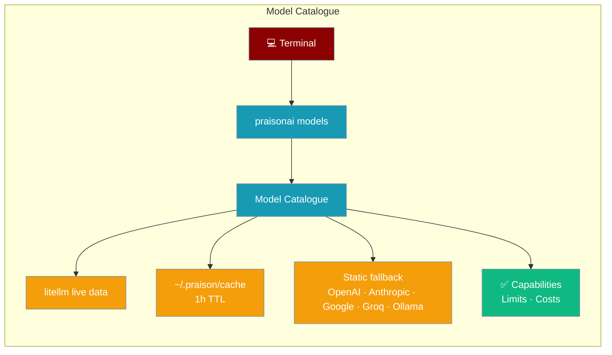
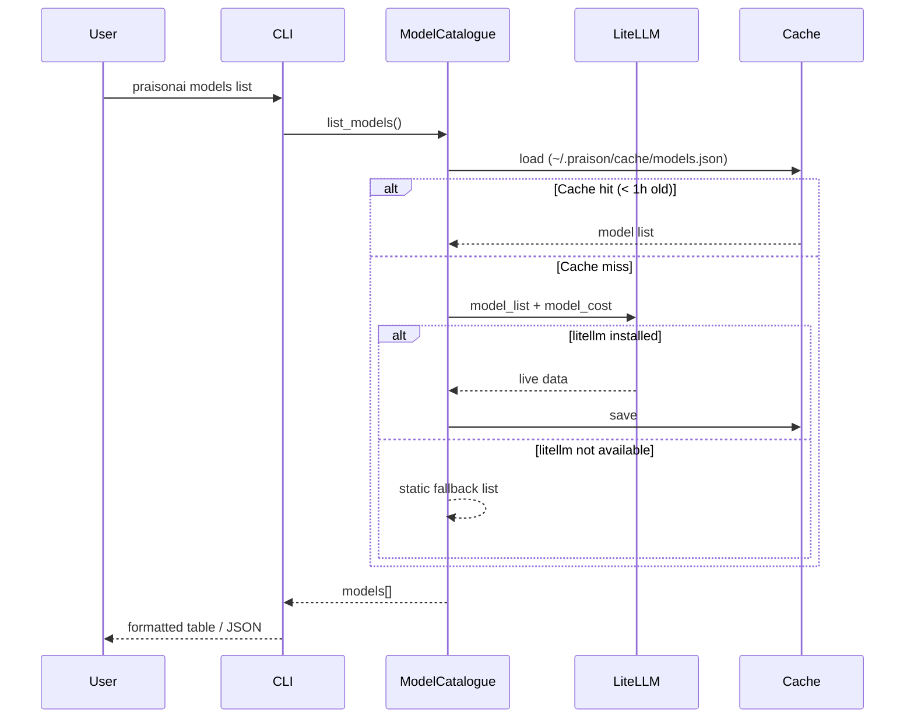
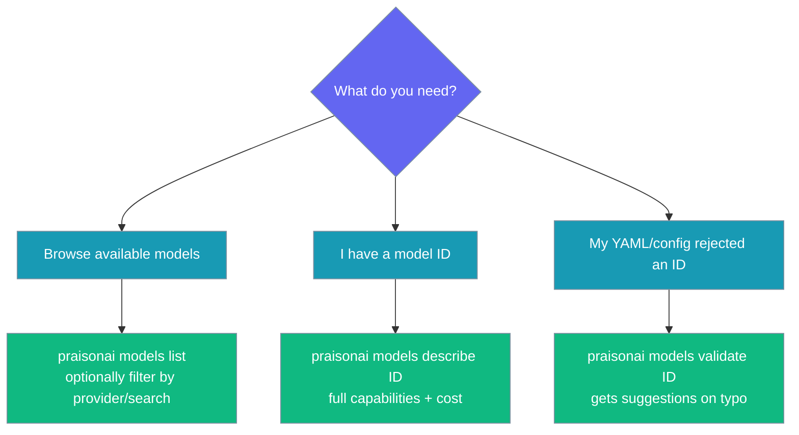

```python
from praisonaiagents import Agent

agent = Agent(name="model-agent", instructions="Manage and switch LLM models via CLI.")
agent.start("List all available models and switch to gpt-4o.")
```


Discover which models you can use, what they cost, and whether they support tools or vision — all from the terminal.



## Quick Start

<Steps>
  <Step title="Browse all models">
    List every available model grouped by provider:
    ```bash
    praisonai models list
    ```

    Filter to a single provider:
    ```bash
    praisonai models list --provider openai
    ```

    Search by name substring:
    ```bash
    praisonai models list gpt
    ```
  </Step>

  <Step title="Inspect a model">
    Get full capabilities, limits, and cost for one model:
    ```bash
    praisonai models describe gpt-4o
    ```

    Sample output:
    ```
    Model: gpt-4o
    Provider: openai
    Description: Most capable GPT-4 model, multimodal

    Capabilities:
      • Tool calling: ✅
      • Vision: ✅
      • Reasoning: ✅
      • Streaming: ✅

    Limits:
      • Context window: 128,000 tokens
      • Max output: 16,384 tokens
    ```
  </Step>

  <Step title="Validate a model ID">
    Check whether an ID is valid — and get suggestions on a typo:
    ```bash
    praisonai models validate gpt-4o-mni
    ```

    Output on a typo:
    ```
    ❌ 'gpt-4o-mni' is not a valid model
    Did you mean one of these?
      • gpt-4o-mini
      • gpt-4o
    ```

    Output on a valid ID:
    ```
    ✅ 'gpt-4o' is a valid model
    Capabilities: tool-calling, vision, reasoning
    ```
  </Step>
</Steps>

## Agent-Centric Example

Use the catalogue to pick the right model for your agent before you run it:

```python
from praisonaiagents import Agent

agent = Agent(
    name="Writer",
    instructions="Write concise summaries.",
    llm="gpt-4o",
)
agent.start("Summarise the latest release notes")
```

YAML equivalent — invalid `llm:` values emit a warning at load time, and pairing `tools:` with a non-tool-calling model (like `o1`) triggers a compatibility warning:

```yaml
framework: praisonai
topic: Summarise release notes
agents:
  writer:
    role: Writer
    instructions: Write concise summaries.
    llm: gpt-4o          # validated against catalogue on load
    tools:
      - InternetSearchTool
    tasks:
      summarise:
        description: Summarise the latest release notes.
        expected_output: A short summary paragraph.
```

<Note>
YAML aliases defined under a top-level `models:` key are accepted even if they are not in the catalogue. This lets you point to custom or private deployments without triggering warnings.
</Note>

## How It Works



**Data sources — priority order:**

| Source | When used | What it provides |
|--------|-----------|-----------------|
| `~/.praison/cache/models.json` | Cache < 1 h old | Full list saved from previous live call |
| litellm (`model_list` + `model_cost`) | Cache miss, litellm installed | Live data: 100+ models with cost & limits |
| Curated static list | litellm unavailable / error | OpenAI, Anthropic, Google, Groq, Ollama |

## Commands Reference

### `praisonai models list`

List available models, grouped by provider.

```bash
praisonai models list [SEARCH] [OPTIONS]
```

| Flag / Argument | Type | Description |
|-----------------|------|-------------|
| `search` | `str` (positional) | Filter by substring in the model ID (e.g. `gpt`, `claude`) |
| `--provider`, `-p` | `str` | Filter by provider (`openai`, `anthropic`, `google`, `groq`, `ollama`) |
| `--json` | `bool` | Machine-readable JSON output |

**Examples:**

```bash
# All models
praisonai models list

# Only Anthropic models
praisonai models list --provider anthropic

# Models containing "flash"
praisonai models list flash

# JSON output for scripting / CI
praisonai models list --json
```

### `praisonai models describe <model>`

Show full metadata for one model, including capabilities, limits, and cost.

```bash
praisonai models describe <MODEL_ID>
```

**Examples:**

```bash
praisonai models describe gpt-4o
praisonai models describe claude-3-5-sonnet-latest
praisonai models describe gemini-1.5-pro
```

### `praisonai models validate <model>`

Validate a model ID. Exits with code `1` and shows close matches if the ID is unknown.

```bash
praisonai models validate <MODEL_ID>
```

**Examples:**

```bash
# Valid ID
praisonai models validate gpt-4o

# Deliberate typo — shows suggestions
praisonai models validate cluade-3-opus
```

**When to use which command:**



## Capabilities & Limits Reference

Every model in the catalogue exposes these fields:

| Field | Type | Default | Description |
|-------|------|---------|-------------|
| `id` | `str` | — | Model identifier (e.g. `gpt-4o`) |
| `provider` | `str` | — | `openai`, `anthropic`, `google`, `groq`, `ollama`, `cohere`, … |
| `description` | `str` | `None` | Short human description |
| `max_context` | `int` | `None` | Max context window (tokens) |
| `max_output` | `int` | `None` | Max output tokens |
| `input_cost` | `float` | `None` | Cost per 1K input tokens (USD) |
| `output_cost` | `float` | `None` | Cost per 1K output tokens (USD) |
| `supports_tools` | `bool` | `False` | Tool-calling support |
| `supports_vision` | `bool` | `False` | Image input support |
| `supports_reasoning` | `bool` | `False` | Reasoning-class model |
| `supports_streaming` | `bool` | `True` | Token streaming |
| `notes` | `str` | `None` | Caveats (e.g. "Requires Ollama running locally") |

## Configuration Options

`ModelCatalogue` accepts two constructor arguments:

| Option | Type | Default | Description |
|--------|------|---------|-------------|
| `cache_dir` | `Path \| None` | `~/.praison/cache` | Directory for the model cache file |
| `cache_ttl` | `int` | `3600` | Cache TTL in seconds (1 hour) |

**Cache file location:** `~/.praison/cache/models.json`

**Force refresh:** delete the cache file, then run any `praisonai models` command:

```bash
rm ~/.praison/cache/models.json
praisonai models list
```

## Validation Behaviour

<Note>
- **YAML local aliases** — if your YAML file defines model aliases under a top-level `models:` key, those aliases are accepted even when absent from the catalogue.  
- **Tool-compatibility warnings** — if an agent has `tools:` configured but its `llm` does not advertise `supports_tools` (e.g. `o1`, `o1-mini`), a warning is emitted at load time.  
- **Opt-out** — pass `validate_model=False` to `resolve_llm_endpoint` (or `resolve_llm_endpoint_with_credentials`) to skip validation entirely and make the call unconditionally.
</Note>

## Best Practices

<AccordionGroup>
  <Accordion title="Install litellm for the full catalogue">
    The static fallback covers ~15 models. Installing `litellm` unlocks 100+ models with live pricing data:
    ```bash
    pip install 'praisonai[litellm]'
    ```
  </Accordion>

  <Accordion title="Refresh the cache when providers release new models">
    The cache is valid for 1 hour. To pull the latest model list immediately:
    ```bash
    rm ~/.praison/cache/models.json
    praisonai models list
    ```
  </Accordion>

  <Accordion title="Use --json in CI to pin your model selection">
    ```bash
    praisonai models list --provider openai --json | jq '.[].id'
    ```
    Parse the JSON output in scripts or pipelines to programmatically choose a model.
  </Accordion>

  <Accordion title="Pick a tool-calling model when your agent uses tools">
    Before adding `tools:` to an agent, verify the model supports them:
    ```bash
    praisonai models describe gpt-4o
    # Look for: Tool calling: ✅
    ```
    Models like `o1` and `o1-mini` do **not** support tool calling.
  </Accordion>
</AccordionGroup>

## Offline / Fallback Behaviour

When `litellm` is not installed or the network is unavailable, the catalogue degrades gracefully to a curated static list covering:

- **OpenAI** — `gpt-4o`, `gpt-4o-mini`, `gpt-3.5-turbo`, `o1`, `o1-mini`
- **Anthropic** — `claude-3-5-sonnet-latest`, `claude-3-5-haiku-latest`, `claude-3-opus-latest`
- **Google** — `gemini-1.5-pro`, `gemini-1.5-flash`, `gemini-2.0-flash-exp`
- **Groq** — `llama-3.3-70b-versatile`, `mixtral-8x7b-32768`
- **Ollama** — `llama3.2` (requires Ollama running locally)

All three CLI commands (`list`, `describe`, `validate`) work against the static list without any external calls.

## Related

<CardGroup cols={2}>
  <Card title="CLI Reference" icon="terminal" href="/docs/features/cli">
    All PraisonAI CLI commands and options
  </Card>
  <Card title="Models Overview" icon="brain" href="/docs/models">
    Supported providers and configuration examples
  </Card>
  <Card title="Model Router" icon="shuffle" href="/docs/features/model-router">
    Route requests across multiple models automatically
  </Card>
  <Card title="Model Capabilities" icon="microchip" href="/docs/features/model-capabilities">
    Model capability flags and how to use them
  </Card>
</CardGroup>
