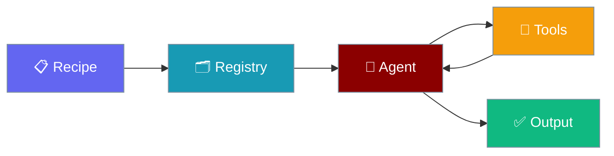

Build complex workflows by composing smaller, reusable recipes together. The `include:` pattern enables DRY (Don't Repeat Yourself) recipe development.

<Warning>
If you publish a recipe that needs custom tools, prefer declaring them under the `tools_sources:` / `override_files:` directives in `TEMPLATE.yaml` — those load without requiring users to set `PRAISONAI_ALLOW_TEMPLATE_TOOLS`. Implicit `tools.py` loading is disabled by default for security (GHSA-xcmw-grxf-wjhj). See [Security Environment Variables](/docs/features/security-environment-variables#praisonai_allow_template_tools) for details.
</Warning>




## Overview

Instead of duplicating common functionality across recipes, extract it into a standalone recipe and include it where needed:

```yaml
# Main recipe includes the reusable publisher
roles:
  content_writer:
    role: Content Writer
    goal: Write articles
    # ... writer configuration

includes:
  - wordpress-publisher  # Reuse the publisher recipe
```

## Usage Patterns

### 1. Include in Steps Format

For workflows using the `steps:` format:

```yaml
name: Content Pipeline
steps:
  - agent: content_writer
    action: "Write article about {{topic}}"
  
  - include: wordpress-publisher
    input: "{{previous_output}}"
```

### 2. Include in Roles Format

For recipes using the `roles:` format (agents.yaml style), use the `includes:` section:

```yaml
framework: praisonai
topic: "AI News"

roles:
  topic_gatherer:
    role: Topic Researcher
    goal: Find news topics
    tasks:
      find_topics:
        description: Search for AI news

  content_writer:
    role: Content Writer
    goal: Write articles
    tasks:
      write:
        description: Write about {{previous_output}}

# Include another recipe as the final step
includes:
  - wordpress-publisher
```

### 3. Include with Configuration

Pass custom input to included recipes:

```yaml
includes:
  - recipe: wordpress-publisher
    input: "{{previous_output}}"
```

## Python API

### Include Class

```python
from praisonaiagents import AgentFlow, Include, include

# Using convenience function
workflow = AgentFlow(
    name="Content Pipeline",
    steps=[
        content_writer_agent,
        include("wordpress-publisher", input="{{previous_output}}")
    ]
)
result = workflow.run("Write about AI")
```

### Direct Class Usage

```python
from praisonaiagents import Include

step = Include(
    recipe="wordpress-publisher",
    input="Custom input here"
)
```

## call_recipe Tool

Give agents the ability to call other recipes as a tool:

```python
from agent_recipes import call_recipe
from praisonaiagents import Agent

# Create an orchestrator agent with recipe-calling ability
orchestrator = Agent(
    name="Orchestrator",
    instructions="Coordinate content publishing workflows",
    tools=[call_recipe]
)

# The agent can now invoke:
# call_recipe("wordpress-publisher", "ARTICLE_TITLE: Test\nARTICLE_CONTENT: ...")
```

## run_recipe Function

Programmatically execute recipes:

```python
from agent_recipes import run_recipe

result = run_recipe(
    recipe_name="wordpress-publisher",
    input_data="ARTICLE_TITLE: My Title\nARTICLE_CONTENT: ...",
    output="status"  # Options: silent, status, trace, verbose, debug, json
)
print(result['output'])
```

## Creating Reusable Recipes

### Recipe Structure

```
wordpress-publisher/
├── TEMPLATE.yaml     # Recipe metadata
├── agents.yaml       # Workflow definition
├── tools.py          # Custom tools
└── README.md         # Documentation
```

### Example: wordpress-publisher

**agents.yaml:**
```yaml
framework: praisonai
topic: "Publish article to WordPress"

roles:
  publisher:
    role: WordPress Publisher
    goal: Validate and publish blog post
    tools:
      - create_wp_post
    tasks:
      validate_and_publish:
        description: |
          {{previous_output}}
          
          Extract ARTICLE_TITLE and ARTICLE_CONTENT:
          - Call create_wp_post with the extracted values
          - Report the published post ID
        expected_output: |
          Published post with ID and confirmation
```

## Cycle Detection

The include system automatically detects circular includes:

```yaml
# recipe-a includes recipe-b
# recipe-b includes recipe-a
# → Error: "Circular include detected"
```

## Best Practices

1. **Single Responsibility**: Each recipe should do one thing well
2. **Clear Contracts**: Document expected input/output formats
3. **Defensive Parsing**: Handle missing or malformed input gracefully
4. **Idempotent Operations**: Avoid side effects on retries

## Available Recipes

List all available recipes:

```bash
praisonai templates list
```

Key reusable recipes:
- `wordpress-publisher` - Publish content to WordPress
- `transcript-generator` - Generate transcripts from media
- `data-transformer` - Transform data between formats

## Best Practices

<AccordionGroup>
<Accordion title="Start with defaults">
Use the built-in defaults first. Only add configuration when you hit a specific limitation.
</Accordion>
<Accordion title="Test incrementally">
Add one feature at a time and verify behaviour before combining features.
</Accordion>
<Accordion title="Monitor in production">
Watch token consumption and latency metrics when enabling advanced features in production.
</Accordion>
</AccordionGroup>

## Related

- [Workflows](/docs/features/workflows) - Workflow fundamentals
- [YAML Workflows](/docs/features/yaml-workflows) - YAML workflow syntax
- [Recipe Registry](/docs/features/recipe-registry) - Browse available recipes

## Related

<CardGroup cols={2}>
<Card title="Recipe Registry" icon="book-open" href="/docs/features/recipe-registry">
  Register reusable recipes
</Card>
<Card title="Recipe Server" icon="server" href="/docs/features/recipe-serve-advanced">
  Serve recipes via API
</Card>
</CardGroup>
