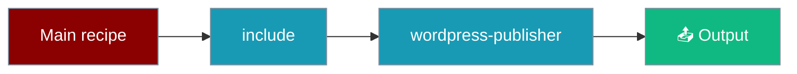

Build complex workflows by composing smaller, reusable recipes with the `include:` pattern.



<Warning>
If you publish a recipe that needs custom tools, prefer declaring them under the `tools_sources:` / `override_files:` directives in `TEMPLATE.yaml` — those load without requiring users to set `PRAISONAI_ALLOW_TEMPLATE_TOOLS`. Implicit `tools.py` loading is disabled by default for security (GHSA-xcmw-grxf-wjhj). See [Security Environment Variables](/docs/features/security-environment-variables#praisonai_allow_template_tools) for details.
</Warning>

## Quick Start

<Steps>

<Step title="Simple Usage">

```yaml
steps:
  - agent: content_writer
    action: "Write article about {{topic}}"
  - include: wordpress-publisher
    input: "{{previous_output}}"
```

</Step>

<Step title="With Configuration">

```python
from praisonaiagents import AgentFlow, include

workflow = AgentFlow(
    name="Content Pipeline",
    steps=[
        content_writer_agent,
        include("wordpress-publisher", input="{{previous_output}}")
    ]
)
result = workflow.run("Write about AI")
```

</Step>

</Steps>

## Overview

Instead of duplicating common functionality across recipes, extract it into a standalone recipe and include it where needed:

```yaml
roles:
  content_writer:
    role: Content Writer
    goal: Write articles

includes:
  - wordpress-publisher
```

## Usage Patterns

### Include in Steps Format

```yaml
name: Content Pipeline
steps:
  - agent: content_writer
    action: "Write article about {{topic}}"
  - include: wordpress-publisher
    input: "{{previous_output}}"
```

### Include in Roles Format

```yaml
framework: praisonai
topic: "AI News"

roles:
  topic_gatherer:
    role: Topic Researcher
    goal: Find news topics
    tasks:
      find_topics:
        description: Search for AI news

  content_writer:
    role: Content Writer
    goal: Write articles
    tasks:
      write:
        description: Write about {{previous_output}}

includes:
  - wordpress-publisher
```

### Include with Configuration

```yaml
includes:
  - recipe: wordpress-publisher
    input: "{{previous_output}}"
```

## Python API

```python
from praisonaiagents import AgentFlow, Include, include

workflow = AgentFlow(
    name="Content Pipeline",
    steps=[
        content_writer_agent,
        include("wordpress-publisher", input="{{previous_output}}")
    ]
)
result = workflow.run("Write about AI")
```

```python
from praisonaiagents import Include

step = Include(recipe="wordpress-publisher", input="Custom input here")
```

## call_recipe Tool

Give agents the ability to call other recipes as a tool:

```python
from agent_recipes import call_recipe
from praisonaiagents import Agent

orchestrator = Agent(
    name="Orchestrator",
    instructions="Coordinate content publishing workflows",
    tools=[call_recipe]
)
```

## run_recipe Function

```python
from agent_recipes import run_recipe

result = run_recipe(
    recipe_name="wordpress-publisher",
    input_data="ARTICLE_TITLE: My Title\nARTICLE_CONTENT: ...",
    output="status"
)
print(result['output'])
```

## Creating Reusable Recipes

```
wordpress-publisher/
├── TEMPLATE.yaml
├── agents.yaml
├── tools.py
└── README.md
```

**agents.yaml:**
```yaml
framework: praisonai
topic: "Publish article to WordPress"

roles:
  publisher:
    role: WordPress Publisher
    goal: Validate and publish blog post
    tools:
      - create_wp_post
    tasks:
      validate_and_publish:
        description: |
          {{previous_output}}
          Extract ARTICLE_TITLE and ARTICLE_CONTENT and call create_wp_post.
        expected_output: Published post with ID and confirmation
```

## Cycle Detection

The include system automatically detects circular includes:

```yaml
# recipe-a includes recipe-b
# recipe-b includes recipe-a
# → Error: "Circular include detected"
```

## Best Practices

<AccordionGroup>

<Accordion title="Single responsibility per recipe">
Each recipe should do one thing well — publish, transform, or validate — not all three.
</Accordion>

<Accordion title="Document input/output contracts">
State the expected `{{previous_output}}` format so included recipes parse input reliably.
</Accordion>

<Accordion title="Handle malformed input defensively">
Included recipes should fail gracefully when required fields are missing.
</Accordion>

<Accordion title="Keep operations idempotent">
Publishing or side-effect steps should be safe to retry without duplicating output.
</Accordion>

</AccordionGroup>

## Available Recipes

```bash
praisonai templates list
```

Key reusable recipes:
- `wordpress-publisher` — Publish content to WordPress
- `transcript-generator` — Generate transcripts from media
- `data-transformer` — Transform data between formats

## Related

<CardGroup cols={2}>
  <Card title="Workflows" icon="diagram-project" href="/docs/features/workflows">
    Workflow fundamentals and step types
  </Card>
  <Card title="Recipe Registry" icon="book" href="/docs/features/recipe-registry">
    Browse available recipes
  </Card>
</CardGroup>
