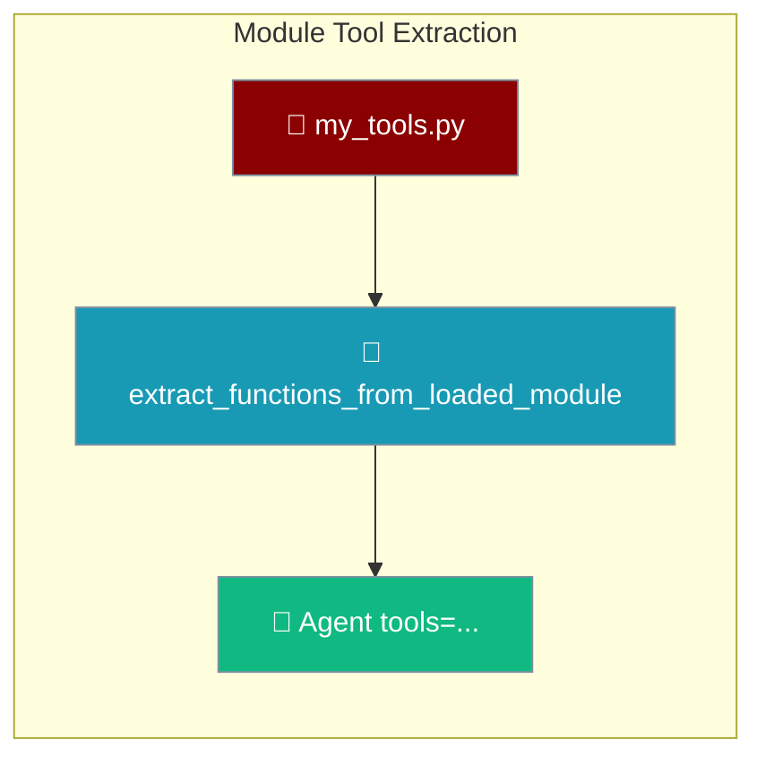
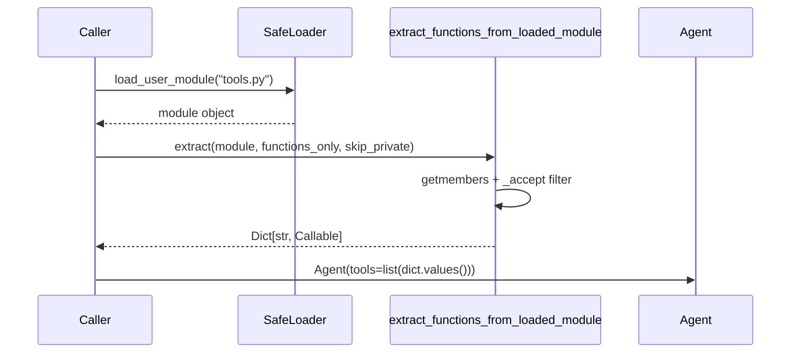
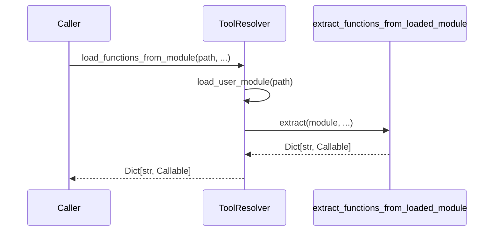
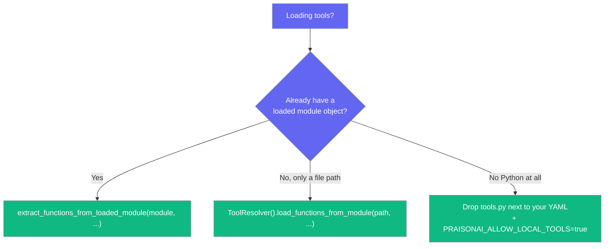

Point PraisonAI at any Python module and it turns the module's public functions into tools an agent can call.



`extract_functions_from_loaded_module` is the single owner of the "walk a loaded module and collect its callables into a `name → callable` registry" rule that PraisonAI uses internally — reuse it when you already have a loaded module.

## Quick Start

<Steps>
<Step title="Simple — point an agent at a folder of tools">
Drop a `tools.py` next to your recipe/workflow YAML and set the gate. PraisonAI loads its public functions automatically — no import needed.

```bash
export PRAISONAI_ALLOW_LOCAL_TOOLS=true
```

```python
# tools.py — sits next to your workflow YAML
def get_weather(city: str) -> str:
    """Get the weather for a city."""
    return f"Weather in {city}: sunny"
```

```bash
praisonai workflow run research.yaml
# → Loaded 1 tools from tools.py: get_weather
```
</Step>

<Step title="Programmatic — load and register a module yourself">
Load the module with the safe loader, extract its callables, then hand the values to `Agent(tools=...)`.

```python
import os
from praisonaiagents import Agent
from praisonai_code._safe_loader import load_user_module
from praisonai_code.tool_resolver import extract_functions_from_loaded_module

os.environ["PRAISONAI_ALLOW_LOCAL_TOOLS"] = "true"

module = load_user_module("tools.py", name="my_tools")
tools = extract_functions_from_loaded_module(module)

agent = Agent(
    name="Tool User",
    instructions="Use the available tools to help the user",
    tools=list(tools.values()),
)
agent.start("What's the weather in Paris?")
```
</Step>

<Step title="Filter the walk">
Two independent knobs narrow what the walk accepts.

```python
# Only plain functions — drops callable class instances
tools = extract_functions_from_loaded_module(module, functions_only=True)

# Drop underscore-prefixed names like _helper
tools = extract_functions_from_loaded_module(module, skip_private=True)
```
</Step>
</Steps>

---

## How It Works

The helper walks the module's members, applies the filter, and returns a `name → callable` dict for the caller to register.



The helper **does not load** anything — the caller owns the loading step (via the safe loader). If you only have a file path and no module object, use the path-based sibling instead.



Both share the same `_accept` rule, so the extraction behaviour is identical — the only difference is who owns the loading step.

---

## Which entry point should I use?

Pick the entry point that matches what you already hold.



<Warning>
Reloading a module produces a **distinct** object. If your code filters by origin (`inspect.getmodule(obj) is my_module`), reuse the module you already loaded — pass it to `extract_functions_from_loaded_module` rather than re-loading it by path.
</Warning>

---

## Filter Reference

Both knobs default to `False` and can be combined.

| Knob | Type | Default | When to enable |
|------|------|---------|----------------|
| `functions_only=True` | `bool` | `False` | Your module exports callable class instances (e.g. Pydantic tool objects) and you want ONLY plain functions. |
| `skip_private=True` | `bool` | `False` | Your module has `_helpers` you don't want the agent to see. |

With defaults, the walk accepts any member where `inspect.isfunction(obj)` **or** `callable(obj)` is true. Order follows `inspect.getmembers(module)` (alphabetical by name).

---

## Common Patterns

<Tabs>
<Tab title="A recipe tools.py">
The recipe/workflow loader picks up `tools.py` automatically when the gate is on, then keeps an own-module origin filter so re-exports from other modules stay out of the registry.

```python
# tools.py next to your workflow YAML
from third_party import external_helper  # re-export — stays OUT of the registry

def summarize(text: str) -> str:
    """Summarize a block of text."""
    return text[:100]
```

```bash
export PRAISONAI_ALLOW_LOCAL_TOOLS=true
praisonai workflow run research.yaml
# → Loaded 1 tools from tools.py: summarize
```

Internally the loader runs `extract_functions_from_loaded_module(tools_module, functions_only=True, skip_private=True)` and then keeps only members where `inspect.getmodule(obj) is tools_module`.
</Tab>

<Tab title="A programmatic loader">
Load with the safe loader, extract, register.

```python
import os
from praisonaiagents import Agent
from praisonai_code._safe_loader import load_user_module
from praisonai_code.tool_resolver import extract_functions_from_loaded_module

os.environ["PRAISONAI_ALLOW_LOCAL_TOOLS"] = "true"

module = load_user_module("tools.py", name="my_tools")
tools = extract_functions_from_loaded_module(module, skip_private=True)

agent = Agent(name="Helper", instructions="Use my tools", tools=list(tools.values()))
agent.start("Run one of my tools")
```
</Tab>

<Tab title="Combining with ToolResolver">
When you only have a path, `ToolResolver` loads + walks in one step (it delegates to the same helper under the hood).

```python
from praisonai.tool_resolver import ToolResolver

resolver = ToolResolver()
tools = resolver.load_functions_from_module(
    "./helpers/my_tools.py",
    functions_only=True,
    skip_private=True,
)
# {"summarize": <function>, ...}
```
</Tab>
</Tabs>

---

## Best Practices

<AccordionGroup>
<Accordion title="Load with the safe loader, not importlib.import_module">
Use `praisonai_code._safe_loader.load_user_module` to stay inside the `PRAISONAI_ALLOW_LOCAL_TOOLS` gate and CWD path constraints. `extract_functions_from_loaded_module` deliberately does not load — the caller must.

```python
from praisonai_code._safe_loader import load_user_module

module = load_user_module("tools.py", name="my_tools")  # ✅ gated + safe
```
</Accordion>

<Accordion title="Use skip_private=True when your module has internal helpers">
Prevents `_normalize_input` and friends from leaking into the agent's tool list.

```python
tools = extract_functions_from_loaded_module(module, skip_private=True)
```
</Accordion>

<Accordion title="Reach for the module-level helper when you already have the loaded module">
Loading a second time by path breaks `inspect.getmodule(obj) is my_module` origin filters — object identity is what matters. Pass the module you already have.

```python
# You already loaded `module` — extract, don't re-load
tools = extract_functions_from_loaded_module(module)
```
</Accordion>

<Accordion title="Add an origin filter if your module re-exports from elsewhere">
Keep re-exported callables from other modules out of your registry, exactly like the recipe loader does.

```python
import inspect
from praisonai_code.tool_resolver import extract_functions_from_loaded_module

registry = {
    name: obj
    for name, obj in extract_functions_from_loaded_module(
        module, functions_only=True, skip_private=True
    ).items()
    if inspect.getmodule(obj) is module
}
```
</Accordion>
</AccordionGroup>

---

## Related

<CardGroup cols={2}>
<Card title="Tool Resolver" icon="wrench" href="/features/tool-resolver">
  The path-based sibling — loads + walks in one step
</Card>
<Card title="Local Tools Loading" icon="folder-tree" href="/features/local-tools-loading">
  How the `PRAISONAI_ALLOW_LOCAL_TOOLS` gate loads your `tools.py`
</Card>
<Card title="Tools (CLI)" icon="terminal" href="/cli/tools">
  Verify what got picked up with `praisonai tools list`
</Card>
<Card title="Tools" icon="wrench" href="/concepts/tools">
  General Tools concept overview
</Card>
</CardGroup>
