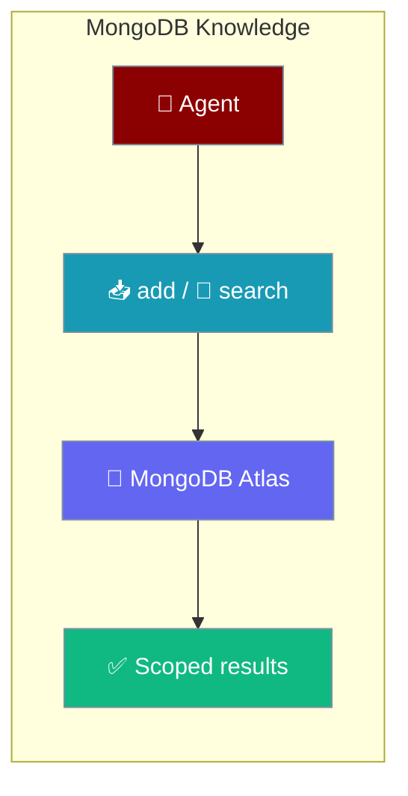
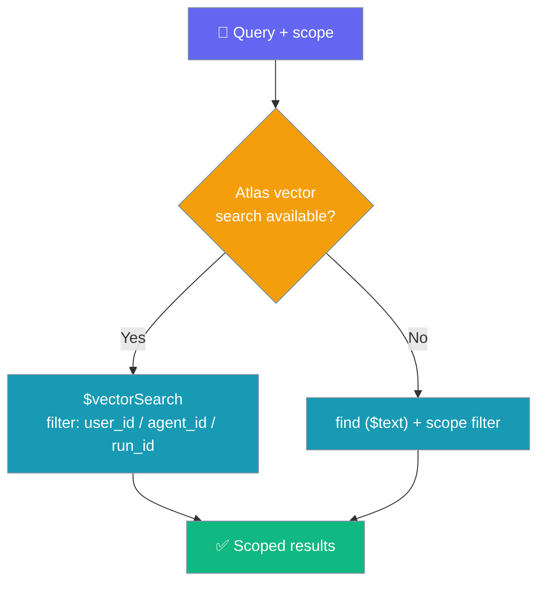
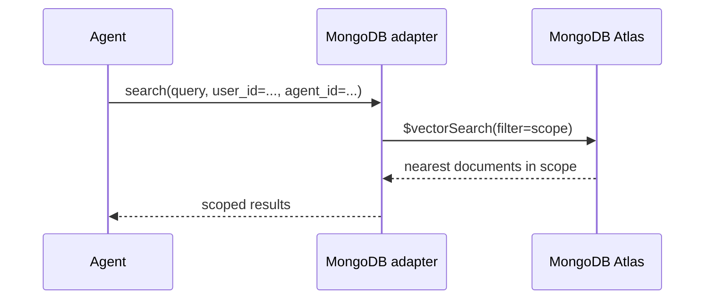

Store agent knowledge in MongoDB Atlas with per-tenant `user_id` / `agent_id` / `run_id` scope on every read and write.



## Quick Start

<Steps>
<Step title="Agent with MongoDB knowledge">

```python
from praisonaiagents import Agent, MemoryConfig

agent = Agent(
    name="SupportBot",
    instructions="Answer using the customer's session history.",
    knowledge={
        "vector_store": {
            "provider": "mongodb",
            "config": {
                "connection_string": "mongodb+srv://...",
                "database": "praison",
                "collection": "support_knowledge",
            },
        },
    },
    memory=MemoryConfig(user_id="customer_42", session_id="session_2026_08_09"),
)

agent.start("What did we agree on for the refund?")
```

</Step>

<Step title="Direct Knowledge API">

```python
from praisonaiagents import Knowledge

kb = Knowledge(config={
    "vector_store": {
        "provider": "mongodb",
        "config": {
            "connection_string": "mongodb+srv://...",
            "database": "praison",
            "collection": "support_knowledge",
        },
    }
})

kb.add("Refund promised: $49 by Aug 12.",
       user_id="customer_42", agent_id="support_bot_v1", run_id="session_2026_08_09")

kb.search("refund promise",
          user_id="customer_42", agent_id="support_bot_v1", run_id="session_2026_08_09")
```

</Step>
</Steps>

---

## How It Works

The adapter persists `user_id` / `agent_id` / `run_id` on each document and applies any provided scope as a pre-filter on search.



On Atlas `$vectorSearch`, the scope becomes the stage-level `filter`. Without Atlas vector search, the adapter falls back to MongoDB text search and merges the scope into the `find()` query. `None` values are dropped — omit an identifier to broaden the search on that dimension.



---

## Configuration Options

Config keys read from `MongoDBKnowledgeAdapter.__init__` under `vector_store.config`.

| Option | Type | Default | Description |
|--------|------|---------|-------------|
| `connection_string` | `str` | `"mongodb://localhost:27017/"` | MongoDB connection URI (use `mongodb+srv://...` for Atlas) |
| `database` | `str` | `"praisonai"` | Database name |
| `collection` | `str` | `"knowledge_base"` | Collection name |
| `use_vector_search` | `bool` | `True` | Enable Atlas `$vectorSearch`; falls back to text search when unavailable |

Embeddings are configured via the top-level `embedder` key:

```python
config = {
    "vector_store": {
        "provider": "mongodb",
        "config": {
            "connection_string": "mongodb+srv://...",
            "database": "praison",
            "collection": "support_knowledge",
        },
    },
    "embedder": {
        "provider": "openai",
        "config": {"model": "text-embedding-3-small"},
    },
}
```

---

## Common Patterns

Isolate a single customer's session by combining all three scopes:

```python
kb.search("refund promise",
          user_id="customer_42", agent_id="support_bot_v1", run_id="session_2026_08_09")
```

Broaden across all sessions for one customer by omitting `run_id`:

```python
kb.search("refund history", user_id="customer_42")
```

---

## Best Practices

<AccordionGroup>
<Accordion title="Use Atlas for vector search">
`use_vector_search=True` needs a MongoDB Atlas cluster with a vector index on the `embedding` path (similarity `cosine`). Without Atlas, the adapter transparently falls back to text search.
</Accordion>

<Accordion title="Always pass scope for multi-tenant apps">
Provide `user_id` (and optionally `agent_id` / `run_id`) on both `add()` and `search()` to keep tenants isolated. Omitted scopes broaden the search on that dimension.
</Accordion>

<Accordion title="Prefer the Agent API">
Passing `knowledge={...}` and `user_id=...` on the `Agent` handles scoping and context injection automatically. Use the direct `Knowledge` class only for custom indexing or search control.
</Accordion>

<Accordion title="Use mongodb+srv:// for Atlas connections">
Atlas connection strings start with `mongodb+srv://` or contain `mongodb.net` — the adapter detects these to enable vector search.
</Accordion>
</AccordionGroup>

<Note>
As of PR [#3810](https://github.com/MervinPraison/PraisonAI/pull/3810), the MongoDB adapter honors `user_id` / `agent_id` / `run_id` on both `add()` and `search()`. On earlier releases these kwargs were silently ignored, producing cross-tenant results. Upgrade to a release built after commit `6b6707c1`.
</Note>

---

## Related

<CardGroup cols={2}>
  <Card title="Knowledge Backends" icon="database" href="/features/knowledge-backends">
    Compare Chroma, mem0, and MongoDB storage backends
  </Card>
  <Card title="MongoDB Memory" icon="brain" href="/features/mongodb-memory">
    Use MongoDB as the agent memory store
  </Card>
</CardGroup>
