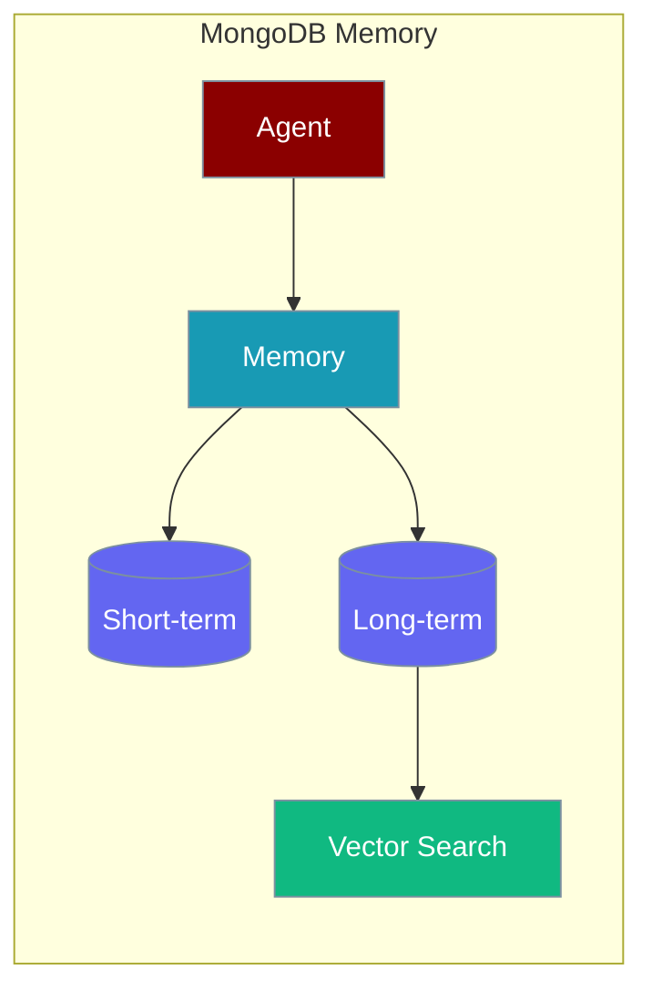

Use MongoDB as a document-backed memory store with optional Atlas Vector Search for semantic retrieval.

<Note>
This is PraisonAI's first-party MongoDB memory adapter. It is **not** the same as running mem0 with a MongoDB vector store backend. Mem0's MongoDB vector store has an [upstream bug](https://github.com/mem0ai/mem0/issues/3185); the adapter documented on this page is a separate implementation and is unaffected. See [Memory Troubleshooting](/docs/features/memory-troubleshooting#why-is-memory-mem0-returning-empty-search-results-mongodb-vector-store) if you were sent here from a mem0 error.
</Note>

```python
from praisonaiagents import Agent

agent = Agent(
    name="assistant",
    instructions="Remember facts across sessions.",
    memory={
        "provider": "mongodb",
        "config": {
            "connection_string": "mongodb://localhost:27017/",
            "database": "praisonai",
        },
    },
)
agent.start("Remember that my favourite colour is teal")
```

The user chats with the agent; short- and long-term memory persist in MongoDB.



## Quick Start

<Steps>

<Step title="Simple Usage">

```python
from praisonaiagents import Agent

agent = Agent(
    name="assistant",
    memory={
        "provider": "mongodb",
        "config": {
            "connection_string": "mongodb://localhost:27017/",
            "database": "praisonai",
        },
    },
)
```

</Step>

<Step title="With Configuration">

```python
import os
from praisonaiagents import Agent

agent = Agent(
    name="assistant",
    memory={
        "provider": "mongodb",
        "config": {
            "connection_string": os.getenv("MONGODB_URI", "mongodb://localhost:27017/"),
            "database": "praisonai",
            "use_vector_search": True,
        },
    },
)
```

</Step>

</Steps>

<Note>
Install the optional dependency first: `pip install pymongo` or `pip install "praisonaiagents[mongodb]"`.
</Note>

## Configuration

| Option | Type | Default | Description |
|--------|------|---------|-------------|
| `connection_string` | `str` | `mongodb://localhost:27017/` | MongoDB URI |
| `database` | `str` | `praisonai` | Database name |
| `use_vector_search` | `bool` | `False` | Enable Atlas Vector Search on long-term memory |
| `max_pool_size` | `int` | `50` | Connection pool maximum |
| `min_pool_size` | `int` | `10` | Connection pool minimum |
| `max_idle_time` | `int` | `30000` | Max idle time in ms |
| `server_selection_timeout` | `int` | `5000` | Server selection timeout in ms |

## Vector Search

When `use_vector_search: True`:

- Long-term writes include an embedding (via `text-embedding-3-small` by default).
- Searches use MongoDB `$vectorSearch` against index `vector_index` on field `embedding`.
- If vector search fails or is unavailable, the adapter falls back to MongoDB text search.

When `use_vector_search: False` (default), only MongoDB text indexes are used.

<Info>
As of PraisonAI PR #2060, `use_vector_search` is always initialised on the `Memory` instance — even when MongoDB is not the active provider. Previously, a missing attribute could raise `AttributeError` deep in store/search paths.
</Info>

## Atlas Setup

1. Create a vector search index named `vector_index` on the `long_term_memory` collection.
2. Set the indexed path to `embedding`.
3. Pass `use_vector_search: True` in agent config.

## Best Practices

<AccordionGroup>
  <Accordion title="Use environment variables for credentials">
    Store connection strings in `MONGODB_URI` rather than hard-coding credentials in source files.
  </Accordion>
  <Accordion title="Enable vector search for semantic recall">
    Set `use_vector_search: True` on Atlas when you need similarity search; text indexes suffice for keyword lookup.
  </Accordion>
  <Accordion title="Size the connection pool for concurrency">
    Tune `max_pool_size` and `min_pool_size` when running many agents against the same cluster.
  </Accordion>
  <Accordion title="Create indexes before production traffic">
    Configure the `vector_index` Atlas index and text indexes before scaling agent workloads.
  </Accordion>
</AccordionGroup>

## Related

<CardGroup cols={2}>
<Card title="Custom Memory Adapters" icon="brain" href="/docs/features/custom-memory-adapters">
  Registry pattern and custom backend registration.
</Card>
<Card title="Memory Advanced Search" icon="magnifying-glass-plus" href="/docs/features/memory-advanced-search">
  Reranking, relevance cutoffs, and quality filtering.
</Card>
<Card title="Dakera Memory" icon="database" href="/docs/features/dakera-memory">
  Self-hosted, decay-weighted vector recall via the Dakera server.
</Card>
</CardGroup>
