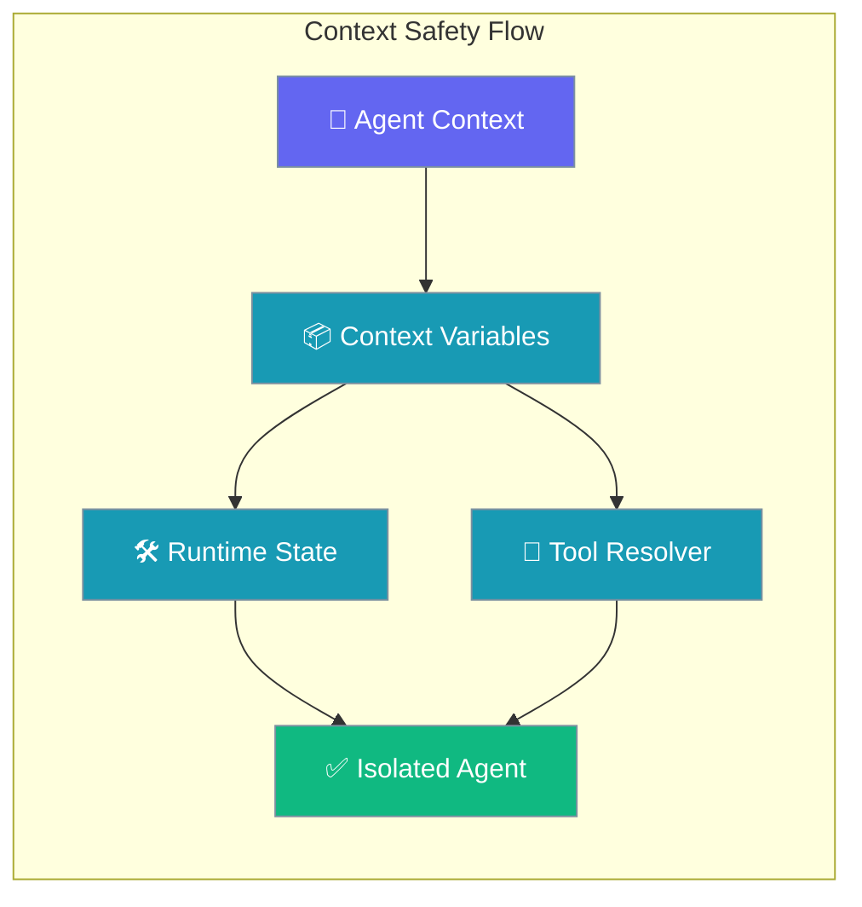
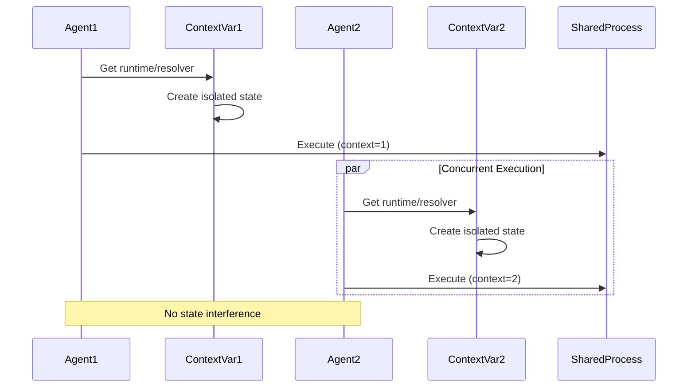

Context-isolated runtime and tool resolution prevents agents from interfering with each other when running concurrently in the same process.

```python
import asyncio
from praisonaiagents import Agent

async def run_agents():
    agent1 = Agent(name="Agent1", instructions="Help with coding")
    agent2 = Agent(name="Agent2", instructions="Help with writing")
    await asyncio.gather(agent1.start("Fix this bug"), agent2.start("Draft release notes"))

asyncio.run(run_agents())
```

The user runs agents concurrently; each agent keeps isolated runtime and tool state.



## Quick Start

<Steps>
<Step title="Default Behavior (Safe)">
Each agent automatically gets its own context-isolated runtime and tool resolver:

```python
import asyncio
from praisonaiagents import Agent

async def run_agents():
    # Each agent gets its own context automatically
    agent1 = Agent(name="Agent1", instructions="Help with coding")
    agent2 = Agent(name="Agent2", instructions="Help with writing")
    
    # These run safely in parallel - no state bleed
    tasks = [
        asyncio.create_task(agent1.astart("Write a Python function")),
        asyncio.create_task(agent2.astart("Write a blog post"))
    ]
    
    results = await asyncio.gather(*tasks)
    print("Both agents completed safely")

asyncio.run(run_agents())
```
</Step>

<Step title="Multi-Project Tool Resolution">
Agents in different working directories get their own tool resolver anchored to their CWD:

```python
import os
from praisonaiagents import Agent
from praisonai.tool_resolver import reset_default_resolver

# Project A with its own tools.py
os.chdir("/project_a")
agent_a = Agent(name="ProjectA", instructions="Use project A tools")
agent_a.start("Use my_custom_tool")  # Uses /project_a/tools.py

# Switch to project B
os.chdir("/project_b") 
reset_default_resolver()  # Force re-anchor for new CWD
agent_b = Agent(name="ProjectB", instructions="Use project B tools")
agent_b.start("Use my_custom_tool")  # Uses /project_b/tools.py
```
</Step>
</Steps>

---

## How It Works



Context variables (`contextvars.ContextVar`) automatically isolate state per execution context. Each agent/task/request gets its own:

- **Interactive runtime** with separate LSP/ACP configurations
- **Tool resolver** anchored to its own working directory
- **Memory and cache state** that won't leak between agents

---

## Configuration Options

The context safety is automatic - no configuration required. However, there are some control points:

| Component | Behavior | Control Function |
|-----------|----------|------------------|
| Tool Resolver | Per-context CWD anchoring | `reset_default_resolver()` |
| Interactive Runtime | Per-context config isolation | `cleanup_runtime()` (context-local) |
| Memory State | Automatic isolation | Built-in with async-safe locks |

---

## Common Patterns

### Pattern 1: Daemon with Project Switching

```python
import os
from praisonai.tool_resolver import reset_default_resolver
from praisonaiagents import Agent

class MultiProjectDaemon:
    def switch_project(self, project_path: str):
        """Switch to a different project directory."""
        os.chdir(project_path)
        reset_default_resolver()  # Re-anchor tool resolver
        print(f"Switched to project: {project_path}")
    
    def process_request(self, project: str, task: str):
        """Process a request for a specific project."""
        self.switch_project(f"/workspace/{project}")
        
        agent = Agent(
            name=f"Agent-{project}",
            instructions=f"Work on {project} tasks"
        )
        
        return agent.start(task)

# Usage
daemon = MultiProjectDaemon()
result1 = daemon.process_request("frontend", "Fix the CSS bug")
result2 = daemon.process_request("backend", "Optimize the database query")
```

### Pattern 2: Concurrent Multi-Agent Workflow

```python
import asyncio
from praisonaiagents import Agent

async def parallel_analysis():
    """Run multiple agents concurrently without interference."""
    
    # Each agent gets isolated context automatically
    agents = [
        Agent(name="DataAnalyst", instructions="Analyze data patterns"),
        Agent(name="SecurityReviewer", instructions="Check for security issues"), 
        Agent(name="CodeReviewer", instructions="Review code quality")
    ]
    
    tasks = [
        "Analyze the sales data for trends",
        "Audit the authentication system",
        "Review the new API endpoints"
    ]
    
    # All run safely in parallel
    results = await asyncio.gather(*[
        agent.astart(task) for agent, task in zip(agents, tasks)
    ])
    
    return results

# Each agent uses its own runtime/resolver context
results = asyncio.run(parallel_analysis())
```

### Pattern 3: IDE Plugin Integration

```python
import asyncio
from praisonaiagents import Agent
from praisonai.tool_resolver import reset_default_resolver

class IDEPlugin:
    def __init__(self):
        self.current_workspace = None
    
    async def handle_workspace_change(self, workspace_path: str):
        """Handle IDE workspace changes."""
        if self.current_workspace != workspace_path:
            self.current_workspace = workspace_path
            reset_default_resolver()  # Re-anchor to new workspace
            print(f"Workspace changed to: {workspace_path}")
    
    async def execute_command(self, command: str):
        """Execute command in current workspace context."""
        agent = Agent(
            name="IDEAssistant",
            instructions="Help with IDE tasks"
        )
        
        # Agent automatically uses workspace-specific context
        return await agent.astart(command)

# Usage in IDE
plugin = IDEPlugin()
await plugin.handle_workspace_change("/user/projects/myapp")
result = await plugin.execute_command("Refactor this function")
```

---

## Best Practices

<AccordionGroup>
<Accordion title="Always use reset_default_resolver() after chdir">
When switching working directories in long-lived processes, explicitly reset the tool resolver to pick up the new directory's tools.py.

```python
import os
from praisonai.tool_resolver import reset_default_resolver

# Good - explicit reset after chdir
os.chdir("/new/project")
reset_default_resolver()
agent = Agent(name="Agent", instructions="Use local tools")

# Bad - may use cached resolver from old directory  
os.chdir("/new/project")
agent = Agent(name="Agent", instructions="Use local tools")
```
</Accordion>

<Accordion title="Trust automatic context isolation">
Don't manually manage context variables - the framework handles isolation automatically. Each async task or thread gets its own context.

```python
# Good - automatic isolation
async def worker(agent_name: str):
    agent = Agent(name=agent_name, instructions="Work independently")
    return await agent.astart("Do the task")

# Run multiple workers - each gets isolated context
tasks = [worker(f"Agent{i}") for i in range(5)]
results = await asyncio.gather(*tasks)

# Bad - manual context management (unnecessary)
import contextvars
ctx_var = contextvars.ContextVar('agent_state')
# Don't do this - framework handles it
```
</Accordion>

<Accordion title="Use context-local cleanup functions">
When cleaning up resources, use the context-local versions that only affect the current agent's context.

```python
from praisonai.cli.features.interactive_tools import cleanup_runtime

async def agent_task():
    agent = Agent(name="TempAgent", instructions="Temporary task")
    try:
        result = await agent.astart("Do something")
        return result
    finally:
        cleanup_runtime()  # Only cleans up this context's runtime
```
</Accordion>

<Accordion title="Leverage CWD-per-context for multi-project tools">
Each context anchors its tool resolver to the working directory when first called. Use this for clean project separation.

```python
# Project structure:
# /project_a/tools.py  - has custom_tool_a()
# /project_b/tools.py  - has custom_tool_b()

import os
from praisonaiagents import Agent

# Agent A in project A context
os.chdir("/project_a")
agent_a = Agent(name="AgentA", instructions="Use project A tools")
# Automatically resolves to /project_a/tools.py

# Agent B in project B context  
os.chdir("/project_b")
agent_b = Agent(name="AgentB", instructions="Use project B tools")
# Automatically resolves to /project_b/tools.py

# Each agent uses its own project's tools
```
</Accordion>
</AccordionGroup>

---

## Related

<CardGroup cols={2}>
<Card title="Thread Safety" icon="lock" href="/docs/features/thread-safety">
  Thread-safe agent operations and state management
</Card>
<Card title="Tool Resolver" icon="wrench" href="/docs/features/tool-resolver">
  Context-aware tool resolution and loading
</Card>
</CardGroup>