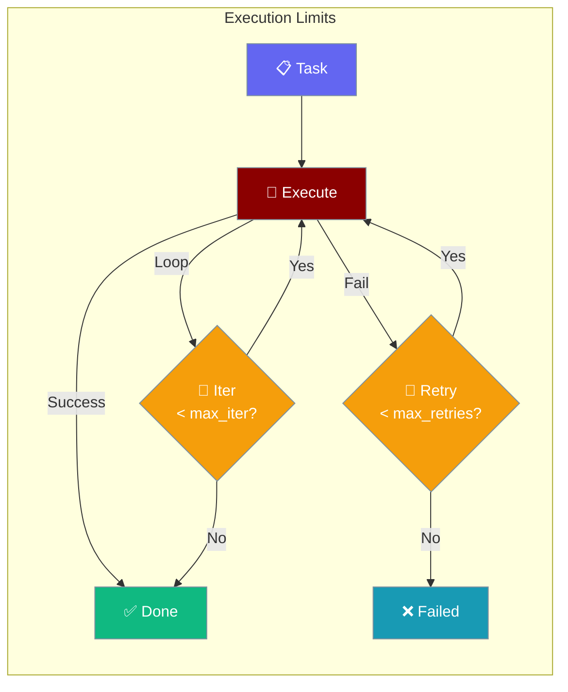

Set how many times your multi-agent system tries each task before giving up.

```python
from praisonaiagents import Agent, Task, PraisonAIAgents
from praisonaiagents import MultiAgentExecutionConfig

team = PraisonAIAgents(
    agents=[agent1, agent2],
    tasks=[task1, task2],
    execution=MultiAgentExecutionConfig(
        max_iter=20,
        max_retries=3,
    )
)

team.start()
```



## Quick Start

<Steps>
<Step title="Default Limits">
The defaults (10 iterations, 5 retries) work for most use cases:

```python
from praisonaiagents import Agent, Task, PraisonAIAgents

team = PraisonAIAgents(
    agents=[agent],
    tasks=[task],
)

team.start()
```
</Step>

<Step title="Custom Limits">
Increase limits for complex long-running tasks:

```python
from praisonaiagents import Agent, Task, PraisonAIAgents
from praisonaiagents import MultiAgentExecutionConfig

team = PraisonAIAgents(
    agents=[agent],
    tasks=[task],
    execution=MultiAgentExecutionConfig(
        max_iter=50,    # Allow more iterations for complex tasks
        max_retries=3,  # Fewer retries if task is unlikely to recover
    )
)

team.start()
```
</Step>
</Steps>

---

## Configuration Options

<Card title="MultiAgentExecutionConfig SDK Reference" icon="code" href="/docs/sdk/reference/python/classes/MultiAgentExecutionConfig">
  Full parameter reference for MultiAgentExecutionConfig
</Card>

| Option | Type | Default | Description |
|--------|------|---------|-------------|
| `max_iter` | `int` | `10` | Maximum iterations per task |
| `max_retries` | `int` | `5` | Maximum retries on task failure |

---

## Best Practices

<AccordionGroup>
<Accordion title="Increase max_iter for research tasks">
Research and writing tasks often need more iterations — the agent may need to search, read, reflect, and revise multiple times. Set `max_iter=30` to `50` for complex tasks.
</Accordion>

<Accordion title="Keep max_retries low for deterministic tasks">
For tasks that either succeed or fail cleanly (like API calls or file reads), keep `max_retries=2` or `3`. High retry counts delay failure detection without helping.
</Accordion>

<Accordion title="Watch for infinite loops">
If an agent repeatedly fails and retries, check that your task description is clear and your tools are working correctly. High `max_iter` values can make loop detection slower.
</Accordion>
</AccordionGroup>

---

## Related

<CardGroup cols={2}>
<Card title="Multi-Agent Hooks" icon="webhook" href="/docs/features/multi-agent-hooks">
  Intercept task lifecycle events
</Card>
<Card title="Multi-Agent Planning" icon="list-check" href="/docs/features/multi-agent-planning">
  Plan tasks before executing them
</Card>
<Card title="Execution Systems" icon="cpu" href="/docs/features/execution-systems">
  Single-agent execution configuration
</Card>
<Card title="Agent Retry" icon="rotate-cw" href="/docs/features/agent-retry">
  Single-agent retry behavior
</Card>
</CardGroup>
