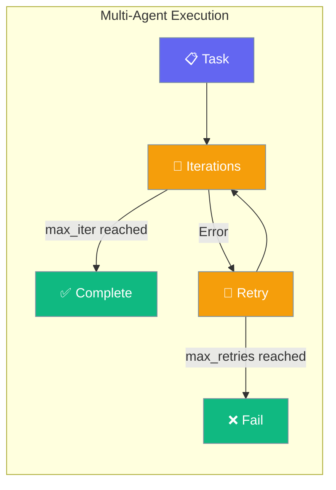
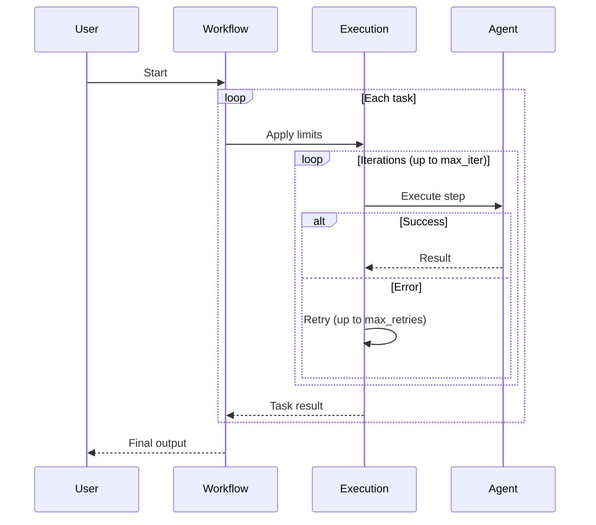

Multi-Agent Execution config controls how many times each task can iterate and how many retries are allowed when tasks fail.

```python
from praisonaiagents import Agent, Task, PraisonAIAgents, MultiAgentExecutionConfig

agent = Agent(name="Researcher", instructions="Research topics thoroughly.")
task = Task(description="Research the history of artificial intelligence", agent=agent)

workflow = PraisonAIAgents(
    agents=[agent],
    tasks=[task],
    execution=MultiAgentExecutionConfig(max_iter=20, max_retries=3),
)
workflow.start()
```



## Quick Start

<Steps>
<Step title="Simple Usage">
```python
from praisonaiagents import Agent, Task, PraisonAIAgents, MultiAgentExecutionConfig

agent = Agent(name="Helper", instructions="Complete tasks efficiently.")
task = Task(description="Write a marketing email for our new product", agent=agent)

workflow = PraisonAIAgents(
    agents=[agent],
    tasks=[task],
    execution=MultiAgentExecutionConfig(max_iter=10),
)
workflow.start()
```
</Step>

<Step title="With Custom Retry Settings">
```python
from praisonaiagents import Agent, Task, PraisonAIAgents, MultiAgentExecutionConfig

agent1 = Agent(name="Researcher", instructions="Research topics in depth.")
agent2 = Agent(name="Writer", instructions="Write clear reports.")

task1 = Task(description="Research quantum computing applications", agent=agent1)
task2 = Task(description="Write a report based on the research", agent=agent2)

workflow = PraisonAIAgents(
    agents=[agent1, agent2],
    tasks=[task1, task2],
    execution=MultiAgentExecutionConfig(max_iter=15, max_retries=5),
)
workflow.start()
```
</Step>
</Steps>

---

## How It Works



| Setting | Controls | Default |
|---|---|---|
| `max_iter` | Max iterations per task | `10` |
| `max_retries` | Max retries on failure | `5` |

---

## Configuration Options

<Card icon="code" href="/docs/sdk/reference/python/MultiAgentExecutionConfig">
  Full list of options, types, and defaults — `MultiAgentExecutionConfig`
</Card>

| Option | Type | Default | Description |
|---|---|---|---|
| `max_iter` | `int` | `10` | Maximum iterations per task |
| `max_retries` | `int` | `5` | Maximum retries on task failure |

---

## Common Patterns

### Pattern 1 — Long-running research workflow
```python
from praisonaiagents import Agent, Task, PraisonAIAgents, MultiAgentExecutionConfig

researcher = Agent(name="Researcher", instructions="Do thorough multi-step research.")
writer = Agent(name="Writer", instructions="Write clear, comprehensive reports.")

tasks = [
    Task(description="Research AI trends in 2025", agent=researcher),
    Task(description="Compile findings into a structured report", agent=writer),
]

response = PraisonAIAgents(
    agents=[researcher, writer],
    tasks=tasks,
    execution=MultiAgentExecutionConfig(max_iter=25, max_retries=3),
).start()
print(response)
```

### Pattern 2 — Conservative limits for cost control
```python
from praisonaiagents import Agent, Task, PraisonAIAgents, MultiAgentExecutionConfig

agent = Agent(name="Classifier", instructions="Classify text into categories.")
task = Task(description="Classify 50 customer support tickets", agent=agent)

workflow = PraisonAIAgents(
    agents=[agent],
    tasks=[task],
    execution=MultiAgentExecutionConfig(max_iter=5, max_retries=2),
)
workflow.start()
```

---

## Best Practices

<AccordionGroup>
<Accordion title="Tune max_iter per task complexity">
Simple tasks (classification, extraction) need `max_iter=5–10`. Complex research or multi-step synthesis tasks may need `max_iter=20–30`. Start low and increase if tasks don't complete.
</Accordion>

<Accordion title="max_retries for fault tolerance">
Set `max_retries=3–5` for workflows calling external services that may fail intermittently. For offline or deterministic tasks, `max_retries=1–2` is usually enough.
</Accordion>

<Accordion title="Monitor with hooks">
Pair `MultiAgentExecutionConfig` with `MultiAgentHooksConfig` to log when retries happen. This helps diagnose why tasks hit their retry limit in production.
</Accordion>
</AccordionGroup>

---

## Related

<CardGroup cols={2}>
<Card icon="webhook" href="/docs/features/multi-agent-hooks">
  Multi-Agent Hooks — callbacks for task lifecycle events
</Card>
<Card icon="list-check" href="/docs/features/multi-agent-planning">
  Multi-Agent Planning — coordinate agent plans across workflows
</Card>
</CardGroup>
