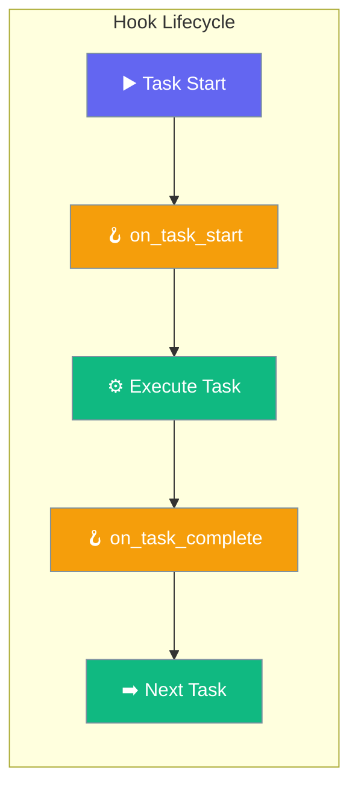
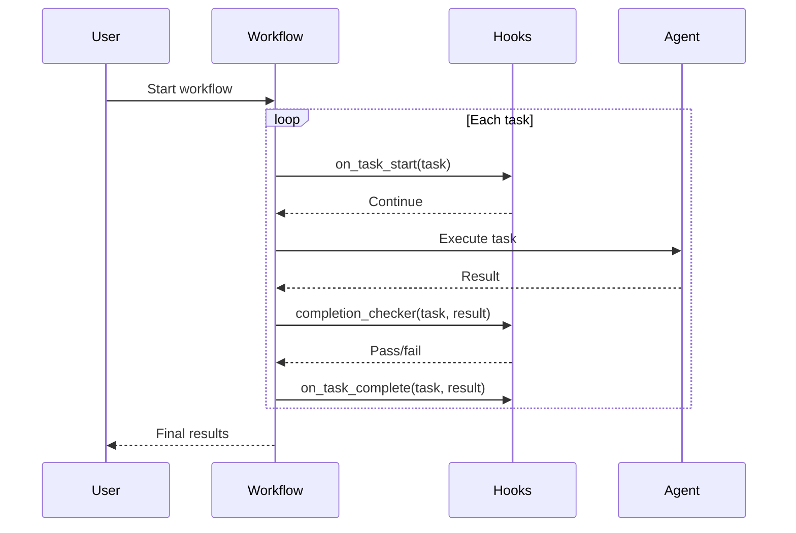

Multi-Agent Hooks let you run custom code when tasks start, complete, or when you need custom completion detection in multi-agent workflows.

```python
from praisonaiagents import Agent, Task, PraisonAIAgents, MultiAgentHooksConfig

def on_task_start(task):
    print(f"Starting: {task.name}")

def on_task_complete(task, result):
    print(f"Done: {task.name}")

agent = Agent(name="Researcher", instructions="Research topics thoroughly.")
task = Task(description="Research quantum computing", agent=agent)

workflow = PraisonAIAgents(
    agents=[agent],
    tasks=[task],
    hooks=MultiAgentHooksConfig(
        on_task_start=on_task_start,
        on_task_complete=on_task_complete,
    ),
)
workflow.start()
```



## Quick Start

<Steps>
<Step title="Simple Usage">
```python
from praisonaiagents import Agent, Task, PraisonAIAgents, MultiAgentHooksConfig

agent = Agent(name="Helper", instructions="Complete assigned tasks.")
task = Task(description="Write a summary of AI trends", agent=agent)

workflow = PraisonAIAgents(
    agents=[agent],
    tasks=[task],
    hooks=MultiAgentHooksConfig(
        on_task_complete=lambda t, r: print(f"Task {t.name} done!"),
    ),
)
workflow.start()
```
</Step>

<Step title="With Custom Completion Checker">
```python
from praisonaiagents import Agent, Task, PraisonAIAgents, MultiAgentHooksConfig

def quality_checker(task, result):
    return len(result.raw) > 100

agent = Agent(name="Writer", instructions="Write detailed content.")
task = Task(description="Write an article about renewable energy", agent=agent)

workflow = PraisonAIAgents(
    agents=[agent],
    tasks=[task],
    hooks=MultiAgentHooksConfig(
        completion_checker=quality_checker,
        on_task_complete=lambda t, r: print(f"✅ {t.name} passed quality check"),
    ),
)
workflow.start()
```
</Step>
</Steps>

---

## How It Works



| Hook | When it fires | Use case |
|---|---|---|
| `on_task_start` | Before each task begins | Logging, resource allocation |
| `on_task_complete` | After each task succeeds | Notifications, result storage |
| `completion_checker` | After task, before marking done | Quality gates, validation |

---

## Configuration Options

<Card icon="code" href="/docs/sdk/reference/python/MultiAgentHooksConfig">
  Full list of options, types, and defaults — `MultiAgentHooksConfig`
</Card>

| Option | Type | Default | Description |
|---|---|---|---|
| `on_task_start` | `Callable \| None` | `None` | Called before each task starts |
| `on_task_complete` | `Callable \| None` | `None` | Called after each task completes |
| `completion_checker` | `Callable \| None` | `None` | Custom function to determine task completion |

---

## Common Patterns

### Pattern 1 — Logging workflow progress
```python
from praisonaiagents import Agent, Task, PraisonAIAgents, MultiAgentHooksConfig
import time

start_times = {}

def log_start(task):
    start_times[task.name] = time.time()
    print(f"[START] {task.name}")

def log_complete(task, result):
    elapsed = time.time() - start_times.get(task.name, 0)
    print(f"[DONE] {task.name} in {elapsed:.1f}s")

agent = Agent(name="Worker", instructions="Complete tasks efficiently.")
task = Task(description="Analyze quarterly sales data", agent=agent)

workflow = PraisonAIAgents(
    agents=[agent],
    tasks=[task],
    hooks=MultiAgentHooksConfig(on_task_start=log_start, on_task_complete=log_complete),
)
workflow.start()
```

### Pattern 2 — Quality gate with retry logic
```python
from praisonaiagents import Agent, Task, PraisonAIAgents, MultiAgentHooksConfig

def length_checker(task, result):
    return len(result.raw) >= 200

agent = Agent(name="Analyst", instructions="Write comprehensive analyses.")
task = Task(description="Analyze the impact of remote work on productivity", agent=agent)

response = PraisonAIAgents(
    agents=[agent],
    tasks=[task],
    hooks=MultiAgentHooksConfig(completion_checker=length_checker),
).start()
print(response)
```

---

## Best Practices

<AccordionGroup>
<Accordion title="Keep hooks lightweight">
Hooks run synchronously in the workflow execution path. Keep them fast — log to a queue, don't make blocking API calls inside a hook. Use background tasks for heavy work triggered by hooks.
</Accordion>

<Accordion title="Use completion_checker for quality gates">
Instead of checking output quality after the workflow, use `completion_checker` to enforce quality at the task level. If the checker returns `False`, the workflow can retry the task automatically.
</Accordion>

<Accordion title="Handle exceptions in hooks">
If a hook raises an exception, it can disrupt the entire workflow. Wrap hook logic in try/except and log errors rather than re-raising them, unless you want a hook failure to stop the workflow.
</Accordion>
</AccordionGroup>

---

## Related

<CardGroup cols={2}>
<Card icon="webhook" href="/docs/features/hooks">
  Single-Agent Hooks — callbacks for individual agent steps
</Card>
<Card icon="users" href="/docs/features/multi-agent-execution">
  Multi-Agent Execution — control iteration and retry limits
</Card>
</CardGroup>
