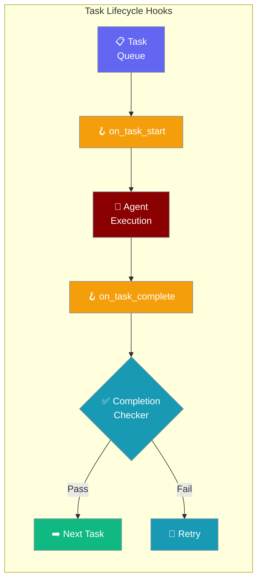
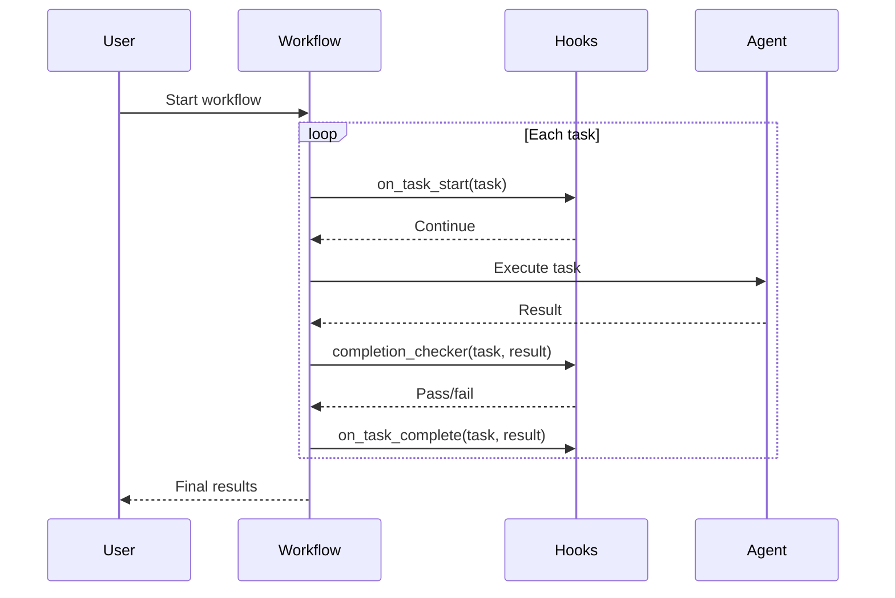

Multi-Agent Hooks let you run custom code when tasks start, complete, or when you need custom completion detection in multi-agent workflows.

```python
from praisonaiagents import Agent, Task, PraisonAIAgents, MultiAgentHooksConfig

def on_task_start(task):
    print(f"Starting: {task.name}")

def on_task_complete(task, result):
    print(f"Done: {task.name}")

agent = Agent(name="Researcher", instructions="Research topics thoroughly.")
task = Task(description="Research quantum computing", agent=agent)

workflow = PraisonAIAgents(
    agents=[agent],
    tasks=[task],
    hooks=MultiAgentHooksConfig(
        on_task_start=on_task_start,
        on_task_complete=on_task_complete,
    ),
)
workflow.start()
```

The user registers hooks; the workflow fires them as each task starts and completes.



## Quick Start

<Steps>
<Step title="Task Lifecycle Logging">
Log every task transition with `on_task_start` and `on_task_complete`:

```python
from praisonaiagents import Agent, Task, PraisonAIAgents
from praisonaiagents import MultiAgentHooksConfig
import time

start_times = {}

def on_start(task):
    start_times[task.name] = time.time()
    print(f"[START] {task.name}")

def on_complete(task, result):
    duration = time.time() - start_times.get(task.name, time.time())
    print(f"[DONE]  {task.name} ({duration:.1f}s)")

researcher = Agent(name="Researcher", instructions="Research topics thoroughly.")
writer = Agent(name="Writer", instructions="Write clear summaries.")

research_task = Task(description="Research quantum computing", agent=researcher)
write_task = Task(description="Write a summary", agent=writer)

team = PraisonAIAgents(
    agents=[researcher, writer],
    tasks=[research_task, write_task],
    hooks=MultiAgentHooksConfig(
        on_task_start=on_start,
        on_task_complete=on_complete,
    )
)

team.start()
```
</Step>

<Step title="Custom Completion Checker">
Override the default completion logic with your own validation:

```python
from praisonaiagents import Agent, Task, PraisonAIAgents
from praisonaiagents import MultiAgentHooksConfig

def quality_checker(task, result):
    """Return True if output meets quality standards."""
    if len(result) < 100:
        print(f"Output too short ({len(result)} chars), retrying...")
        return False
    if "error" in result.lower():
        print("Output contains error, retrying...")
        return False
    return True

agent = Agent(name="Analyst", instructions="Provide detailed analysis.")
task = Task(description="Analyze the market trends for 2025", agent=agent)

team = PraisonAIAgents(
    agents=[agent],
    tasks=[task],
    hooks=MultiAgentHooksConfig(
        completion_checker=quality_checker,
        on_task_complete=lambda t, r: print(f"✅ {t.name} passed quality check"),
    ),
)
workflow.start()
```
</Step>
</Steps>

---

## How It Works



| Hook | When it fires | Use case |
|---|---|---|
| `on_task_start` | Before each task begins | Logging, resource allocation |
| `on_task_complete` | After each task succeeds | Notifications, result storage |
| `completion_checker` | After task, before marking done | Quality gates, validation |

---

## Configuration Options

<Card title="MultiAgentHooksConfig SDK Reference" icon="code" href="/docs/sdk/reference/python/classes/MultiAgentHooksConfig">
  Full parameter reference for MultiAgentHooksConfig
</Card>

| Option | Type | Default | Description |
|--------|------|---------|-------------|
| `on_task_start` | `Callable \| None` | `None` | Called before a task begins. Signature: `(task) -> None` |
| `on_task_complete` | `Callable \| None` | `None` | Called after a task finishes. Signature: `(task, result) -> None` |
| `completion_checker` | `Callable \| None` | `None` | Custom validator. Signature: `(task, result) -> bool` |

---

## Common Patterns

### Pattern 1 — Logging workflow progress
```python
from praisonaiagents import Agent, Task, PraisonAIAgents, MultiAgentHooksConfig
import time

start_times = {}

def log_start(task):
    start_times[task.name] = time.time()
    print(f"[START] {task.name}")

def log_complete(task, result):
    elapsed = time.time() - start_times.get(task.name, 0)
    print(f"[DONE] {task.name} in {elapsed:.1f}s")

agent = Agent(name="Worker", instructions="Complete tasks efficiently.")
task = Task(description="Analyze quarterly sales data", agent=agent)

workflow = PraisonAIAgents(
    agents=[agent],
    tasks=[task],
    hooks=MultiAgentHooksConfig(on_task_start=log_start, on_task_complete=log_complete),
)
workflow.start()
```

### Pattern 2 — Quality gate with retry logic
```python
from praisonaiagents import Agent, Task, PraisonAIAgents, MultiAgentHooksConfig

def length_checker(task, result):
    return len(result.raw) >= 200

agent = Agent(name="Analyst", instructions="Write comprehensive analyses.")
task = Task(description="Analyze the impact of remote work on productivity", agent=agent)

response = PraisonAIAgents(
    agents=[agent],
    tasks=[task],
    hooks=MultiAgentHooksConfig(completion_checker=length_checker),
).start()
print(response)
```

---

## Best Practices

<AccordionGroup>
<Accordion title="Keep hooks lightweight">
Hook callbacks run synchronously in the orchestrator loop. Expensive operations (database writes, HTTP requests) should be done asynchronously or offloaded to a background thread to avoid slowing down task execution.
</Accordion>

<Accordion title="Use completion_checker for quality gates">
The `completion_checker` is ideal for enforcing output quality requirements — minimum length, required fields, absence of error text. Return `False` to trigger a retry and `True` to accept the result.
</Accordion>

<Accordion title="Don't mutate task objects in hooks">
Hook callbacks receive task references. Mutating task properties during execution can cause unexpected behavior. Use hooks for observation and notification, not for changing task state.
</Accordion>
</AccordionGroup>

---

## Related

<CardGroup cols={2}>
<Card title="Hooks" icon="webhook" href="/docs/features/hooks">
  Single-agent lifecycle hooks
</Card>
<Card title="Callbacks" icon="rotate-cw" href="/docs/features/callbacks">
  Agent callback system
</Card>
<Card title="Multi-Agent Output" icon="display" href="/docs/features/multi-agent-output">
  Control output verbosity across agents
</Card>
<Card title="Multi-Agent Execution" icon="play" href="/docs/features/multi-agent-execution">
  Configure iteration and retry limits
</Card>
</CardGroup>
