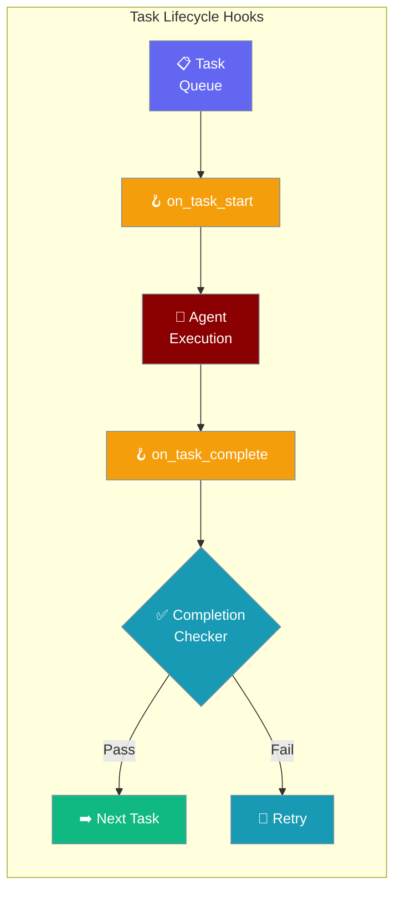
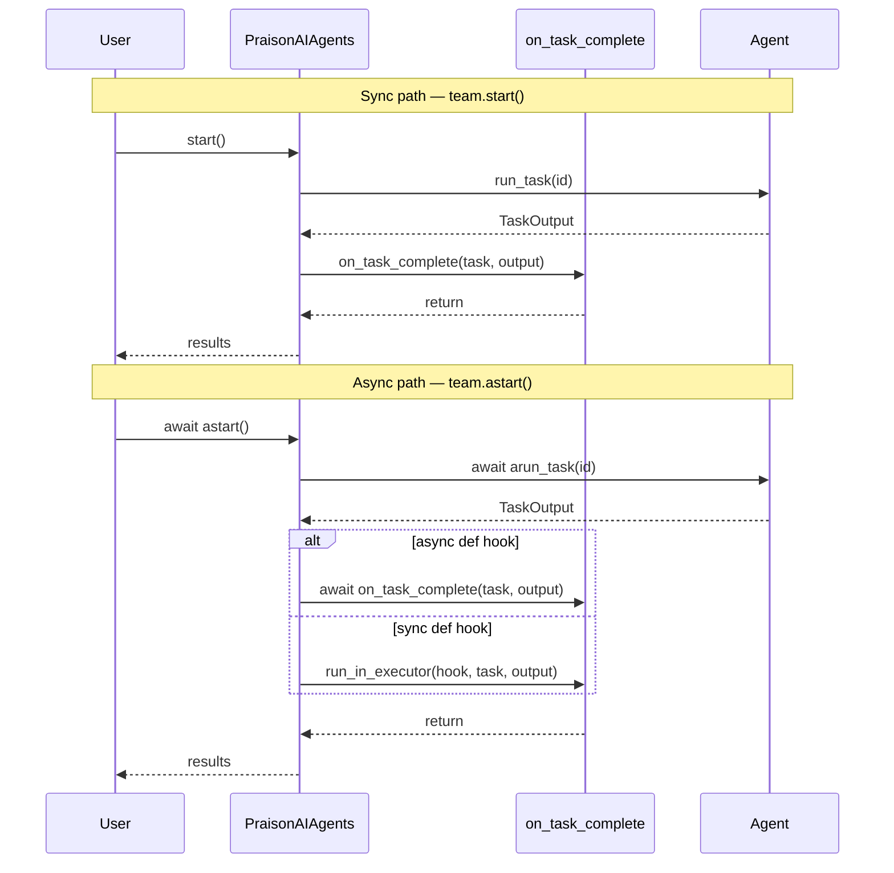

Multi-Agent Hooks let you run custom code when tasks start, complete, or when you need custom completion detection in multi-agent workflows.

```python
from praisonaiagents import Agent, Task, PraisonAIAgents, MultiAgentHooksConfig

def on_task_start(task, task_id):
    print(f"Starting: {task.name} (id={task_id})")

def on_task_complete(task, task_output):
    print(f"Done: {task.name}")

agent = Agent(name="Researcher", instructions="Research topics thoroughly.")
task = Task(description="Research quantum computing", agent=agent)

team = PraisonAIAgents(
    agents=[agent],
    tasks=[task],
    hooks=MultiAgentHooksConfig(
        on_task_start=on_task_start,
        on_task_complete=on_task_complete,
    ),
)
team.start()
```

The user registers hooks; the workflow fires them as each task starts and completes.

<Note>
Multi-agent lifecycle hooks fire on **both** sync (`team.start()`) and async (`team.astart()`) workflows, and callbacks may be either regular functions or `async def` coroutines. See [Async and Sync Callbacks](#async-and-sync-callbacks) below.
</Note>



## Quick Start

<Steps>
<Step title="Task Lifecycle Logging">
Log every task transition with `on_task_start` and `on_task_complete`:

```python
from praisonaiagents import Agent, Task, PraisonAIAgents
from praisonaiagents import MultiAgentHooksConfig
import time

start_times = {}

def on_start(task, task_id):
    start_times[task.name] = time.time()
    print(f"[START] {task.name} (id={task_id})")

def on_complete(task, task_output):
    duration = time.time() - start_times.get(task.name, time.time())
    print(f"[DONE]  {task.name} ({duration:.1f}s)")

researcher = Agent(name="Researcher", instructions="Research topics thoroughly.")
writer = Agent(name="Writer", instructions="Write clear summaries.")

research_task = Task(description="Research quantum computing", agent=researcher)
write_task = Task(description="Write a summary", agent=writer)

team = PraisonAIAgents(
    agents=[researcher, writer],
    tasks=[research_task, write_task],
    hooks=MultiAgentHooksConfig(
        on_task_start=on_start,
        on_task_complete=on_complete,
    )
)

team.start()
```
</Step>

<Step title="Async Workflow with async def Hooks">
Run the team with `astart()` and use `async def` callbacks to `await` I/O directly:

```python
import asyncio
from praisonaiagents import Agent, Task, PraisonAIAgents, MultiAgentHooksConfig

async def on_start(task, task_id):
    print(f"[START] {task.name} (id={task_id})")

async def on_complete(task, task_output):
    # await your async I/O directly — no wrapper needed
    print(f"[DONE]  {task.name}: {task_output.raw[:80]}")

agent = Agent(name="Researcher", instructions="Research topics thoroughly.")
task  = Task(description="Research quantum computing", agent=agent)

team = PraisonAIAgents(
    agents=[agent],
    tasks=[task],
    hooks=MultiAgentHooksConfig(
        on_task_start=on_start,       # async def — awaited
        on_task_complete=on_complete, # async def — awaited
    ),
)

asyncio.run(team.astart())  # fires the same hooks as .start()
```
</Step>

<Step title="Custom Completion Checker">
Override the default completion logic with your own validation:

```python
from praisonaiagents import Agent, Task, PraisonAIAgents
from praisonaiagents import MultiAgentHooksConfig

def quality_checker(task, task_output):
    """Return True if output meets quality standards."""
    if len(task_output) < 100:
        print(f"Output too short ({len(task_output)} chars), retrying...")
        return False
    if "error" in task_output.lower():
        print("Output contains error, retrying...")
        return False
    return True

agent = Agent(name="Analyst", instructions="Provide detailed analysis.")
task = Task(description="Analyze the market trends for 2025", agent=agent)

team = PraisonAIAgents(
    agents=[agent],
    tasks=[task],
    hooks=MultiAgentHooksConfig(
        completion_checker=quality_checker,
        on_task_complete=lambda t, o: print(f"✅ {t.name} passed quality check"),
    ),
)
team.start()
```
</Step>
</Steps>

---

## How It Works



| Hook | When it fires | Sync? | Async? | Use case |
|---|---|---|---|---|
| `on_task_start` | Before each task begins | ✅ `start()` / `run_task()` | ✅ `astart()` / `arun_task()` | Logging, resource allocation |
| `on_task_complete` | After each task succeeds | ✅ | ✅ | Notifications, result storage |
| `completion_checker` | After task, before marking done | ✅ | ✅ | Quality gates, validation |

### Async and Sync Callbacks

`MultiAgentHooksConfig` accepts either regular functions or `async def` coroutines for `on_task_start` and `on_task_complete`.

- In sync workflows (`team.start()`), only sync callables are meaningful — an `async def` here would return an un-awaited coroutine.
- In async workflows (`team.astart()` / `arun_task()`), the framework detects the callable type and does the right thing:
  - `async def` callbacks are `await`ed inline.
  - Sync callbacks are offloaded to the default executor via `loop.run_in_executor(None, ...)`, so a blocking hook can't stall the event loop.
- Exceptions raised by either callback are logged (`logger.error`) and swallowed — they never abort the task.

### Global Variables Propagation

Pass `variables=` once at the team level and every task substitutes them into its description at runtime:

```python
from praisonaiagents import Agent, Task, PraisonAIAgents

agent = Agent(name="Writer", instructions="Write a paragraph on {topic} for {audience}.")
task  = Task(description="Write on {topic}", agent=agent)

team = PraisonAIAgents(
    agents=[agent],
    tasks=[task],
    variables={"topic": "quantum computing", "audience": "beginners"},
)
team.start()
```

Values passed to `variables=` are shallow-copied into `task.variables` before each task runs (unless the task defines its own `variables`), then substituted into `task.description`. The shallow copy means a task mutating its own `variables` no longer leaks back into the team-level dict, so parallel tasks in a `process="parallel"` team don't stomp on each other.

---

## Configuration Options

<Card title="MultiAgentHooksConfig SDK Reference" icon="code" href="/docs/sdk/reference/python/classes/MultiAgentHooksConfig">
  Full parameter reference for MultiAgentHooksConfig
</Card>

| Option | Type | Default | Description |
|--------|------|---------|-------------|
| `on_task_start` | `Callable \| None` | `None` | Called before a task begins. Signature: `(task, task_id) -> None`. May be sync or `async def`. |
| `on_task_complete` | `Callable \| None` | `None` | Called after a task finishes. Signature: `(task, task_output) -> None`. May be sync or `async def`. |
| `completion_checker` | `Callable \| None` | `None` | Custom validator. Signature: `(task, task_output) -> bool` |

---

## Common Patterns

### Pattern 1 — Logging workflow progress
```python
from praisonaiagents import Agent, Task, PraisonAIAgents, MultiAgentHooksConfig
import time

start_times = {}

def log_start(task, task_id):
    start_times[task.name] = time.time()
    print(f"[START] {task.name}")

def log_complete(task, task_output):
    elapsed = time.time() - start_times.get(task.name, 0)
    print(f"[DONE] {task.name} in {elapsed:.1f}s")

agent = Agent(name="Worker", instructions="Complete tasks efficiently.")
task = Task(description="Analyze quarterly sales data", agent=agent)

team = PraisonAIAgents(
    agents=[agent],
    tasks=[task],
    hooks=MultiAgentHooksConfig(on_task_start=log_start, on_task_complete=log_complete),
)
team.start()
```

### Pattern 2 — Quality gate with retry logic
```python
from praisonaiagents import Agent, Task, PraisonAIAgents, MultiAgentHooksConfig

def length_checker(task, task_output):
    return len(task_output) >= 200

agent = Agent(name="Analyst", instructions="Write comprehensive analyses.")
task = Task(description="Analyze the impact of remote work on productivity", agent=agent)

response = PraisonAIAgents(
    agents=[agent],
    tasks=[task],
    hooks=MultiAgentHooksConfig(completion_checker=length_checker),
).start()
print(response)
```

### Pattern 3 — Async I/O in a completion hook
```python
import asyncio
from praisonaiagents import Agent, Task, PraisonAIAgents, MultiAgentHooksConfig

async def notify(task, task_output):
    # await a DB write or HTTP call directly inside the hook
    print(f"Notifying downstream: {task.name}")

agent = Agent(name="Worker", instructions="Do the work.")
task = Task(description="Process batch #42", agent=agent)

team = PraisonAIAgents(
    agents=[agent],
    tasks=[task],
    hooks=MultiAgentHooksConfig(on_task_complete=notify),
)
asyncio.run(team.astart())
```

---

## Best Practices

<AccordionGroup>
<Accordion title="Keep hooks lightweight">
Callbacks are invoked on the orchestrator's task-completion path. In **sync workflows**, an expensive hook blocks the next task. In **async workflows**, sync hooks are offloaded to a thread executor and `async def` hooks are awaited, so blocking work is safer — but a slow hook still increases end-to-end task latency. Prefer `async def` for I/O-bound work (DB writes, HTTP notifications) and keep CPU-bound work off the hook path entirely.
</Accordion>

<Accordion title="Prefer async def hooks with astart()">
When you run the team with `astart()`, use `async def` callbacks for `on_task_start` / `on_task_complete` so you can `await` I/O directly. Sync callbacks still work — the framework offloads them to the default executor — but writing them as coroutines is clearer and avoids an unnecessary executor hop.
</Accordion>

<Accordion title="Use completion_checker for quality gates">
The `completion_checker` is ideal for enforcing output quality requirements — minimum length, required fields, absence of error text. Return `False` to trigger a retry and `True` to accept the result.
</Accordion>

<Accordion title="Don't mutate task objects in hooks">
Hook callbacks receive task references. Mutating task properties during execution can cause unexpected behavior. Use hooks for observation and notification, not for changing task state.
</Accordion>
</AccordionGroup>

---

## Related

<CardGroup cols={2}>
<Card title="Async Agents" icon="clock" href="/docs/features/async">
  Run multi-agent workflows with astart()
</Card>
<Card title="Hooks" icon="webhook" href="/docs/features/hooks">
  Single-agent lifecycle hooks
</Card>
<Card title="Callbacks" icon="rotate-cw" href="/docs/features/callbacks">
  Agent callback system
</Card>
<Card title="Multi-Agent Execution" icon="play" href="/docs/features/multi-agent-execution">
  Configure iteration and retry limits
</Card>
</CardGroup>
