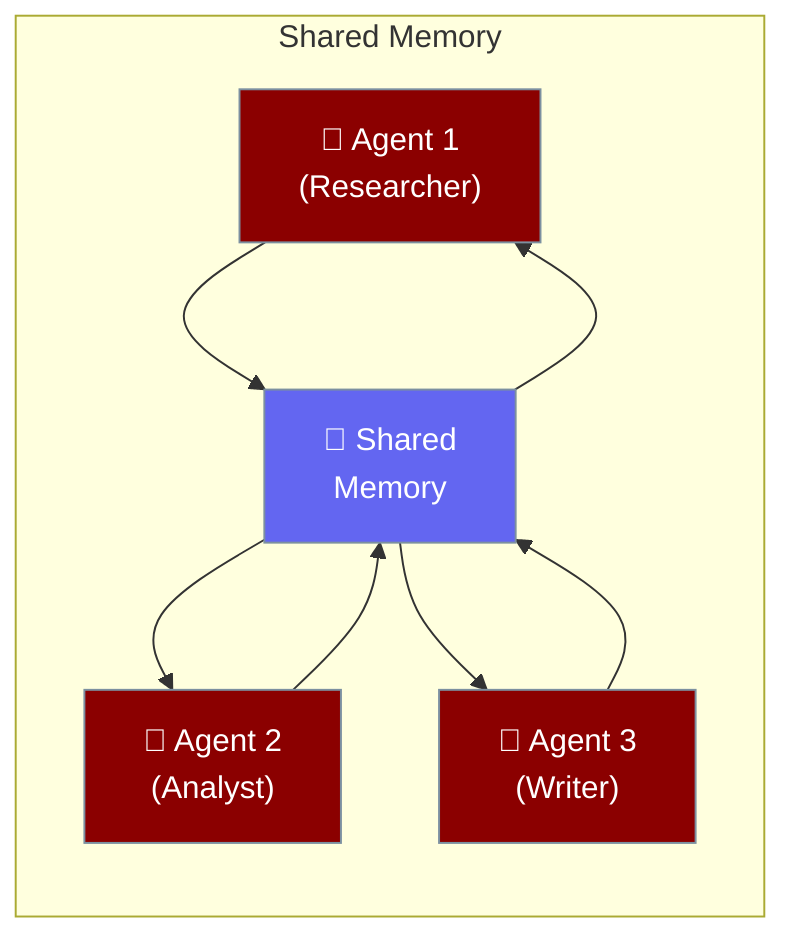

Give your agent team a shared memory — every agent can read and write to the same knowledge store.

```python
from praisonaiagents import Agent, Task, PraisonAIAgents
from praisonaiagents import MultiAgentMemoryConfig

team = PraisonAIAgents(
    agents=[researcher, analyst, writer],
    tasks=[task1, task2, task3],
    memory=MultiAgentMemoryConfig(
        user_id="project-alpha",
        embedder={"provider": "openai"},
    )
)

team.start()
```



## Quick Start

<Steps>
<Step title="Simple Enable">
Enable shared memory with a boolean:

```python
from praisonaiagents import Agent, Task, PraisonAIAgents

team = PraisonAIAgents(
    agents=[researcher, writer],
    tasks=[task1, task2],
    memory=True
)

team.start()
```
</Step>

<Step title="With MultiAgentMemoryConfig">
Configure user scoping and embedder:

```python
from praisonaiagents import Agent, Task, PraisonAIAgents
from praisonaiagents import MultiAgentMemoryConfig

team = PraisonAIAgents(
    agents=[researcher, analyst, writer],
    tasks=[task1, task2, task3],
    memory=MultiAgentMemoryConfig(
        user_id="user-123",                  # Scope memory to this user/project
        embedder={"provider": "openai"},     # Use OpenAI for vector embeddings
        config={"provider": "rag"},          # Memory provider configuration
    )
)

team.start()
```
</Step>
</Steps>

---

## Configuration Options

<Card title="MultiAgentMemoryConfig SDK Reference" icon="code" href="/docs/sdk/reference/python/classes/MultiAgentMemoryConfig">
  Full parameter reference for MultiAgentMemoryConfig
</Card>

**Precedence ladder:**

```python
# Level 1: Bool (enable with defaults)
team = PraisonAIAgents(memory=True)

# Level 2: MultiAgentMemoryConfig (full control)
team = PraisonAIAgents(memory=MultiAgentMemoryConfig(
    user_id="user-123",
    embedder={"provider": "openai"},
))
```

| Option | Type | Default | Description |
|--------|------|---------|-------------|
| `user_id` | `str \| None` | `None` | Scope memory to a specific user or project |
| `embedder` | `Any \| None` | `None` | Embedder configuration (e.g., `{"provider": "openai"}`) |
| `config` | `dict \| None` | `None` | Memory provider configuration |

---

## Common Patterns

**Project-scoped memory:**

```python
from praisonaiagents import MultiAgentMemoryConfig

# All agents in this team share the "project-x" memory namespace
memory = MultiAgentMemoryConfig(user_id="project-x")
```

**Custom embedder for specialized domains:**

```python
from praisonaiagents import MultiAgentMemoryConfig

# Use a domain-specific embedder for better recall
memory = MultiAgentMemoryConfig(
    user_id="medical-team",
    embedder={"provider": "openai", "config": {"model": "text-embedding-3-large"}},
)
```

---

## Best Practices

<AccordionGroup>
<Accordion title="Always set user_id in multi-user systems">
Without `user_id`, all users share the same memory pool. Set a unique `user_id` per user or project to prevent data leakage between different users' agent sessions.
</Accordion>

<Accordion title="Use multi-agent memory for knowledge sharing">
Multi-agent memory shines when agents need to build on each other's findings. The researcher's discoveries become searchable context for the writer — no manual context passing needed.
</Accordion>
</AccordionGroup>

---

## Related

<CardGroup cols={2}>
<Card title="Advanced Memory" icon="database" href="/docs/features/advanced-memory">
  Single-agent memory configuration
</Card>
<Card title="Multi-Agent Planning" icon="list-check" href="/docs/features/multi-agent-planning">
  Plan tasks before executing them
</Card>
<Card title="Multi-Agent Hooks" icon="webhook" href="/docs/features/multi-agent-hooks">
  Intercept task lifecycle events
</Card>
<Card title="Learn" icon="graduation-cap" href="/docs/features/learn">
  Continuous learning from conversations
</Card>
</CardGroup>
