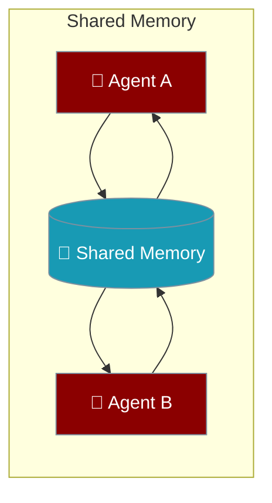
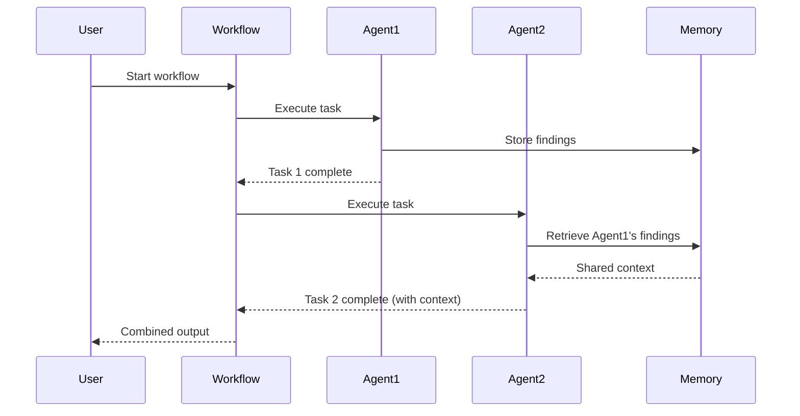

Multi-Agent Memory gives all agents in a workflow access to shared memory, so knowledge discovered by one agent is available to others.

```python
from praisonaiagents import Agent, Task, PraisonAIAgents, MultiAgentMemoryConfig

researcher = Agent(name="Researcher", instructions="Research topics and share findings.")
writer = Agent(name="Writer", instructions="Write based on shared research.")

tasks = [
    Task(description="Research climate change impacts on agriculture", agent=researcher),
    Task(description="Write a policy brief based on the research", agent=writer),
]

workflow = PraisonAIAgents(
    agents=[researcher, writer],
    tasks=tasks,
    memory=MultiAgentMemoryConfig(user_id="project_climate", config={"provider": "rag"}),
)
workflow.start()
```



## Quick Start

<Steps>
<Step title="Simple Usage">
```python
from praisonaiagents import Agent, Task, PraisonAIAgents, MultiAgentMemoryConfig

agent1 = Agent(name="Gatherer", instructions="Gather and remember information.")
agent2 = Agent(name="Synthesizer", instructions="Synthesize remembered information.")

tasks = [
    Task(description="Gather key facts about solar energy", agent=agent1),
    Task(description="Create a summary from gathered facts", agent=agent2),
]

workflow = PraisonAIAgents(
    agents=[agent1, agent2],
    tasks=tasks,
    memory=MultiAgentMemoryConfig(user_id="solar_project"),
)
workflow.start()
```
</Step>

<Step title="With Custom Embedder">
```python
from praisonaiagents import Agent, Task, PraisonAIAgents, MultiAgentMemoryConfig

agents = [
    Agent(name="Expert", instructions="Provide domain expertise."),
    Agent(name="Summarizer", instructions="Summarize expert findings."),
]

tasks = [
    Task(description="Analyze cybersecurity vulnerabilities in cloud systems", agent=agents[0]),
    Task(description="Create an executive summary for non-technical stakeholders", agent=agents[1]),
]

workflow = PraisonAIAgents(
    agents=agents,
    tasks=tasks,
    memory=MultiAgentMemoryConfig(
        user_id="security_review",
        embedder={"provider": "openai", "config": {"model": "text-embedding-3-small"}},
        config={"provider": "rag"},
    ),
)
workflow.start()
```
</Step>
</Steps>

---

## How It Works



| Phase | What happens |
|---|---|
| 1. Store | First agent saves discoveries to shared memory |
| 2. Retrieve | Subsequent agents access all stored context |
| 3. Build | Later agents build on earlier agents' work |

---

## Configuration Options

<Card icon="code" href="/docs/sdk/reference/python/MultiAgentMemoryConfig">
  Full list of options, types, and defaults — `MultiAgentMemoryConfig`
</Card>

| Option | Type | Default | Description |
|---|---|---|---|
| `user_id` | `str \| None` | `None` | Shared user/project identifier for scoped memory |
| `embedder` | `Any \| None` | `None` | Embedder configuration for semantic memory |
| `config` | `dict \| None` | `None` | Memory provider configuration |

---

## Common Patterns

### Pattern 1 — Project-scoped research memory
```python
from praisonaiagents import Agent, Task, PraisonAIAgents, MultiAgentMemoryConfig

agents = [
    Agent(name="Researcher", instructions="Research and document findings."),
    Agent(name="Analyst", instructions="Analyze documented findings."),
    Agent(name="Reporter", instructions="Create final reports."),
]

tasks = [
    Task(description="Research market trends in renewable energy", agent=agents[0]),
    Task(description="Identify key investment opportunities from research", agent=agents[1]),
    Task(description="Write an investment recommendation report", agent=agents[2]),
]

result = PraisonAIAgents(
    agents=agents,
    tasks=tasks,
    memory=MultiAgentMemoryConfig(user_id="renewable_energy_2025"),
).start()
print(result)
```

---

## Best Practices

<AccordionGroup>
<Accordion title="Always set user_id for project isolation">
Set `user_id` to a unique project or session identifier to prevent memory from bleeding between unrelated workflows. Without `user_id`, all workflows share the same memory namespace.
</Accordion>

<Accordion title="Use semantic memory for related topics">
Configure the `embedder` when agents need to find semantically related information (not just exact matches). OpenAI's `text-embedding-3-small` is a good default — fast and cost-effective.
</Accordion>

<Accordion title="Order tasks to build context">
Tasks run in order by default. Place information-gathering tasks first and synthesis/writing tasks later so downstream agents have full context from upstream agents.
</Accordion>
</AccordionGroup>

---

## Related

<CardGroup cols={2}>
<Card icon="brain" href="/docs/features/memory">
  Memory — single-agent memory configuration
</Card>
<Card icon="users" href="/docs/features/multi-agent-hooks">
  Multi-Agent Hooks — lifecycle callbacks for workflows
</Card>
</CardGroup>
