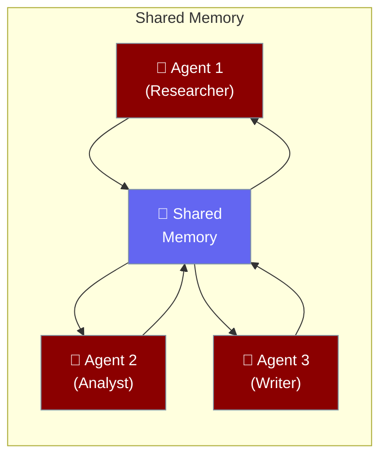
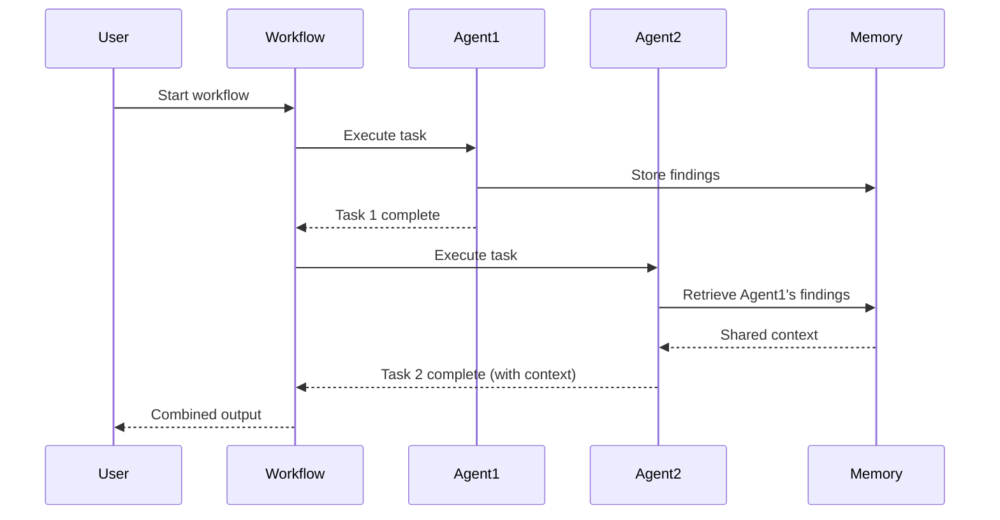
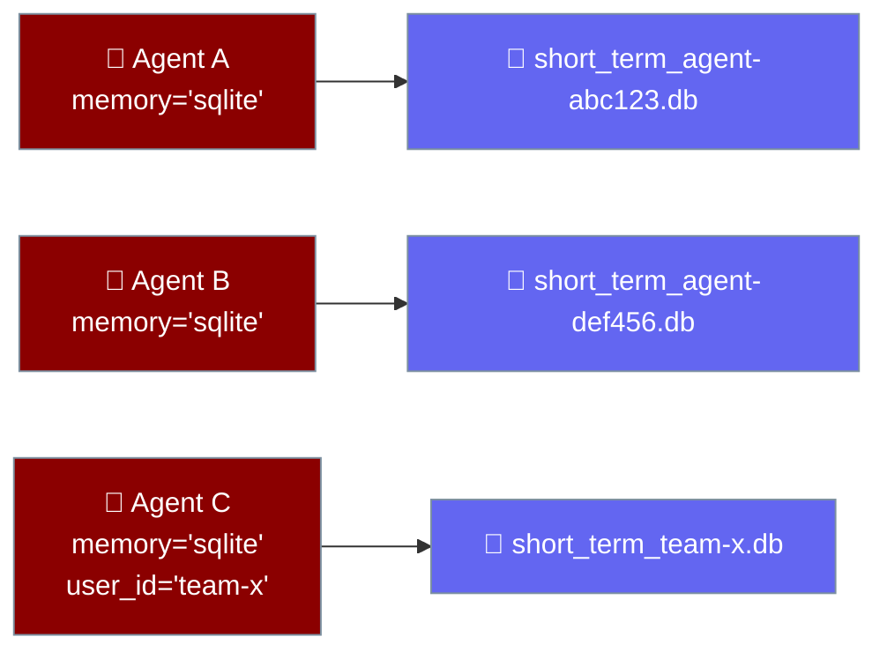
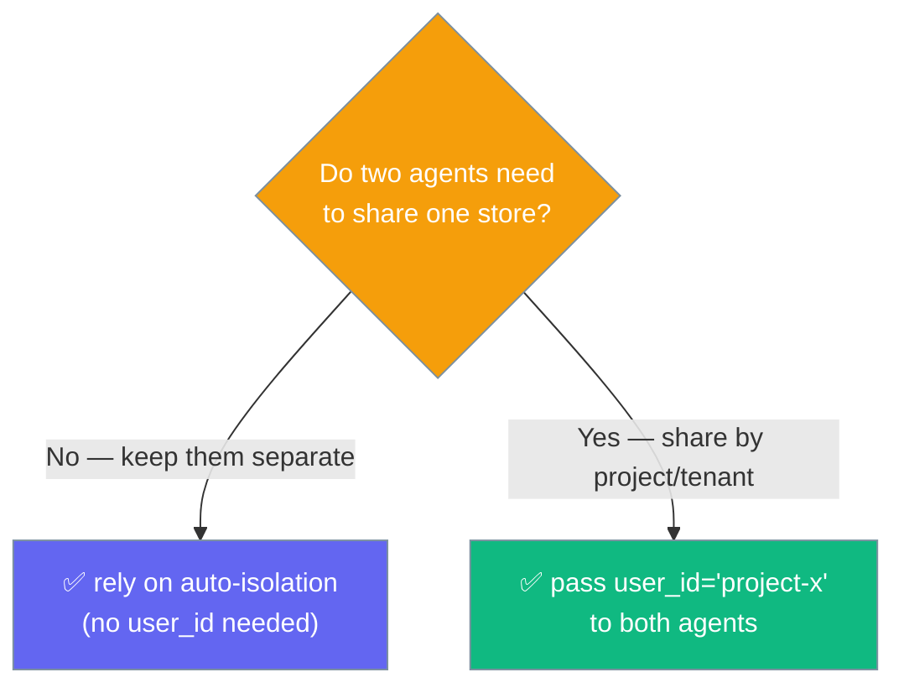

Multi-Agent Memory gives all agents in a workflow access to shared memory, so knowledge discovered by one agent is available to others.

```python
from praisonaiagents import Agent, Task, PraisonAIAgents, MultiAgentMemoryConfig

researcher = Agent(name="Researcher", instructions="Research topics and share findings.")
writer = Agent(name="Writer", instructions="Write based on shared research.")

tasks = [
    Task(description="Research climate change impacts on agriculture", agent=researcher),
    Task(description="Write a policy brief based on the research", agent=writer),
]

workflow = PraisonAIAgents(
    agents=[researcher, writer],
    tasks=tasks,
    memory=MultiAgentMemoryConfig(user_id="project_climate", config={"provider": "rag"}),
)
workflow.start()
```

The user runs a multi-agent workflow; all agents read and write shared memory under one user id.


```mermaid
graph LR
    subgraph "Shared Memory"
        A1["🤖 Agent 1\n(Researcher)"] --> MEM["🧠 Shared\nMemory"]
        A2["🤖 Agent 2\n(Analyst)"] --> MEM
        A3["🤖 Agent 3\n(Writer)"] --> MEM
        MEM --> A1
        MEM --> A2
        MEM --> A3
    end

    classDef agent fill:#8B0000,stroke:#7C90A0,color:#fff
    classDef memory fill:#6366F1,stroke:#7C90A0,color:#fff

    class A1,A2,A3 agent
    class MEM memory
```

## Quick Start

<Steps>
<Step title="Simple Usage">
```python
from praisonaiagents import Agent, Task, PraisonAIAgents, MultiAgentMemoryConfig

agent1 = Agent(name="Gatherer", instructions="Gather and remember information.")
agent2 = Agent(name="Synthesizer", instructions="Synthesize remembered information.")

tasks = [
    Task(description="Gather key facts about solar energy", agent=agent1),
    Task(description="Create a summary from gathered facts", agent=agent2),
]

workflow = PraisonAIAgents(
    agents=[agent1, agent2],
    tasks=tasks,
    memory=MultiAgentMemoryConfig(user_id="solar_project"),
)
workflow.start()
```
</Step>

<Step title="With Custom Embedder">
```python
from praisonaiagents import Agent, Task, PraisonAIAgents, MultiAgentMemoryConfig

agents = [
    Agent(name="Expert", instructions="Provide domain expertise."),
    Agent(name="Summarizer", instructions="Summarize expert findings."),
]

tasks = [
    Task(description="Analyze cybersecurity vulnerabilities in cloud systems", agent=agents[0]),
    Task(description="Create an executive summary for non-technical stakeholders", agent=agents[1]),
]

workflow = PraisonAIAgents(
    agents=agents,
    tasks=tasks,
    memory=MultiAgentMemoryConfig(
        user_id="security_review",
        embedder={"provider": "openai", "config": {"model": "text-embedding-3-small"}},
        config={"provider": "rag"},
    ),
)
workflow.start()
```
</Step>
</Steps>

---

## Configuration Options

<Card title="MultiAgentMemoryConfig SDK Reference" icon="code" href="/sdk/reference/praisonaiagents/modules/feature_configs">
  Full parameter reference for MultiAgentMemoryConfig
</Card>

**Precedence ladder:**

```python
# Level 1: Bool (enable with defaults)
team = PraisonAIAgents(memory=True)

# Level 2: MultiAgentMemoryConfig (full control)
team = PraisonAIAgents(memory=MultiAgentMemoryConfig(
    user_id="user-123",
    embedder={"provider": "openai"},
))
```

| Option | Type | Default | Description |
|--------|------|---------|-------------|
| `user_id` | `str \| None` | `None` | Scope memory to a specific user or project |
| `embedder` | `Any \| None` | `None` | Embedder configuration (e.g., `{"provider": "openai"}`) |

## How It Works


```mermaid
sequenceDiagram
    participant User
    participant Workflow
    participant Agent1
    participant Agent2
    participant Memory

    User->>Workflow: Start workflow
    Workflow->>Agent1: Execute task
    Agent1->>Memory: Store findings
    Agent1-->>Workflow: Task 1 complete
    Workflow->>Agent2: Execute task
    Agent2->>Memory: Retrieve Agent1's findings
    Memory-->>Agent2: Shared context
    Agent2-->>Workflow: Task 2 complete (with context)
    Workflow-->>User: Combined output
```

| Phase | What happens |
|---|---|
| 1. Store | First agent saves discoveries to shared memory |
| 2. Retrieve | Subsequent agents access all stored context |
| 3. Build | Later agents build on earlier agents' work |

---

## Configuration Options

<Card icon="code" href="/sdk/reference/praisonaiagents/modules/feature_configs">
  Full list of options, types, and defaults — `MultiAgentMemoryConfig`
</Card>

| Option | Type | Default | Description |
|---|---|---|---|
| `user_id` | `str \| None` | `None` | Shared user/project identifier for scoped memory |
| `embedder` | `Any \| None` | `None` | Embedder configuration for semantic memory |
| `config` | `dict \| None` | `None` | Memory provider configuration |

---

## Common Patterns

### Pattern 1 — Project-scoped research memory
```python
from praisonaiagents import Agent, Task, PraisonAIAgents, MultiAgentMemoryConfig

agents = [
    Agent(name="Researcher", instructions="Research and document findings."),
    Agent(name="Analyst", instructions="Analyze documented findings."),
    Agent(name="Reporter", instructions="Create final reports."),
]

tasks = [
    Task(description="Research market trends in renewable energy", agent=agents[0]),
    Task(description="Identify key investment opportunities from research", agent=agents[1]),
    Task(description="Write an investment recommendation report", agent=agents[2]),
]

result = PraisonAIAgents(
    agents=agents,
    tasks=tasks,
    memory=MultiAgentMemoryConfig(user_id="renewable_energy_2025"),
).start()
print(result)
```

---

## Best Practices

<AccordionGroup>
<Accordion title="Always set user_id for project isolation">
Set `user_id` to a unique project or session identifier to prevent memory from bleeding between unrelated workflows. Without `user_id`, all workflows share the same memory namespace.

<Tip>
Agents that intentionally share a `user_id` write safely under one process — see [Concurrency and shared user_id](#concurrency-and-shared-user-id).
</Tip>
</Accordion>

<Accordion title="Use semantic memory for related topics">
Configure the `embedder` when agents need to find semantically related information (not just exact matches). OpenAI's `text-embedding-3-small` is a good default — fast and cost-effective.
</Accordion>

<Accordion title="Order tasks to build context">
Tasks run in order by default. Place information-gathering tasks first and synthesis/writing tasks later so downstream agents have full context from upstream agents.
</Accordion>
</AccordionGroup>

---

## Isolating collections per agent

When several agents share one `rag_db_path`, give each a distinct `collection_name` so they coexist and can be reset independently.

```python
from praisonaiagents import Agent

researcher = Agent(
    name="Researcher",
    memory={
        "provider": "rag",
        "rag_db_path": "./chroma_db",
        "collection_name": "researcher_ltm",
    },
)

writer = Agent(
    name="Writer",
    memory={
        "provider": "rag",
        "rag_db_path": "./chroma_db",
        "collection_name": "writer_ltm",
    },
)

# researcher.memory.reset_long_term() no longer wipes writer's memory.
```

`collection_name` defaults to `"memory_store"`. See [Memory Configuration](/docs/configuration/memory-config#chroma-collection-name).

---

## Per-agent isolation across backends

Two agents in one process no longer share one on-disk store by default. As of PraisonAI [#4203](https://github.com/MervinPraison/PraisonAI/pull/4203), `Agent(memory="sqlite" | "chroma" | {"provider": "mongodb"} | {"provider": "mem0"} | {"learn": True})` inherits the same per-agent isolation that `FileMemory` already had — each agent gets a per-instance `agent-<uuid>` id and its own default store when no explicit `user_id` is given.

```python
from praisonaiagents import Agent

support = Agent(name="Support", memory="sqlite", instructions="Handle customer A's private ticket.")
sales   = Agent(name="Sales",   memory="sqlite", instructions="Draft outreach for customer B.")
# Distinct default files per agent — private data no longer crosses agents:
#   short_term_agent-<uuidA>.db / long_term_agent-<uuidA>.db  (Support)
#   short_term_agent-<uuidB>.db / long_term_agent-<uuidB>.db  (Sales)
```

Each backend derives per-user defaults from the scoping `user_id`:

| Default | Bare store (no `user_id`) | Scoped store (`user_id="team-x"`) |
|---|---|---|
| Short-term DB | `short_term.db` | `short_term_team-x.db` |
| Long-term DB | `long_term.db` | `long_term_team-x.db` |
| Chroma path | `chroma_db/` | `chroma_db_team-x/` |
| Collection | `memory_store` | `memory_store_team-x` |


```mermaid
graph LR
    A1["🤖 Agent A<br/>memory='sqlite'"] --> S1["💾 short_term_agent-abc123.db"]
    A2["🤖 Agent B<br/>memory='sqlite'"] --> S2["💾 short_term_agent-def456.db"]
    A3["🤖 Agent C<br/>memory='sqlite'<br/>user_id='team-x'"] --> S3["💾 short_term_team-x.db"]

    classDef agent fill:#8B0000,stroke:#7C90A0,color:#fff
    classDef store fill:#6366F1,stroke:#7C90A0,color:#fff
    class A1,A2,A3 agent
    class S1,S2,S3 store
```

Explicit values always win — `user_id`, `short_db`, `long_db`, `rag_db_path`, or `collection_name` in the caller's dict bypass the auto-defaults. A bare store with no `user_id` keeps the original shared defaults, so existing single-store setups are unchanged.

**When to pass an explicit `user_id`:**


```mermaid
graph TB
    Q{Do two agents need<br/>to share one store?} -->|No — keep them separate| Auto["✅ rely on auto-isolation<br/>(no user_id needed)"]
    Q -->|Yes — share by project/tenant| Named["✅ pass user_id='project-x'<br/>to both agents"]

    classDef q fill:#F59E0B,stroke:#7C90A0,color:#fff
    classDef auto fill:#6366F1,stroke:#7C90A0,color:#fff
    classDef named fill:#10B981,stroke:#7C90A0,color:#fff
    class Q q
    class Auto auto
    class Named named
```

<Note>
**`user_id` validation for default-path scoping.** When a `user_id` feeds the default sqlite/chroma paths, it must not contain `/`, `\`, `..`, or NUL — an unsafe value raises `ValueError("memory user_id must not contain path separators or parent references")` at `Memory` init. Other characters are normalised (only `isalnum()` or one of `-_.` is kept; everything else becomes `_`). Explicit `short_db` / `long_db` / `rag_db_path` / `collection_name` bypass this normalisation entirely.
</Note>

## Concurrency and shared user_id

When multiple agents share the same `user_id` and back FileMemory (or the file-backed learn store) on the same paths, concurrent writes are now merge-safe: each mutation re-reads the on-disk state under the instance lock before appending, so two agents recording facts against the same `user_id` no longer overwrite each other's entries. This applies to `add_short_term`, `add_long_term`, `add_entity`, auto-promotion to long-term memory, and `learn/stores.py` `BaseStore.add`.

This is a bug fix, not a new API — no configuration change is required. If you previously worked around lost writes by serializing agent runs or by giving agents distinct `user_id`s, you can remove that workaround where sharing was actually the goal.

<Note>
File-based memory serializes writes per-process. If you run agents across separate processes on the same on-disk memory files, the per-process lock does not cover cross-process races — use per-process `user_id` scoping or a shared memory provider (RAG/graph) for cross-process sharing.
</Note>

For hierarchical runs that share memory, see how the [hierarchical process](/features/hierarchical-process#return-value) surfaces the final worker task's output.

---

## Related

<CardGroup cols={2}>
<Card title="Advanced Memory" icon="database" href="/features/advanced-memory">
  Single-agent memory configuration
</Card>
<Card title="Multi-Agent Planning" icon="list-check" href="/features/multi-agent-planning">
  Plan tasks before executing them
</Card>
<Card title="Multi-Agent Hooks" icon="webhook" href="/features/multi-agent-hooks">
  Intercept task lifecycle events
</Card>
<Card title="Learn" icon="graduation-cap" href="/features/learn">
  Continuous learning from conversations
</Card>
</CardGroup>
