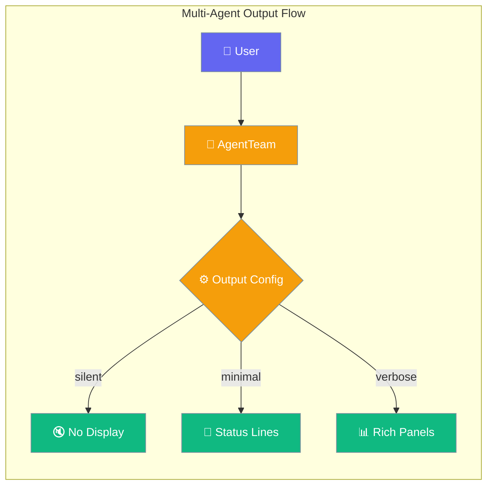

Multi-agent output controls how an `AgentTeam` displays its progress and results. Streaming is on by default for responsive output — disable it explicitly if you need compatibility with sync-only providers.



## Quick Start

<Steps>
<Step title="Default Silent Mode">
```python
from praisonaiagents import Agent, AgentTeam

researcher = Agent(name="Researcher", instructions="Research topics")
writer = Agent(name="Writer", instructions="Write content")

team = AgentTeam(agents=[researcher, writer])
result = team.start("Research and write about AI")  # Silent by default
```
</Step>

<Step title="Verbose Output">
```python
team = AgentTeam(
    agents=[researcher, writer], 
    output="verbose"
)
team.start("Research and write about AI")  # Rich display
```
</Step>

<Step title="Streaming Output">
```python
from praisonaiagents import AgentTeam, MultiAgentOutputConfig

team = AgentTeam(
    agents=[researcher, writer],
    output=MultiAgentOutputConfig(verbose=2, stream=True)
)
team.start("Research and write about AI")  # Verbose + streaming
```
</Step>
</Steps>

---

## Presets

| Preset | `verbose` | `stream` | Use case |
|--------|-----------|----------|----------|
| `"silent"` | `0` | `False` | Programmatic / API / batch |
| `"minimal"` | `1` | `True` | Short status lines |
| `"verbose"` | `2` | `True` | Rich panels, full trace (default) |

<Note>
**Streaming is ON by default** in `"minimal"` and `"verbose"` presets. Only `"silent"` disables streaming. If you need compatibility with sync-only providers, explicitly set `stream=False` with `output=["verbose", {"stream": False}]` or `output=MultiAgentOutputConfig(verbose=2, stream=False)`.
</Note>

---

## Configuration Options

<Card title="MultiAgentOutputConfig API Reference" icon="code" href="/docs/sdk/reference/praisonaiagents/classes/MultiAgentOutputConfig">
  Full API reference
</Card>

| Option | Type | Default | Description |
|--------|------|---------|-------------|
| `verbose` | `int` | `0` | Verbosity level (0=silent, 1=minimal, 2+=verbose) |
| `stream` | `bool` | `True` | Stream tokens as the team's agents respond |

---

## Disabling streaming for a multi-agent team

```python
from praisonaiagents import Agent, AgentTeam, MultiAgentOutputConfig

team = AgentTeam(
    agents=[researcher, writer],
    output=MultiAgentOutputConfig(verbose=2, stream=False),
)
team.start("Research and write about quantum computing")
```

Or via the array form (preset + override):

```python
team = AgentTeam(
    agents=[researcher, writer],
    output=["verbose", {"stream": False}],
)
```

<Warning>
Streaming is enabled by default. If you're using sync-only providers like the sync OpenAI adapter or Deepseek (sync), explicitly set `stream=False` to ensure compatibility.
</Warning>

---

## Choosing the right preset

```mermaid
graph TB
    Start[How do you run the team?] --> API{Programmatic/API?}
    Start --> Demo{Live demo?}
    Start --> Batch{Batch processing?}
    
    API -->|Yes| Silent[🔇 output=None<br/>Silent mode]
    Demo -->|Yes| Verbose[📊 output="verbose"<br/>Rich display]
    Batch -->|Yes| Minimal[📝 output="minimal"<br/>Status logging]
    
    Silent --> Provider{Provider supports<br/>sync streaming?}
    Verbose --> Provider
    Minimal --> Provider
    
    Provider -->|Yes| Stream[✨ Add stream=True<br/>for real-time tokens]
    Provider -->|No| NoStream[⚡ Keep stream=False<br/>for compatibility]
    
    classDef decision fill:#F59E0B,stroke:#7C90A0,color:#fff
    classDef silent fill:#6366F1,stroke:#7C90A0,color:#fff
    classDef verbose fill:#10B981,stroke:#7C90A0,color:#fff
    classDef minimal fill:#189AB4,stroke:#7C90A0,color:#fff
    classDef stream fill:#10B981,stroke:#7C90A0,color:#fff
    classDef nostream fill:#8B0000,stroke:#7C90A0,color:#fff
    
    class Start,API,Demo,Batch,Provider decision
    class Silent silent
    class Verbose verbose
    class Minimal minimal
    class Stream stream
    class NoStream nostream
```

---

## Common Patterns

### Pattern 1: Programmatic team (default)

```python
from praisonaiagents import Agent, AgentTeam

team = AgentTeam(agents=[researcher, writer])
result = team.start("Topic")  # Returns result, no display
```

### Pattern 2: Verbose terminal demo

```python
team = AgentTeam(agents=[researcher, writer], output="verbose")
team.start("Topic")
```

### Pattern 3: Verbose + streaming (provider must support sync stream)

```python
team = AgentTeam(
    agents=[researcher, writer],
    output=["verbose", {"stream": True}],
)
team.start("Topic")
```

---

## Best Practices

<AccordionGroup>
<Accordion title="Use 'silent' for production APIs">
`output="silent"` (the default) has zero display overhead and works on every provider.
</Accordion>

<Accordion title="Test streaming with single agent first">
Sync streaming is not supported by every provider. Verify with a single agent before enabling for teams.
</Accordion>

<Accordion title="Choose 'verbose' for demos, 'minimal' for logs">
`verbose` is great for live terminal walkthroughs; `minimal` keeps log files readable.
</Accordion>

<Accordion title="Use async for broader streaming support">
If you use `astart()` (async), streaming is more widely supported because async adapters handle sync-only providers via background threads.
</Accordion>
</AccordionGroup>

---

## Related

<CardGroup cols={2}>
  <Card icon="bolt" href="/docs/features/streaming">
    Single-agent streaming (auto-detect + fallback)
  </Card>
  <Card icon="display" href="/docs/configuration/output-config">
    Single-agent output configuration
  </Card>
  <Card icon="users" href="/docs/features/multi-agent-patterns">
    Sequential, parallel, hierarchical patterns
  </Card>
  <Card icon="code" href="/docs/sdk/reference/praisonaiagents/classes/MultiAgentOutputConfig">
    Auto-generated SDK reference
  </Card>
</CardGroup>