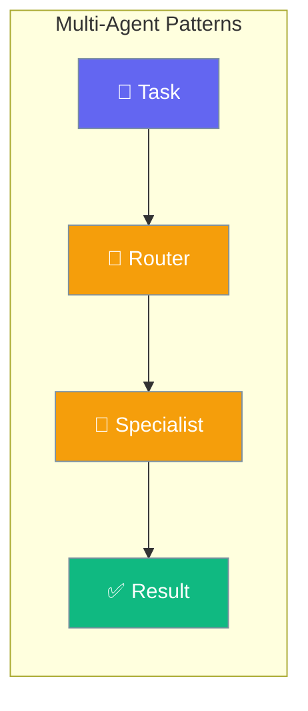
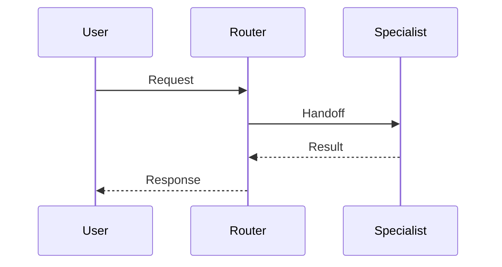

Multi-agent patterns enable different types of collaboration between agents, from dynamic routing to fixed workflows to collaborative teams.



## Quick Start

<Steps>
<Step title="Simple Handoffs">

```python
from praisonaiagents import Agent

# Create specialist agent
specialist = Agent(
    name="specialist",
    instructions="You are an expert in your domain.",
)

# Router agent with handoff capability
router = Agent(
    name="router",
    instructions="Route requests to appropriate specialists.",
    handoffs=[specialist]  # LLM decides when to handoff
)

result = router.run("Help me with a complex task")
```

</Step>

<Step title="With Configuration">

```python
from praisonaiagents import Agent, HandoffConfig, ContextPolicy

# Configure handoff behavior
handoff_config = HandoffConfig(
    context_policy=ContextPolicy.SUMMARY,
    detect_cycles=True,
    timeout_seconds=300
)

router = Agent(
    name="router",
    instructions="Route requests intelligently.",
    handoffs=[specialist],
    handoff_config=handoff_config
)
```

</Step>
</Steps>

---

## How It Works



| Pattern | Use Case | Control | Example |
|---------|----------|---------|---------|
| **Handoffs** | Dynamic routing | LLM decides | Customer service triage |
| **Programmatic** | Explicit control | Code decides | Error handling workflow |
| **AgentFlow** | Fixed sequence | Predefined order | Data processing pipeline |
| **AgentTeam** | Collaboration | Shared context | Multi-expert analysis |

---

## Configuration Options

<Card title="Handoff Configuration" icon="cog" href="/docs/configuration/handoff-config">
  Complete handoff configuration reference
</Card>

---

## Common Patterns

### Pattern 1: Handoffs (LLM-Driven)

**When to use:** LLM decides which specialist agent to call based on the user's request.

<Tabs>
<Tab title="Basic Handoff">

```python
from praisonaiagents import Agent

researcher = Agent(
    name="researcher",
    instructions="Research topics thoroughly using web search.",
    tools=["web_search"]
)

writer = Agent(
    name="writer", 
    instructions="Write engaging articles based on research.",
)

# Router agent with handoff capabilities
router = Agent(
    name="router",
    instructions="Route requests to appropriate specialists.",
    handoffs=[researcher, writer]
)

result = router.run("Write an article about AI trends after researching")
```

</Tab>

<Tab title="Advanced Config">

```python
from praisonaiagents import Agent, HandoffConfig, ContextPolicy

handoff_config = HandoffConfig(
    context_policy=ContextPolicy.SUMMARY,
    max_context_tokens=2000,
    detect_cycles=True,
    max_depth=5
)

router = Agent(
    name="intelligent_router",
    instructions="Route complex requests through specialists.",
    handoffs=[researcher, analyzer, writer],
    handoff_config=handoff_config
)

result = router.run("Create a market analysis report")
```

</Tab>
</Tabs>

### Pattern 2: Programmatic Handoffs

**When to use:** Your application code needs explicit control over which agent handles a task.

<Tabs>
<Tab title="Basic Programmatic">

```python
from praisonaiagents import Agent

reviewer = Agent(
    name="code_reviewer",
    instructions="Review code for bugs and improvements.",
)

fixer = Agent(
    name="code_fixer", 
    instructions="Fix code issues based on review feedback.",
)

async def process_code_review(code: str):
    # First, review the code
    review_result = await reviewer.arun(f"Review this code:\n{code}")
    
    # Check if issues were found (your logic)
    if "issues found" in review_result.lower():
        # Explicitly handoff to fixer
        fix_result = await reviewer.handoff_to_async(
            fixer, 
            f"Fix issues:\nReview: {review_result}\nCode: {code}"
        )
        return fix_result
    
    return review_result

result = await process_code_review("def divide(a, b): return a / b")
```

</Tab>

<Tab title="Async Concurrent">

```python
from praisonaiagents import Agent
import asyncio

async def process_dataset(datasets: list):
    coordinator = Agent(name="coordinator")
    validator = Agent(name="validator")
    processor = Agent(name="processor")
    
    # Process multiple datasets concurrently
    validation_tasks = []
    for dataset in datasets:
        task = coordinator.handoff_to_async(
            validator, 
            f"Validate dataset: {dataset}"
        )
        validation_tasks.append(task)
    
    validation_results = await asyncio.gather(*validation_tasks)
    
    # Sequential processing of validated data
    processed_results = []
    for i, validation_result in enumerate(validation_results):
        if "valid" in validation_result.lower():
            processed = await coordinator.handoff_to_async(
                processor,
                f"Process this validated data: {datasets[i]}"
            )
            processed_results.append(processed)
    
    return processed_results
```

</Tab>
</Tabs>

### Pattern 3: AgentFlow (Sequential/Parallel)

**When to use:** Tasks follow a predictable sequence or can be executed in parallel.

<Tabs>
<Tab title="Sequential">

```python
from praisonaiagents import Agent, AgentFlow, Task

extractor = Agent(name="data_extractor")
transformer = Agent(name="data_transformer") 
loader = Agent(name="data_loader")

extract_task = Task(
    name="extract_data",
    description="Extract customer data",
    agent=extractor
)

transform_task = Task(
    name="transform_data", 
    description="Clean and standardize data",
    agent=transformer
)

load_task = Task(
    name="load_data",
    description="Load data into database", 
    agent=loader
)

# Sequential workflow
etl_pipeline = AgentFlow(
    name="etl_pipeline",
    agents=[extractor, transformer, loader],
    tasks=[extract_task, transform_task, load_task]
)

result = etl_pipeline.run("Process today's data batch")
```

</Tab>

<Tab title="Parallel">

```python
from praisonaiagents import Agent, AgentFlow, Task

sentiment_agent = Agent(name="sentiment_analyzer")
keyword_agent = Agent(name="keyword_extractor")
summary_agent = Agent(name="summarizer")

sentiment_task = Task(
    name="analyze_sentiment",
    description="Analyze feedback sentiment",
    agent=sentiment_agent
)

keyword_task = Task(
    name="extract_keywords",
    description="Extract key topics", 
    agent=keyword_agent
)

summary_task = Task(
    name="summarize_feedback",
    description="Create executive summary",
    agent=summary_agent  
)

# Parallel workflow
analysis_flow = AgentFlow(
    name="parallel_analysis",
    agents=[sentiment_agent, keyword_agent, summary_agent],
    tasks=[sentiment_task, keyword_task, summary_task],
    parallel=True  # Enable parallel execution
)

result = analysis_flow.run("Analyze customer feedback")
```

</Tab>
</Tabs>

### Pattern 4: AgentTeam (Collaborative)

**When to use:** Multiple agents need to work together on the same problem.

```python
from praisonaiagents import Agent, AgentTeam, Task

market_analyst = Agent(
    name="market_analyst",
    instructions="Analyze market trends and competition.",
    tools=["web_search", "data_analysis"]
)

financial_analyst = Agent(
    name="financial_analyst", 
    instructions="Analyze financial data and risk factors.",
    tools=["financial_tools", "calculator"]
)

strategy_consultant = Agent(
    name="strategy_consultant",
    instructions="Synthesize analysis into strategic recommendations.",
)

analysis_task = Task(
    name="market_analysis",
    description="Comprehensive market analysis for product launch",
    agent=market_analyst
)

# Collaborative team
expert_team = AgentTeam(
    name="strategic_analysis_team",
    agents=[market_analyst, financial_analyst, strategy_consultant],
    tasks=[analysis_task],
    collaboration_mode="consensus"
)

result = expert_team.run("Analyze market opportunity for solar panels")
```

---

## Best Practices

<AccordionGroup>

<Accordion title="Pattern Selection">

**Choose the right pattern for your use case:**

1. **Start Simple:** Use single agents first, add patterns as complexity grows
2. **LLM Routing:** Use handoffs when the AI should decide the flow
3. **Deterministic:** Use AgentFlow for predictable, repeatable processes  
4. **Collaborative:** Use AgentTeam when agents need to build on each other's work
5. **Explicit Control:** Use programmatic handoffs for error handling and conditionals

</Accordion>

<Accordion title="Context Management">

**Optimize context sharing:**

- Use `ContextPolicy.SUMMARY` for most handoffs (safe default)
- Use `ContextPolicy.FULL` only when complete history is essential
- Set `max_context_tokens` to control costs and latency
- Enable `detect_cycles=True` to prevent infinite loops

```python
handoff_config = HandoffConfig(
    context_policy=ContextPolicy.SUMMARY,
    max_context_tokens=1000,
    detect_cycles=True
)
```

</Accordion>

<Accordion title="Error Handling">

**Handle common errors:**

```python
# HandoffTimeoutError: Handoff timed out
handoff_config = HandoffConfig(timeout_seconds=600)

# HandoffCycleError: Cycle detected
handoff_config = HandoffConfig(detect_cycles=True)

# HandoffDepthError: Max depth exceeded
handoff_config = HandoffConfig(max_depth=15)
```

</Accordion>

<Accordion title="Performance Optimization">

**Optimize for your use case:**

- **Handoffs:** Best for dynamic routing (10-100ms overhead)
- **AgentFlow:** Best for predictable pipelines (minimal overhead)
- **AgentTeam:** Best for collaborative analysis (higher context cost) 
- **Programmatic:** Best for explicit control (lowest overhead)

```python
# Efficient context sharing
handoff_config = HandoffConfig(
    context_policy=ContextPolicy.SUMMARY,
    max_context_tokens=1000
)

# Async for I/O-bound operations
result = await agent.handoff_to_async(specialist, task)
```

</Accordion>

</AccordionGroup>

---

## Related

<CardGroup cols={2}>
  <Card title="Handoffs" icon="arrow-right-arrow-left" href="/docs/concepts/handoffs">
    LLM-driven agent routing
  </Card>
  <Card title="AgentFlow" icon="diagram-project" href="/docs/concepts/agentflow">
    Sequential and parallel workflows
  </Card>
</CardGroup>