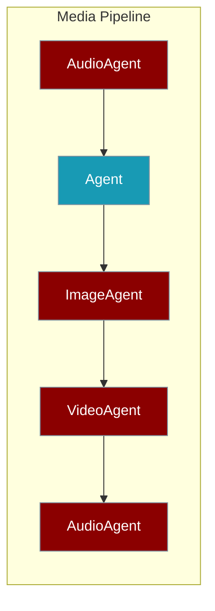

```python
from praisonaiagents import Agent

audio_agent = Agent(name="transcriber", instructions="Transcribe audio to text.")
summary_agent = Agent(name="summariser", instructions="Summarise the transcript.")
result = audio_agent.start("Transcribe this podcast episode.")
summary_agent.start(result)
```

Create powerful media processing workflows by chaining specialised agents (AudioAgent, VideoAgent, ImageAgent, OCRAgent) with standard agents. Context passes between steps using `{{previous_output}}`.



## Quick Start

<Steps>

<Step title="Simple Usage">

```yaml
name: Media Pipeline
process: sequential

agents:
  transcriber:
    agent: AudioAgent
    llm: openai/whisper-1
    role: Audio Transcriber
    goal: Convert audio to text

  summarizer:
    role: Summarizer
    goal: Summarise the transcript

steps:
  - agent: transcriber
    action: transcribe
    input: "{{audio_file}}"

  - agent: summarizer
    action: "Summarise: {{previous_output}}"

variables:
  audio_file: input.mp3
```

</Step>

<Step title="With Configuration">

```yaml
name: Media Pipeline
description: Complete media pipeline from audio to video
process: sequential

agents:
  transcriber:
    agent: AudioAgent
    llm: openai/whisper-1
    role: Audio Transcriber
    goal: Convert audio to text

  researcher:
    role: Research Specialist
    goal: Research the topic
    tools:
      - tavily_search

  image_creator:
    agent: ImageAgent
    llm: openai/dall-e-3
    role: Visual Artist
    goal: Create images

  video_creator:
    agent: VideoAgent
    llm: openai/sora-2
    role: Video Producer
    goal: Create videos

  narrator:
    agent: AudioAgent
    llm: openai/tts-1-hd
    role: Voice Narrator
    goal: Create voiceovers

steps:
  - agent: transcriber
    action: transcribe
    input: "{{audio_file}}"

  - agent: researcher
    action: "Research based on: {{previous_output}}"

  - agent: image_creator
    action: generate
    prompt: "{{previous_output}}"

  - agent: video_creator
    action: generate
    prompt: "{{previous_output}}"

  - agent: narrator
    action: speech
    text: "{{previous_output}}"
    output: "voiceover.mp3"

variables:
  audio_file: input.mp3
```

</Step>

</Steps>

## Context Passing

Use `{{previous_output}}` to pass the output from one agent to the next:

```yaml
steps:
  - agent: transcriber
    action: transcribe
    input: "audio.mp3"
  
  - agent: researcher
    action: "Research this topic: {{previous_output}}"
  
  - agent: artist
    action: generate
    prompt: "Create an image for: {{previous_output}}"
```

## Mixed Agent Types

Combine specialised agents with standard agents:

```yaml
agents:
  transcriber:
    agent: AudioAgent
    llm: openai/whisper-1
    role: Transcriber
    goal: Transcribe audio

  analyzer:
    role: Content Analyst
    goal: Analyze and summarize content
    instructions: You analyze content and provide insights.

  visualizer:
    agent: ImageAgent
    llm: openai/dall-e-3
    role: Visualizer
    goal: Create visual representations

steps:
  - agent: transcriber
    action: transcribe
    input: "meeting.mp3"
  
  - agent: analyzer
    action: "Analyze this transcript and identify key themes: {{previous_output}}"
  
  - agent: visualizer
    action: generate
    prompt: "Create an infographic showing: {{previous_output}}"
```

## CLI Usage

Run the multi-agent pipeline recipe:

```bash
praisonai recipe run ai-media-pipeline --var audio_file=input.mp3
praisonai recipe run ai-media-pipeline --var audio_file=podcast.mp3 --var output_dir=./output
```

## Python API

```python
from praisonaiagents import YAMLWorkflowParser

yaml_content = """
name: Custom Pipeline
process: sequential

agents:
  transcriber:
    agent: AudioAgent
    llm: openai/whisper-1
    role: Transcriber
    goal: Transcribe audio
  
  summarizer:
    role: Summarizer
    goal: Summarize content

steps:
  - agent: transcriber
    action: transcribe
    input: "{{audio_file}}"
  
  - agent: summarizer
    action: "Summarize: {{previous_output}}"

variables:
  audio_file: recording.mp3
"""

parser = YAMLWorkflowParser()
workflow = parser.parse_string(yaml_content)
result = workflow.start()
```

## Available Recipes

| Recipe | Description | Agents |
|--------|-------------|--------|
| `ai-text-to-speech` | Convert text to speech | AudioAgent |
| `ai-speech-to-text` | Transcribe audio | AudioAgent |
| `ai-generate-image` | Generate images | ImageAgent |
| `ai-generate-video` | Generate videos | VideoAgent |
| `ai-document-ocr` | Extract text from documents | OCRAgent |
| `ai-media-pipeline` | Complete 5-agent pipeline | AudioAgent, Agent, ImageAgent, VideoAgent |

## Best Practices

<AccordionGroup>
  <Accordion title="Order agents logically">
    Place agents in input → processing → output sequence so each step receives meaningful context.
  </Accordion>
  <Accordion title="Match models to tasks">
    Use Whisper for transcription, DALL·E for images, and TTS models for voiceovers — not general chat models.
  </Accordion>
  <Accordion title="Specify media output paths">
    Set `output` on steps that produce files so downstream agents and recipes can find artefacts.
  </Accordion>
  <Accordion title="Test agents individually first">
    Validate each agent in isolation before chaining the full pipeline.
  </Accordion>
</AccordionGroup>

## Error Handling

Add error handling with guardrails:

```yaml
steps:
  - agent: transcriber
    action: transcribe
    input: "{{audio_file}}"
    max_retries: 3
  
  - agent: researcher
    action: "Research: {{previous_output}}"
    guardrail: validate_research_output
```

## Related

<CardGroup cols={2}>
  <Card title="Specialized Agents" icon="robot" href="/docs/features/specialized-agents">
    AudioAgent, VideoAgent, ImageAgent, and OCRAgent reference.
  </Card>
  <Card title="YAML Workflows" icon="file-code" href="/docs/features/yaml-workflows">
    Workflow syntax, variables, and step definitions.
  </Card>
</CardGroup>
