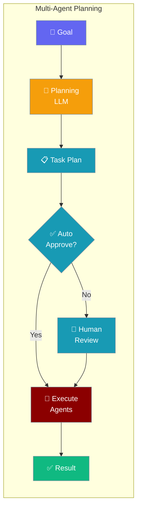
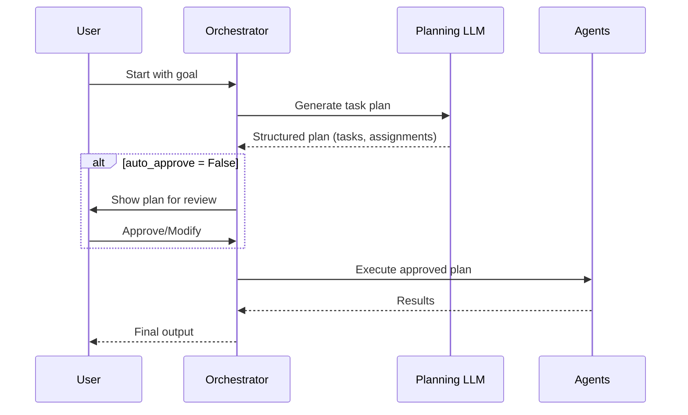

Let an LLM plan the task sequence before your agent team starts executing — great for complex, open-ended goals.

```python
from praisonaiagents import Agent, Task, PraisonAIAgents
from praisonaiagents import MultiAgentPlanningConfig

team = PraisonAIAgents(
    agents=[agent1, agent2],
    tasks=[task1],
    planning=MultiAgentPlanningConfig(
        llm="gpt-4o",
        auto_approve=True,
    )
)

team.start()
```



## Quick Start

<Steps>
<Step title="Simple Enable">
Enable planning with a boolean — uses default settings:

```python
from praisonaiagents import Agent, Task, PraisonAIAgents

team = PraisonAIAgents(
    agents=[researcher, writer],
    tasks=[main_task],
    planning=True
)

team.start()
```
</Step>

<Step title="With MultiAgentPlanningConfig">
Choose the planning model and enable auto-approval:

```python
from praisonaiagents import Agent, Task, PraisonAIAgents
from praisonaiagents import MultiAgentPlanningConfig

team = PraisonAIAgents(
    agents=[researcher, analyst, writer],
    tasks=[complex_task],
    planning=MultiAgentPlanningConfig(
        llm="gpt-4o",         # Use a powerful model for planning
        auto_approve=True,    # Skip human review (for automated pipelines)
        reasoning=True,       # Enable chain-of-thought reasoning in planning
    )
)

team.start()
```
</Step>
</Steps>

---

## How It Works



---

<Note>
Multi-agent planning (`MultiAgentPlanningConfig`) generates plans at the orchestration level — it decides what tasks to run and which agents run them.

This is different from single-agent `PlanningConfig` (see [Planning Mode](/docs/features/planning-mode)), which makes a single agent break down its own task into steps before acting.
</Note>

---

## Configuration Options

<Card title="MultiAgentPlanningConfig SDK Reference" icon="code" href="/docs/sdk/reference/python/classes/MultiAgentPlanningConfig">
  Full parameter reference for MultiAgentPlanningConfig
</Card>

**Precedence ladder:**

```python
# Level 1: Bool (enable with defaults)
team = PraisonAIAgents(planning=True)

# Level 2: MultiAgentPlanningConfig (full control)
team = PraisonAIAgents(planning=MultiAgentPlanningConfig(
    llm="gpt-4o",
    auto_approve=True,
    reasoning=True,
))
```

| Option | Type | Default | Description |
|--------|------|---------|-------------|
| `llm` | `str \| None` | `None` | LLM model for planning (defaults to team's LLM) |
| `auto_approve` | `bool` | `False` | Auto-approve plans without human review |
| `tools` | `list \| None` | `None` | Tools available to the planning agent |
| `reasoning` | `bool` | `False` | Enable chain-of-thought reasoning in planning |

---

## Best Practices

<AccordionGroup>
<Accordion title="Use a capable model for planning">
Planning requires understanding the goal and decomposing it into tasks. Use `gpt-4o`, `claude-3-5-sonnet`, or similar capable models. Smaller models often produce poor plans.
</Accordion>

<Accordion title="Enable auto_approve for CI/CD pipelines">
In automated workflows where human review isn't possible, set `auto_approve=True`. In interactive applications, leave it `False` so users can review and adjust the plan before execution.
</Accordion>

<Accordion title="Enable reasoning for complex goals">
`reasoning=True` adds chain-of-thought prompting to the planning step, helping the planning model think through dependencies and edge cases before producing the task list.
</Accordion>

<Accordion title="Multi-agent planning vs. single-agent planning">
Use multi-agent planning when you have a team of specialized agents and a complex goal that needs task decomposition. Use single-agent planning (via `PlanningConfig`) when a single agent needs to break down its own sub-goal.
</Accordion>
</AccordionGroup>

---

## Related

<CardGroup cols={2}>
<Card title="Planning Mode" icon="list-check" href="/docs/features/planning-mode">
  Single-agent planning configuration
</Card>
<Card title="Multi-Agent Execution" icon="play" href="/docs/features/multi-agent-execution">
  Configure iteration and retry limits
</Card>
<Card title="Multi-Agent Hooks" icon="webhook" href="/docs/features/multi-agent-hooks">
  Intercept task lifecycle events
</Card>
<Card title="Autonomous Workflow" icon="robot" href="/docs/features/autonomous-workflow">
  Fully autonomous multi-agent pipelines
</Card>
</CardGroup>
