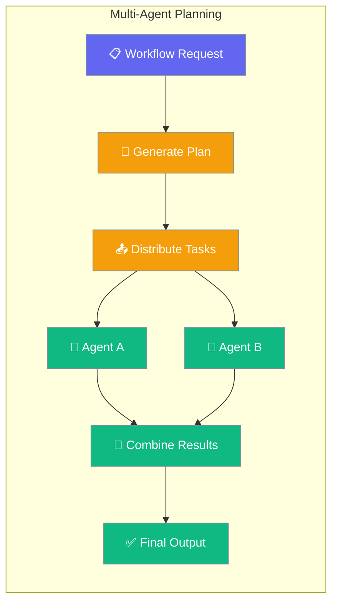
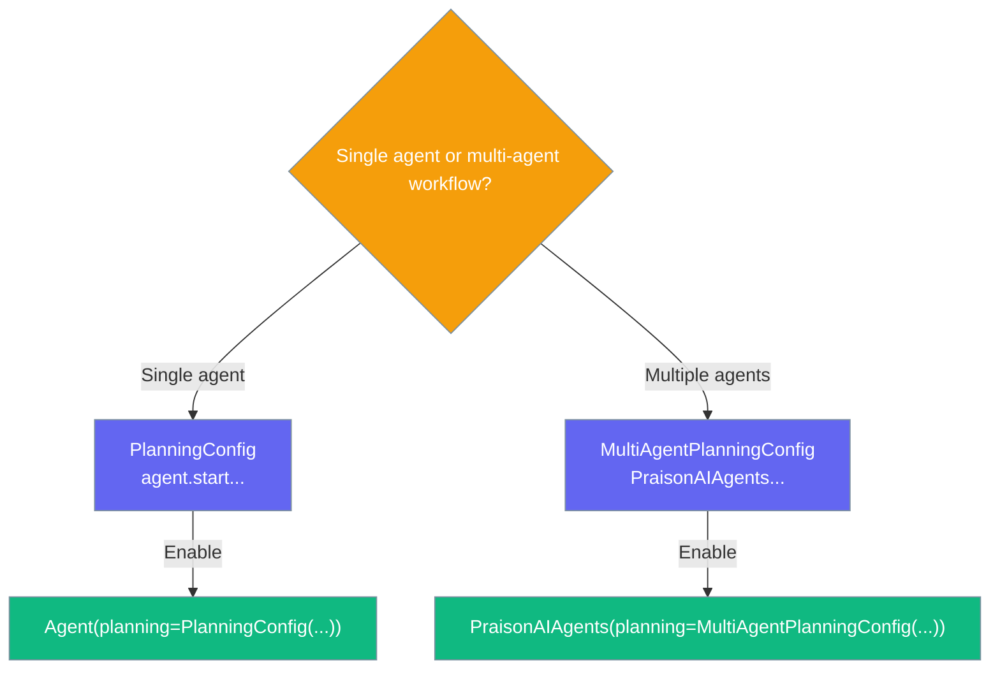
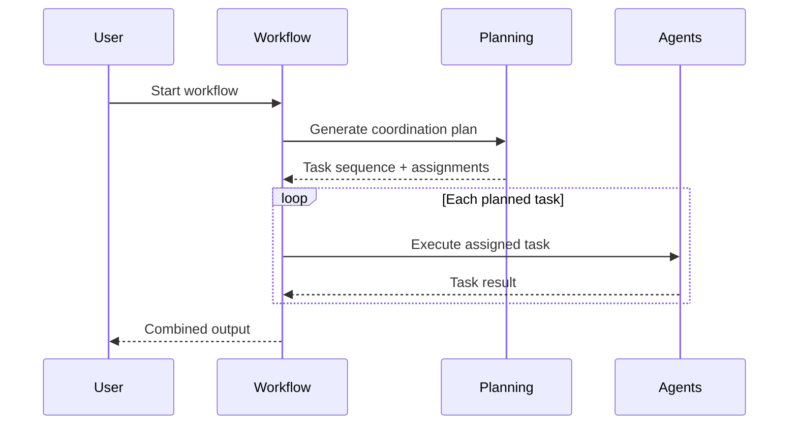

Multi-Agent Planning generates a high-level plan before distributing tasks across agents, improving coordination on complex workflows.

```python
from praisonaiagents import Agent, Task, PraisonAIAgents, MultiAgentPlanningConfig

researcher = Agent(name="Researcher", instructions="Research topics thoroughly.")
writer = Agent(name="Writer", instructions="Write clear, engaging content.")

tasks = [
    Task(description="Research the impact of AI on healthcare", agent=researcher),
    Task(description="Write a report on the research findings", agent=writer),
]

workflow = PraisonAIAgents(
    agents=[researcher, writer],
    tasks=tasks,
    planning=MultiAgentPlanningConfig(llm="gpt-4o", auto_approve=True),
)
workflow.start()
```



## Quick Start

<Steps>
<Step title="Simple Usage">
```python
from praisonaiagents import Agent, Task, PraisonAIAgents, MultiAgentPlanningConfig

agent = Agent(name="Analyst", instructions="Analyze data and provide insights.")
task = Task(description="Analyze customer churn patterns", agent=agent)

workflow = PraisonAIAgents(
    agents=[agent],
    tasks=[task],
    planning=MultiAgentPlanningConfig(auto_approve=True),
)
workflow.start()
```
</Step>

<Step title="With Reasoning">
```python
from praisonaiagents import Agent, Task, PraisonAIAgents, MultiAgentPlanningConfig

researcher = Agent(name="Researcher", instructions="Research deeply.")
analyst = Agent(name="Analyst", instructions="Analyze and summarize findings.")

tasks = [
    Task(description="Research quantum computing use cases", agent=researcher),
    Task(description="Summarize key findings for a business audience", agent=analyst),
]

workflow = PraisonAIAgents(
    agents=[researcher, analyst],
    tasks=tasks,
    planning=MultiAgentPlanningConfig(
        llm="gpt-4o",
        reasoning=True,
        auto_approve=True,
    ),
)
workflow.start()
```
</Step>
</Steps>

---

## Single-Agent vs Multi-Agent Planning



`PlanningConfig` plans **within** a single agent's execution. `MultiAgentPlanningConfig` plans **across** multiple agents and tasks.

---

## How It Works



| Phase | What happens |
|---|---|
| 1. Plan | Workflow generates a coordination plan for all tasks |
| 2. Approve | User reviews plan (if `auto_approve=False`) |
| 3. Distribute | Tasks are assigned to agents per the plan |
| 4. Execute | Each agent runs its task |
| 5. Combine | Results are aggregated into final output |

---

## Configuration Options

<Card icon="code" href="/docs/sdk/reference/python/MultiAgentPlanningConfig">
  Full list of options, types, and defaults — `MultiAgentPlanningConfig`
</Card>

| Option | Type | Default | Description |
|---|---|---|---|
| `llm` | `str \| None` | `None` | LLM for planning (defaults to workflow LLM) |
| `auto_approve` | `bool` | `False` | Skip user confirmation of generated plans |
| `tools` | `list \| None` | `None` | Tools available to the planner |
| `reasoning` | `bool` | `False` | Enable extended reasoning during planning |

---

## Common Patterns

### Pattern 1 — Automated multi-agent research pipeline
```python
from praisonaiagents import Agent, Task, PraisonAIAgents, MultiAgentPlanningConfig

agents = [
    Agent(name="Searcher", instructions="Search for relevant information."),
    Agent(name="Analyst", instructions="Analyze and extract insights."),
    Agent(name="Writer", instructions="Write clear, structured reports."),
]

tasks = [
    Task(description="Search for recent AI breakthroughs", agent=agents[0]),
    Task(description="Analyze which breakthroughs are most impactful", agent=agents[1]),
    Task(description="Write an executive summary", agent=agents[2]),
]

result = PraisonAIAgents(
    agents=agents,
    tasks=tasks,
    planning=MultiAgentPlanningConfig(llm="gpt-4o", auto_approve=True, reasoning=True),
).start()
print(result)
```

---

## Best Practices

<AccordionGroup>
<Accordion title="Use a capable model for planning">
The planning LLM needs to understand all tasks and coordinate agents correctly. Use a capable model (e.g., `gpt-4o`) for planning even if individual agents use cheaper models for execution.
</Accordion>

<Accordion title="auto_approve for production workflows">
Set `auto_approve=True` in automated pipelines. Use `auto_approve=False` during development to review and refine the generated plan before committing to execution.
</Accordion>

<Accordion title="Contrast with single-agent planning">
Multi-agent planning coordinates task distribution across agents. Single-agent `PlanningConfig` breaks down a task into steps within one agent's execution. Use both together for complex autonomous systems.
</Accordion>
</AccordionGroup>

---

## Related

<CardGroup cols={2}>
<Card icon="list-check" href="/docs/features/planning">
  Planning — single-agent planning before executing
</Card>
<Card icon="users" href="/docs/features/multi-agent-execution">
  Multi-Agent Execution — control iteration and retry limits
</Card>
</CardGroup>
