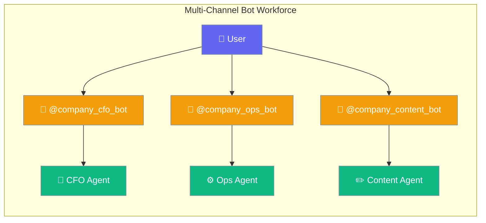
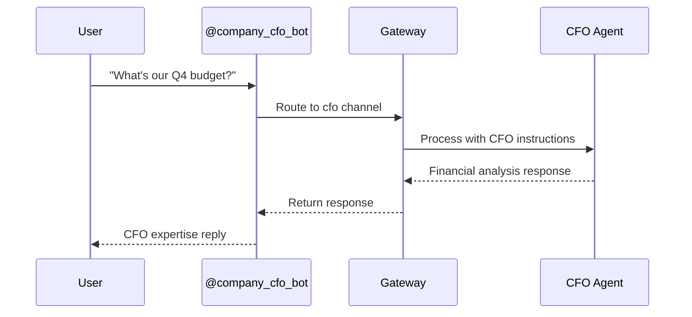
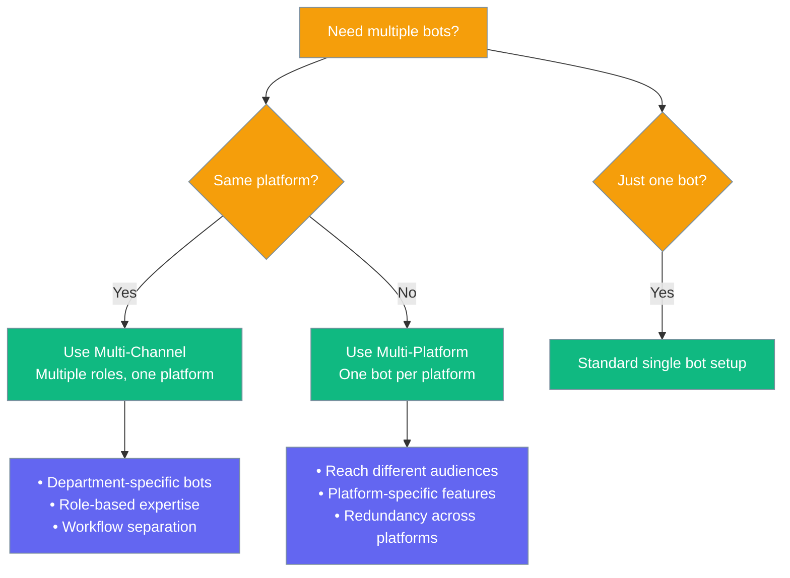

Deploy multiple specialized bots on the same platform with unique tokens and role-specific routing.



## Quick Start

<Steps>
<Step title="Run onboard wizard">
Start the wizard and choose your platform:

```bash
praisonai onboard
```

Choose `telegram` for your first platform, then when prompted "Add another bot channel?" answer `Yes` and enter roles like `cfo`, `ops`, `content`.
</Step>

<Step title="Configure tokens">
The wizard generates unique environment variables for each channel:

```bash
# Tokens are saved to ~/.praisonai/.env automatically
TELEGRAM_CFO_BOT_TOKEN=123456789:ABC...
TELEGRAM_OPS_BOT_TOKEN=987654321:DEF...
TELEGRAM_CONTENT_BOT_TOKEN=456789123:GHI...
TELEGRAM_ALLOWED_USERS=123456789,987654321
```

<Note>
If you leave `TELEGRAM_ALLOWED_USERS` empty, you must also set `unknown_user_policy: "allow"` for the bot to reply to anyone (since [PR #1885](https://github.com/MervinPraison/PraisonAI/pull/1885)). For production, set `TELEGRAM_ALLOWED_USERS` to your user IDs and leave `unknown_user_policy` at the default `"deny"`.
</Note>
</Step>

<Step title="Start the gateway">
Launch all bots simultaneously:

```bash
praisonai gateway start
```

All configured bots will connect and route to their specialized agents.
</Step>
</Steps>

---

## How It Works



Multi-channel setup routes each bot to its specialized agent based on the channel configuration.

---

## Environment Variable Convention

Follow this exact naming pattern for multiple bots on the same platform:

| Channel key | Environment Variable | Bot Purpose |
|-------------|---------------------|-------------|
| `telegram_cfo` | `TELEGRAM_CFO_BOT_TOKEN` | CFO-related tasks |
| `telegram_ops` | `TELEGRAM_OPS_BOT_TOKEN` | Operations tasks |
| `telegram_content` | `TELEGRAM_CONTENT_BOT_TOKEN` | Content creation |
| `telegram_support` | `TELEGRAM_SUPPORT_BOT_TOKEN` | Customer support |

**Pattern**: `<PLATFORM>_<ROLE>_BOT_TOKEN` (uppercase, role separated by underscore).

---

## Example Configuration

This `bot.yaml` shows a complete multi-channel workforce setup:

```yaml
gateway:
  host: "127.0.0.1"
  port: 8765

agents:
  cfo:
    instructions: "You are a CFO agent. Help with financial analysis, budget planning, and cost optimization."
    model: gpt-4o-mini
    memory: false
  ops:
    instructions: "You are an ops agent. Help with system monitoring, deployment, and infrastructure."
    model: gpt-4o-mini
    memory: false
  content:
    instructions: "You are a content agent. Help with writing, editing, and content strategy."
    model: gpt-4o-mini
    memory: false

channels:
  telegram_cfo:
    platform: telegram
    token: ${TELEGRAM_CFO_BOT_TOKEN}
    group_policy: mention_only
    allowed_users: ${TELEGRAM_ALLOWED_USERS}
    routes:
      default: cfo
  telegram_ops:
    platform: telegram
    token: ${TELEGRAM_OPS_BOT_TOKEN}
    group_policy: mention_only
    allowed_users: ${TELEGRAM_ALLOWED_USERS}
    routes:
      default: ops
  telegram_content:
    platform: telegram
    token: ${TELEGRAM_CONTENT_BOT_TOKEN}
    group_policy: mention_only
    allowed_users: ${TELEGRAM_ALLOWED_USERS}
    routes:
      default: content
```

---

## Common Patterns

<Tabs>
<Tab title="Single platform, multiple roles">
Deploy multiple specialized bots on one platform:

```yaml
channels:
  telegram_finance:
    platform: telegram
    token: ${TELEGRAM_FINANCE_BOT_TOKEN}
    routes:
      default: finance_agent
  
  telegram_hr:
    platform: telegram
    token: ${TELEGRAM_HR_BOT_TOKEN}
    routes:
      default: hr_agent
  
  telegram_marketing:
    platform: telegram
    token: ${TELEGRAM_MARKETING_BOT_TOKEN}
    routes:
      default: marketing_agent
```
</Tab>

<Tab title="Cross-platform workforce">
Distribute roles across different platforms:

```yaml
channels:
  telegram_cfo:
    platform: telegram
    token: ${TELEGRAM_CFO_BOT_TOKEN}
    routes:
      default: cfo
  
  discord_ops:
    platform: discord
    token: ${DISCORD_OPS_BOT_TOKEN}
    routes:
      default: ops
  
  slack_content:
    platform: slack
    token: ${SLACK_CONTENT_BOT_TOKEN}
    routes:
      default: content
```
</Tab>
</Tabs>

---

## Validation with `praisonai doctor`

The `multi_channel_tokens` check validates your setup:

### PASS Conditions
- Each channel has a unique environment variable
- Each environment variable resolves to a unique token value
- Follows `PLATFORM_<ROLE>_BOT_TOKEN` naming convention

### WARN Conditions
- Environment variable doesn't follow naming convention
- Environment variable is unset but referenced in config

### FAIL Conditions
- Two channels point to the same environment variable
- Two environment variables resolve to the same token value

**Sample output:**
```bash
$ praisonai doctor
✓ Multi-Channel Token Configuration: Multi-channel configuration looks good (3 channels)
```

**Remediation:** Each channel must have a unique bot token. Create separate bots in @BotFather and use unique environment variables.

---

## Best Practices

<AccordionGroup>
<Accordion title="Use unique tokens per role">
Create a separate bot in @BotFather for each role. Never reuse the same token across multiple channels as this will cause conflicts and validation failures.
</Accordion>

<Accordion title="Follow naming convention">
Stick to the `PLATFORM_<ROLE>_BOT_TOKEN` pattern so the doctor check passes. This makes it clear which token belongs to which channel and role.
</Accordion>

<Accordion title="Secure token storage">
Keep all role tokens in `~/.praisonai/.env` with chmod 600 permissions. Never commit tokens to version control or share them publicly.
</Accordion>

<Accordion title="Role-specific access control">
Each role can have its own `allowed_users` environment variable for granular access control. For example, only finance team members should access the CFO bot.
</Accordion>
</AccordionGroup>

---

## When to Use Multi-Channel



---

## Related

<CardGroup cols={2}>
<Card title="Bot Onboarding" icon="user-plus" href="/docs/features/onboard">
  Set up your first bot with the interactive wizard
</Card>
<Card title="Messaging Bots" icon="message-circle" href="/docs/features/messaging-bots">
  Core bot functionality and platform integration
</Card>
<Card title="Bot Routing" icon="route" href="/docs/features/bot-routing">
  Advanced routing patterns and agent selection
</Card>
<Card title="Bot Security" icon="shield" href="/docs/best-practices/bot-security">
  Security best practices for bot deployments
</Card>
</CardGroup>