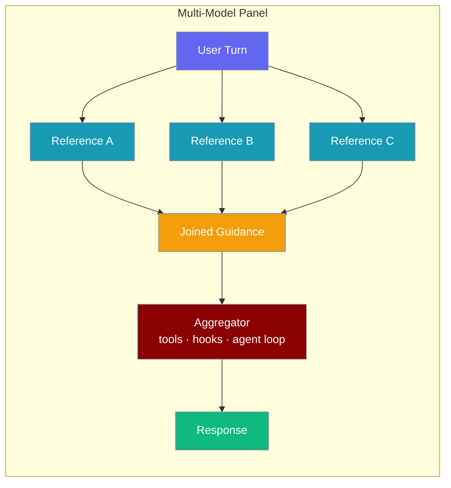
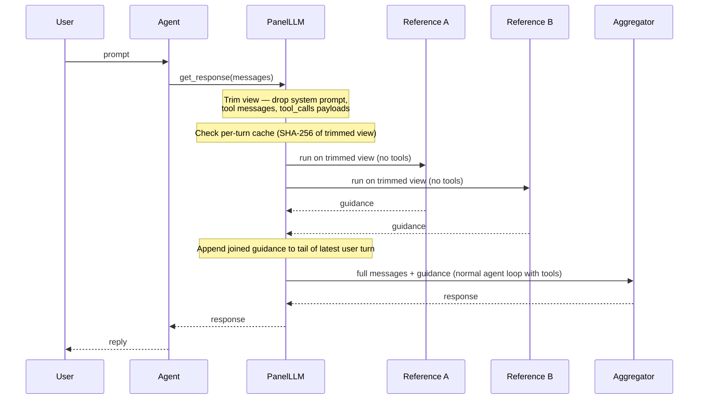
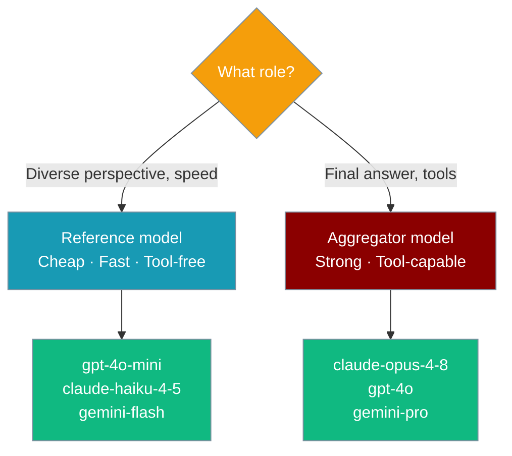
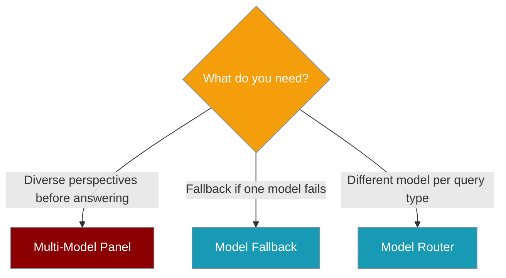

A **panel** is a mixture-of-agents you select exactly like any other model: reference models run first to provide diverse perspectives, then one aggregator model synthesizes their input and produces the final response with full tool access.



## Quick Start

<Steps>
<Step title="Inline dict — no registration needed">

```python
from praisonaiagents import Agent

agent = Agent(
    name="Deep Thinker",
    instructions="Answer questions with the best reasoning.",
    llm={
        "provider": "panel",
        "references": ["gpt-4o-mini", "claude-haiku-4-5"],
        "aggregator": "claude-opus-4-8",
    },
)
agent.start("How should I architect a feature-flag service?")
```

</Step>

<Step title="Named preset — one-line llm= everywhere">

Register once, reuse by name in any agent, YAML, or CLI:

```python
from praisonaiagents import Agent, register_panel_preset

register_panel_preset("deep", {
    "references": ["gpt-4o-mini", "claude-haiku-4-5"],
    "aggregator": "claude-opus-4-8",
})

agent = Agent(name="Deep Thinker", llm="panel:deep")
agent.start("Design a rate limiter.")
```

</Step>
</Steps>

---

## How It Works



The panel subclasses `LLM` — the aggregator runs the normal agent loop (tool calls, hooks, sessions) unchanged.

---

## Two Descriptor Forms

Both forms are fully equivalent. Pick the one that fits your project.

<Tabs>
<Tab title="Inline dict">

No registration required. Pass the full config as `llm=`.

```python
from praisonaiagents import Agent

agent = Agent(
    name="Analyst",
    instructions="Provide thorough analysis.",
    llm={
        "provider": "panel",
        "references": ["gpt-4o-mini", "claude-haiku-4-5"],
        "aggregator": "claude-opus-4-8",
        "enabled": True,
    },
)
```

</Tab>

<Tab title="Named preset">

Register once at startup, then use `"panel:<name>"` as a plain string anywhere a model string is accepted.

```python
from praisonaiagents import Agent, register_panel_preset

register_panel_preset("my-panel", {
    "references": ["gpt-4o-mini", "claude-haiku-4-5"],
    "aggregator": "claude-opus-4-8",
})

agent = Agent(name="Analyst", llm="panel:my-panel")
```

YAML works identically:

```yaml
agents:
  analyst:
    name: Analyst
    llm: panel:my-panel
```

</Tab>
</Tabs>

---

## Configuration Reference

| Key | Type | Default | Description |
|-----|------|---------|-------------|
| `references` | `list[str]` | `[]` | Advisory models. Each runs once per user turn, tool-free, on a trimmed view. |
| `aggregator` | `str` | **required** | The acting model that runs the full agent loop with tools. |
| `enabled` | `bool` | `True` | `False` collapses to aggregator-only (no reference calls). Use as a kill switch. |
| `provider` | `str` | — | Always `"panel"` in the inline dict form; absent in named presets. |
| `base_url` | `str` | — | Custom endpoint forwarded to both the aggregator and each reference (e.g. Ollama). |
| `api_key` | `str` | — | API key forwarded to both the aggregator and each reference. |
| `api_version` | `str` | — | API version forwarded to both aggregator and references. |
| `auth` | `str` | — | Extra auth headers forwarded to both aggregator and references. |
| `temperature` (+ extras) | varies | — | Forwarded to the aggregator only. |

---

## Choosing References vs Aggregator



**References:** Use cheap, fast models from different providers. They contribute diverse perspectives. They never use tools and don't see the system prompt or tool messages.

**Aggregator:** Use your strongest model. It's the only model that calls tools, runs hooks, and drives the agent loop. It receives all reference guidance appended to the user turn tail.

---

## When to Use a Panel



---

## Safe-by-Default Behaviours

| Behaviour | What happens |
|-----------|-------------|
| **Partial-failure tolerance** | A failed reference becomes a labelled `(unavailable: reference call failed)` note; the turn continues normally. Raw exception text is never injected. |
| **Strict-provider safety** | References receive a trimmed view — system prompt, `tool`-role messages, and `tool_calls` payloads are removed so strict providers (e.g. Anthropic) don't reject orphan tool messages. |
| **Cache-safe injection** | Reference guidance is appended to the **tail of the latest user turn**, never to the system prompt or earlier history — stable cached prefixes are preserved. |
| **Per-turn caching** | References run once per unique user turn (keyed by SHA-256 of the trimmed view). Bounded FIFO cache (max 128 entries). |
| **Recursion guard** | A panel descriptor cannot reference another panel descriptor — raises `ValueError` at config resolution. |
| **`enabled: false`** | Collapses to aggregator-acting-alone without removing the preset. Useful as a quick kill switch. |
| **Connection settings forwarded** | `base_url`, `api_key`, `api_version`, `auth` reach both the aggregator and each reference — one Ollama endpoint or subscription auth works everywhere. |

---

## YAML Usage

Named presets flow through `llm:` strings unchanged:

```yaml
agents:
  analyst:
    name: Deep Analyst
    role: Research Analyst
    goal: Provide thorough, multi-perspective analysis
    llm: panel:deep
```

---

## Limitations

<Note>
- References **never use tools** — they are advisory inputs only.
- References **don't see** the system prompt or tool messages (trimmed view by design).
- Reference calls are **not streamed** — they run and complete before the aggregator starts.
- **Panels are not nestable** — a reference or aggregator cannot itself be a panel descriptor.
</Note>

---

## Best Practices

<AccordionGroup>
<Accordion title="Keep references cheap and fast">
  References run on every unique user turn. Use small, fast models (e.g. `gpt-4o-mini`, `claude-haiku-4-5`) to keep latency low and costs minimal.
</Accordion>

<Accordion title="Use enabled: false as a kill switch">
  Set `enabled: false` in a registered preset to disable reference calls instantly — no code changes needed, and the aggregator continues acting alone.
</Accordion>

<Accordion title="Reuse connection settings">
  References share `base_url`, `api_key`, and `auth` with the aggregator. A single Ollama endpoint or subscription API key covers the whole panel.
</Accordion>

<Accordion title="Keep panels flat">
  The recursion guard prevents nested panels. Design your panel topology to be a single layer: N references → 1 aggregator.
</Accordion>

<Accordion title="Same question reuses cached references">
  Per-turn caching means asking the exact same question reuses reference outputs for free. Long-lived agents benefit automatically.
</Accordion>
</AccordionGroup>

---

## Related

<CardGroup cols={2}>
<Card title="Configurable Model" icon="sliders" href="/docs/features/configurable-model">
  Switch models per-call or permanently at runtime.
</Card>
<Card title="Model Fallback" icon="shield-check" href="/docs/features/model-fallback">
  Automatic retry on alternate models when the primary fails.
</Card>
<Card title="Model Router" icon="route" href="/docs/features/model-router">
  Dynamic model selection based on task type.
</Card>
<Card title="Rate Limiter" icon="gauge" href="/docs/features/rate-limiter">
  Throttle requests before they fail.
</Card>
</CardGroup>
