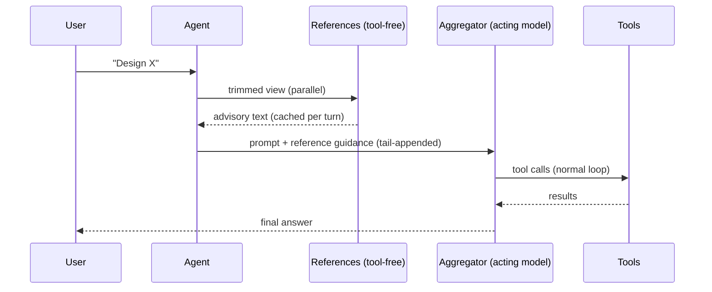
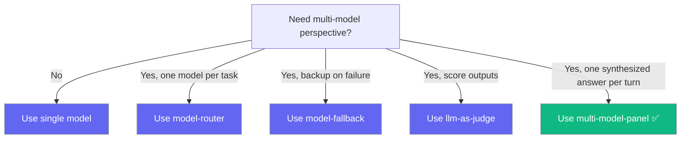

Run multiple models as advisors and one as the actor — all selectable as a single LLM.


## Quick Start

<Steps>
<Step title="Inline descriptor">

Describe the panel inline — no registration needed. The references advise, the aggregator writes the final answer.

```python
from praisonaiagents import Agent

agent = Agent(
    name="Assistant",
    instructions="Answer thoughtfully.",
    llm={
        "provider": "panel",
        "references": ["gpt-4o", "anthropic/claude-3-5-sonnet"],
        "aggregator": "anthropic/claude-3-5-sonnet",
    },
)

agent.start("Design a migration plan for moving from REST to GraphQL.")
```
</Step>

<Step title="Named preset (reusable)">

Register a preset once and reference it by name — works from Python, YAML, CLI, and bots.

```python
from praisonaiagents import Agent
from praisonaiagents.llm import register_panel_preset

register_panel_preset("deep", {
    "references": ["gpt-4o", "anthropic/claude-3-5-sonnet"],
    "aggregator": "anthropic/claude-3-5-sonnet",
})

agent = Agent(name="Researcher", llm="panel:deep")
agent.start("What are the trade-offs of event sourcing?")
```
</Step>
</Steps>

## How It Works



On every user turn the references run **once** (tool-free, trimmed view) and their advisory text is **appended to the tail of the latest user turn** — never to the system prompt, so Anthropic prompt caching on the system prefix stays intact. The aggregator then runs the normal tool loop with full tools, hooks, and sessions.

## When To Use This vs. Other Model Features



| Feature | What it does | What it does NOT do |
|---|---|---|
| `model-router` | Picks ONE model per task | Does not ensemble |
| `model-fallback` | Backup on failure | Not parallel perspectives |
| `llm-as-judge` | Scores outputs after-the-fact | Does not act as a model |
| **`multi-model-panel`** | Multiple references advise + one aggregator acts as a single LLM | — |

## Configuration Options

`Agent(llm=...)` accepts the panel in two equivalent forms:

```python
# 1. Named preset (must register first)
agent = Agent(name="assistant", llm="panel:deep")

# 2. Inline dict descriptor (no registration needed)
agent = Agent(
    name="assistant",
    llm={
        "provider": "panel",
        "references": ["gpt-4o", "anthropic/claude-3-5-sonnet"],
        "aggregator": "anthropic/claude-3-5-sonnet",
        "enabled": True,
    },
)
```

### Panel descriptor keys

| Key | Type | Default | Description |
|---|---|---|---|
| `aggregator` *(required)* | `str` | — | Model string that acts in the loop (e.g. `"gpt-4o"`, `"anthropic/claude-3-5-sonnet"`). Inherits the full tool loop, hooks, and session. |
| `references` | `list[str] \| None` | `None` | Advisory model strings called first, tool-free, with a trimmed view. Empty list = aggregator-alone. |
| `enabled` | `bool` | `True` | When `False`, references are skipped entirely — behaves identically to selecting the aggregator directly (no added cost). |
| `reference_temperature` | `float` | `0.0` | Temperature passed to the advisory reference calls (kept deterministic by default for caching). |
| `base_url` | `str \| None` | `None` | Base URL forwarded to the underlying `LLM` and propagated to reference LLMs so they hit the same backend. |
| `api_key` | `str \| None` | `None` | API key forwarded to the underlying `LLM` and propagated to reference LLMs. |
| `api_version` | `str \| None` | `None` | API version forwarded to the underlying `LLM` and propagated to reference LLMs. |
| `auth` | `object \| None` | `None` | Auth object forwarded to the underlying `LLM` and propagated to reference LLMs. |

### Module helpers

<Note title="SDK reference">
Helper APIs such as `register_panel_preset`, `resolve_panel_config`, `is_panel_descriptor`, `create_panel_llm`, and the `PANEL_PRESETS` registry are internal module symbols — see the auto-generated SDK reference for signatures and full details. This page stays focused on using the panel feature rather than documenting module internals.
</Note>

## Common Patterns

### With tools (aggregator gets full tool loop)

```python
from praisonaiagents import Agent
from praisonaiagents.tools import duckduckgo

agent = Agent(
    name="Research Assistant",
    llm="panel:deep",
    tools=[duckduckgo],
)

agent.start("Research the latest Anthropic releases and summarize.")
```

### YAML

```yaml
agent:
  name: assistant
  llm: panel:deep
  tools:
    - duckduckgo
```

### Local models (Ollama, with `base_url`)

```python
agent = Agent(
    name="Local Panel",
    llm={
        "provider": "panel",
        "references": ["ollama/llama3", "ollama/mistral"],
        "aggregator": "ollama/llama3",
        "base_url": "http://localhost:11434",
    },
)
```

### Disabled panel (escape hatch)

```python
agent = Agent(
    name="Assistant",
    llm={
        "provider": "panel",
        "references": ["gpt-4o"],
        "aggregator": "anthropic/claude-3-5-sonnet",
        "enabled": False,  # skip references; aggregator acts alone
    },
)
```

## Behavioral Guarantees

- **Selectable like any model** — flows through CLI `--model panel:deep`, YAML `llm: panel:deep`, bot `/model panel:deep`, and Python `Agent(llm=...)`.
- **Prompt-cache safe** — reference outputs are injected at the tail of the latest user turn, never on the system prompt or history.
- **Per-turn reference caching** — references run **once per user turn**, cached across tool-loop iterations by a deterministic signature of the trimmed view. Bounded FIFO cache (max 128 entries).
- **Partial-failure tolerance** — if one reference fails (network, credentials), it becomes a labeled `(unavailable: reference call failed)` note and the turn continues. The whole turn never fails just because a reference did.
- **Strict-provider safety** — references get a trimmed view: system prompt dropped, `tool`-role messages dropped, `tool_calls` payloads dropped. Strict providers won't 400 on orphan tool messages.
- **Recursion guard** — a panel preset cannot reference another panel preset (rejected at config-validation time with `ValueError`).
- **`enabled=False` collapses cleanly** — same cost as selecting the aggregator directly.
- **Tool-free references** — references never see the tool schema and cannot emit tool calls. Only the aggregator acts.

## Best Practices

<AccordionGroup>
<Accordion title="Keep reference_temperature at 0.0">

Deterministic reference outputs maximize cache hits and keep the aggregator's view stable across tool-loop iterations.
</Accordion>

<Accordion title="Use 2-3 references max">

Each reference is an extra API call per turn. Marginal value drops fast beyond two or three references, while cost grows linearly.
</Accordion>

<Accordion title="Pick a strong aggregator">

The aggregator writes the final answer and runs the tool loop. It should be the most capable model in your panel, not necessarily the cheapest.
</Accordion>

<Accordion title="Don't nest panels">

A panel preset can't reference another panel preset — the config validator rejects it with `ValueError`. Keep panels flat.
</Accordion>
</AccordionGroup>

## Related

<CardGroup cols={2}>
<Card title="Model Router" icon="route" href="/docs/features/model-router">
Pick one model per task.
</Card>
<Card title="Model Fallback" icon="shield-check" href="/docs/features/model-fallback">
Retry on alternate models when the primary fails.
</Card>
</CardGroup>