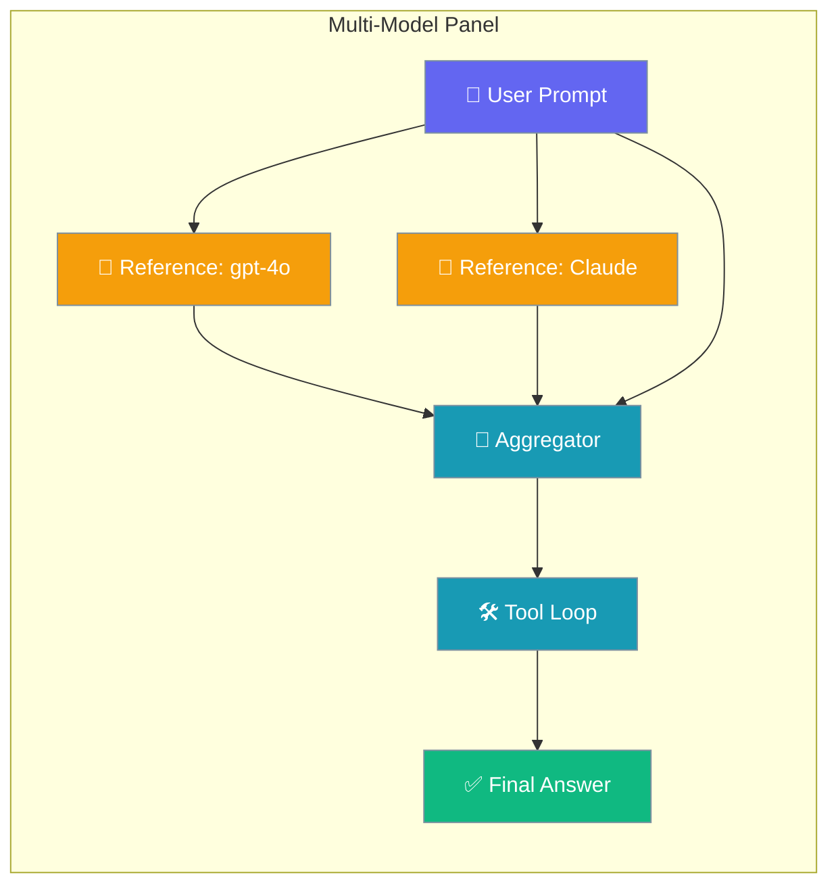
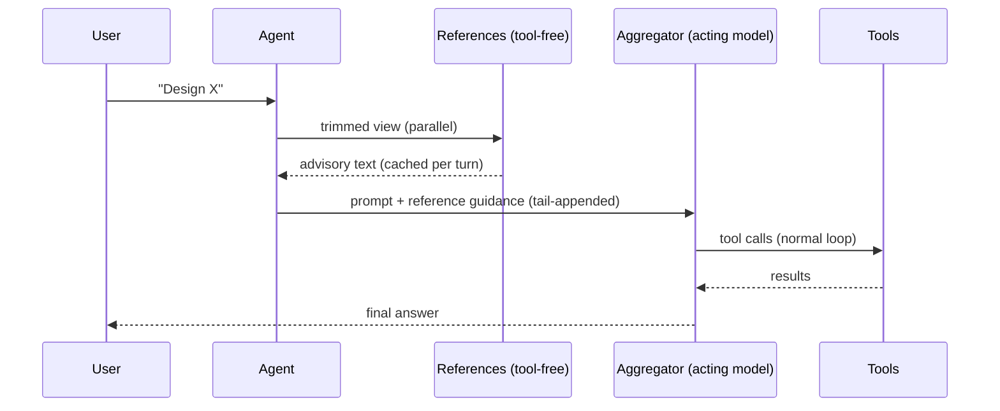

Run multiple models as advisors and one as the actor — all as a single drop-in model selection.



## Quick Start

<Steps>
<Step title="Inline panel (no setup needed)">
```python
from praisonaiagents import Agent

agent = Agent(
    name="Assistant",
    instructions="Answer thoughtfully.",
    llm={
        "provider": "panel",
        "references": ["gpt-4o", "anthropic/claude-3-5-sonnet"],
        "aggregator": "anthropic/claude-3-5-sonnet",
    },
)

agent.start("Design a migration plan for moving from REST to GraphQL.")
```
</Step>

<Step title="Named preset (reusable across agents)">
```python
from praisonaiagents import Agent
from praisonaiagents.llm import register_panel_preset

register_panel_preset("deep", {
    "references": ["gpt-4o", "anthropic/claude-3-5-sonnet"],
    "aggregator": "anthropic/claude-3-5-sonnet",
})

agent = Agent(name="Researcher", llm="panel:deep")
agent.start("What are the trade-offs of event sourcing?")
```
</Step>
</Steps>

---

## How It Works

Reference models advise first (tool-free, trimmed view); the aggregator receives their perspectives and writes the final answer with full tool access.



| Step | Who | What happens |
|------|-----|-------------|
| 1 | References | See only user/assistant text — no system prompt, no tool calls |
| 2 | Agent | Caches reference outputs by turn signature (max 128 entries) |
| 3 | Aggregator | Receives original prompt + reference notes appended at tail |
| 4 | Aggregator | Runs the full tool loop and produces the final answer |

---

## When To Use This


| Feature | What it does | Multi-model? |
|---------|-------------|-------------|
| `model-router` | Picks one model per task | No |
| `model-fallback` | Backup on failure | No (sequential) |
| `llm-as-judge` | Scores outputs after the fact | No |
| **`multi-model-panel`** | Multiple references advise + one aggregator acts | **Yes** |

---

## Configuration Options

### `PanelLLM` parameters

| Parameter | Type | Default | Description |
|-----------|------|---------|-------------|
| `aggregator` | `str` | *(required)* | The acting model — runs tool calls, hooks, and session |
| `references` | `Optional[List[str]]` | `None` | Advisory models called first; empty list means aggregator-alone |
| `enabled` | `bool` | `True` | `False` skips references entirely — same cost as using the aggregator directly |
| `reference_temperature` | `float` | `0.0` | Temperature for reference calls (deterministic by default for caching) |
| `**kwargs` | — | — | Forwarded to the aggregator LLM (`base_url`, `api_key`, `api_version`, `auth`, `temperature`, etc.) |

### Descriptor keys (dict or preset config)

| Key | Type | Description |
|-----|------|-------------|
| `provider` | `"panel"` | Identifies this as a panel descriptor |
| `references` | `List[str]` | Advisory model strings |
| `aggregator` | `str` | Acting model string |
| `enabled` | `bool` | Enable/disable references |
| `base_url` | `str` | Forwarded to both references and aggregator |
| `api_key` | `str` | Forwarded to both references and aggregator |

---

## Common Patterns

### With tools — aggregator gets the full tool loop

```python
from praisonaiagents import Agent
from praisonaiagents.tools import duckduckgo
from praisonaiagents.llm import register_panel_preset

register_panel_preset("deep", {
    "references": ["gpt-4o", "anthropic/claude-3-5-sonnet"],
    "aggregator": "anthropic/claude-3-5-sonnet",
})

agent = Agent(
    name="Research Assistant",
    llm="panel:deep",
    tools=[duckduckgo],
)

agent.start("Research the latest Anthropic releases and summarise.")
```

### YAML preset

```yaml
agent:
  name: assistant
  llm: panel:deep
  tools:
    - duckduckgo
```

### Local models via Ollama

```python
from praisonaiagents import Agent

agent = Agent(
    name="Local Panel",
    llm={
        "provider": "panel",
        "references": ["ollama/llama3", "ollama/mistral"],
        "aggregator": "ollama/llama3",
        "base_url": "http://localhost:11434",
    },
)
agent.start("Explain transformer attention mechanisms.")
```

### `enabled=False` — toggle without removing the descriptor

```python
from praisonaiagents import Agent

agent = Agent(
    name="Assistant",
    llm={
        "provider": "panel",
        "references": ["gpt-4o"],
        "aggregator": "anthropic/claude-3-5-sonnet",
        "enabled": False,
    },
)
```

---

## Key Guarantees

<Note>
**Prompt-cache safe** — reference outputs are injected at the tail of the latest user turn, never into the system prompt or history. Anthropic prompt caching on the system prefix stays intact.
</Note>

<Note>
**Partial-failure tolerance** — if a reference model fails (network error, wrong credentials), it becomes a labelled `(unavailable: reference call failed)` note. The turn never fails because one reference did.
</Note>

<Note>
**Recursion guard** — a panel preset cannot reference another panel preset. `resolve_panel_config` raises `ValueError` at config-validation time.
</Note>

---

## Best Practices

<AccordionGroup>
<Accordion title="Pick a deterministic aggregator for consistency">
The aggregator writes the final answer. Use the same model you would trust to act alone — the references are advisors, not decision-makers.
</Accordion>

<Accordion title="Keep reference lists short (1–3 models)">
Each reference adds a separate API call per turn. More than three references rarely improves output quality relative to the added latency and cost.
</Accordion>

<Accordion title="Use reference_temperature=0.0 for cache hits">
The default `reference_temperature=0.0` maximises cache hits across identical turns. Raise it only when you deliberately want varied reference perspectives.
</Accordion>

<Accordion title="Don't nest panels">
The recursion guard rejects panel-in-panel configs at validation time. Combine models in a single panel instead of chaining panels.
</Accordion>
</AccordionGroup>

---

## Related

<CardGroup cols={2}>
<Card title="Model Router" icon="route" href="/docs/features/model-router">
  Pick one model dynamically based on task complexity.
</Card>
<Card title="Model Fallback" icon="shield-check" href="/docs/features/model-fallback">
  Automatic retry on alternate models when the primary fails.
</Card>
<Card title="LLM as Judge" icon="scale-balanced" href="/docs/features/llm-as-judge">
  Score and rank model outputs after the fact.
</Card>
<Card title="Configurable Model" icon="sliders" href="/docs/features/configurable-model">
  Per-agent model overrides and LLM config.
</Card>
</CardGroup>
