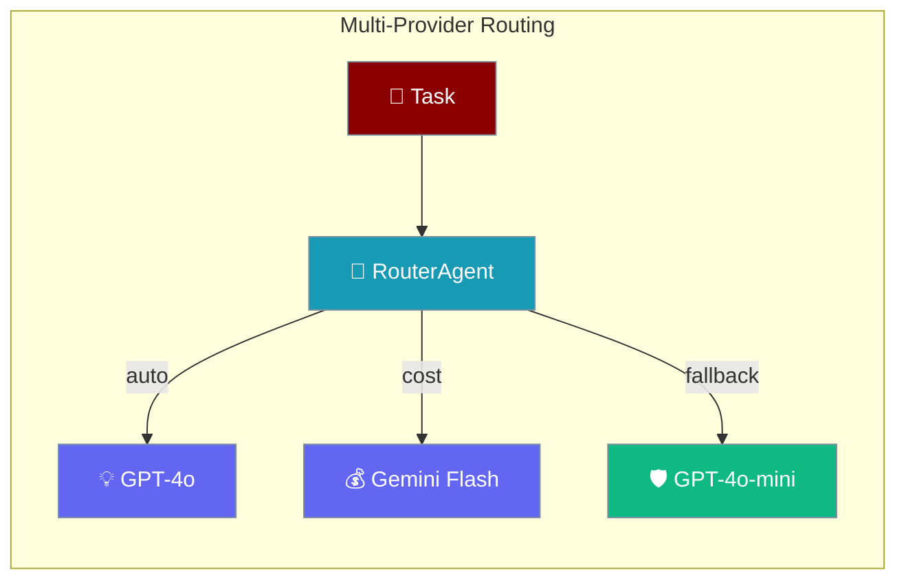
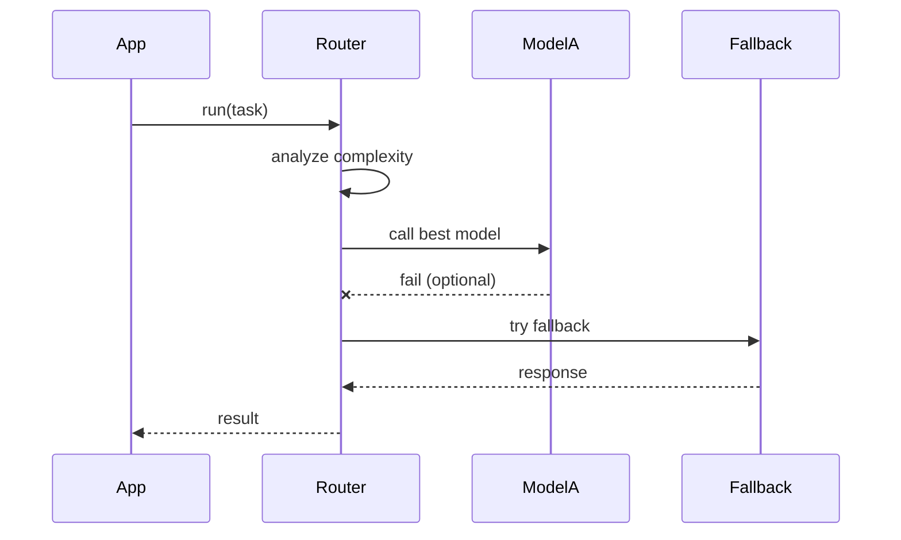

While basic multi-provider support allows you to use different LLMs for different agents, PraisonAI's `ModelRouter` and `RouterAgent` provide sophisticated patterns for dynamic provider switching, cost optimization, and resilience.

<Warning>
**PR #2122:** A model string like `my-custom-model` no longer defaults to the OpenAI provider — it raises `ValueError`: *"Cannot infer provider from model '...'. Use the 'provider/model' form, e.g. 'ollama/llama3', 'bedrock/anthropic.claude-3-sonnet'."*
</Warning>

### Model string format

Use either a recognised prefix (`gpt-`, `claude-`, `gemini-`) or explicit `provider/model` form:

| Form | Example |
|------|---------|
| Prefix | `gpt-4o`, `claude-3-5-sonnet` |
| Provider/model | `ollama/llama3`, `bedrock/anthropic.claude-3-sonnet`, `deepseek/deepseek-chat` |

See [Fail-Loud Defaults](/docs/features/fail-loud-defaults) for migration guidance.

## Quick Start

<Steps>
<Step title="Create a RouterAgent">
```python
from praisonaiagents import RouterAgent

router_agent = RouterAgent(
    models=[
        "gpt-4o",
        "gpt-4o-mini",
        "gemini/gemini-1.5-flash",
    ],
    routing_strategy="auto",
    fallback_model="gpt-4o-mini"
)
```
</Step>

<Step title="Run tasks — router picks the model">
```python
response = router_agent.run("Analyze this complex financial report...")
response = router_agent.run("What's the weather today?")

usage = router_agent.get_usage_summary()
print(f"Total cost: ${usage['total_cost']:.4f}")
```
</Step>
</Steps>

---

## How It Works



---

## Overview

The advanced multi-provider system enables:
- Dynamic model selection based on task requirements
- Automatic fallback when providers fail
- Cost-optimized routing for different task complexities
- Performance-based routing for critical operations
- Load balancing across providers
- Circuit breaker patterns for provider health

## RouterAgent with ModelRouter

The `RouterAgent` uses the `ModelRouter` to intelligently select models based on task analysis:

```python
from praisonaiagents import RouterAgent

# Configure router with multiple models
router_agent = RouterAgent(
    models=[
        "gpt-4o",                    # High capability, higher cost
        "gpt-4o-mini",              # Balanced capability and cost
        "gemini/gemini-1.5-flash",  # Fast and cost-effective
        "deepseek/deepseek-chat"    # Very cost-effective
    ],
    routing_strategy="auto",  # or "cost-optimized", "performance-optimized"
    fallback_model="gpt-4o-mini"
)

# The router automatically selects appropriate models based on task complexity
response = router_agent.run("Analyze this complex financial report...")  # Uses GPT-4
response = router_agent.run("What's the weather today?")  # Uses cheaper model
```

## Routing Strategies

### 1. Automatic Routing ("auto")

Analyzes task complexity and requirements to select the best model:

```python
router_agent = RouterAgent(
    models=["gpt-4o", "claude-3-opus-20240229", "gemini/gemini-1.5-pro"],
    routing_strategy="auto"
)

# Complex analysis task → Premium model
# Simple query → Cost-effective model
# Tool usage → Model with function calling support
```

### 2. Cost-Optimized Routing

Prioritizes cheaper models while ensuring task completion:

```python
router_agent = RouterAgent(
    models=["gpt-4o", "gpt-4o-mini", "gemini/gemini-1.5-flash"],
    routing_strategy="cost-optimized",
    cost_threshold=0.005  # Max cost per 1k tokens
)

# Get usage report with cost estimates
usage = router_agent.get_usage_summary()
print(f"Total cost: ${usage['total_cost']:.4f}")
```

### 3. Performance-Optimized Routing

Prioritizes capability and reliability for critical tasks:

```python
router_agent = RouterAgent(
    models=["gpt-4o", "claude-3-opus-20240229"],
    routing_strategy="performance-optimized"
)

# Always uses the most capable model available
```

## Advanced Patterns

### Fallback Mechanism

Automatic fallback when primary model fails:

```python
from praisonaiagents import RouterAgent, Agent

router = RouterAgent(
    models=["gpt-4o", "claude-3-haiku-20240307", "gemini/gemini-1.5-flash"],
    fallback_model="gpt-4o-mini",
    routing_strategy="auto"
)

# If primary model fails, automatically tries next model
# If all models fail, uses fallback_model
agent = Agent(name="Resilient Agent", router=router)
```

### Task-Based Routing

Route specific task types to specific providers:

```python
from praisonaiagents import ModelRouter

class CustomRouter(ModelRouter):
    def select_model(self, task_description: str, **kwargs):
        # Code generation → Specialized model
        if any(keyword in task_description.lower() 
               for keyword in ["code", "programming", "function"]):
            return "deepseek/deepseek-coder"
        
        # Creative tasks → Creative model
        if any(keyword in task_description.lower() 
               for keyword in ["creative", "story", "poem"]):
            return "claude-3-opus-20240229"
        
        # Default to cost-effective model
        return "gemini/gemini-1.5-flash"

router_agent = RouterAgent(router=CustomRouter())
```

### Provider Health Monitoring

Track provider performance and route accordingly:

```python
from praisonaiagents import RouterAgent
import time

class MonitoredRouter(RouterAgent):
    def __init__(self, *args, **kwargs):
        super().__init__(*args, **kwargs)
        self.provider_stats = {}
    
    def track_performance(self, model, latency, success):
        if model not in self.provider_stats:
            self.provider_stats[model] = {
                "total_calls": 0,
                "failures": 0,
                "avg_latency": 0
            }
        
        stats = self.provider_stats[model]
        stats["total_calls"] += 1
        if not success:
            stats["failures"] += 1
        
        # Update average latency
        stats["avg_latency"] = (
            (stats["avg_latency"] * (stats["total_calls"] - 1) + latency) 
            / stats["total_calls"]
        )
    
    def get_health_score(self, model):
        if model not in self.provider_stats:
            return 1.0
        
        stats = self.provider_stats[model]
        failure_rate = stats["failures"] / stats["total_calls"]
        return 1.0 - failure_rate

# Use monitored router
router = MonitoredRouter(
    models=["gpt-4o", "claude-3-haiku-20240307", "gemini/gemini-1.5-flash"]
)
```

### Load Balancing

Distribute load across multiple providers:

```python
from praisonaiagents import RouterAgent
import random

class LoadBalancedRouter(RouterAgent):
    def __init__(self, *args, **kwargs):
        super().__init__(*args, **kwargs)
        self.model_usage = {model: 0 for model in self.models}
    
    def select_model_balanced(self):
        # Find least used model
        min_usage = min(self.model_usage.values())
        candidates = [m for m, u in self.model_usage.items() if u == min_usage]
        
        selected = random.choice(candidates)
        self.model_usage[selected] += 1
        return selected

router = LoadBalancedRouter(
    models=["gpt-4o-mini", "gemini/gemini-1.5-flash", "claude-3-haiku"]
)
```

### Circuit Breaker Pattern

Temporarily disable failing providers:

```python
from praisonaiagents import RouterAgent
import time

class CircuitBreakerRouter(RouterAgent):
    def __init__(self, *args, failure_threshold=5, timeout=300, **kwargs):
        super().__init__(*args, **kwargs)
        self.failure_threshold = failure_threshold
        self.timeout = timeout
        self.failures = {}
        self.circuit_open = {}
    
    def is_available(self, model):
        if model in self.circuit_open:
            if time.time() - self.circuit_open[model] > self.timeout:
                # Reset circuit after timeout
                del self.circuit_open[model]
                self.failures[model] = 0
                return True
            return False
        return True
    
    def record_failure(self, model):
        self.failures[model] = self.failures.get(model, 0) + 1
        if self.failures[model] >= self.failure_threshold:
            self.circuit_open[model] = time.time()
            print(f"Circuit breaker opened for {model}")
    
    def get_available_models(self):
        return [m for m in self.models if self.is_available(m)]
```

## Integration with AutoAgents

Use RouterAgent with AutoAgents for dynamic teams:

```python
from praisonaiagents import AutoAgentTeam, RouterAgent

# Create router for the team
router = RouterAgent(
    models=["gpt-4o", "claude-3-haiku-20240307", "gemini/gemini-1.5-flash"],
    routing_strategy="cost-optimized"
)

# AutoAgents will use the router for all agents
auto_agents = AutoAgentTeam(
    instructions="Create a research team",
    router=router
)

# Each agent gets optimal model based on their tasks
agents = auto_agents.create_agents()
```

## Best Practices

<AccordionGroup>
<Accordion title="Configure model profiles for accurate routing">

Configure accurate model profiles for better routing:

```python
router = RouterAgent(
    model_profiles={
        "gpt-4o": {
            "cost_per_1k_tokens": 0.03,
            "strengths": ["reasoning", "analysis", "coding"],
            "supports_tools": True,
            "context_window": 128000
        },
        "gemini/gemini-1.5-flash": {
            "cost_per_1k_tokens": 0.0001,
            "strengths": ["speed", "simple_tasks"],
            "supports_tools": True,
            "context_window": 1000000
        }
    }
)
```
</Accordion>

<Accordion title="Monitor and limit costs">
```python
router = RouterAgent(
    models=["gpt-4o", "gpt-4o-mini"],
    cost_threshold=0.01,
    daily_budget=10.0
)

usage = router.get_usage_summary()
if usage["total_cost"] > 5.0:
    router.routing_strategy = "cost-optimized"
```
</Accordion>

<Accordion title="Handle provider failures gracefully">
```python
try:
    response = router_agent.run(task)
except ProviderError as e:
    logger.error(f"Provider {e.provider} failed: {e}")
except MaxRetriesError:
    logger.critical("All providers failed")
```
</Accordion>

<Accordion title="Use explicit provider/model form for custom models">
Custom model strings like `my-model` raise `ValueError`. Always use `provider/model` form or a known prefix.

```python
"ollama/llama3"             # explicit
"bedrock/anthropic.claude-3-sonnet"  # explicit
"gpt-4o"                    # recognised prefix
```
</Accordion>
</AccordionGroup>

---

## Common Use Cases

### 1. Development vs Production

```python
# Development: Use cost-effective models
dev_router = RouterAgent(
    models=["gpt-4o-mini", "gemini/gemini-1.5-flash"],
    routing_strategy="cost-optimized"
)

# Production: Use high-performance models
prod_router = RouterAgent(
    models=["gpt-4o", "claude-3-opus-20240229"],
    routing_strategy="performance-optimized"
)
```

### 2. Specialized Routing

```python
# Route by capability
coding_router = RouterAgent(
    models=["deepseek/deepseek-coder", "gpt-4o"],
    task_filter=lambda t: "code" in t.lower()
)

creative_router = RouterAgent(
    models=["claude-3-opus-20240229", "gpt-4o"],
    task_filter=lambda t: any(w in t.lower() for w in ["creative", "write", "story"])
)
```

### 3. A/B Testing

```python
# Test different models for same tasks
ab_router = RouterAgent(
    models=["gpt-4o", "claude-3-opus-20240229"],
    routing_strategy="random",  # 50/50 split
    track_performance=True
)

# Analyze results
performance = ab_router.get_performance_comparison()
```

## Related

<CardGroup cols={2}>
<Card title="Fail-Loud Defaults" icon="triangle-exclamation" href="/features/fail-loud-defaults">
  Model string validation and migration guidance
</Card>
<Card title="Agent Profiles" icon="id-card" href="/features/agent-profiles">
  Pre-built agent configurations for common roles
</Card>
</CardGroup>