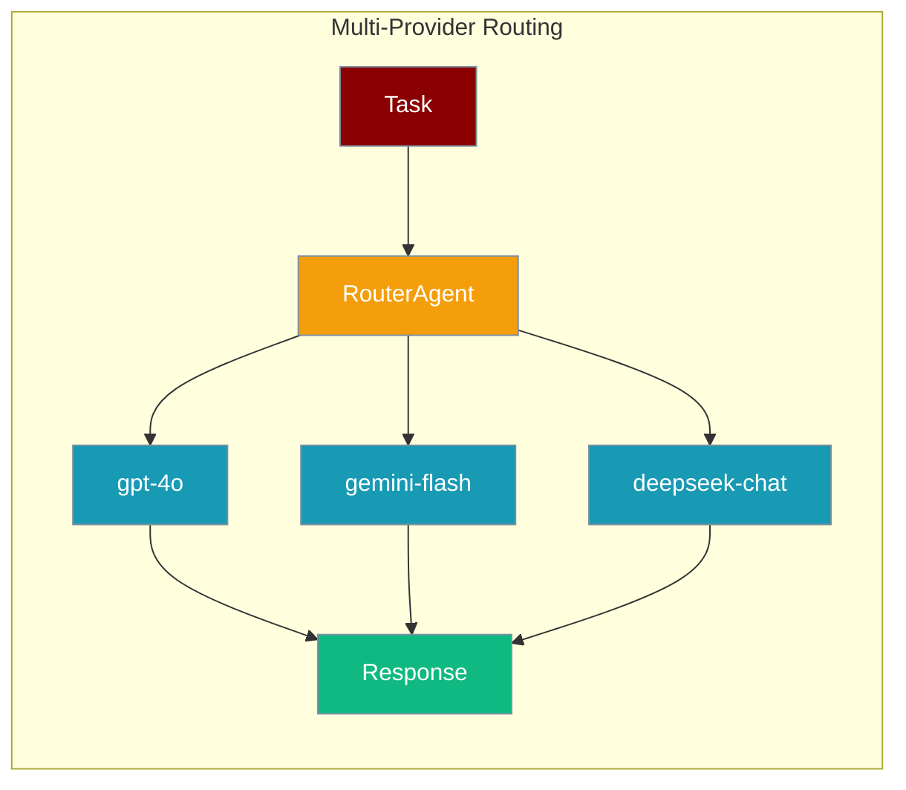

While basic multi-provider support lets you assign different LLMs to different agents, `ModelRouter` and `RouterAgent` add dynamic switching, cost optimisation, and resilience.



<Warning>
**PR #2122:** A model string like `my-custom-model` no longer defaults to the OpenAI provider — it raises `ValueError`. Use the `provider/model` form, e.g. `ollama/llama3`, `bedrock/anthropic.claude-3-sonnet`.
</Warning>

### Model string format

Use either a recognised prefix (`gpt-`, `claude-`, `gemini-`) or explicit `provider/model` form:

| Form | Example |
|------|---------|
| Prefix | `gpt-4o`, `claude-3-5-sonnet` |
| Provider/model | `ollama/llama3`, `bedrock/anthropic.claude-3-sonnet`, `deepseek/deepseek-chat` |

See [Fail-Loud Defaults](/docs/features/fail-loud-defaults) for migration guidance.

## Quick Start

<Steps>

<Step title="Simple Usage">

```python
from praisonaiagents import RouterAgent

router_agent = RouterAgent(
    models=["gpt-4o-mini", "gemini/gemini-1.5-flash"],
    routing_strategy="auto",
)

response = router_agent.run("What's the weather today?")
```

</Step>

<Step title="With Configuration">

```python
from praisonaiagents import RouterAgent, Agent

router = RouterAgent(
    models=[
        "gpt-4o",
        "gpt-4o-mini",
        "gemini/gemini-1.5-flash",
        "deepseek/deepseek-chat",
    ],
    routing_strategy="cost-optimized",
    fallback_model="gpt-4o-mini",
)

agent = Agent(name="Resilient Agent", router=router)
response = agent.run("Analyze this complex financial report...")
```

</Step>

</Steps>

## Overview

The advanced multi-provider system enables:

- Dynamic model selection based on task requirements
- Automatic fallback when providers fail
- Cost-optimised routing for different task complexities
- Performance-based routing for critical operations
- Load balancing across providers
- Circuit breaker patterns for provider health

## Routing Strategies

### Automatic Routing ("auto")

Analyses task complexity and requirements to select the best model:

```python
router_agent = RouterAgent(
    models=["gpt-4o", "claude-3-opus-20240229", "gemini/gemini-1.5-pro"],
    routing_strategy="auto"
)
```

### Cost-Optimized Routing

Prioritises cheaper models while ensuring task completion:

```python
router_agent = RouterAgent(
    models=["gpt-4o", "gpt-4o-mini", "gemini/gemini-1.5-flash"],
    routing_strategy="cost-optimized",
    cost_threshold=0.005
)

usage = router_agent.get_usage_summary()
print(f"Total cost: ${usage['total_cost']:.4f}")
```

### Performance-Optimized Routing

Prioritises capability and reliability for critical tasks:

```python
router_agent = RouterAgent(
    models=["gpt-4o", "claude-3-opus-20240229"],
    routing_strategy="performance-optimized"
)
```

## Advanced Patterns

### Fallback Mechanism

```python
from praisonaiagents import RouterAgent, Agent

router = RouterAgent(
    models=["gpt-4o", "claude-3-haiku-20240307", "gemini/gemini-1.5-flash"],
    fallback_model="gpt-4o-mini",
    routing_strategy="auto"
)

agent = Agent(name="Resilient Agent", router=router)
```

### Task-Based Routing

```python
from praisonaiagents import ModelRouter, RouterAgent

class CustomRouter(ModelRouter):
    def select_model(self, task_description: str, **kwargs):
        if any(k in task_description.lower() for k in ["code", "programming", "function"]):
            return "deepseek/deepseek-coder"
        if any(k in task_description.lower() for k in ["creative", "story", "poem"]):
            return "claude-3-opus-20240229"
        return "gemini/gemini-1.5-flash"

router_agent = RouterAgent(router=CustomRouter())
```

### Provider Health Monitoring

```python
from praisonaiagents import RouterAgent

class MonitoredRouter(RouterAgent):
    def __init__(self, *args, **kwargs):
        super().__init__(*args, **kwargs)
        self.provider_stats = {}

    def track_performance(self, model, latency, success):
        if model not in self.provider_stats:
            self.provider_stats[model] = {"total_calls": 0, "failures": 0, "avg_latency": 0}
        stats = self.provider_stats[model]
        stats["total_calls"] += 1
        if not success:
            stats["failures"] += 1

router = MonitoredRouter(
    models=["gpt-4o", "claude-3-haiku-20240307", "gemini/gemini-1.5-flash"]
)
```

### Load Balancing

```python
from praisonaiagents import RouterAgent
import random

class LoadBalancedRouter(RouterAgent):
    def __init__(self, *args, **kwargs):
        super().__init__(*args, **kwargs)
        self.model_usage = {model: 0 for model in self.models}

    def select_model_balanced(self):
        min_usage = min(self.model_usage.values())
        candidates = [m for m, u in self.model_usage.items() if u == min_usage]
        selected = random.choice(candidates)
        self.model_usage[selected] += 1
        return selected

router = LoadBalancedRouter(
    models=["gpt-4o-mini", "gemini/gemini-1.5-flash", "claude-3-haiku"]
)
```

### Circuit Breaker Pattern

```python
from praisonaiagents import RouterAgent
import time

class CircuitBreakerRouter(RouterAgent):
    def __init__(self, *args, failure_threshold=5, timeout=300, **kwargs):
        super().__init__(*args, **kwargs)
        self.failure_threshold = failure_threshold
        self.timeout = timeout
        self.failures = {}
        self.circuit_open = {}

    def is_available(self, model):
        if model in self.circuit_open:
            if time.time() - self.circuit_open[model] > self.timeout:
                del self.circuit_open[model]
                self.failures[model] = 0
                return True
            return False
        return True

router = CircuitBreakerRouter(
    models=["gpt-4o", "claude-3-haiku-20240307", "gemini/gemini-1.5-flash"]
)
```

## Integration with AutoAgents

```python
from praisonaiagents import AutoAgentTeam, RouterAgent

router = RouterAgent(
    models=["gpt-4o", "claude-3-haiku-20240307", "gemini/gemini-1.5-flash"],
    routing_strategy="cost-optimized"
)

auto_agents = AutoAgentTeam(instructions="Create a research team", router=router)
agents = auto_agents.create_agents()
```

## Best Practices

<AccordionGroup>
  <Accordion title="Configure accurate model profiles">
    Pass `model_profiles` with cost, strengths, and context window so routing decisions reflect real capabilities.
  </Accordion>
  <Accordion title="Monitor and cap costs">
    Use `get_usage_summary()` and set `cost_threshold` or daily budgets before production traffic.
  </Accordion>
  <Accordion title="Always set a fallback model">
    Provide `fallback_model` so a single provider outage does not halt the agent.
  </Accordion>
  <Accordion title="Use explicit provider/model strings">
    Prefer `ollama/llama3` over ambiguous bare model names to avoid provider inference errors.
  </Accordion>
</AccordionGroup>

## Related

<CardGroup cols={2}>
  <Card title="Memory Management" icon="brain" href="/docs/features/memory">
    Stateful multi-provider agents with persistent memory.
  </Card>
  <Card title="Fail-Loud Defaults" icon="triangle-exclamation" href="/docs/features/fail-loud-defaults">
    Provider inference rules and migration guidance.
  </Card>
</CardGroup>
