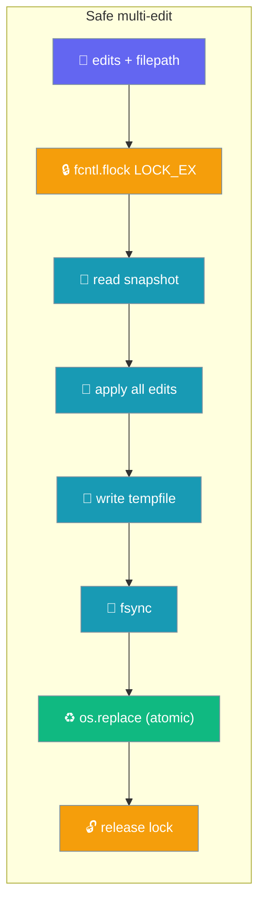
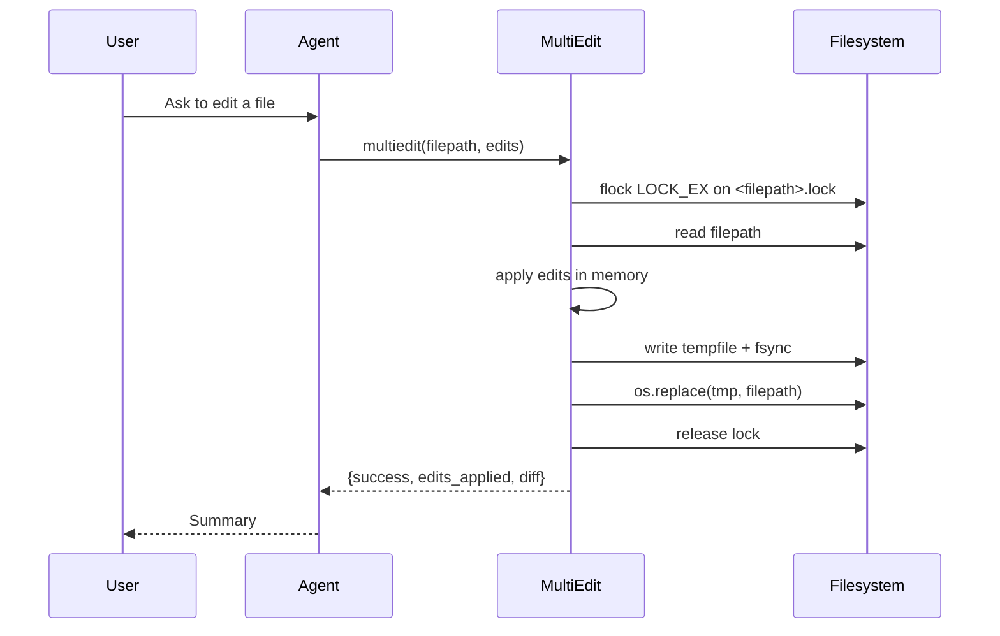

The `multiedit` tool applies many find-and-replace edits to one file in a single atomic, lock-safe operation.

```python
from praisonaiagents import Agent
from praisonai.tools.multiedit import multiedit

agent = Agent(
    name="editor",
    instructions="Apply the requested edits to files.",
    tools=[multiedit],
)

agent.start("Rename `foo` to `bar` in src/app.py and fix the typo on line 12.")
```



## Quick Start

<Steps>
<Step title="Simple Usage">

Apply several edits to one file in a single call:

```python
from praisonai.tools.multiedit import multiedit

result = multiedit(
    filepath="src/app.py",
    edits=[
        {"old": "def foo", "new": "def bar"},
        {"old": "return foo(x)", "new": "return bar(x)"},
    ],
)
print(result["success"], result["edits_applied"], result["diff"])
```

</Step>

<Step title="Dry Run">

Preview the diff without touching disk or taking the lock:

```python
from praisonai.tools.multiedit import multiedit

result = multiedit(
    filepath="src/app.py",
    edits=[{"old": "def foo", "new": "def bar"}],
    dry_run=True,   # prints the diff, writes nothing, does not take the lock
)
```

</Step>

<Step title="Inside an Agent">

Give the tool to an agent so it can edit files on request:

```python
from praisonaiagents import Agent
from praisonai.tools.multiedit import multiedit

agent = Agent(
    name="editor",
    instructions="Apply the requested edits precisely.",
    tools=[multiedit],
)
agent.start("Fix the typo `recieve` → `receive` in src/app.py")
```

</Step>
</Steps>

---

## How It Works



The tool locks the file, reads a snapshot, applies every edit in memory, then writes the result to a temp file, fsyncs it, and atomically replaces the original.

---

## Safety Guarantees

| Guarantee | How it is delivered | What it prevents |
|-----------|--------------------|------------------|
| **Atomic write** | `tempfile.mkstemp` → `write` → `flush` → `os.fsync` → `os.replace` | A cancellation / `SIGTERM` / disk-full mid-write can no longer leave the file zero-byte or partial — the original file stays intact until `os.replace` swaps it |
| **Durable** | `os.fsync(f.fileno())` before rename | Power loss no longer leaves an empty file after apparent success |
| **Mode preserved** | `os.chmod(tmp, existing_stat.st_mode)` before replace | A `0o755` script does not become `0o600` after the replace (mkstemp's default) |
| **Ownership preserved (best-effort)** | `os.chown(tmp, uid, gid)` (needs privilege; no-op on Windows) | A group-owned file editing on a shared filesystem does not silently change owner |
| **No lost updates between concurrent agents** | Advisory `fcntl.flock(LOCK_EX)` on `<filepath>.lock` around the full read-modify-write | Two overlapping `multiedit()` calls on the same file can no longer both read the same snapshot and have the later write discard the earlier edit |
| **Portable** | `fcntl` is imported inside `_file_lock`; unavailable-import (Windows) yields a no-op context | Tool still works on Windows; only the cross-process lock is unavailable there |
| **Dry-run bypass** | `dry_run=True` skips both the lock (uses `contextlib.nullcontext()`) and the write | Cheap previews do not contend for a lock or touch disk |

---

## Configuration Options

| Option | Type | Default | Description |
|--------|------|---------|-------------|
| `filepath` | `str` | (required) | File to edit. Must resolve safely inside `PRAISONAI_WORKSPACE` (see [File Tool Workspace Confinement](/features/file-tools-workspace-confinement)); protected paths are refused (see [Protected Paths](/features/protected-paths)) |
| `edits` | `List[Dict[str, Any]]` | (required) | Ordered list of edits. Each entry is `{"old": str, "new": str, "line"?: int, "fuzzy"?: bool}` |
| `dry_run` | `bool` | `False` | If `True`, generate the diff but do not lock or write |
| `workspace_root` | `Optional[str]` | `None` | Overrides `PRAISONAI_WORKSPACE` for this call |

Return dict:

| Key | Type | Meaning |
|-----|------|---------|
| `success` | `bool` | `True` iff `edits_failed == 0` |
| `edits_applied` | `int` | Edits that matched and were applied |
| `edits_failed` | `int` | Edits whose `old` did not match |
| `diff` | `str` | Unified diff (`difflib.unified_diff`) between original and new content |
| `error` | `Optional[str]` | Populated if an exception was raised during the read/apply/write |

---

## Common Patterns

### Batch a rename across a file

```python
from praisonai.tools.multiedit import multiedit

result = multiedit(
    filepath="src/service.py",
    edits=[
        {"old": "class OldName", "new": "class NewName"},
        {"old": "OldName()", "new": "NewName()"},
    ],
)
```

### Target a specific line

```python
from praisonai.tools.multiedit import multiedit

result = multiedit(
    filepath="config.py",
    edits=[{"old": "DEBUG = True", "new": "DEBUG = False", "line": 5}],
)
```

---

## Best Practices

<AccordionGroup>
  <Accordion title="Batch related edits into one call">
    The file is read, locked, and written once; N sequential single-edit calls cost N locks + N fsyncs.
  </Accordion>
  <Accordion title="Use dry_run=True for previews">
    No lock is taken, no write happens, but you still get the diff.
  </Accordion>
  <Accordion title="Keep old distinctive">
    The first exact match wins; if the same substring appears multiple times, include enough surrounding context to disambiguate (or pass `line` as a hint).
  </Accordion>
  <Accordion title="Windows: cross-process safety is best-effort">
    `fcntl` is unavailable on Windows, so the lock context is a no-op there. Do not run multiple concurrent `multiedit()` calls on the same file on Windows.
  </Accordion>
</AccordionGroup>

---

## Related

<CardGroup cols={2}>
  <Card title="File Tool Workspace Confinement" icon="lock" href="/features/file-tools-workspace-confinement">
    How `multiedit` honours `PRAISONAI_WORKSPACE`
  </Card>
  <Card title="Protected Paths" icon="shield" href="/features/protected-paths">
    How `multiedit` refuses to edit sensitive files (`.env`, credentials)
  </Card>
</CardGroup>
