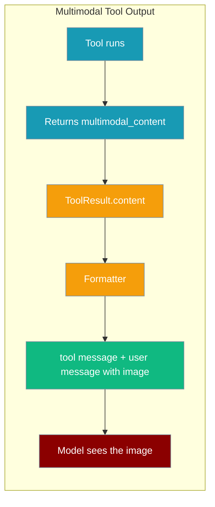
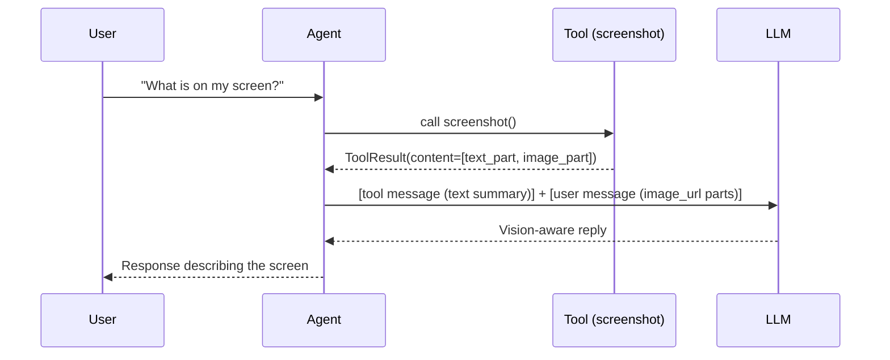

Tools can now return images and files that become visible to the model on the next turn — enabling screenshot tools, chart renderers, PDF rasterisers, and any tool that produces visual output to feed vision-capable models directly.



## Quick Start

<Steps>
<Step title="Install and set up">
```bash
pip install praisonaiagents
export OPENAI_API_KEY=your_key_here
```
</Step>

<Step title="Write a tool that returns an image">
```python
from praisonaiagents import Agent
from praisonaiagents.tools import multimodal_content, text_part, image_part

def screenshot() -> "ToolResult":
    png = capture()  # your screen-capture impl
    return multimodal_content(
        text_part("Here is the current screen:"),
        image_part(png, mime="image/png", name="screen.png"),
    )

agent = Agent(
    name="Screen Assistant",
    instructions="Help the user by capturing and analysing the screen.",
    tools=[screenshot],
    llm="gpt-4o",  # vision-capable model required
)

agent.start("What is on my screen right now?")
```
</Step>

<Step title="Run">
```bash
python app.py
```

The model receives the screenshot and responds with an analysis of what it sees.
</Step>
</Steps>

## How It Works

When a tool returns multimodal content, the framework emits **two messages** rather than one. Most LLM providers reject images inside a `tool` role message, so the formatter separates them:



The `tool` message satisfies the `tool_call_id` contract required by the provider. The follow-up `user` message carries the actual image using the same `image_url` data-URI encoding used for input attachments, so encoding is consistent across the board.

Plain text/JSON tool returns are **unchanged** — multimodal is entirely opt-in.

## Content Parts

Build structured results using the four helpers:

| Helper | What it creates | Required fields |
|--------|----------------|-----------------|
| `text_part(text)` | `{"type": "text", "text": "..."}` | `text` |
| `image_part(data, mime, name)` | `{"type": "image", "data": <base64>, "mime": "...", "name": "..."}` | `data` or `url` |
| `image_part(url=...)` | `{"type": "image", "url": "https://..."}` | `url` |
| `file_part(data, mime, name)` | `{"type": "file", "data": ..., "mime": "...", "name": "..."}` | `data` or `url` |

Combine them with `multimodal_content()`:

```python
from praisonaiagents.tools import multimodal_content, text_part, image_part, file_part

# Image from bytes
return multimodal_content(
    text_part("Chart generated:"),
    image_part(png_bytes, mime="image/png", name="chart.png"),
)

# Image from URL
return multimodal_content(
    image_part(url="https://example.com/result.png"),
)

# File reference
return multimodal_content(
    text_part("Report attached:"),
    file_part(pdf_bytes, mime="application/pdf", name="report.pdf"),
)
```

You can also pass raw bytes or a pre-encoded base64 string to `image_part` — the formatter handles both.

## Common Patterns

<Tabs>
<Tab title="Screenshot Tool">
```python
from praisonaiagents import Agent
from praisonaiagents.tools import multimodal_content, text_part, image_part
import base64

def take_screenshot() -> "ToolResult":
    # Using any screenshot library
    import subprocess
    subprocess.run(["scrot", "/tmp/shot.png"])
    with open("/tmp/shot.png", "rb") as f:
        png_bytes = f.read()
    return multimodal_content(
        text_part("Screenshot captured:"),
        image_part(png_bytes, mime="image/png", name="shot.png"),
    )

agent = Agent(
    name="Desktop Agent",
    instructions="Analyse the screen and describe what you see.",
    tools=[take_screenshot],
    llm="gpt-4o",
)
agent.start("Take a screenshot and tell me what is open.")
```
</Tab>
<Tab title="Chart Renderer">
```python
from praisonaiagents import Agent
from praisonaiagents.tools import multimodal_content, text_part, image_part
import io

def render_chart(data: list) -> "ToolResult":
    import matplotlib.pyplot as plt
    fig, ax = plt.subplots()
    ax.bar(range(len(data)), data)
    buf = io.BytesIO()
    fig.savefig(buf, format="png")
    buf.seek(0)
    return multimodal_content(
        text_part(f"Bar chart of {len(data)} data points:"),
        image_part(buf.read(), mime="image/png", name="chart.png"),
    )

agent = Agent(
    name="Data Analyst",
    instructions="Analyse data and create visualisations.",
    tools=[render_chart],
    llm="gpt-4o",
)
agent.start("Chart these values: [42, 17, 65, 28, 91]")
```
</Tab>
<Tab title="PDF Rasteriser">
```python
from praisonaiagents import Agent
from praisonaiagents.tools import multimodal_content, text_part, image_part

def render_pdf_page(path: str, page: int = 0) -> "ToolResult":
    import fitz  # PyMuPDF
    doc = fitz.open(path)
    pix = doc[page].get_pixmap(dpi=150)
    return multimodal_content(
        text_part(f"Page {page + 1} of {path}:"),
        image_part(pix.tobytes("png"), mime="image/png", name=f"page_{page+1}.png"),
    )

agent = Agent(
    name="PDF Reader",
    instructions="Read and summarise PDF documents.",
    tools=[render_pdf_page],
    llm="gpt-4o",
)
agent.start("Summarise page 1 of /docs/report.pdf")
```
</Tab>
</Tabs>

## MCP Tool Compatibility

MCP tools that return image or blob blocks are **auto-detected** — no code changes needed.

The framework recognises MCP-style blocks like:

```json
{"type": "image", "data": "...", "mimeType": "image/png"}
{"type": "blob", "data": "...", "mimeType": "application/pdf"}
```

and normalises them to the same content-part schema. If you are using MCP tools with a vision-capable model, multimodal output just works.

## Limits & Safety

<AccordionGroup>
<Accordion title="Image size cap (~5 MB)">
Image bytes are bounded at **5,000,000 bytes** (roughly 5 MB of base64, ~3.75 MB raw) to protect the context window. Images that exceed this limit are silently skipped and a warning is logged. Resize or compress images before returning them if they may exceed this threshold.
</Accordion>
<Accordion title="Binary data bypasses trust-wrap and truncation">
Multimodal results skip the normal prompt-injection fence (`trust_wrap`) and output-truncation pipeline. This is intentional: binary image data must not be stringified or truncated. Text parts inside a multimodal result that come from external (untrusted) tools are still individually fenced.
</Accordion>
<Accordion title="Files are summarised, not inlined">
File parts (`file_part`) are rendered as `[file: name (mime)]` text summaries in the follow-up message. Most providers cannot ingest arbitrary binary files inline; use image parts for content you want the model to visually inspect.
</Accordion>
<Accordion title="Vision-capable model required">
The model must support vision inputs (e.g. `gpt-4o`, `claude-3-5-sonnet`, `gemini-1.5-pro`). Text-only models receive the text summary from the `tool` message and never see the image.
</Accordion>
</AccordionGroup>

## Backward Compatibility

Only `ToolResult` instances with a non-empty `content` list, bare lists of part dicts that contain at least one image or file part, single part dicts with an image/file type, and MCP image/blob blocks trigger the multimodal path. Everything else — plain strings, dicts, numbers — follows the existing single `tool` message path unchanged.

```python
# Existing code — unchanged behaviour
def my_tool() -> str:
    return "some text result"

# New opt-in path — multimodal
def my_tool() -> "ToolResult":
    return multimodal_content(
        text_part("summary"),
        image_part(png_bytes),
    )
```

## Related

<CardGroup cols={2}>
  <Card title="Multimodal Agents (input side)" icon="images" href="/docs/features/multimodal">
    Feed images and video to agents via `images=` and `attachments=`
  </Card>
  <Card title="Tools" icon="wrench" href="/docs/concepts/tools">
    How to write and register tools for agents
  </Card>
  <Card title="MCP Integration" icon="plug" href="/docs/concepts/mcp">
    Use MCP servers as tool providers
  </Card>
  <Card title="Interactive Approval" icon="shield-check" href="/docs/features/interactive-approval">
    Require human sign-off before sensitive tools run
  </Card>
</CardGroup>
