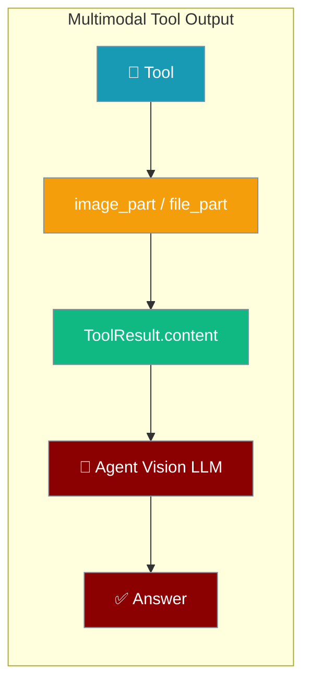
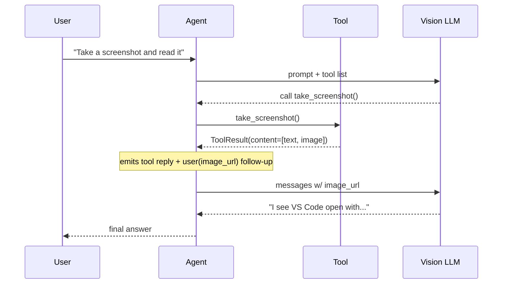

Tools can return images or files that the model sees on the next turn, not just text.



## Quick Start

<Steps>
<Step title="Install Package">
```bash
pip install praisonaiagents
```
</Step>

<Step title="Set API Key">
```bash
export OPENAI_API_KEY=your_api_key_here
```
</Step>

<Step title="Create a screenshot agent">
```python
from praisonaiagents import Agent
from praisonaiagents.tools import multimodal_content, text_part, image_part

def take_screenshot():
    png_bytes = open("screen.png", "rb").read()
    return multimodal_content(
        text_part("Here is the current screen:"),
        image_part(png_bytes, mime="image/png", name="screen.png"),
    )

agent = Agent(
    name="Screen Reader",
    instructions="Describe what is on the screen.",
    llm="gpt-4o",
    tools=[take_screenshot],
)

agent.start("Take a screenshot and tell me what app is open.")
```
</Step>

<Step title="Run">
```bash
python app.py
```
</Step>
</Steps>

<Tabs>
  <Tab title="Code">
```python
from praisonaiagents import Agent
from praisonaiagents.tools import multimodal_content, text_part, image_part

def take_screenshot():
    png_bytes = open("screen.png", "rb").read()
    return multimodal_content(
        text_part("Here is the current screen:"),
        image_part(png_bytes, mime="image/png", name="screen.png"),
    )

agent = Agent(
    name="Screen Reader",
    instructions="Describe what is on the screen.",
    llm="gpt-4o",
    tools=[take_screenshot],
)

agent.start("Take a screenshot and tell me what app is open.")
```
  </Tab>
  <Tab title="No Code (YAML)">
```yaml
framework: praisonai
process: sequential
topic: screenshot analysis
agents:
  screen_reader:
    name: Screen Reader
    instructions: Describe what is on the screen.
    llm: gpt-4o
    tools:
      - take_screenshot
```
  </Tab>
</Tabs>

---

## How It Works



The formatter emits **two messages** per multimodal tool result:
1. A `tool` role message satisfying the `tool_call_id` contract (text summary or fallback).
2. A follow-up `user` role message carrying the actual `image_url` / text parts.

Most providers reject media inside a `tool` role — this two-message pattern ensures compatibility.

---

## Content Parts Reference

Four helpers build content parts from `praisonaiagents.tools`:

| Helper | Signature | Returns |
|--------|-----------|---------|
| `multimodal_content(*parts, output=None, success=True)` | variadic parts + optional output | `ToolResult` |
| `text_part(text)` | `text: str` | `{"type": "text", "text": ...}` |
| `image_part(data=None, *, mime="image/png", name=None, url=None)` | bytes/base64 OR url | `{"type": "image", ...}` |
| `file_part(data=None, *, mime="application/octet-stream", name=None, url=None)` | bytes/base64 OR url | `{"type": "file", ...}` |

Import all helpers from `praisonaiagents.tools`:

```python
from praisonaiagents.tools import (
    multimodal_content,
    text_part,
    image_part,
    file_part,
    ToolResult,
)
```

`ToolResult` gains two new fields:

| Field | Type | Default | Description |
|-------|------|---------|-------------|
| `content` | `list[dict] \| None` | `None` | Ordered list of content parts (text/image/file) |
| `is_multimodal` | `bool` (property) | derived | `True` when `content` is non-empty |

---

## Supported Input Shapes

The formatter recognises four content shapes — tools can return any of them:

| Shape | Example |
|-------|---------|
| `ToolResult.content` | `multimodal_content(image_part(...))` |
| Bare list of dicts | `[{"type": "image", "data": ..., "mime": "image/png"}]` |
| Single dict | `{"type": "image", "url": "https://..."}` |
| MCP-style block | `{"type": "image", "data": ..., "mimeType": "image/png"}` |

The canonical part schemas:

```python
# Text part
{"type": "text", "text": "..."}

# Image part — raw bytes or base64 string
{"type": "image", "data": <bytes | base64 str>, "mime": "image/png", "name": "shot.png"}

# Image part — URL or data: URI
{"type": "image", "url": "https://... or data:image/png;base64,..."}

# File part (referenced as text; most providers can't ingest arbitrary binaries inline)
{"type": "file", "data": <bytes | base64>, "mime": "application/pdf", "name": "doc.pdf"}
```

<Note>
MCP tools that return `{"type": "image", "data": ..., "mimeType": "image/png"}` (note `mimeType` not `mime`) work natively without any adaptation.
</Note>

---

## Common Patterns

### URL-based image (no encoding overhead)

```python
from praisonaiagents import Agent
from praisonaiagents.tools import multimodal_content, image_part

def latest_chart():
    return multimodal_content(
        image_part(url="https://example.com/sales-today.png", mime="image/png"),
    )

agent = Agent(
    name="Chart Analyst",
    instructions="Analyse sales charts and summarise trends.",
    llm="gpt-4o",
    tools=[latest_chart],
)

agent.start("What does the latest sales chart show?")
```

### Chart renderer

```python
import io
import matplotlib.pyplot as plt
from praisonaiagents import Agent
from praisonaiagents.tools import multimodal_content, text_part, image_part

def render_bar_chart(labels: list, values: list):
    fig, ax = plt.subplots()
    ax.bar(labels, values)
    buf = io.BytesIO()
    fig.savefig(buf, format="png")
    plt.close(fig)
    return multimodal_content(
        text_part("Bar chart of the provided data:"),
        image_part(buf.getvalue(), mime="image/png", name="chart.png"),
    )

agent = Agent(
    name="Data Visualiser",
    instructions="Create and interpret charts.",
    llm="gpt-4o",
    tools=[render_bar_chart],
)

agent.start("Chart these sales figures: Q1=120, Q2=95, Q3=140, Q4=160")
```

### PDF rasteriser

```python
from praisonaiagents import Agent
from praisonaiagents.tools import multimodal_content, text_part, image_part, file_part

def extract_pdf_page(path: str, page: int = 0):
    import fitz  # PyMuPDF
    doc = fitz.open(path)
    pix = doc[page].get_pixmap(dpi=150)
    png_bytes = pix.tobytes("png")
    return multimodal_content(
        text_part(f"Page {page + 1} of {path}:"),
        image_part(png_bytes, mime="image/png", name=f"page_{page + 1}.png"),
    )

agent = Agent(
    name="PDF Reader",
    instructions="Extract and summarise content from PDF pages.",
    llm="gpt-4o",
    tools=[extract_pdf_page],
)

agent.start("What is on page 1 of report.pdf?")
```

### MCP-style passthrough

```python
from praisonaiagents import Agent

def mcp_image_tool():
    # Returned shape from an MCP server — handled natively
    return [
        {"type": "text", "text": "Logo"},
        {"type": "image", "data": "<base64>", "mimeType": "image/png"},
    ]

agent = Agent(
    name="MCP Agent",
    instructions="Use tools to fetch and describe images.",
    llm="gpt-4o",
    tools=[mcp_image_tool],
)

agent.start("Fetch the logo and describe it.")
```

---

## Limits & Safety

| Limit | Value | Behaviour |
|-------|-------|-----------|
| `MULTIMODAL_IMAGE_BYTE_LIMIT` | 5,000,000 bytes (~5 MB raw / ~3.75 MB encoded) | Images over the cap are **dropped with a warning** |
| External tool fencing | Automatic | Text parts from external/untrusted tools are wrapped in a prompt-injection fence |
| Trusted local tools | No fencing | Local tools are not fenced |

<Warning>
Always use a **vision-capable model** (e.g. `gpt-4o`, `claude-3-5-sonnet`, `gemini-1.5-pro`) when your tools return image parts. Text-only models will receive only the text summary.
</Warning>

Multimodal results bypass trust-wrapping and truncation so binary data is never stringified accidentally.

---

## Best Practices

<AccordionGroup>
<Accordion title="Use a vision-capable model">
Set `llm="gpt-4o"` or another vision model. Text-only models ignore image parts and only see the text summary.
</Accordion>

<Accordion title="Prefer URLs for large remote images">
Pass `url=` to `image_part()` instead of downloading bytes — it skips base64 encoding and avoids the 5 MB cap entirely.

```python
image_part(url="https://cdn.example.com/chart.png")
```
</Accordion>

<Accordion title="Set name= for traceability">
The `name=` kwarg on `image_part()` and `file_part()` labels the asset in logs and debug output, making it easier to trace which tool produced which image.

```python
image_part(data=bytes, mime="image/png", name="dashboard-2024-q4.png")
```
</Accordion>

<Accordion title="Return text alongside images">
Include a `text_part()` describing the image. The text part is used as a fallback summary for providers that don't support vision, and helps the model understand context before viewing the image.

```python
return multimodal_content(
    text_part("Sales dashboard for Q4 2024:"),
    image_part(chart_bytes, mime="image/png"),
)
```
</Accordion>
</AccordionGroup>

---

## Related

<CardGroup cols={2}>
  <Card title="Multimodal Agents (Input)" icon="images" href="./multimodal">
    Send images and media **to** agents using `images=` and `attachments=`
  </Card>
  <Card title="Tool Output Store" icon="database" href="./tool-output-store">
    Persist and retrieve tool outputs across agent runs
  </Card>
  <Card title="Runtime Tool Result Middleware" icon="webhook" href="./runtime-tool-result-middleware">
    Intercept and transform tool results at runtime
  </Card>
  <Card title="Image Generation" icon="wand-magic-sparkles" href="./image-generation">
    Generate images using AI models as a tool
  </Card>
</CardGroup>
