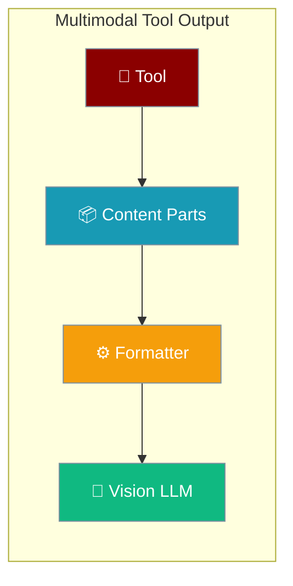
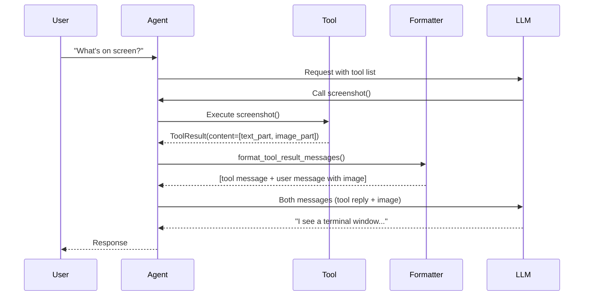
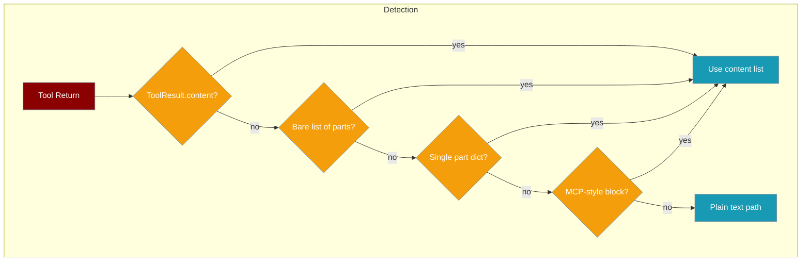

Tools can now return images, screenshots, and files that vision models see directly — not just text.



## Quick Start

<Steps>
<Step title="Return an image from a tool">

```python
from praisonaiagents import Agent
from praisonaiagents.tools import multimodal_content, text_part, image_part

def screenshot():
    png_bytes = open("screen.png", "rb").read()
    return multimodal_content(
        text_part("Here is the current screen:"),
        image_part(png_bytes, mime="image/png", name="screen.png"),
    )

agent = Agent(
    name="Vision Assistant",
    instructions="Use the screenshot tool when asked about what's on screen.",
    llm="gpt-4o",
    tools=[screenshot],
)

agent.start("What do you see on my screen right now?")
```
</Step>

<Step title="Use a URL instead of raw bytes">

```python
from praisonaiagents import Agent
from praisonaiagents.tools import multimodal_content, text_part, image_part

def fetch_chart():
    return multimodal_content(
        text_part("Here is the sales chart:"),
        image_part(url="https://example.com/chart.png", mime="image/png"),
    )

agent = Agent(
    name="Data Analyst",
    instructions="Analyse charts when provided.",
    llm="gpt-4o",
    tools=[fetch_chart],
)

agent.start("Show me the sales chart and summarise it.")
```
</Step>
</Steps>

---

## How It Works



The formatter emits **two messages** per multimodal result:
1. A `tool` message satisfying the `tool_call_id` contract.
2. A follow-up `user` message carrying the image — most providers reject images inside `tool` role messages.

---

## Content Parts

Three helper functions build content parts:

| Function | Purpose | Key Parameters |
|----------|---------|---------------|
| `text_part(text)` | Plain text part | `text: str` |
| `image_part(data, *, mime, name, url)` | Image from bytes or URL | `data` (bytes or base64), `mime="image/png"`, `name`, `url` |
| `file_part(data, *, mime, name, url)` | Generic file reference | `data` (bytes or base64), `mime="application/octet-stream"`, `name`, `url` |

```python
from praisonaiagents.tools import text_part, image_part, file_part

# From raw bytes
image_part(png_bytes, mime="image/png", name="screenshot.png")

# From URL
image_part(url="https://example.com/image.png")

# From data URI
image_part(url="data:image/png;base64,iVBORw0KGgo...")

# File reference (rendered as text hint to model)
file_part(pdf_bytes, mime="application/pdf", name="report.pdf")
```

### `ToolResult` with content

```python
from praisonaiagents.tools import multimodal_content, text_part, image_part, ToolResult

# Using the factory (recommended)
result = multimodal_content(
    text_part("Chart rendered:"),
    image_part(png_bytes, mime="image/png"),
)

# Or build ToolResult directly
result = ToolResult(
    output="Chart rendered",
    content=[
        text_part("Chart rendered:"),
        image_part(png_bytes, mime="image/png"),
    ]
)

result.is_multimodal  # True when content is non-empty
```

| Parameter | Type | Default | Description |
|-----------|------|---------|-------------|
| `output` | `Any` | required | Plain text/JSON output (unchanged behaviour) |
| `success` | `bool` | `True` | Whether the tool succeeded |
| `error` | `str` | `None` | Error message when `success=False` |
| `metadata` | `dict` | `None` | Free-form metadata |
| `content` | `list` | `None` | Ordered list of content parts (text/image/file) |

---

## Recognised Shapes

The formatter auto-detects multimodal results — no extra wiring needed:



**MCP-style blocks** (objects with `mimeType`) are normalised automatically:

```python
# MCP-style result — detected and normalised
{"type": "image", "data": "base64...", "mimeType": "image/png"}

# Equivalent canonical form
{"type": "image", "data": "base64...", "mime": "image/png"}
```

---

## Common Patterns

### Screenshot Tool

```python
from praisonaiagents.tools import multimodal_content, text_part, image_part

def take_screenshot():
    import subprocess, base64
    result = subprocess.run(["scrot", "-o", "/tmp/screen.png"])
    png = open("/tmp/screen.png", "rb").read()
    return multimodal_content(
        text_part("Current screen captured."),
        image_part(png, mime="image/png", name="screen.png"),
    )
```

### Chart Renderer

```python
from praisonaiagents.tools import multimodal_content, text_part, image_part
import io

def render_bar_chart(data: dict) -> "ToolResult":
    import matplotlib.pyplot as plt
    fig, ax = plt.subplots()
    ax.bar(list(data.keys()), list(data.values()))
    buf = io.BytesIO()
    fig.savefig(buf, format="png")
    plt.close(fig)
    return multimodal_content(
        text_part(f"Bar chart for {list(data.keys())}"),
        image_part(buf.getvalue(), mime="image/png", name="chart.png"),
    )
```

### PDF Page Rasteriser

```python
from praisonaiagents.tools import multimodal_content, text_part, image_part, file_part

def rasterise_pdf_page(path: str, page: int = 0) -> "ToolResult":
    import fitz  # PyMuPDF
    doc = fitz.open(path)
    pix = doc[page].get_pixmap()
    png = pix.tobytes("png")
    return multimodal_content(
        text_part(f"Page {page} of {path}:"),
        image_part(png, mime="image/png", name=f"page_{page}.png"),
    )
```

---

## Best Practices

<AccordionGroup>
<Accordion title="Stay within the ~5 MB image size limit">
The formatter automatically skips images larger than ~5 MB (raw bytes) or ~10 MB (base64) to protect the context window. Resize or compress images before returning them to stay within this limit.
</Accordion>

<Accordion title="Prefer URLs for large or remote media">
Passing `url=` sends only a URL to the model — no bytes enter the conversation history. Use this for large images already hosted on the web or your own server.

```python
image_part(url="https://cdn.example.com/report-chart.png")
```
</Accordion>

<Accordion title="Set the correct MIME type">
Vision models use the `mime` field to interpret the payload. Use `"image/png"` for PNG, `"image/jpeg"` for JPEG. Incorrect MIME types may cause the model to misinterpret or skip the image.
</Accordion>

<Accordion title="Use 'name' for downstream attribution">
Set `name` on image and file parts so the model can reference the asset by name in follow-up messages:

```python
image_part(png_bytes, mime="image/png", name="sales_q3.png")
# Model can then say: "In sales_q3.png, I see..."
```
</Accordion>
</AccordionGroup>

---

## Related

<CardGroup cols={2}>
<Card title="Tools" icon="wrench" href="/docs/concepts/tools">
  Learn how to create and register tools for agents
</Card>
<Card title="Multimodal" icon="image" href="/docs/features/multimodal">
  Agent-level vision and multimodal input handling
</Card>
</CardGroup>
