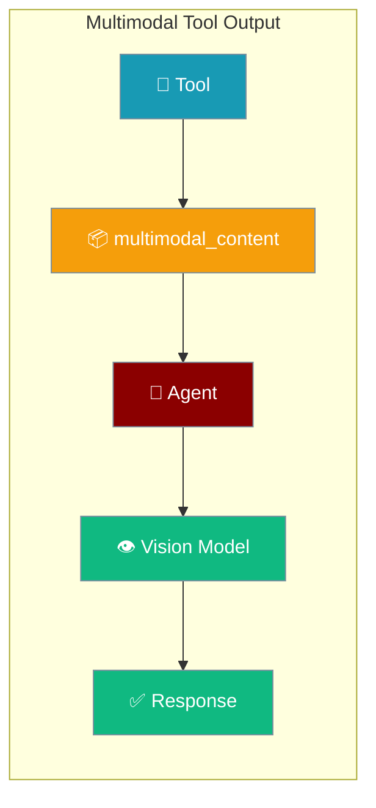
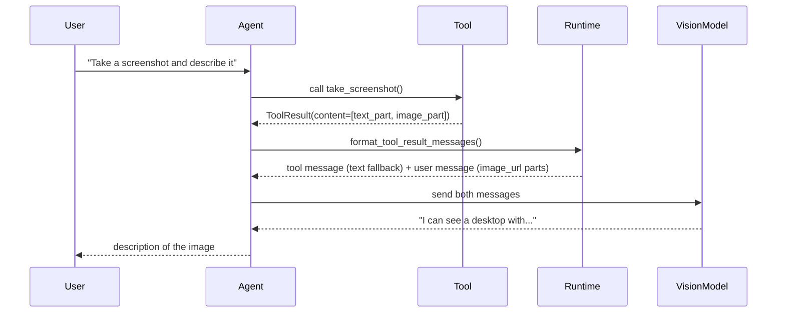
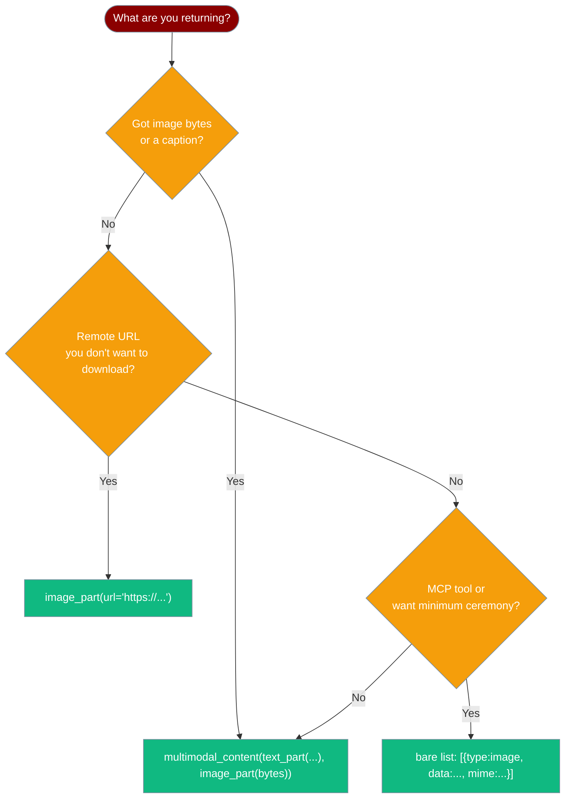

Let your tools hand back screenshots, charts, or rendered pages — the agent sees the picture, not a description of it.



## Quick Start

<Steps>
<Step title="Screenshot tool returning an image">

A `@tool`-decorated function captures a screenshot and hands the PNG bytes back to the agent. The vision model sees the actual image on the next turn.

```python
from praisonaiagents import Agent
from praisonaiagents.tools import tool, multimodal_content, text_part, image_part

@tool
def take_screenshot() -> dict:
    """Capture a screenshot and return it as an image the agent can see."""
    import subprocess, base64
    result = subprocess.run(
        ["python", "-c",
         "import PIL.ImageGrab; img = PIL.ImageGrab.grab(); "
         "import io; buf=io.BytesIO(); img.save(buf, 'PNG'); "
         "print(buf.getvalue().hex())"],
        capture_output=True, text=True
    )
    png_bytes = bytes.fromhex(result.stdout.strip())
    return multimodal_content(
        text_part("Here is the current screenshot:"),
        image_part(png_bytes),
    )

agent = Agent(
    instructions="You are a screen-reading assistant. Take a screenshot and describe what you see.",
    tools=[take_screenshot],
    llm="gpt-4o",
)

agent.start("Take a screenshot and describe what is on screen.")
```
</Step>

<Step title="Remote image via URL">

No downloading needed — pass `url=` directly and the model fetches it.

```python
from praisonaiagents import Agent
from praisonaiagents.tools import tool, multimodal_content, text_part, image_part

@tool
def fetch_chart(symbol: str) -> dict:
    """Return a stock chart image for the given symbol."""
    chart_url = f"https://charts.example.com/{symbol}.png"
    return multimodal_content(
        text_part(f"Stock chart for {symbol}:"),
        image_part(url=chart_url),
    )

agent = Agent(
    instructions="You are a financial analyst. Fetch charts and describe trends.",
    tools=[fetch_chart],
    llm="gpt-4o",
)

agent.start("Show me the chart for AAPL and describe the recent trend.")
```
</Step>

<Step title="Bare list (lightweight shape)">

Skip the helper — return a plain list of part-dicts. The runtime normalises it automatically.

```python
from praisonaiagents import Agent
from praisonaiagents.tools import tool

@tool
def render_diagram(code: str) -> list:
    """Render a Mermaid diagram and return the image."""
    import base64, io
    # ... render to PNG bytes ...
    png_bytes = b""  # replace with real rendering
    b64 = base64.b64encode(png_bytes).decode()
    return [
        {"type": "text", "text": "Rendered diagram:"},
        {"type": "image", "data": b64, "mime": "image/png"},
    ]

agent = Agent(
    instructions="Render diagrams and explain them.",
    tools=[render_diagram],
    llm="gpt-4o",
)

agent.start("Render a simple flowchart and explain what it shows.")
```
</Step>
</Steps>

---

## How It Works



The runtime emits **two messages** automatically:

1. A `tool` message satisfying the `tool_call_id` contract (containing a short text fallback).
2. A follow-up `user` message carrying the `image_url` parts.

This two-step delivery is required because most providers reject `image_url` parts inside `tool`-role messages. You don't need to do anything — it's automatic. When an assistant turn contains multiple tool calls, all `tool` replies stay consecutive and the media `user` message is appended only after the full batch flushes.

---

## Choosing the Return Shape



All four shapes are auto-detected by the runtime — pick whichever feels natural:

| Shape | When to use |
|-------|-------------|
| `multimodal_content(*parts)` | Recommended path — explicit, readable, type-safe |
| `image_part(url=...)` | Remote image you don't want to download locally |
| Bare list of part-dicts | Lighter-weight; good for simple cases or MCP passthrough |
| Single part-dict | One image with no caption |
| MCP-style block (`mimeType` key) | Runtime normalises `mimeType` → `mime` automatically |

---

## Configuration Options

There is no separate config class. Import the helpers from `praisonaiagents.tools`:

```python
from praisonaiagents.tools import multimodal_content, text_part, image_part, file_part, ToolResult
```

| Helper | Arguments | Returns |
|--------|-----------|---------|
| `multimodal_content(*parts, output=None, success=True)` | One or more part-dicts | `ToolResult` with `is_multimodal=True` |
| `text_part(text)` | `text: str` | `{"type": "text", "text": ...}` |
| `image_part(data=None, *, mime="image/png", name=None, url=None)` | bytes / base64 str / data URI in `data`, or remote `url=` | image part-dict |
| `file_part(data=None, *, mime="application/octet-stream", name=None, url=None)` | Same as `image_part` | file part-dict |
| `ToolResult(output, success=True, error=None, metadata=None, content=None)` | Direct construction | `ToolResult`; set `content` list to enable multimodal |

`image_part` accepts **any** of:
- Raw `bytes`
- Base64 `str`
- A `data:` URI string
- A remote `url=` keyword argument

---

## Common Patterns

### Screenshot tool

```python
from praisonaiagents import Agent
from praisonaiagents.tools import tool, multimodal_content, text_part, image_part
import io

@tool
def screenshot(region: str = "full") -> dict:
    """Capture a screenshot and return it so the agent can see the screen."""
    try:
        from PIL import ImageGrab, Image
        img = ImageGrab.grab()
        # Resize to keep under 5 MB limit
        img.thumbnail((1280, 800), Image.LANCZOS)
        buf = io.BytesIO()
        img.save(buf, format="PNG", optimize=True)
        png_bytes = buf.getvalue()
        return multimodal_content(
            text_part(f"Screenshot ({region}):"),
            image_part(png_bytes),
        )
    except Exception as e:
        return {"error": str(e)}

agent = Agent(
    instructions="You are a UI assistant. Screenshot the screen and describe the UI.",
    tools=[screenshot],
    llm="gpt-4o",
)
agent.start("What application is currently open?")
```

### Chart renderer (matplotlib → PNG)

```python
from praisonaiagents import Agent
from praisonaiagents.tools import tool, multimodal_content, text_part, image_part
import io

@tool
def plot_chart(data: str) -> dict:
    """Plot a bar chart from comma-separated values and return the image."""
    import matplotlib
    matplotlib.use("Agg")
    import matplotlib.pyplot as plt

    values = [float(x) for x in data.split(",")]
    fig, ax = plt.subplots(figsize=(6, 4))
    ax.bar(range(len(values)), values)
    buf = io.BytesIO()
    fig.savefig(buf, format="png", dpi=100, bbox_inches="tight")
    plt.close(fig)
    png_bytes = buf.getvalue()

    return multimodal_content(
        text_part(f"Bar chart for values: {data}"),
        image_part(png_bytes),
    )

agent = Agent(
    instructions="Plot charts and analyse trends in the data.",
    tools=[plot_chart],
    llm="gpt-4o",
)
agent.start("Plot 10,25,15,40,30 and describe the trend.")
```

### MCP image passthrough

MCP servers often return image blocks with a `mimeType` key. Return the block as-is — the runtime normalises `mimeType` → `mime` automatically.

```python
from praisonaiagents import Agent
from praisonaiagents.tools import tool

@tool
def mcp_screenshot() -> dict:
    """Return an MCP-style image content block directly."""
    import base64
    # MCP servers return blocks like this:
    mcp_block = {
        "type": "image",
        "data": base64.b64encode(b"...png bytes...").decode(),
        "mimeType": "image/png",   # note: mimeType, not mime
    }
    return mcp_block   # runtime normalises it — no extra wrapping needed

agent = Agent(
    instructions="Use the MCP screenshot tool and describe what you see.",
    tools=[mcp_screenshot],
    llm="gpt-4o",
)
agent.start("Take a screenshot using MCP and describe the screen.")
```

---

## Best Practices

<AccordionGroup>
<Accordion title="Keep images under 5 MB">
The runtime enforces a **5 MB cap per image part** (`MULTIMODAL_IMAGE_BYTE_LIMIT = 5_000_000`). Images over this limit are silently dropped with a warning — the model only sees the text fallback.

Resize before returning:

```python
from PIL import Image
import io

def resize_to_safe(img: Image.Image, max_bytes: int = 4_000_000) -> bytes:
    """Resize image until it fits under the byte limit."""
    quality = 90
    scale = 1.0
    while True:
        buf = io.BytesIO()
        w, h = int(img.width * scale), int(img.height * scale)
        resized = img.resize((w, h), Image.LANCZOS)
        resized.save(buf, "PNG", optimize=True)
        data = buf.getvalue()
        if len(data) <= max_bytes or scale < 0.2:
            return data
        scale *= 0.8
```
</Accordion>

<Accordion title="Use a vision-capable LLM">
Image parts are only perceived by models that support vision. Use:
- `gpt-4o` / `gpt-4o-mini` (OpenAI)
- `claude-3-5-sonnet-20241022` or any Claude 3+ model (Anthropic)
- `gemini-1.5-pro` / `gemini-1.5-flash` (Google)

Plain text models only see the text fallback string — they do not raise an error.

```python
agent = Agent(
    instructions="...",
    tools=[take_screenshot],
    llm="gpt-4o",   # vision-capable
)
```
</Accordion>

<Accordion title="Always include a text caption alongside the image">
A caption improves grounding and is the only signal a non-vision model gets. Always pair `image_part` with `text_part`:

```python
return multimodal_content(
    text_part("Screenshot of the dashboard at 14:32:"),   # ← always include
    image_part(png_bytes),
)
```

This also helps when the image is dropped due to the 5 MB cap — the agent still gets useful context.
</Accordion>

<Accordion title="Files aren't pixels">
`file_part` is currently surfaced to the model as a text annotation `[file: name (mime)]`. Most LLM providers cannot ingest arbitrary binary files inline.

For PDFs or other documents you want the model to *see*, rasterise to images first:

```python
from pdf2image import convert_from_bytes
import io

def pdf_to_image(pdf_bytes: bytes) -> bytes:
    """Convert first page of PDF to PNG."""
    images = convert_from_bytes(pdf_bytes, first_page=1, last_page=1)
    buf = io.BytesIO()
    images[0].save(buf, "PNG")
    return buf.getvalue()

return multimodal_content(
    text_part("First page of the PDF document:"),
    image_part(pdf_to_image(pdf_bytes)),   # image, not file_part
)
```
</Accordion>
</AccordionGroup>

---

## Security

<Note>
Text parts returned by external or untrusted tools are automatically wrapped in a prompt-injection fence — the same protection used for text-only tool output. You don't need to do anything, but know that if you mark a tool as external, its text parts will be fenced before the model sees them.
</Note>

---

## Related

<CardGroup cols={2}>
  <Card title="Multimodal Agents" icon="images" href="./multimodal">
    Send images **to** the agent via `Task(images=[...])` or `agent.chat(attachments=[...])` — the symmetric direction.
  </Card>
  <Card title="Image Generation" icon="wand-magic-sparkles" href="./image-generation">
    Generate new images with AI models and use them in agent workflows.
  </Card>
</CardGroup>
