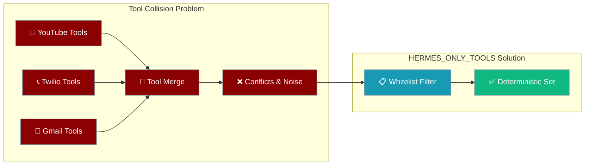
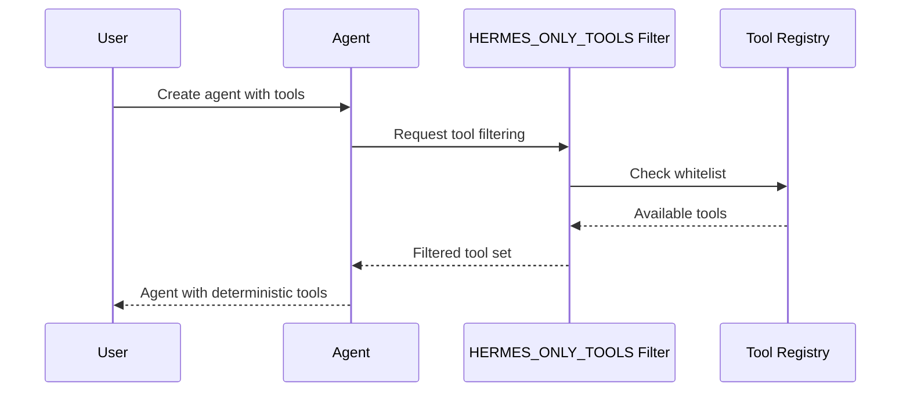
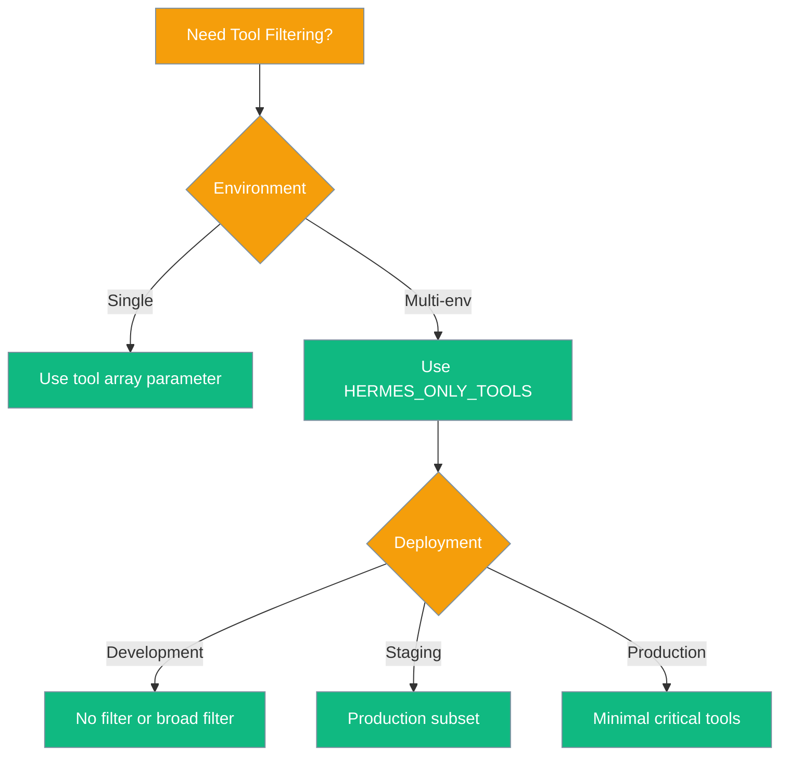

Multi-environment agent setups create tool conflicts when different capabilities overlap or shadow each other. HERMES_ONLY_TOOLS provides deterministic tool filtering for production deployments.



## Quick Start

<Steps>
<Step title="Basic Filtering">
Filter to specific tools in multi-env setups:

```python
import os
from praisonaiagents import Agent

# Set environment variable before agent creation
os.environ["HERMES_ONLY_TOOLS"] = "web_search,send_email,file_read"

agent = Agent(
    name="Focused Agent",
    instructions="Use only whitelisted tools for task execution",
    tools=["web_search", "send_email", "file_read", "other_tool"]  # other_tool filtered out
)

result = agent.start("Search web and send summary email")
```
</Step>

<Step title="Multi-Environment Setup">
Prevent tool shadowing in complex environments:

```python
import os
from praisonaiagents import Agent

# Environment with overlapping tool sets
os.environ["HERMES_ONLY_TOOLS"] = "youtube_search,gmail_send,file_manager"

# Agent will only see whitelisted tools despite multiple imports
agent = Agent(
    name="Multi-Env Agent",
    instructions="Execute tasks with filtered tool catalog",
    # Multiple tool sources loaded but filtered
    tools="auto"  # Auto-discovery filtered by whitelist
)

agent.start("Search YouTube and email results")
```
</Step>
</Steps>

---

## How It Works



| Stage | Description | Example |
|-------|-------------|---------|
| **Registration** | Tools register with full names | `web_search`, `send_twilio_sms`, `gmail_send` |
| **Filtering** | HERMES_ONLY_TOOLS whitelist applied | `"web_search,gmail_send"` |
| **Selection** | Only whitelisted tools available | `web_search` ✅, `send_twilio_sms` ❌, `gmail_send` ✅ |

---

## Configuration Options

### Environment Variable Format

```bash
# Comma-separated tool names (exact spelling)
export HERMES_ONLY_TOOLS="tool1,tool2,tool3"

# Case-sensitive matching
export HERMES_ONLY_TOOLS="web_search,file_read,send_email"

# Empty = no filtering (all tools available)
export HERMES_ONLY_TOOLS=""
```

### Discovery Commands

Check tool filtering status:

```python
import os
from praisonaiagents import Agent

# Check current filter
current_filter = os.environ.get("HERMES_ONLY_TOOLS", "")
print(f"Current filter: {current_filter}")

# Create agent to see filtered tools
agent = Agent(name="Test", instructions="Test agent")
available_tools = [tool.name for tool in agent.tools]
print(f"Available tools: {available_tools}")
```

---

## Common Patterns

### Pattern 1: Environment-Specific Filtering

```python
import os
from praisonaiagents import Agent

# Development: All tools
if os.environ.get("ENV") == "development":
    os.environ["HERMES_ONLY_TOOLS"] = ""

# Production: Critical tools only  
elif os.environ.get("ENV") == "production":
    os.environ["HERMES_ONLY_TOOLS"] = "web_search,send_email,file_read"

agent = Agent(
    name="Environment Agent",
    instructions="Execute with environment-appropriate tools"
)
```

### Pattern 2: Capability-Based Filtering

```python
import os
from praisonaiagents import Agent

# Research-focused agent
os.environ["HERMES_ONLY_TOOLS"] = "web_search,arxiv_search,wikipedia_search"

research_agent = Agent(
    name="Research Assistant",
    instructions="Conduct research using approved search tools"
)

# Communication-focused agent
os.environ["HERMES_ONLY_TOOLS"] = "send_email,send_sms,slack_message"

comm_agent = Agent(
    name="Communication Assistant", 
    instructions="Handle communications using approved channels"
)
```

### Pattern 3: Incremental Rollout

```python
import os
from praisonaiagents import Agent

# Phase 1: Core tools
core_tools = ["web_search", "file_read", "send_email"]

# Phase 2: Add experimental tools
experimental_tools = core_tools + ["ai_image_gen", "code_executor"]

# Set based on rollout phase
phase = os.environ.get("ROLLOUT_PHASE", "1")
if phase == "1":
    os.environ["HERMES_ONLY_TOOLS"] = ",".join(core_tools)
elif phase == "2":
    os.environ["HERMES_ONLY_TOOLS"] = ",".join(experimental_tools)

agent = Agent(name="Rollout Agent", instructions="Use phase-appropriate tools")
```

---

## Best Practices

<AccordionGroup>
<Accordion title="Use Exact Tool Names">
HERMES_ONLY_TOOLS requires exact spelling matching registration names. Typos silently drop tools from availability.

```python
# ✅ Correct - exact tool names
os.environ["HERMES_ONLY_TOOLS"] = "web_search,file_read,send_email"

# ❌ Wrong - typos cause tools to be filtered out
os.environ["HERMES_ONLY_TOOLS"] = "websearch,file-read,sendemail"
```
</Accordion>

<Accordion title="Set Before Agent Creation">
Environment variables must be set before creating agents. Runtime changes don't affect existing agents.

```python
import os
from praisonaiagents import Agent

# ✅ Set before agent creation
os.environ["HERMES_ONLY_TOOLS"] = "web_search,file_read"
agent = Agent(name="Test")  # Gets filtered tools

# ❌ Setting after creation has no effect
agent2 = Agent(name="Test2")  # Gets all tools
os.environ["HERMES_ONLY_TOOLS"] = "web_search"  # Ignored for agent2
```
</Accordion>

<Accordion title="Monitor Tool Availability">
Log or validate that required tools are available after filtering to catch configuration issues.

```python
import os
import logging
from praisonaiagents import Agent

os.environ["HERMES_ONLY_TOOLS"] = "web_search,send_email"

agent = Agent(name="Monitor Agent")
available_tools = [tool.name for tool in agent.tools]

required_tools = ["web_search", "send_email"]
missing_tools = [t for t in required_tools if t not in available_tools]

if missing_tools:
    logging.error(f"Missing required tools: {missing_tools}")
    raise ValueError(f"Required tools not available: {missing_tools}")
```
</Accordion>

<Accordion title="Use for Production Deployments">
HERMES_ONLY_TOOLS is designed for production where deterministic behavior is critical. Consider cost, security, and reliability implications.

```python
# Production configuration
PRODUCTION_TOOLS = [
    "web_search",      # Core research
    "send_email",      # Communication  
    "file_read",       # Data access
    "schedule_task"    # Workflow
]

# Set in deployment config
os.environ["HERMES_ONLY_TOOLS"] = ",".join(PRODUCTION_TOOLS)
```
</Accordion>
</AccordionGroup>

---

## Troubleshooting

### Missing Tool Errors

When agents try to use filtered tools:

```python
# Error scenario
os.environ["HERMES_ONLY_TOOLS"] = "web_search"

agent = Agent(name="Test")
# Agent tries to use 'send_email' but it's filtered out
result = agent.start("Search web and send email")  # Will fail or adapt
```

**Solutions:**
1. Add missing tool to whitelist: `"web_search,send_email"`
2. Update agent instructions to use only available tools
3. Check tool name spelling in whitelist

### Tool Discovery Issues

```python
import os
from praisonaiagents import Agent

# Debug tool availability
def debug_tools():
    # Check current filter
    filter_setting = os.environ.get("HERMES_ONLY_TOOLS", "No filter")
    print(f"HERMES_ONLY_TOOLS: {filter_setting}")
    
    # Create test agent
    agent = Agent(name="Debug Agent")
    available = [tool.name for tool in agent.tools]
    print(f"Available tools: {available}")
    
    return available

debug_tools()
```

### Name Matching Failures

Common tool name variations that cause mismatches:

| Registered Name | Common Mistakes | Result |
|----------------|----------------|---------|
| `web_search` | `websearch`, `web-search` | Tool filtered out |
| `send_email` | `sendemail`, `email_send` | Tool filtered out |
| `file_read` | `file-read`, `readfile` | Tool filtered out |

---

## Decision Guide

Choose the right filtering approach:



---

## Related

<CardGroup cols={2}>
<Card title="Tools Overview" icon="wrench" href="/docs/features/toolsets">
  Core tool system concepts
</Card>
<Card title="Agent Configuration" icon="gear" href="/docs/configuration/agent-config">
  Agent setup and configuration
</Card>
</CardGroup>