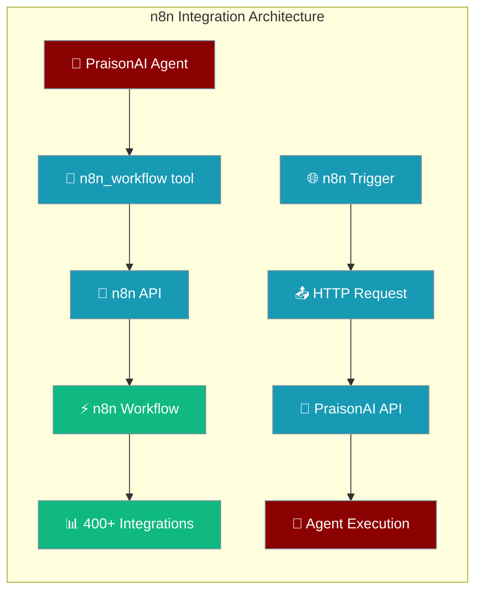
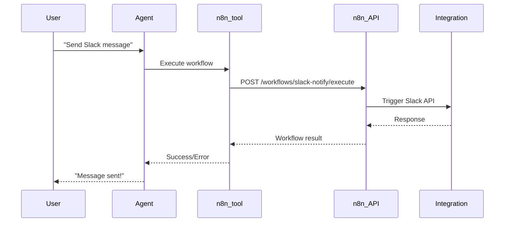

n8n integration enables bidirectional workflow automation, connecting PraisonAI agents to n8n's 400+ integrations including Slack, Gmail, Notion, databases, and APIs.



## Quick Start

<Steps>
<Step title="Install n8n Tools">
```bash
pip install "praisonai-tools[n8n]"
```
</Step>

<Step title="Set Up n8n Instance">
```bash
# Start n8n locally
docker run -it --rm --name n8n -p 5678:5678 -v n8n_data:/home/node/.n8n docker.n8n.io/n8nio/n8n

# Set environment variables
export N8N_URL="http://localhost:5678"
export N8N_API_KEY="your-api-key"  # Optional for local
```
</Step>

<Step title="Use in Agent">
```python
from praisonaiagents import Agent
from praisonai_tools.n8n import n8n_workflow

agent = Agent(
    name="automation-agent",
    instructions="Execute n8n workflows for automation tasks",
    tools=[n8n_workflow]
)

agent.start("Send a Slack message to #general saying Hello!")
```
</Step>
</Steps>

---

## How It Works



| Component | Purpose | Direction |
|-----------|---------|-----------|
| **PraisonAI → n8n** | Agents execute workflows via tools | Agent calls n8n |
| **n8n → PraisonAI** | Workflows invoke agents via API | n8n calls Agent |
| **Visual Editor** | Preview YAML workflows in n8n UI | Export/Import |

---

## Integration Directions

<CardGroup cols={2}>
  <Card title="Agents → n8n Workflows" icon="arrow-right" href="/docs/features/n8n-tools">
    Agents execute n8n workflows to access 400+ integrations
  </Card>
  <Card title="n8n → Agent API" icon="arrow-left" href="/docs/features/n8n-api">
    n8n workflows invoke PraisonAI agents via HTTP endpoints
  </Card>
  <Card title="Visual Workflow Editor" icon="eye" href="/docs/features/n8n-visual-editor">
    Export PraisonAI YAML workflows to n8n for visual editing
  </Card>
  <Card title="CLI Export Tools" icon="terminal" href="/docs/cli/n8n">
    Command-line tools for n8n workflow export and management
  </Card>
</CardGroup>

---

## Common Patterns

<Tabs>
<Tab title="Notification Workflows">
```python
from praisonaiagents import Agent
from praisonai_tools.n8n import n8n_workflow

notification_agent = Agent(
    name="notifier",
    instructions="Send notifications via various channels",
    tools=[n8n_workflow]
)

# Slack notification
notification_agent.start("Send deployment status to #deployments channel")

# Email notification  
notification_agent.start("Email the marketing team about campaign results")
```
</Tab>

<Tab title="Data Processing">
```python
from praisonaiagents import Agent
from praisonai_tools.n8n import n8n_workflow

data_agent = Agent(
    name="data-processor",
    instructions="Process data using n8n integrations",
    tools=[n8n_workflow]
)

# Google Sheets integration
data_agent.start("Add this sales data to the Q1 spreadsheet")

# Database operations
data_agent.start("Store customer feedback in PostgreSQL")
```
</Tab>

<Tab title="Multi-Step Automation">
```python
from praisonaiagents import Agent, Task, PraisonAIAgents
from praisonai_tools.n8n import n8n_workflow

# Multi-agent workflow with n8n
researcher = Agent(
    name="researcher",
    instructions="Research topics thoroughly",
    tools=[n8n_workflow]
)

publisher = Agent(
    name="publisher", 
    instructions="Publish content to multiple channels",
    tools=[n8n_workflow]
)

# Create coordinated workflow
team = PraisonAIAgents(
    agents=[researcher, publisher],
    process="sequential"
)
team.start("Research AI trends and publish to blog and social media")
```
</Tab>
</Tabs>

---

## Available Integrations

n8n provides 400+ integrations across multiple categories:

<AccordionGroup>
<Accordion title="Communication & Messaging">
- **Chat**: Slack, Discord, Microsoft Teams, Telegram, WhatsApp
- **Email**: Gmail, Outlook, SendGrid, Mailchimp
- **Video**: Zoom, Google Meet, Microsoft Teams
</Accordion>

<Accordion title="Productivity & Collaboration">
- **Documents**: Notion, Google Docs, Microsoft Office, Confluence
- **Spreadsheets**: Google Sheets, Excel, Airtable
- **Task Management**: Trello, Jira, Linear, Asana, Monday.com
</Accordion>

<Accordion title="Databases & Storage">
- **SQL Databases**: PostgreSQL, MySQL, SQL Server, Oracle
- **NoSQL**: MongoDB, Redis, Elasticsearch, DynamoDB
- **Cloud Storage**: Google Drive, Dropbox, AWS S3, Azure Blob
</Accordion>

<Accordion title="APIs & Development">
- **REST APIs**: HTTP Request node, GraphQL
- **Webhooks**: Trigger and receive webhooks
- **Git**: GitHub, GitLab, Bitbucket integration
</Accordion>
</AccordionGroup>

---

## Best Practices

<AccordionGroup>
<Accordion title="Error Handling">
Always handle workflow errors gracefully in your agent instructions:

```python
agent = Agent(
    name="robust-agent",
    instructions="""
    When executing n8n workflows:
    1. Check the result for errors
    2. Retry with different parameters if needed
    3. Provide clear feedback to the user
    4. Log important details for debugging
    """,
    tools=[n8n_workflow]
)
```
</Accordion>

<Accordion title="Environment Configuration">
Use environment variables for configuration:

```bash
# Production setup
export N8N_URL="https://n8n.yourcompany.com"
export N8N_API_KEY="your-production-api-key"

# Development setup  
export N8N_URL="http://localhost:5678"
# API key optional for local development
```
</Accordion>

<Accordion title="Workflow Organization">
Create focused, single-purpose workflows in n8n:

- **Good**: `slack-notify`, `email-send`, `database-insert`
- **Avoid**: `do-everything-workflow`

This makes workflows more reliable and easier to debug.
</Accordion>

<Accordion title="Security">
Never expose sensitive data in workflow inputs:

```python
# Good - use environment variables in n8n
result = n8n_workflow(
    workflow_id="secure-api-call",
    input_data={"endpoint": "https://api.example.com/data"}
)

# Avoid - don't pass API keys directly
# input_data={"api_key": "secret-key"}  # DON'T DO THIS
```
</Accordion>
</AccordionGroup>

---

## Related

<CardGroup cols={2}>
  <Card title="n8n Tools Reference" icon="wrench" href="/docs/features/n8n-tools">
    Complete API reference for n8n workflow tools
  </Card>
  <Card title="n8n API Integration" icon="code" href="/docs/features/n8n-api">
    HTTP endpoints for n8n to invoke PraisonAI agents
  </Card>
  <Card title="Visual Workflow Editor" icon="eye" href="/docs/features/n8n-visual-editor">
    Export and edit PraisonAI workflows in n8n UI
  </Card>
  <Card title="CLI n8n Commands" icon="terminal" href="/docs/cli/n8n">
    Command-line tools for n8n workflow management
  </Card>
</CardGroup>