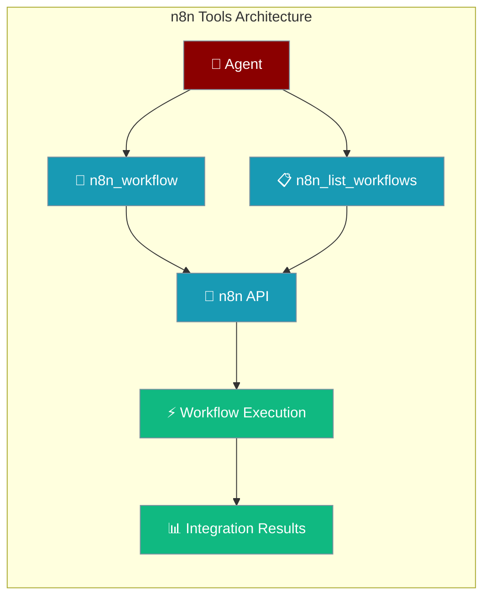

n8n tools enable PraisonAI agents to execute n8n workflows, providing access to 400+ integrations including Slack, Gmail, Notion, databases, and APIs.



## Quick Start

<Steps>
<Step title="Install n8n Tools">
```python
# Install with n8n support
pip install "praisonai-tools[n8n]"

# Or install httpx manually
pip install praisonai-tools httpx
```
</Step>

<Step title="Basic Usage">
```python
from praisonaiagents import Agent
from praisonai_tools.n8n import n8n_workflow

agent = Agent(
    name="automation-agent",
    instructions="Execute n8n workflows for automation tasks",
    tools=[n8n_workflow]
)

agent.start("Execute the slack-notify workflow to send a welcome message")
```
</Step>

<Step title="With Configuration">
```python
from praisonai_tools.n8n import n8n_workflow, n8n_list_workflows

# Direct tool usage
result = n8n_workflow(
    workflow_id="slack-notify",
    input_data={
        "channel": "#general",
        "message": "Hello from PraisonAI!"
    },
    n8n_url="http://localhost:5678",
    api_key="your-api-key"
)
```
</Step>
</Steps>

---

## Available Tools

### n8n_workflow

Execute an n8n workflow and return the result.

```python
from praisonai_tools.n8n import n8n_workflow

result = n8n_workflow(
    workflow_id="slack-notify",
    input_data={"message": "Hello World!"},
    wait_for_completion=True
)
```

**Parameters:**

| Parameter | Type | Default | Description |
|-----------|------|---------|-------------|
| `workflow_id` | `str` | Required | The n8n workflow ID to execute |
| `input_data` | `dict` | `None` | Input data to pass to the workflow |
| `n8n_url` | `str` | `http://localhost:5678` | n8n instance URL (or N8N_URL env var) |
| `api_key` | `str` | `None` | n8n API key (or N8N_API_KEY env var) |
| `timeout` | `float` | `60.0` | Request timeout in seconds |
| `wait_for_completion` | `bool` | `True` | Wait for workflow to complete before returning |

**Returns:**

```python
{
    "executionId": "execution-123",
    "status": "success",
    "data": [
        {
            "json": {"result": "Message sent successfully"}
        }
    ],
    "finished": True
}

# On error:
{
    "error": "HTTP 404: Workflow not found"
}
```

### n8n_list_workflows

List available n8n workflows.

```python
from praisonai_tools.n8n import n8n_list_workflows

workflows = n8n_list_workflows()
```

**Parameters:**

| Parameter | Type | Default | Description |
|-----------|------|---------|-------------|
| `n8n_url` | `str` | `http://localhost:5678` | n8n instance URL (or N8N_URL env var) |
| `api_key` | `str` | `None` | n8n API key (or N8N_API_KEY env var) |

**Returns:**

```python
{
    "data": [
        {
            "id": "workflow-123",
            "name": "Slack Notify",
            "active": True,
            "createdAt": "2026-04-16T12:00:00.000Z",
            "updatedAt": "2026-04-16T12:00:00.000Z"
        }
    ],
    "count": 1
}
```

---

## Environment Variables

Configure n8n connection through environment variables:

| Variable | Description | Default |
|----------|-------------|---------|
| `N8N_URL` | n8n instance URL | `http://localhost:5678` |
| `N8N_API_KEY` | n8n API key for authentication | None (optional for local) |

```bash
# Local development
export N8N_URL="http://localhost:5678"

# Production
export N8N_URL="https://n8n.yourcompany.com"
export N8N_API_KEY="your-api-key"
```

---

## Agent Examples

<Tabs>
<Tab title="Simple Automation Agent">
```python
from praisonaiagents import Agent
from praisonai_tools.n8n import n8n_workflow, n8n_list_workflows

agent = Agent(
    name="automation-agent",
    instructions="""
    You help users automate tasks using n8n workflows.
    
    Available actions:
    - List workflows to see what's available
    - Execute workflows with appropriate input data
    - Explain what each workflow does based on its name
    
    Always ask for clarification if workflow parameters are unclear.
    """,
    tools=[n8n_workflow, n8n_list_workflows],
    llm="gpt-4o-mini"
)

# Example usage
agent.start("Send a Slack message to #deployments saying 'Build completed'")
```
</Tab>

<Tab title="Data Processing Agent">
```python
from praisonaiagents import Agent
from praisonai_tools.n8n import n8n_workflow

data_agent = Agent(
    name="data-processor",
    instructions="""
    You process and transform data using n8n workflows.
    
    Capabilities:
    - Google Sheets integration
    - Database operations (PostgreSQL, MongoDB)
    - CSV processing
    - API data fetching
    - File transformations
    
    Format data appropriately for each workflow's requirements.
    """,
    tools=[n8n_workflow],
    llm="gpt-4o"
)

# Example usage
data_agent.start("Add this customer data to the CRM spreadsheet: John Doe, john@example.com, Premium Plan")
```
</Tab>

<Tab title="Multi-Platform Notifier">
```python
from praisonaiagents import Agent
from praisonai_tools.n8n import n8n_workflow

notifier = Agent(
    name="notification-agent",
    instructions="""
    You send notifications across multiple platforms using n8n workflows.
    
    Available channels:
    - Slack (channels and DMs)
    - Email (Gmail, Outlook)
    - Discord
    - Telegram
    - WhatsApp
    - Microsoft Teams
    
    Choose the appropriate channel based on urgency and content type.
    """,
    tools=[n8n_workflow],
    llm="gpt-4o-mini"
)

# Example usage
notifier.start("Notify the team about the server maintenance scheduled for tonight")
```
</Tab>
</Tabs>

---

## Workflow Integration Patterns

<AccordionGroup>
<Accordion title="Communication Workflows">
Common patterns for messaging and communication:

```python
# Slack notification
result = n8n_workflow(
    workflow_id="slack-notify",
    input_data={
        "channel": "#general",
        "message": "Deployment successful!",
        "username": "DeployBot"
    }
)

# Email with attachment
result = n8n_workflow(
    workflow_id="email-send",
    input_data={
        "to": "team@company.com",
        "subject": "Weekly Report",
        "body": "Please find the weekly report attached.",
        "attachment_url": "https://example.com/report.pdf"
    }
)
```
</Accordion>

<Accordion title="Data Integration Workflows">
Patterns for data processing and storage:

```python
# Google Sheets integration
result = n8n_workflow(
    workflow_id="sheets-append",
    input_data={
        "spreadsheet_id": "1BxiMVs0XRA5nFMdKvBdBZjgmUUqptlbs74OgvE2upms",
        "range": "Sheet1!A:E",
        "values": [["John Doe", "john@example.com", "2026-04-16", "Premium", "Active"]]
    }
)

# Database insertion
result = n8n_workflow(
    workflow_id="postgres-insert",
    input_data={
        "table": "customers",
        "data": {
            "name": "Jane Smith",
            "email": "jane@example.com",
            "plan": "Enterprise"
        }
    }
)
```
</Accordion>

<Accordion title="API Integration Workflows">
Patterns for external API calls:

```python
# REST API call with authentication
result = n8n_workflow(
    workflow_id="api-post",
    input_data={
        "endpoint": "https://api.example.com/users",
        "method": "POST",
        "data": {
            "name": "New User",
            "email": "user@example.com"
        }
    }
)

# GraphQL query
result = n8n_workflow(
    workflow_id="graphql-query",
    input_data={
        "query": """
        query GetUser($id: ID!) {
            user(id: $id) {
                name
                email
                profile {
                    avatar
                }
            }
        }
        """,
        "variables": {"id": "user123"}
    }
)
```
</Accordion>
</AccordionGroup>

---

## Error Handling

Handle workflow execution errors gracefully:

<Tabs>
<Tab title="Basic Error Handling">
```python
from praisonai_tools.n8n import n8n_workflow

result = n8n_workflow(
    workflow_id="slack-notify",
    input_data={"message": "Test message"}
)

if "error" in result:
    print(f"Workflow failed: {result['error']}")
else:
    print(f"Workflow succeeded: {result.get('status')}")
```
</Tab>

<Tab title="Agent Error Handling">
```python
from praisonaiagents import Agent
from praisonai_tools.n8n import n8n_workflow

agent = Agent(
    name="robust-agent",
    instructions="""
    When executing n8n workflows:
    
    1. Always check the result for errors
    2. If a workflow fails, try to understand why:
       - Invalid workflow ID?
       - Missing required input data?
       - n8n server unreachable?
    3. Provide helpful feedback to the user
    4. Suggest corrections when possible
    """,
    tools=[n8n_workflow]
)
```
</Tab>

<Tab title="Retry Logic">
```python
import time
from praisonai_tools.n8n import n8n_workflow

def execute_with_retry(workflow_id, input_data, max_retries=3):
    for attempt in range(max_retries):
        result = n8n_workflow(
            workflow_id=workflow_id,
            input_data=input_data,
            timeout=30.0
        )
        
        if "error" not in result:
            return result
            
        if "timeout" in result["error"].lower() and attempt < max_retries - 1:
            time.sleep(2 ** attempt)  # Exponential backoff
            continue
        else:
            return result
    
    return {"error": f"Failed after {max_retries} attempts"}
```
</Tab>
</Tabs>

---

## Best Practices

<AccordionGroup>
<Accordion title="Workflow Design">
Design n8n workflows for agent consumption:

- **Single Purpose**: Each workflow should do one thing well
- **Clear Inputs**: Define expected input data structure clearly
- **Consistent Outputs**: Return structured, predictable results
- **Error Handling**: Include error nodes to handle failures gracefully
</Accordion>

<Accordion title="Input Data Validation">
Validate input data before passing to workflows:

```python
def validate_slack_input(data):
    required = ["channel", "message"]
    missing = [key for key in required if key not in data]
    
    if missing:
        return {"error": f"Missing required fields: {missing}"}
    
    if not data["channel"].startswith("#"):
        data["channel"] = f"#{data['channel']}"
    
    return data

# Use in agent instructions
agent = Agent(
    name="slack-agent",
    instructions="Always validate Slack input data before executing workflows",
    tools=[n8n_workflow]
)
```
</Accordion>

<Accordion title="Security Considerations">
Keep sensitive data secure:

- Store API keys and secrets in n8n credential storage, not workflow inputs
- Use environment variables for configuration
- Validate and sanitize user inputs
- Limit workflow execution permissions appropriately
</Accordion>

<Accordion title="Performance Optimization">
Optimize workflow performance:

- Use `wait_for_completion=False` for fire-and-forget operations
- Set appropriate timeouts based on workflow complexity
- Cache workflow lists when possible
- Monitor execution times and optimize slow workflows
</Accordion>
</AccordionGroup>

---

## Related

<CardGroup cols={2}>
  <Card title="n8n Integration Overview" icon="diagram-project" href="/docs/features/n8n-integration">
    Complete guide to n8n integration architecture and setup
  </Card>
  <Card title="n8n API Reference" icon="code" href="/docs/features/n8n-api">
    HTTP endpoints for n8n to invoke PraisonAI agents
  </Card>
  <Card title="Visual Workflow Editor" icon="eye" href="/docs/features/n8n-visual-editor">
    Export and edit PraisonAI workflows in n8n UI
  </Card>
  <Card title="CLI n8n Commands" icon="terminal" href="/docs/cli/n8n">
    Command-line tools for n8n workflow management
  </Card>
</CardGroup>