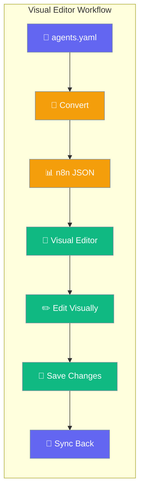
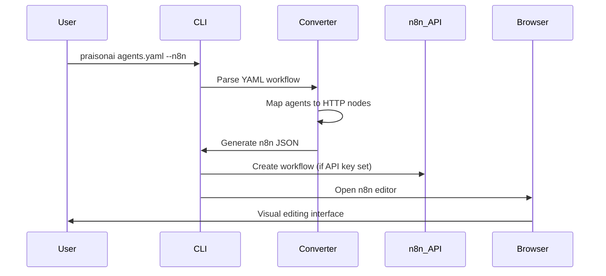

The n8n Visual Workflow Editor converts PraisonAI YAML workflows to n8n format, enabling visual editing and execution through n8n's drag-and-drop interface.



## Quick Start

<Steps>
<Step title="Export to n8n">
```bash
# Export PraisonAI workflow to n8n format
praisonai agents.yaml --n8n

# This creates agents_n8n.json and opens n8n in browser
```
</Step>

<Step title="Visual Editing">
```bash
# Open n8n workflow directly in browser for editing
praisonai n8n preview agents.yaml

# With custom n8n URL
praisonai n8n preview agents.yaml --n8n-url https://n8n.yourcompany.com
```
</Step>

<Step title="Import Back">
```bash
# Import modified n8n workflow back to YAML
praisonai n8n import workflow.json --output updated_agents.yaml

# Or sync changes from n8n
praisonai n8n pull workflow-id agents.yaml
```
</Step>
</Steps>

---

## How It Works



The converter transforms PraisonAI concepts into n8n components:

| PraisonAI Element | n8n Component | Purpose |
|-------------------|---------------|---------|
| **Workflow** | Workflow Container | Overall workflow structure |
| **Agents** | HTTP Request Nodes | Individual agent execution |
| **Sequential Steps** | Node Connections | Flow between agents |
| **Parallel Tasks** | Fan-out Connections | Concurrent agent execution |
| **Conditional Logic** | Switch Nodes | Decision-based routing |

---

## CLI Commands

### Export Commands

<Tabs>
<Tab title="Basic Export">
```bash
# Export to JSON file
praisonai n8n export agents.yaml

# Custom output file
praisonai n8n export agents.yaml --output my-workflow.json

# Include API server configuration
praisonai n8n export agents.yaml --api-url https://api.mycompany.com
```
</Tab>

<Tab title="Preview in Browser">
```bash
# Open in n8n for visual editing
praisonai n8n preview agents.yaml

# With specific n8n instance
praisonai n8n preview agents.yaml --n8n-url https://n8n.yourcompany.com:5678

# Auto-import with API key
export N8N_API_KEY="your-api-key"
praisonai n8n preview agents.yaml
```
</Tab>

<Tab title="Push to n8n">
```bash
# Create new workflow in n8n
praisonai n8n push agents.yaml

# Update existing workflow
praisonai n8n push agents.yaml workflow-id-123

# With custom name
praisonai n8n push agents.yaml --name "My Custom Workflow"
```
</Tab>
</Tabs>

### Import Commands

<Tabs>
<Tab title="Import from JSON">
```bash
# Convert n8n JSON back to YAML
praisonai n8n import workflow.json

# Custom output location
praisonai n8n import workflow.json --output converted_agents.yaml

# Preserve original structure
praisonai n8n import workflow.json --preserve-structure
```
</Tab>

<Tab title="Pull from n8n">
```bash
# Download workflow from n8n
praisonai n8n pull workflow-id-123 agents.yaml

# With API authentication
export N8N_API_KEY="your-api-key"
praisonai n8n pull workflow-id-123 agents.yaml

# Include execution history
praisonai n8n pull workflow-id-123 agents.yaml --include-executions
```
</Tab>

<Tab title="Sync Changes">
```bash
# Two-way sync between YAML and n8n
praisonai n8n sync agents.yaml workflow-id-123

# Conflict resolution
praisonai n8n sync agents.yaml workflow-id-123 --resolve local
praisonai n8n sync agents.yaml workflow-id-123 --resolve remote
```
</Tab>
</Tabs>

---

## Workflow Mapping Patterns

### Agent to Node Conversion

<AccordionGroup>
<Accordion title="Simple Sequential Workflow">
**PraisonAI YAML:**
```yaml
name: Research Pipeline
agents:
  researcher:
    name: Researcher
    instructions: Research the given topic
    tools: [tavily_search]
  writer:
    name: Writer
    instructions: Write content based on research
steps:
  - agent: researcher
  - agent: writer
```

**Generated n8n Workflow:**
- Webhook Trigger → HTTP Request (Researcher) → HTTP Request (Writer)
- Each HTTP node calls `/agents/{agent_id}/invoke`
- Output of one agent becomes input to the next
</Accordion>

<Accordion title="Parallel Agent Execution">
**PraisonAI YAML:**
```yaml
name: Multi-Source Analysis
agents:
  web_researcher: {name: Web Researcher}
  academic_researcher: {name: Academic Researcher}
  market_researcher: {name: Market Researcher}
parallel:
  - agent: web_researcher
  - agent: academic_researcher
  - agent: market_researcher
```

**Generated n8n Workflow:**
- Webhook Trigger → Fan-out to 3 parallel HTTP Request nodes
- All agents execute simultaneously
- Results can be merged with a Set node
</Accordion>

<Accordion title="Conditional Routing">
**PraisonAI YAML:**
```yaml
name: Smart Content Pipeline
agents:
  classifier: {name: Content Classifier}
  blog_writer: {name: Blog Writer}
  social_writer: {name: Social Media Writer}
route:
  - condition: "content_type == 'blog'"
    agent: blog_writer
  - condition: "content_type == 'social'"
    agent: social_writer
```

**Generated n8n Workflow:**
- Webhook → Classifier → Switch Node → Appropriate Writer
- Switch node routes based on classifier output
</Accordion>
</AccordionGroup>

### Advanced Pattern Mappings

<Tabs>
<Tab title="Loop Workflows">
**PraisonAI:**
```yaml
name: Iterative Improvement
agents:
  reviewer: {name: Content Reviewer}
  improver: {name: Content Improver}
loop:
  - agent: reviewer
  - agent: improver
  condition: "quality_score < 8"
  max_iterations: 5
```

**n8n Mapping:**
- Uses SplitInBatches node for iteration
- IF node checks quality score condition
- Loop back connection for iterations
</Tab>

<Tab title="Error Handling">
**PraisonAI:**
```yaml
name: Robust Pipeline
agents:
  processor: {name: Data Processor}
  fallback: {name: Fallback Handler}
error_handling:
  retry_count: 3
  fallback_agent: fallback
```

**n8n Mapping:**
- HTTP Request nodes with error workflow
- Set node for retry logic
- Fallback path using IF node
</Tab>

<Tab title="Webhook Integration">
**PraisonAI:**
```yaml
name: Event Driven Workflow
triggers:
  - webhook: "/process-data"
agents:
  processor: {name: Data Processor}
  notifier: {name: Notification Agent}
```

**n8n Mapping:**
- Webhook Trigger node with custom path
- HTTP Request nodes for agents
- Response node for webhook reply
</Tab>
</Tabs>

---

## Visual Editor Features

<CardGroup cols={2}>
  <Card title="Drag & Drop Interface" icon="hand">
    Visually connect and arrange agent nodes using n8n's intuitive interface
  </Card>
  <Card title="Real-time Testing" icon="play">
    Execute individual nodes or entire workflows to test functionality
  </Card>
  <Card title="Data Inspection" icon="magnifying-glass">
    View input/output data at each step for debugging and optimization
  </Card>
  <Card title="Version Control" icon="code-branch">
    Track changes and maintain different versions of your workflows
  </Card>
</CardGroup>

### Visual Editing Benefits

<AccordionGroup>
<Accordion title="Non-Developer Friendly">
- **Visual Flow**: See workflow logic as connected boxes
- **Easy Modifications**: Change connections without editing YAML
- **Immediate Feedback**: Test changes instantly in the editor
- **Documentation**: Visual diagrams serve as living documentation
</Accordion>

<Accordion title="Enhanced Debugging">
- **Step-by-Step Execution**: Run workflows node by node
- **Data Inspection**: See exact data passed between agents
- **Error Visualization**: Identify failure points visually
- **Performance Monitoring**: View execution times for optimization
</Accordion>

<Accordion title="Advanced Logic">
- **Conditional Branches**: Add complex IF/ELSE logic visually
- **Data Transformation**: Use Set nodes to modify data between agents
- **Error Handling**: Create error paths and retry logic
- **External Integrations**: Connect to 400+ n8n integrations
</Accordion>
</AccordionGroup>

---

## Configuration Options

### Environment Variables

| Variable | Description | Example |
|----------|-------------|---------|
| `N8N_URL` | n8n instance URL | `https://n8n.yourcompany.com` |
| `N8N_API_KEY` | API key for auto-import | `n8n_api_1234567890` |
| `PRAISONAI_API_URL` | PraisonAI API endpoint | `https://api.yourcompany.com` |

### Command-Line Options

```bash
# Export options
praisonai n8n export agents.yaml \
  --output custom_name.json \
  --api-url https://api.example.com \
  --include-metadata \
  --format pretty

# Import options
praisonai n8n import workflow.json \
  --output agents.yaml \
  --preserve-structure \
  --include-comments \
  --validate-agents

# Preview options
praisonai n8n preview agents.yaml \
  --n8n-url https://n8n.example.com \
  --auto-import \
  --activate-workflow \
  --open-browser
```

---

## Best Practices

<AccordionGroup>
<Accordion title="Workflow Design">
Design workflows for visual editing:

- **Clear Naming**: Use descriptive names for agents and workflows
- **Logical Flow**: Organize agents in left-to-right execution order
- **Error Paths**: Plan error handling routes in advance
- **Documentation**: Include descriptions for complex logic
</Accordion>

<Accordion title="Version Control">
Manage workflow versions effectively:

```bash
# Export before major changes
praisonai n8n export agents.yaml --output backup_v1.json

# Track changes with git
git add agents.yaml agents_n8n.json
git commit -m "feat: add error handling to research pipeline"

# Sync with n8n regularly
praisonai n8n sync agents.yaml workflow-id-123
```
</Accordion>

<Accordion title="Collaboration">
Enable team collaboration:

- **Shared n8n Instance**: Use centralized n8n server for team access
- **API Key Management**: Use service accounts for automation
- **Change Documentation**: Document modifications in n8n workflow descriptions
- **Regular Syncing**: Sync changes back to YAML for version control
</Accordion>

<Accordion title="Performance Optimization">
Optimize visual workflows:

- **Parallel Execution**: Use fan-out patterns for independent agents
- **Caching**: Add Set nodes to cache intermediate results
- **Timeouts**: Configure appropriate timeouts for long-running agents
- **Error Recovery**: Implement retry logic for unreliable operations
</Accordion>
</AccordionGroup>

---

## Related

<CardGroup cols={2}>
  <Card title="n8n Integration Overview" icon="diagram-project" href="/docs/features/n8n-integration">
    Complete guide to n8n integration architecture and setup
  </Card>
  <Card title="n8n Tools Reference" icon="wrench" href="/docs/features/n8n-tools">
    API reference for n8n workflow tools and functions
  </Card>
  <Card title="CLI n8n Commands" icon="terminal" href="/docs/cli/n8n">
    Complete CLI reference for n8n workflow management
  </Card>
  <Card title="n8n API Integration" icon="code" href="/docs/features/n8n-api">
    HTTP endpoints for n8n to invoke PraisonAI agents
  </Card>
</CardGroup>