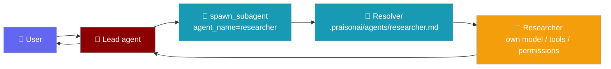
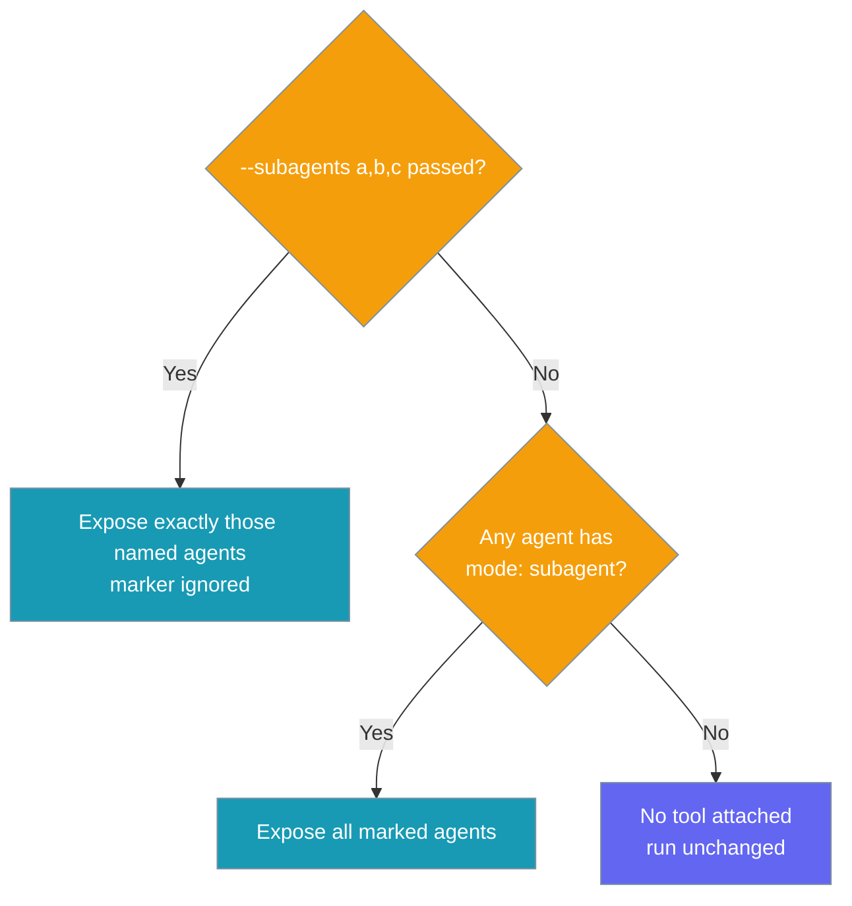
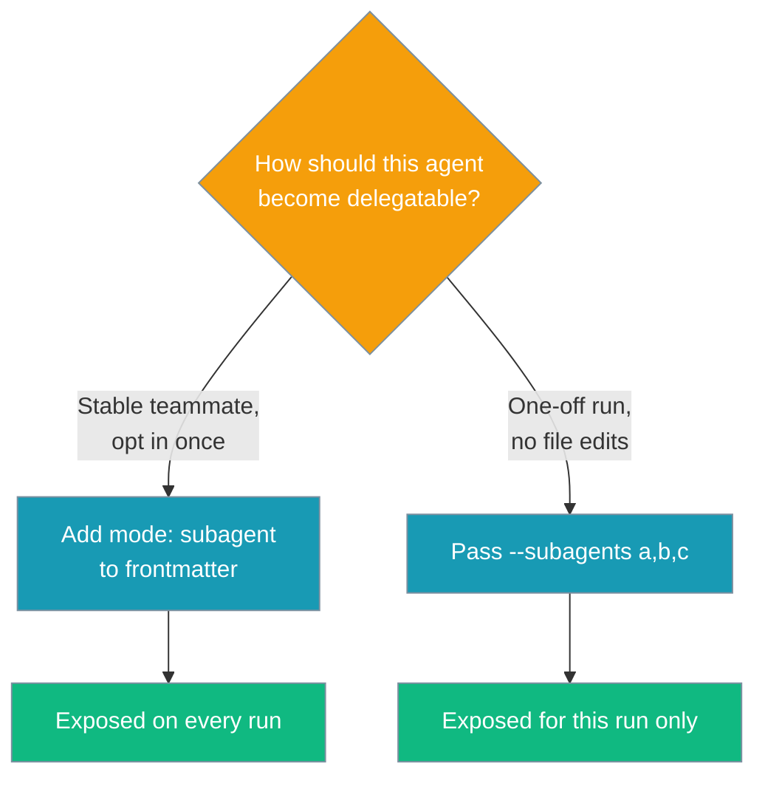

A running agent can delegate sub-tasks to your own named agents in `.praisonai/agents/*.md` — by name, mid-run, with no Python.

```bash
# .praisonai/agents/researcher.md carries `mode: subagent`
praisonai run --agent lead "Draft a market brief on WebAssembly adoption"
```

```markdown
<!-- .praisonai/agents/lead.md -->
---
model: gpt-4o
role: Team Lead
goal: Coordinate research and review, then write the final brief
---
You lead a small team. Delegate research and review to your teammates, then synthesise the result.
```

```markdown
<!-- .praisonai/agents/researcher.md -->
---
model: gpt-4o-mini
role: Research Specialist
goal: Gather accurate, cited facts on a topic
mode: subagent
tools:
  - web_search
---
You are a meticulous researcher. Provide concise, cited findings.
```

```markdown
<!-- .praisonai/agents/reviewer.md -->
---
model: gpt-4o
role: Editorial Reviewer
goal: Check drafts for accuracy and clarity
mode: subagent
---
You review drafts for accuracy, tone, and clarity. Suggest concrete edits.
```

Prefer to opt agents in per run instead of editing frontmatter? Use the `--subagents` allow-list:

```bash
praisonai run --agent lead --subagents researcher,reviewer "Draft and review a market brief on X"
```



A primary agent assembles a team: it hands specific sub-tasks to specific named agents (researcher, coder, reviewer, …) that already live in `.praisonai/agents/*.md`. Unlike a generic [`spawn_subagent`](/docs/features/subagent-tool) — which spins up an anonymous scoped worker — the delegatee here is a user-authored profile with its own model, tools, and permissions.

## Quick Start

<Steps>

<Step title="Mark an agent as delegatable">

Add `mode: subagent` to any agent's frontmatter. The agent's author opts it in once, and every run can delegate to it.

```markdown
<!-- .praisonai/agents/researcher.md -->
---
model: gpt-4o-mini
role: Research Specialist
mode: subagent
---
You are a meticulous researcher.
```

</Step>

<Step title="Or opt agents in from the CLI">

Pass `--subagents` to expose exact agents for a single run, no frontmatter changes required.

```bash
praisonai run --agent lead --subagents researcher,reviewer "Write a brief on X"
```

</Step>

<Step title="Run the primary agent">

```bash
praisonai run --agent lead "Draft a market brief on WebAssembly adoption"
```

The lead agent calls `spawn_subagent(agent_name="researcher")`, the resolver loads `researcher.md`, and the researcher runs under its own model, tools, and permissions.

</Step>

</Steps>

## How It Works

The primary agent picks a teammate by name; a resolver instantiates that agent from its Markdown definition and runs the sub-task.

```mermaid
sequenceDiagram
    participant User
    participant Primary as Primary Agent
    participant Tool as spawn_subagent
    participant Resolver as agent_resolver
    participant Named as Named Agent

    User->>Primary: "Draft and review a brief on X"
    Primary->>Tool: spawn_subagent(agent_name="researcher", task="...")
    Tool->>Resolver: resolve("researcher")
    Resolver->>Named: instantiate from .praisonai/agents/researcher.md
    Named->>Named: .chat(prompt) under own model/tools/permissions
    Named-->>Tool: result
    Tool-->>Primary: {output, agent_name: "researcher"}
    Primary-->>User: final brief

    classDef user fill:#6366F1,stroke:#7C90A0,color:#fff
    classDef agent fill:#8B0000,stroke:#7C90A0,color:#fff
    classDef tool fill:#189AB4,stroke:#7C90A0,color:#fff
    classDef named fill:#10B981,stroke:#7C90A0,color:#fff

    class User user
    class Primary agent
    class Tool,Resolver tool
    class Named named
```

---

## How delegation is chosen

Which agents become delegation targets depends on whether `--subagents` is set.



- Explicit `--subagents a,b,c` wins — any named agent can be opted in, ignoring `mode:`.
- Otherwise every agent whose frontmatter has `mode: subagent` is exposed.
- If neither yields anything, no `spawn_subagent` tool is attached — the run behaves exactly as before (backward compatible).

---

## Two ways to opt agents in

Choose per-agent frontmatter for stable teammates, or the CLI flag for ad-hoc runs.



| Route | Set where | Scope | Best for |
|-------|-----------|-------|----------|
| `mode: subagent` | Agent frontmatter | Every run | Stable teammates you always want available |
| `--subagents a,b,c` | CLI flag | Single run | Ad-hoc delegation without editing files |

When `--subagents` is passed, those exact names are exposed regardless of `mode`. When it is omitted, every agent whose frontmatter has `mode: subagent` is exposed. If neither yields any agent, the `spawn_subagent` tool is not wired at all and the run is identical to before.

## What the delegated agent inherits

Each named agent runs under **its own** `model`, `tools`, and `permissions` from its frontmatter. The primary agent does not override them.

| Generic `spawn_subagent` | Named agent delegation |
|--------------------------|------------------------|
| Parent chooses the model, tools, and permission mode per call | Each named agent brings its own `model`, `tools`, and `permissions` |
| Spawns a generic worker | Runs your pre-defined `.praisonai/agents/*.md` agent |

A named agent's `mode: subagent` marker never changes its permissions — it only marks the agent as delegatable (see [Delegatability vs permissions](#delegatability-vs-permissions)).

## How the model discovers them

The tool description lists each delegatable agent so the primary model can pick one by purpose:

```
You can delegate to these named agents by passing their name as agent_name
(each runs under its own model/tools/permissions):
- researcher: Gather accurate, cited facts on a topic
- reviewer: Check drafts for accuracy and clarity
```

Each line's text is the agent's `description`, falling back to `goal`, then `role`, then an empty string when none is set. Give every delegatable agent a clear `goal` or `description` so the primary model chooses the right teammate.

## Fallback behaviour

Delegation is purely additive — nothing changes when there is nothing to delegate to.

- **Unknown name:** if `agent_name` targets a name the resolver cannot find, the resolver returns `None` and the existing generic-spawn path runs instead.
- **No delegatable agents:** if no agent is marked `mode: subagent` and `--subagents` is omitted, the `spawn_subagent` tool is not wired at all — the run is byte-identical to before.

## Delegatability vs permissions

`mode: subagent` is a **delegatability marker**, not a permission mode. It is ignored (case-insensitive) when computing permissions, so it is never rejected as an unknown mode. Any other `mode` value — `read-only`, `plan`, `accept-edits` — still flows through the permission engine as before. See [Custom Agents & Commands](/docs/features/custom-agents-commands) for the full `mode` reference.

<Info>
To make a delegatable agent read-only, set `mode: read-only` **and** name it in `--subagents` (it no longer carries the `subagent` marker, so the CLI allow-list is how you keep it delegatable). A delegatable agent's `permission:` block is honoured — it is translated to an approval config on construction, so a scoped agent runs under its restrictions.
</Info>

```markdown
---
name: reviewer
model: gpt-4o-mini
mode: read-only
permission:
  bash:
    "git *": ask
    "*": deny
---
You are a meticulous code reviewer.
```

```bash
# read-only agents are opted in explicitly since they lack the subagent marker
praisonai run --agent lead --subagents researcher,reviewer "Draft and review a script"
```

## Configuration Options

| Option | Type | Default | Description |
|--------|------|---------|-------------|
| `agent_resolver` | `Callable[[str], Agent]` | `None` | SDK callback that returns a ready-to-run `Agent` for a name. When a passed `agent_name` resolves, that named agent runs the sub-task under its own model/tools/permissions. `None` preserves generic-spawn behaviour. |
| `resolvable_agents` | `Dict[str, str]` | `None` | SDK `{name: description}` map of delegatable agents; each entry enriches the tool description so the model can pick one. |
| `--subagents` | CLI flag | — | Comma-separated named agents (`.praisonai/agents/*.md`) the running agent may delegate to. Omit to expose agents marked `mode: subagent`. |

<Note>
`agent_resolver` and `resolvable_agents` are SDK parameters on [`create_subagent_tool`](/docs/features/subagent-tool). The CLI wires them for you from your `.praisonai/agents/` definitions — you only need `mode: subagent` or `--subagents`.
</Note>

## `--subagents` CLI flag

| Flag | Value | Behaviour |
|------|-------|-----------|
| `--subagents a,b,c` | comma-separated names | Explicit allow-list — takes precedence over `mode: subagent`. Any named agent can be opted in. |
| `--subagents` omitted | — | Every `.praisonai/agents/*.md` with `mode: subagent` is exposed. |
| No delegatable agents at all | — | No tool attached; the run is unchanged. |

## Result shape

When the resolver runs a named agent, `spawn_subagent` returns:

```python
{
    "success": True,
    "output": "...",             # named agent's chat() result
    "agent_name": "researcher",  # the resolved name
    "task": "...",
    "llm": "...",                # resolved from the tool's effective llm
    "permission_mode": "...",
}
```

## Common Patterns

<Tabs>

<Tab title="Researcher + Reviewer">

A lead delegates to two teammates marked `mode: subagent`:

```bash
praisonai run --agent lead "Draft and review a launch brief for our new API"
```

The lead calls `spawn_subagent(agent_name="researcher")` and `spawn_subagent(agent_name="reviewer")`, each running under its own frontmatter.

</Tab>

<Tab title="One-off CLI allow-list">

Expose agents for a single run without touching any frontmatter:

```bash
praisonai run --agent lead --subagents researcher,reviewer "Quick competitive scan on X"
```

</Tab>

<Tab title="Mixing markers + override">

Some agents carry `mode: subagent`, but `--subagents` takes precedence for this run — only the named agents are exposed:

```bash
# Only editor is delegatable this run, even if others carry mode: subagent
praisonai run --agent lead --subagents editor "Polish the final draft"
```

</Tab>

<Tab title="Python-side wiring">

For advanced SDK use without the CLI:

```python
from praisonaiagents import Agent
from praisonaiagents.tools.subagent_tool import create_subagent_tool
from praisonai_code.cli.features.custom_definitions import build_subagent_resolver

resolver, descriptions = build_subagent_resolver(["researcher", "coder"])

lead = Agent(
    name="Lead",
    instructions="Delegate research/coding to the named subagents.",
    tools=[create_subagent_tool(
        agent_resolver=resolver,
        allowed_agents=list(descriptions.keys()),
        resolvable_agents=descriptions,
    )],
)

lead.start("Draft an evaluation script for 3 vector DBs")
```

</Tab>

</Tabs>

## Best Practices

<AccordionGroup>

<Accordion title="Prefer mode: subagent for stable teammates, --subagents for ad-hoc runs">
Mark agents you always want available with `mode: subagent` and commit them to git. Reach for `--subagents` when you need a one-off delegation without editing files.
</Accordion>

<Accordion title="Give each named agent a clear description or goal">
The primary model picks teammates by their `description` (falling back to `goal`, then `role`). A vague goal makes the model guess; a specific one routes the right sub-task to the right agent.
</Accordion>

<Accordion title="Keep the primary agent's tools narrow">
Put heavy tools on the delegated agents and keep the primary agent focused on coordination.
</Accordion>

<Accordion title="Use permission blocks to sandbox delegated agents">
Each named agent runs under its own `permissions`. Add a `permission:` block (or a `mode:` like `read-only`) to a delegated agent to sandbox its side-effects independently of the primary agent.
</Accordion>

<Accordion title="Keep delegation shallow">
A delegated agent chatting to finish its sub-task is fine. Nested delegation — a delegated agent delegating again — is not part of this feature; design flat teams with a single coordinating agent.
</Accordion>

</AccordionGroup>

---

## Related

<CardGroup cols={2}>
  <Card title="Subagent Tool" icon="robot" href="/docs/features/subagent-tool">
    The create_subagent_tool seam and its parameters
  </Card>
  <Card title="Subagent Delegation" icon="users" href="/docs/features/subagent-delegation">
    Programmatic spawn control and parallel fan-out
  </Card>
  <Card title="Custom Agents & Commands" icon="file-code" href="/docs/features/custom-agents-commands">
    Define named agents in .praisonai/agents/*.md
  </Card>
  <Card title="Agent Presets & Modes" icon="shield-check" href="/docs/features/agent-presets-and-modes">
    Modes and per-agent permission scoping
  </Card>
  <Card title="Run CLI" icon="play" href="/docs/cli/run">
    --agent and --subagents flags
  </Card>
  <Card title="Handoffs" icon="right-left" href="/docs/features/handoffs">
    Agent-to-agent routing inside a conversation
  </Card>
</CardGroup>
