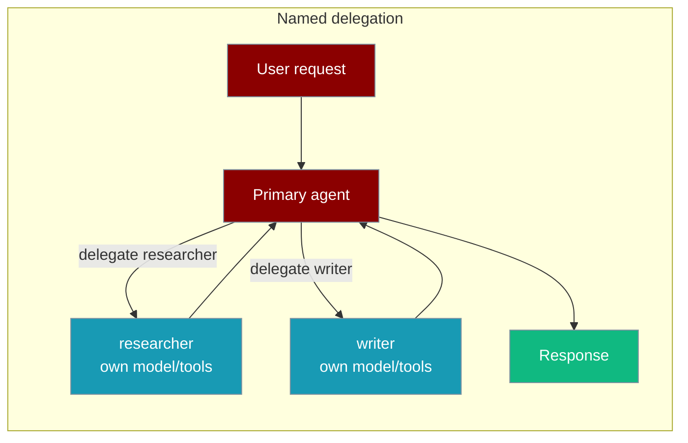
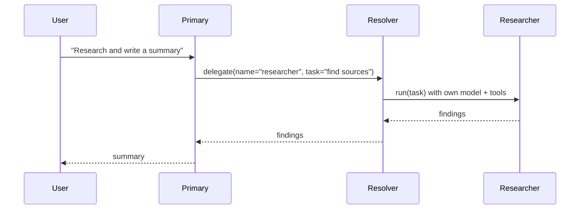
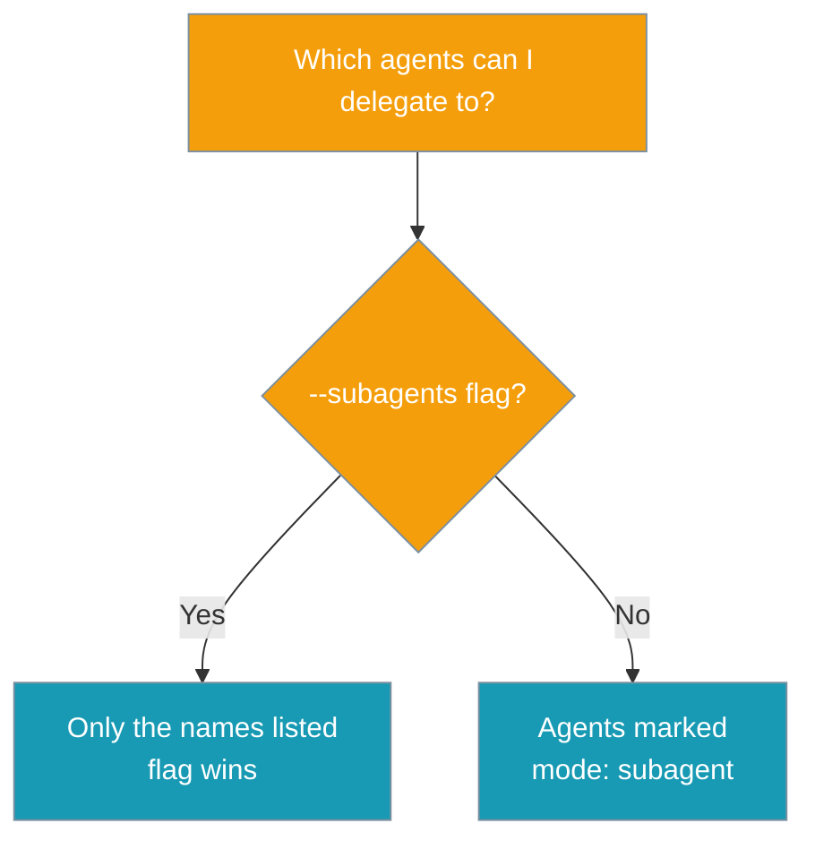

A running agent can delegate a sub-task to one of **your own named agents** by name, and that agent runs under its **own** model, tools, and permissions.

Define an agent in `.praisonai/agents/researcher.md`, then let any run delegate to it — no Python file required.



## Quick Start

<Steps>
<Step title="Define a named agent">

Create `.praisonai/agents/researcher.md`:

```markdown
---
name: researcher
mode: subagent
model: gpt-4o
tools:
  - web_search
---

You are a careful research subagent. Find primary sources and summarise them.
```

</Step>

<Step title="Delegate to it by name">

Run any agent with the `researcher` subagent exposed:

```bash
praisonai run --agent writer --subagents researcher "Write a summary of the 2024 EU AI Act"
```

The `writer` agent can now call `researcher` mid-run. `researcher` runs under **its own** model and tools.

</Step>
</Steps>

<Note>
`--subagents` applies to a named agent run (`--agent <name>`). The running agent gains a `spawn_subagent` tool whose description lists the agents it may delegate to.
</Note>

---

## How It Works

The wrapper discovers `.praisonai/agents/*.md`, builds a resolver, and hands it to the core subagent tool. When the model targets a named agent that resolves, that agent runs the sub-task under its own definition.



| Step | What happens |
|------|--------------|
| Discover | `.praisonai/agents/*.md` definitions are loaded |
| Expose | Delegatable agents are listed in the `spawn_subagent` tool description |
| Resolve | A targeted name is instantiated as its own `Agent` |
| Run | The named agent runs under **its own** model, tools, and permissions |
| Fall back | An unresolved name uses the existing generic spawn |

---

## Two Ways to Opt In

Choose which named agents a run may delegate to with either a CLI allow-list or a frontmatter marker.



<Tabs>
<Tab title="Allow-list (CLI flag)">

Expose specific agents for this run. The flag takes precedence over any markers:

```bash
praisonai run --agent writer --subagents researcher,reviewer "Draft and review the RFC"
```

</Tab>
<Tab title="Frontmatter marker">

Mark a definition delegatable so it is exposed whenever no `--subagents` flag is given:

```markdown
---
name: researcher
mode: subagent
model: gpt-4o
tools:
  - web_search
---

You are a careful research subagent…
```

```bash
praisonai run --agent writer "Draft the RFC using the researcher when you need sources"
```

</Tab>
</Tabs>

<Warning>
`mode: subagent` is a **marker**, not a permission mode. It only makes a definition delegatable — it grants no permissions. Scope tools and permissions with `model`, `tools`, and the `permission` block.
</Warning>

---

## Definition File Schema

Each `.praisonai/agents/<name>.md` file uses YAML frontmatter followed by the system prompt as the body.

| Key | Type | Description |
|-----|------|-------------|
| `name` | `string` | The delegation name (defaults to the filename stem) |
| `description` | `string` | Shown in the dynamic tool description so the primary agent knows when to pick this subagent |
| `mode: subagent` | `string` | Marker that makes this definition delegatable (not a permission mode) |
| `model` | `string` | LLM the subagent runs under (maps to `llm`) |
| `tools` | `list` | Tool names available to the subagent |
| `role` | `string` | Optional role |
| `goal` | `string` | Optional goal (used as the tool description when `description` is absent) |
| `permission` | `map` | Optional per-capability permission rules (e.g. `bash: {"*": deny}`) |

The Markdown body (after the frontmatter) becomes the agent's instructions.

---

## Common Patterns

Compose named agents into CLI-first workflows with no Python.

<AccordionGroup>
<Accordion title="Research → write pipeline">

Two named agents, each in its own file:

```markdown
---
name: researcher
mode: subagent
model: gpt-4o
tools:
  - web_search
---
Find primary sources and summarise them.
```

```markdown
---
name: writer
mode: subagent
model: gpt-4o
---
Write clear, well-structured prose from provided research.
```

```bash
praisonai run --agent writer --subagents researcher "Write a briefing on quantum error correction"
```

</Accordion>

<Accordion title="Selective reviewer">

Expose a reviewer the primary agent invokes only when it needs a second pass:

```markdown
---
name: reviewer
description: Audits drafts for accuracy and tone; read-only
mode: subagent
permission:
  edit: deny
  write: deny
---
You are a meticulous reviewer. Do not modify files.
```

```bash
praisonai run --agent writer --subagents reviewer "Draft the release notes, then have the reviewer check them"
```

</Accordion>

<Accordion title="CLI-first multi-agent — no Python">

A whole multi-agent workflow lives in Markdown files under `.praisonai/agents/`:

```bash
praisonai run --agent planner --subagents researcher,writer,reviewer "Plan, research, write, and review the report"
```

</Accordion>
</AccordionGroup>

---

## Best Practices

<AccordionGroup>
<Accordion title="Give each agent a clear description">
The `description` (or `goal`) appears in the tool description the primary agent sees, so a specific one-liner helps it pick the right subagent for each sub-task.
</Accordion>

<Accordion title="Scope tools per agent, not per caller">
A resolved named agent runs under its **own** `model`, `tools`, and `permission` — never the caller's. Keep each definition's tools minimal for its job.
</Accordion>

<Accordion title="Use the allow-list for one-off runs">
`--subagents a,b` opts agents in without editing files, and wins over `mode: subagent` markers. Use markers for agents you always want delegatable.
</Accordion>

<Accordion title="Backward compatible by default">
With no delegatable agents, nothing changes — the `spawn_subagent` tool is not wired. An unresolved name falls back to the existing generic spawn.
</Accordion>
</AccordionGroup>

---

## Related

<CardGroup cols={2}>
<Card title="Subagent Delegation" icon="users" href="/docs/features/subagent-delegation">
Programmatic spawn control, scoped permissions, and parallel fan-out.
</Card>
<Card title="Background Subagents" icon="rocket" href="/docs/features/background-subagents">
Fire-and-forget subagents that return a job ID and deliver results later.
</Card>
</CardGroup>
