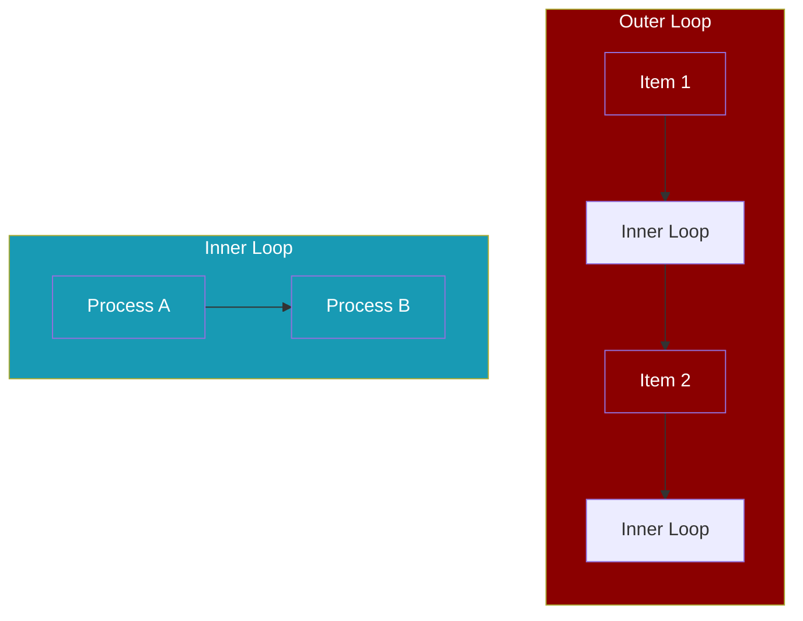
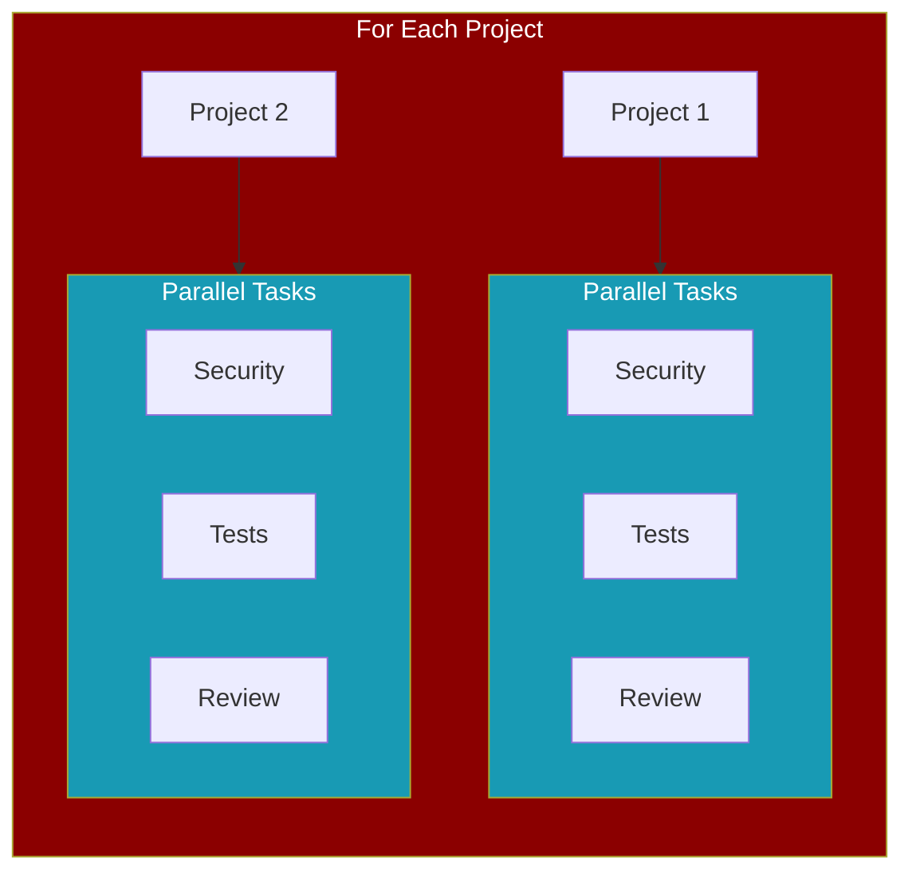

Nested workflows allow you to combine workflow patterns like loops, parallel execution, and routing to create sophisticated data processing pipelines.



## Quick Start

<CodeGroup>
```python Nested Loops
from praisonaiagents import AgentFlow, WorkflowContext, StepResult
from praisonaiagents.workflows import loop

def process_cell(ctx: WorkflowContext) -> StepResult:
    row = ctx.variables.get("row")
    col = ctx.variables.get("col")
    return StepResult(output=f"Processed {row}-{col}")

# Inner loop processes columns
inner = loop(process_cell, over="columns", var_name="col")

# Outer loop processes rows
outer = loop(steps=[inner], over="rows", var_name="row")

workflow = AgentFlow(
    steps=[outer],
    variables={
        "rows": ["A", "B"],
        "columns": ["1", "2", "3"]
    }
)
workflow.start("Process matrix")
```

```yaml YAML
workflow:
  steps:
    - loop:
        over: rows
        var_name: row
        steps:
          - loop:
              over: columns
              var_name: col
              steps:
                - agent: processor
                  action: "Process {{row}}-{{col}}"
```
</CodeGroup>

## Supported Nesting Patterns

<CardGroup cols={2}>
  <Card title="Loop in Loop" icon="arrows-rotate">
    Process multi-dimensional data like matrices or hierarchical structures
  </Card>
  <Card title="Parallel in Loop" icon="bolt">
    Run concurrent tasks for each item in a collection
  </Card>
  <Card title="Route in Loop" icon="code-branch">
    Make routing decisions for each item based on conditions
  </Card>
  <Card title="If in Loop" icon="code-compare">
    Apply conditional logic to each item during iteration
  </Card>
</CardGroup>

## Loop Inside Loop

Process nested data structures by placing one loop inside another.

<Tabs>
  <Tab title="Python">
```python
from praisonaiagents import AgentFlow, WorkflowContext, StepResult
from praisonaiagents.workflows import loop

results = []

def process_member(ctx: WorkflowContext) -> StepResult:
    team = ctx.variables.get("team", {})
    member = ctx.variables.get("member")
    results.append(f"{team['name']}/{member}")
    return StepResult(output=f"Processed {member}")

# Inner: process each member
member_loop = loop(process_member, over="members", var_name="member")

# Outer: process each team
team_loop = loop(steps=[member_loop], over="teams", var_name="team")

workflow = AgentFlow(
    steps=[team_loop],
    variables={
        "teams": [
            {"name": "Frontend", "members": ["Alice", "Bob"]},
            {"name": "Backend", "members": ["Charlie"]}
        ],
        "members": ["Dev1", "Dev2"]  # Default members
    }
)
workflow.start("Process organization")
# Results: ['Frontend/Dev1', 'Frontend/Dev2', 'Backend/Dev1', 'Backend/Dev2']
```
  </Tab>
  <Tab title="YAML">
```yaml
workflow:
  variables:
    teams:
      - name: Frontend
      - name: Backend
    members: ["Dev1", "Dev2"]
  
  steps:
    - loop:
        over: teams
        var_name: team
        steps:
          - loop:
              over: members
              var_name: member
              steps:
                - agent: processor
                  action: "Process {{member}} from {{team.name}}"
```
  </Tab>
</Tabs>

## Parallel Inside Loop

Run multiple tasks concurrently for each item in a loop.



```python
from praisonaiagents import AgentFlow, WorkflowContext, StepResult
from praisonaiagents.workflows import loop, parallel

def security_scan(ctx: WorkflowContext) -> StepResult:
    project = ctx.variables.get("project")
    return StepResult(output=f"Security scan: {project}")

def run_tests(ctx: WorkflowContext) -> StepResult:
    project = ctx.variables.get("project")
    return StepResult(output=f"Tests passed: {project}")

def code_review(ctx: WorkflowContext) -> StepResult:
    project = ctx.variables.get("project")
    return StepResult(output=f"Review complete: {project}")

# Parallel tasks for each project
parallel_tasks = parallel([security_scan, run_tests, code_review])

workflow = AgentFlow(
    steps=[
        loop(
            steps=[parallel_tasks],
            over="projects",
            var_name="project"
        )
    ],
    variables={"projects": ["api", "web", "mobile"]}
)
workflow.start("Analyze all projects")
```

## Route Inside Loop

Apply different processing logic to each item based on conditions.

```python
from praisonaiagents import AgentFlow, WorkflowContext, StepResult
from praisonaiagents.workflows import loop, route

def process_image(ctx: WorkflowContext) -> StepResult:
    return StepResult(output="Image processed")

def process_video(ctx: WorkflowContext) -> StepResult:
    return StepResult(output="Video processed")

def get_file_type(ctx: WorkflowContext) -> StepResult:
    file = ctx.variables.get("file", {})
    return StepResult(output=file.get("type", "unknown"))

# Route based on file type
type_router = route({
    "image": [process_image],
    "video": [process_video]
})

workflow = AgentFlow(
    steps=[
        loop(
            steps=[get_file_type, type_router],
            over="files",
            var_name="file"
        )
    ],
    variables={
        "files": [
            {"name": "photo.jpg", "type": "image"},
            {"name": "movie.mp4", "type": "video"}
        ]
    }
)
workflow.start("Process files")
```

## Depth Limit Protection

<Warning>
Nested workflows have a maximum depth of **5 levels** to prevent infinite recursion and stack overflow errors.
</Warning>

```python
from praisonaiagents.workflows import MAX_NESTING_DEPTH

print(f"Maximum nesting depth: {MAX_NESTING_DEPTH}")  # 5

# This will raise ValueError if depth exceeds 5
try:
    # Creating 6+ levels of nesting
    inner = loop(handler, over="items")
    for _ in range(5):
        inner = loop(steps=[inner], over="items")
    
    workflow = AgentFlow(steps=[inner], variables={"items": ["a"]})
    workflow.start("test")
except ValueError as e:
    print(f"Error: {e}")
    # "Maximum nesting depth (5) exceeded..."
```

## Best Practices

<AccordionGroup>
  <Accordion title="Keep Nesting Shallow">
    Aim for 2-3 levels of nesting maximum. If you need more, consider restructuring your workflow or breaking it into sub-workflows.
  </Accordion>
  
  <Accordion title="Use Meaningful Variable Names">
    Use descriptive `var_name` values like `customer`, `order`, `item` instead of generic names like `x`, `y`, `z`.
  </Accordion>
  
  <Accordion title="Consider Parallel for Performance">
    When processing independent items, use `parallel=True` in loops to speed up execution.
  </Accordion>
  
  <Accordion title="Handle Errors Gracefully">
    Add error handling in your step functions to prevent one failed item from stopping the entire workflow.
  </Accordion>
</AccordionGroup>

## Related

<CardGroup cols={2}>
  <Card title="Conditional Branching" icon="code-branch" href="/features/conditional-branching">
    Use if/then/else patterns for dynamic workflow paths
  </Card>
  <Card title="Workflow Loops" icon="arrows-rotate" href="/features/workflow-loop">
    Learn the basics of loop patterns
  </Card>
  <Card title="Parallel Execution" icon="bolt" href="/features/workflow-parallel">
    Run steps concurrently for better performance
  </Card>
  <Card title="Routing" icon="route" href="/features/workflow-routing">
    Route workflow execution based on conditions
  </Card>
</CardGroup>
