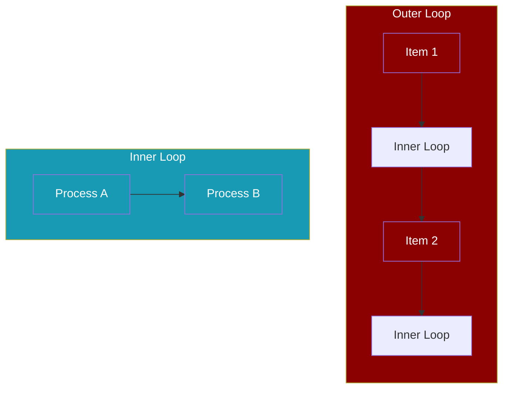

Nested workflows allow you to combine workflow patterns like loops, parallel execution, and routing to create sophisticated data processing pipelines.


```mermaid
flowchart TD
    subgraph Outer["Outer Loop"]
        direction TB
        A[Item 1] --> B[Inner Loop]
        B --> C[Item 2]
        C --> D[Inner Loop]
    end
    
    subgraph Inner["Inner Loop"]
        E[Process A] --> F[Process B]
    end
    
    style Outer fill:#8B0000,color:#fff
    style Inner fill:#189AB4,color:#fff
    style A fill:#8B0000,color:#fff
    style C fill:#8B0000,color:#fff
    style E fill:#189AB4,color:#fff
    style F fill:#189AB4,color:#fff
```

## Quick Start


<Steps>
<Step title="Simple Usage">
<CodeGroup>
```python Nested Loops
from praisonaiagents import AgentFlow, WorkflowContext, StepResult, loop

def process_cell(ctx: WorkflowContext) -> StepResult:
    row = ctx.variables.get("row")
    col = ctx.variables.get("col")
    return StepResult(output=f"Processed {row}-{col}")

# Inner loop processes columns
inner = loop(process_cell, over="columns", var_name="col")

# Outer loop processes rows
outer = loop(steps=[inner], over="rows", var_name="row")

workflow = AgentFlow(
    steps=[outer],
    variables={
        "rows": ["A", "B"],
        "columns": ["1", "2", "3"]
    }
)
workflow.start("Process matrix")
```
</Step>

<Step title="With Configuration">
```yaml YAML
workflow:
  steps:
    - loop:
        over: rows
        var_name: row
        steps:
          - loop:
              over: columns
              var_name: col
              steps:
                - agent: processor
                  action: "Process {{row}}-{{col}}"
```
</CodeGroup>
</Step>
</Steps>


## Best Practices

<AccordionGroup>
  <Accordion title="Start simple">
    Enable the feature with a single parameter before adding configuration. Verify it works, then layer in options.
  </Accordion>
  <Accordion title="Use environment variables for secrets">
    Never hardcode API keys or tokens. Use `os.getenv("KEY_NAME")` to read from environment variables.
  </Accordion>
  <Accordion title="Test with minimal examples first">
    Copy the Quick Start example, run it, then extend it. This confirms your environment is set up correctly.
  </Accordion>
  <Accordion title="Check the logs">
    Set `verbose=True` on your agent to see detailed execution logs when debugging unexpected behavior.
  </Accordion>
</AccordionGroup>

## Related

<CardGroup cols={2}>
  <Card title="Features Overview" icon="grid-2" href="/docs/features">
    Browse all PraisonAI features
  </Card>
  <Card title="Quick Start" icon="rocket" href="/docs/introduction">
    Get started with PraisonAI agents
  </Card>
</CardGroup>
