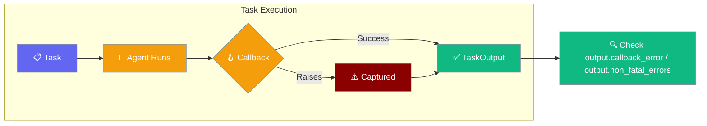
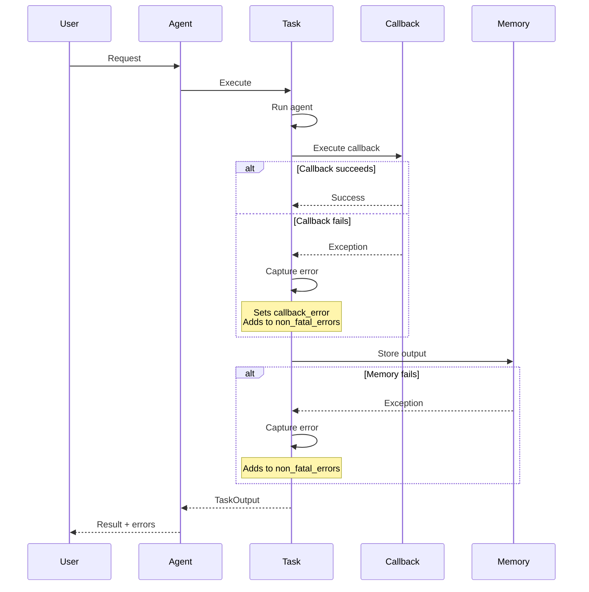
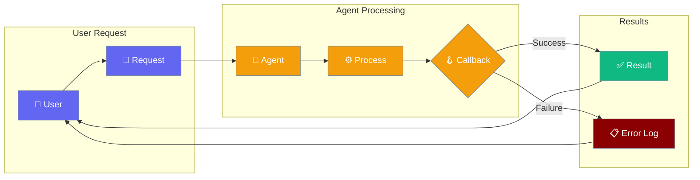

Non-fatal errors expose callback and memory failures that used to be silently swallowed, so your agent can see what went wrong without crashing the workflow.

<Note>
**Important Change**: LLM errors are no longer non-fatal by default. They now raise `LLMError` exceptions instead of being captured as non-fatal errors. See [Structured LLM Errors](/features/structured-llm-errors) for details.
</Note>



## Quick Start

<Steps>
<Step title="Reading non-fatal errors from a task output">
```python
from praisonaiagents import Agent, Task, PraisonAIAgents

def my_callback(output):
    raise RuntimeError("downstream webhook timed out")

agent = Agent(name="Reporter", instructions="Summarise the input.")
task = Task(description="Summarise 'hello'", agent=agent, callback=my_callback)

workflow = PraisonAIAgents(agents=[agent], tasks=[task])
workflow.start()

if task.output.callback_error:
    print("Callback failed:", task.output.callback_error)
if task.output.non_fatal_errors:
    for err in task.output.non_fatal_errors:
        print("Non-fatal:", err)
```
</Step>

<Step title="Inspecting accumulated errors on the Task itself">
```python
# Same workflow as above
for err in task.non_fatal_errors:
    print(err)   # e.g. "callback: downstream webhook timed out"
```
</Step>
</Steps>

---

## How It Works



| Surface | Type | When populated |
|---------|------|----------------|
| `TaskOutput.callback_error` | `Optional[str]` | Only if a `callback` function raises |
| `TaskOutput.non_fatal_errors` | `Optional[list[str]]` | All non-fatal errors (memory ops + callback) from this run |
| `Task.non_fatal_errors` | `list[str]` | Same list, available on the Task instance directly |

---

## Error Classification

### Non-Fatal Errors (Captured)
These errors are captured and stored in `non_fatal_errors` without stopping task execution:
- **Callback failures**: Exceptions in task `callback` functions
- **Memory operation failures**: Memory storage, retrieval, or quality check failures
- **Non-critical integrations**: Optional service failures

### Fatal Errors (Raised)
These errors now raise exceptions and stop task execution:
- **LLM errors**: Chat completion failures (now raise `LLMError`)
- **Tool execution failures**: Critical tool failures (raise `ToolExecutionError`) 
- **Validation errors**: Configuration or input validation failures

```python
from praisonaiagents import Agent, Task, PraisonAIAgents
from praisonaiagents.errors import LLMError

def failing_callback(output):
    raise Exception("Webhook failed")  # Non-fatal: captured

agent = Agent(name="Test Agent", instructions="Process input")
task = Task(
    description="Process data", 
    agent=agent, 
    callback=failing_callback
)

workflow = PraisonAIAgents(agents=[agent], tasks=[task])

try:
    workflow.start()
    # Check non-fatal errors
    if task.non_fatal_errors:
        print("Non-fatal errors:", task.non_fatal_errors)
        # ["callback: Webhook failed"]
except LLMError as e:
    # Fatal LLM errors are raised, not captured
    print(f"Fatal LLM error: {e.message}")
```

---

## Common Patterns

### Pattern A: Skip to next task only when callback succeeded

```python
from praisonaiagents import Agent, Task, PraisonAIAgents

def critical_callback(output):
    # This must succeed for the workflow to be valid
    pass

agent = Agent(name="Worker", instructions="Process the data.")
task = Task(description="Process input", agent=agent, callback=critical_callback)

workflow = PraisonAIAgents(agents=[agent], tasks=[task])
workflow.start()

# Only proceed if callback succeeded
if task.output.callback_error is None:
    print("Safe to continue to next task")
else:
    print("Workflow failed - callback error:", task.output.callback_error)
```

### Pattern B: Route failures to alerting system

```python
from praisonaiagents import Agent, Task, PraisonAIAgents

def alert_on_errors(task):
    if task.non_fatal_errors:
        # Send to monitoring system
        for error in task.non_fatal_errors:
            send_alert(f"Task {task.description}: {error}")

agent = Agent(name="Processor", instructions="Process data.")
task = Task(description="Important task", agent=agent)

workflow = PraisonAIAgents(agents=[agent], tasks=[task])
workflow.start()

alert_on_errors(task)
```

---

## User Interaction Flow



---

## Best Practices

<AccordionGroup>
<Accordion title="Don't treat non-fatal errors as success">
Always inspect the output before chaining tasks. A task that completed with non-fatal errors may not have produced the expected result.

```python
if task.output.non_fatal_errors:
    print("Task completed with issues:", task.output.non_fatal_errors)
    # Decide whether to continue or retry
```
</Accordion>

<Accordion title="Memory failures are non-fatal by design">
If `quality_check=True` was requested but the memory adapter isn't ready, the task still completes. Check `non_fatal_errors` for memory-related issues.

```python
# Look for memory-specific errors
memory_errors = [err for err in task.non_fatal_errors 
                if "memory" in err.lower()]
if memory_errors:
    print("Memory operations failed:", memory_errors)
```
</Accordion>

<Accordion title="Raise explicitly for critical callbacks">
If a callback must block the workflow on failure, re-raise inside it. The framework currently captures the message but does NOT re-raise automatically.

```python
def critical_callback(output):
    try:
        # Critical operation
        result = send_to_external_api(output.raw)
    except Exception as e:
        # Log the error and re-raise to stop the workflow
        log.error(f"Critical callback failed: {e}")
        raise  # This will stop the entire workflow
```
</Accordion>
</AccordionGroup>

---

## Related

<CardGroup cols={2}>
<Card title="Task Output" icon="display" href="/concepts/output">
  TaskOutput reference and all available fields
</Card>
<Card title="Task Lifecycle" icon="list-check" href="/concepts/tasks">
  Task execution phases and configuration
</Card>
</CardGroup>