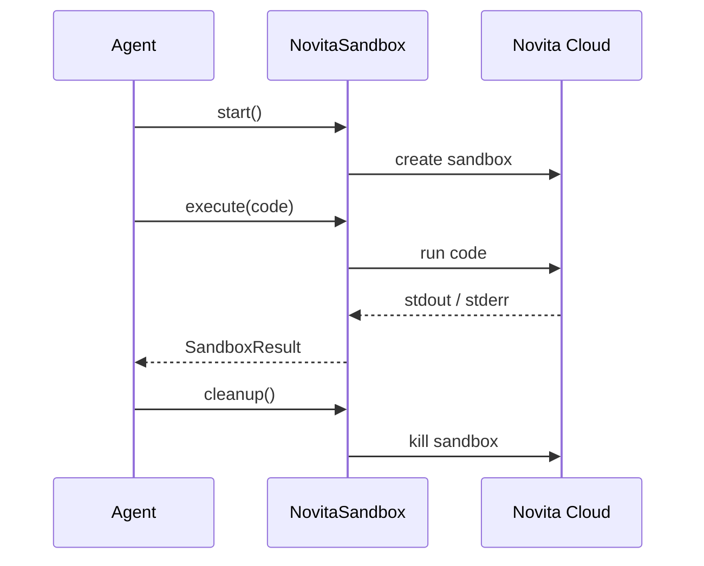

Novita is a cloud sandbox backend that runs your agent's code in an isolated remote environment — no local Docker, no host access.


## Quick Start

<Steps>
<Step title="Install and set your key">

```bash
pip install "praisonai-sandbox[novita]"
export NOVITA_API_KEY="your-api-key"
```

</Step>

<Step title="Run an agent in a Novita sandbox">

```python
from praisonaiagents import Agent, SandboxConfig

agent = Agent(
    name="Coder",
    instructions="Run code safely",
    sandbox=SandboxConfig.novita(),
)
agent.start("Print the current directory tree")
```

</Step>
</Steps>

The user asks the agent to run code; the agent hands it to a Novita cloud sandbox, which executes it in isolation and returns the result.

---

## How It Works

Each run starts a fresh Novita sandbox, executes the code, and cleans up.



`NovitaSandbox` implements the standard `SandboxProtocol` — `start`, `stop`, `execute`, `run_command`, `read_file`, `write_file`, `list_files`, `get_status`, `cleanup`, and `reset` — so it works anywhere the other cloud backends work.

---

## Configuration

`SandboxConfig.novita()` sets `sandbox_type="novita"` and reuses the shared sandbox settings.

| Option | Type | Default | Description |
|--------|------|---------|-------------|
| `sandbox_type` | `str` | `"novita"` | Selected automatically by `.novita()` |
| `NOVITA_API_KEY` | env var | _(required)_ | Novita API key; the sandbox is unavailable without it |

The sandbox honours the shared `resource_limits.timeout_seconds` from `SandboxConfig` when creating the remote environment.

```python
from praisonaiagents import Agent, SandboxConfig
from praisonaiagents.sandbox import ResourceLimits

config = SandboxConfig.novita()
config.resource_limits = ResourceLimits(timeout_seconds=120)

agent = Agent(
    name="DataAnalyst",
    instructions="Analyze data with Python.",
    sandbox=config,
)
agent.start("Read CSV data and create a summary")
```

---

## Use the Backend Directly

Import `NovitaSandbox` when you want the isolated runtime without an `Agent`.

```python
import asyncio
import os
from praisonai_sandbox import NovitaSandbox

os.environ["NOVITA_API_KEY"] = "your-api-key"

async def main():
    sandbox = NovitaSandbox()
    result = await sandbox.execute("print('Hello, World!')")
    print(result.stdout)
    await sandbox.cleanup()

asyncio.run(main())
```

---

## Best Practices

<AccordionGroup>
<Accordion title="Set NOVITA_API_KEY before selecting the backend">
`NovitaSandbox.is_available` returns `False` when the key is missing, so `start()` fails fast with an install-and-key hint. Set the key in your environment or CI secrets.
</Accordion>

<Accordion title="Install only the novita extra">
`pip install "praisonai-sandbox[novita]"` pulls `novita-sandbox>=2.0.0` and nothing else — keep the dependency tree slim by avoiding `[all]`.
</Accordion>

<Accordion title="Prefer a cloud backend for untrusted code">
Novita runs code off your host, so it's a safe default for code you don't fully trust — unlike the local `subprocess` backend.
</Accordion>

<Accordion title="Let cleanup run">
Each `execute` auto-starts the sandbox; call `cleanup()` (or rely on the agent's auto-cleanup) so remote sandboxes don't linger.
</Accordion>
</AccordionGroup>

---

## Related

<CardGroup cols={2}>
  <Card title="Sandbox Backends" icon="shield" href="/features/sandbox-backends">
    All cloud and local backends and how to choose between them
  </Card>
  <Card title="praisonai-sandbox Package" icon="box" href="/features/praisonai-sandbox-package">
    Standalone package and the full backend registry
  </Card>
</CardGroup>
