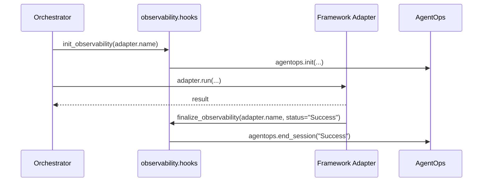

Observability Hooks provide a centralized entry and exit point for observability providers (AgentOps, future Langfuse, W&B) in PraisonAI and custom framework adapters.


`praisonai.observability.hooks.init_observability(framework_tag, *, tags=None)` and `finalize_observability(_framework_tag, *, status="Success")` are **public hooks**. The orchestrator calls both automatically; custom framework adapters should mirror the same pattern in `setup()` and at run end.

---

## Quick Start

<Steps>
<Step title="Default behaviour (just set the env var)">
```bash
export AGENTOPS_API_KEY=xxx
```

```python
from praisonai.agents_generator import AgentsGenerator

# init_observability and finalize_observability are called for you
gen = AgentsGenerator("agents.yaml", "crewai", config_list=[...])
gen.generate_crew_and_kickoff()
```
</Step>

<Step title="Custom tags from a custom adapter">
```python
from praisonai.framework_adapters.base import BaseFrameworkAdapter
from praisonai.observability.hooks import init_observability

class MyAdapter(BaseFrameworkAdapter):
    name = "myframework"

    def setup(self, *, framework_tag: str) -> None:
        # Add extra tags for this run
        init_observability(framework_tag, tags=["tenant=acme", "experiment=foo"])
```
</Step>

<Step title="Pair init with finalize in custom adapters">
```python
from praisonai.framework_adapters.base import BaseFrameworkAdapter
from praisonai.observability.hooks import init_observability, finalize_observability

class MyAdapter(BaseFrameworkAdapter):
    name = "myframework"

    def setup(self, *, framework_tag: str) -> None:
        init_observability(framework_tag, tags=["tenant=acme"])

    def run(self, ...):
        try:
            result = my_framework.execute(...)
            finalize_observability(self.name, status="Success")
            return result
        except Exception:
            finalize_observability(self.name, status="Failure")
            raise
```
</Step>

<Step title="Branch on availability">
```python
from praisonai.observability.hooks import is_agentops_available

if is_agentops_available():
    ...  # do extra setup
```
</Step>
</Steps>

---

## How It Works

`init_observability(framework_tag, *, tags=None)` centralizes observability initialization:

- **Auto-call site:** orchestrator calls `init_observability(adapter.name)` immediately after `assert_framework_available(...)` and before `adapter.setup(...)`
- **AgentOps init guard:** `agentops.init(...)` only fires if both (a) `is_agentops_available()` returns true, and (b) `AGENTOPS_API_KEY` is set in the env. Init is centralised here — `agents_generator` no longer double-inits AgentOps (PR #2062).
- **Failure mode:** `ImportError` (no agentops) is logged at `DEBUG`; any other exception is logged at `WARNING` and never propagated
- **`is_agentops_available()`** lazy function — prefer over the removed eager `AGENTOPS_AVAILABLE` constant in this module

`finalize_observability(_framework_tag, *, status="Success")` closes observability sessions symmetrically:

- **Auto-call site:** built-in adapters call `finalize_observability(self.name, status=...)` at the end of `run()`/`arun()` (both success and exception paths for AutoGen v0.4 and AG2)
- **AgentOps end guard:** `agentops.end_session(...)` only fires if `agentops` is importable
- **Failure mode:** `ImportError` returns silently; any other exception is logged at `WARNING` and never propagated
- **Why symmetric calls matter:** without `finalize_observability`, AgentOps dashboard sessions stay stuck "in progress"

The hook also leaves room for future providers (the source already has placeholder comments for `_init_langfuse` and `_init_wandb`), so users may want to know the surface area.



---

## Configuration

### `init_observability`

| Parameter | Type | Default | Description |
|---|---|---|---|
| `framework_tag` | `str` | required | Primary tag (e.g. `"crewai"`, `"autogen_v4"`). Becomes the first entry in `default_tags` passed to `agentops.init`. |
| `tags` | `list[str] \| None` | `None` | Extra tags appended after `framework_tag`. |

### `finalize_observability`

| Parameter | Type | Default | Description |
|---|---|---|---|
| `_framework_tag` | `str` | required | Framework name for context (reserved for future observability providers — currently unused, but pass `framework_tag` for forward-compat). |
| `status` | `str` (keyword-only) | `"Success"` | Session status passed to `agentops.end_session(...)`. Conventional values: `"Success"`, `"Failure"`. |

---

## Best Practices

<AccordionGroup>
<Accordion title="Always pair init with finalize">
The orchestrator auto-handles both hooks for built-in adapters. Custom adapters that bypass the orchestrator must call `finalize_observability` in `try`/`except` blocks to avoid stuck telemetry sessions on the AgentOps dashboard.
</Accordion>

<Accordion title="Status convention">
Use `status="Success"` for the happy path and `status="Failure"` in `except` blocks. The string is passed verbatim to `agentops.end_session(...)`; future providers may map other values.
</Accordion>

<Accordion title="Use for run-scoped tags only">
The orchestrator calls `init_observability(adapter.name)` once per run. If you call it again from `setup()`, you'll re-init with your tags (last call wins for AgentOps). Use this for run-scoped tags only:

```python
def setup(self, *, framework_tag: str) -> None:
    # Good - adds run-specific context
    init_observability(framework_tag, tags=[
        f"tenant={self.tenant_id}",
        f"experiment={self.experiment_name}"
    ])
```
</Accordion>

<Accordion title="Don't import agentops directly">
Don't import `agentops` at the top of your adapter — gate it behind `is_agentops_available()` or rely on the hook to no-op silently:

```python
# ✅ Good - use the hook or check availability
from praisonai.observability.hooks import is_agentops_available, init_observability

if is_agentops_available():
    # Safe to do AgentOps-specific setup
    pass

# ❌ Bad - direct import can fail
import agentops  # May fail if not installed
```
</Accordion>

<Accordion title="Future-proof for new providers">
New providers (Langfuse, W&B, etc.) will be added inside `_init_<provider>` helpers in `praisonai/observability/hooks.py` — calling `init_observability(...)` will automatically pick them up; you don't need to update adapter code:

```python
# Future providers will be added automatically
def init_observability(framework_tag, *, tags=None):
    _init_agentops(framework_tag, tags or [])
    # _init_langfuse(framework_tag, tags)    # Future
    # _init_wandb(framework_tag, tags)       # Future
```
</Accordion>
</AccordionGroup>

---

## Related

<CardGroup cols={2}>
<Card title="AgentOps" icon="robot" href="/docs/observability/agentops">
  AgentOps integration documentation
</Card>
<Card title="Framework Adapter Plugins" icon="puzzle-piece" href="/docs/features/framework-adapter-plugins">
  How to create custom framework adapters
</Card>
</CardGroup>
