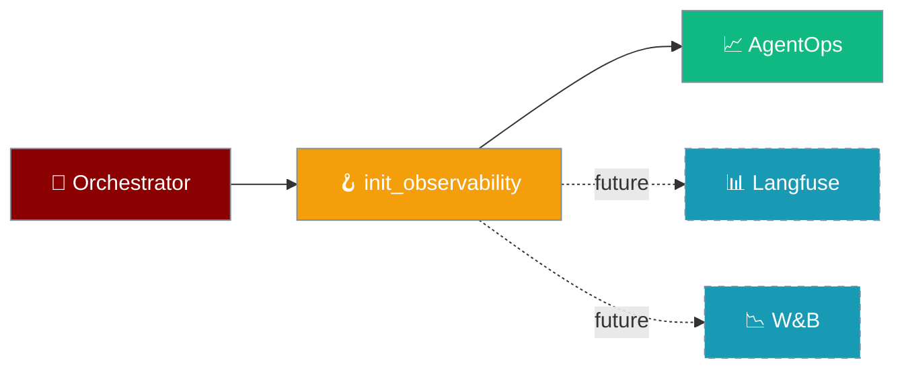

Observability Hooks provide a centralized entry point for initializing observability providers (AgentOps, future Langfuse, W&B) in PraisonAI and custom framework adapters.



`praisonai.observability.hooks.init_observability(framework_tag, *, tags=None)` is now a **public hook**, called automatically by the orchestrator and intended to be called by custom framework adapters' `setup()` method.

---

## Quick Start

<Steps>
<Step title="Default behaviour (just set the env var)">
```bash
export AGENTOPS_API_KEY=xxx
```

```python
from praisonai.agents_generator import AgentsGenerator

# init_observability is called for you, with framework_tag = resolved adapter name
gen = AgentsGenerator("agents.yaml", "crewai", config_list=[...])
gen.generate_crew_and_kickoff()
```
</Step>

<Step title="Custom tags from a custom adapter">
```python
from praisonai.framework_adapters.base import BaseFrameworkAdapter
from praisonai.observability.hooks import init_observability

class MyAdapter(BaseFrameworkAdapter):
    name = "myframework"

    def setup(self, *, framework_tag: str) -> None:
        # Add extra tags for this run
        init_observability(framework_tag, tags=["tenant=acme", "experiment=foo"])
```
</Step>

<Step title="Branch on availability">
```python
from praisonai.observability.hooks import AGENTOPS_AVAILABLE

if AGENTOPS_AVAILABLE:
    ...  # do extra setup
```

<Note>
**PR #2062 (2026-06-22):** `AGENTOPS_AVAILABLE` remains available in `praisonai.observability.hooks` as a module-level constant for backward compatibility. Internally, AgentOps init is no longer duplicated between `agents_generator.py` and `hooks.py` — it is now fully centralized in `hooks.py`. Double-initialization of AgentOps is no longer possible.
</Note>
</Step>
</Steps>

---

## How It Works

`init_observability(framework_tag, *, tags=None)` centralizes observability initialization:

- **Auto-call site:** orchestrator calls `init_observability(adapter.name)` immediately after `assert_framework_available(...)` and before `adapter.setup(...)`
- **AgentOps init guard:** `agentops.init(...)` only fires if both (a) `agentops` is importable, and (b) `AGENTOPS_API_KEY` is set in the env
- **Failure mode:** `ImportError` (no agentops) is logged at `DEBUG`; any other exception is logged at `WARNING` and never propagated
- **`AGENTOPS_AVAILABLE`** module-level boolean for code that wants to short-circuit instrumentation entirely
- **No double-init:** `agents_generator._init_observability` delegates to `hooks.py` — AgentOps is initialized exactly once per run

The hook also leaves room for future providers (the source already has placeholder comments for `_init_langfuse` and `_init_wandb`), so users may want to know the surface area.

---

## Configuration

| Parameter | Type | Default | Description |
|---|---|---|---|
| `framework_tag` | `str` | required | Primary tag (e.g. `"crewai"`, `"autogen_v4"`). Becomes the first entry in `default_tags` passed to `agentops.init`. |
| `tags` | `list[str] \| None` | `None` | Extra tags appended after `framework_tag`. |

---

## Best Practices

<AccordionGroup>
<Accordion title="Use for run-scoped tags only">
The orchestrator calls `init_observability(adapter.name)` once per run. If you call it again from `setup()`, you'll re-init with your tags (last call wins for AgentOps). Use this for run-scoped tags only:

```python
def setup(self, *, framework_tag: str) -> None:
    # Good - adds run-specific context
    init_observability(framework_tag, tags=[
        f"tenant={self.tenant_id}",
        f"experiment={self.experiment_name}"
    ])
```
</Accordion>

<Accordion title="Don't import agentops directly">
Don't import `agentops` at the top of your adapter — gate it behind `AGENTOPS_AVAILABLE` or rely on the hook to no-op silently:

```python
# ✅ Good - use the hook or check availability
from praisonai.observability.hooks import AGENTOPS_AVAILABLE, init_observability

if AGENTOPS_AVAILABLE:
    # Safe to do AgentOps-specific setup
    pass

# ❌ Bad - direct import can fail
import agentops  # May fail if not installed
```

<Note>
`AGENTOPS_AVAILABLE` is a module-level constant set at import time. Since PR #2062, AgentOps initialization is fully centralized in `observability/hooks.py` — the `agents_generator` no longer calls `agentops.init` directly, so double-initialization is no longer a risk.
</Note>
</Accordion>

<Accordion title="Future-proof for new providers">
New providers (Langfuse, W&B, etc.) will be added inside `_init_<provider>` helpers in `praisonai/observability/hooks.py` — calling `init_observability(...)` will automatically pick them up; you don't need to update adapter code:

```python
# Future providers will be added automatically
def init_observability(framework_tag, *, tags=None):
    _init_agentops(framework_tag, tags or [])
    # _init_langfuse(framework_tag, tags)    # Future
    # _init_wandb(framework_tag, tags)       # Future
```
</Accordion>
</AccordionGroup>

---

## Related

<CardGroup cols={2}>
<Card title="AgentOps" icon="robot" href="/docs/observability/agentops">
  AgentOps integration documentation
</Card>
<Card title="Framework Adapter Plugins" icon="puzzle-piece" href="/docs/features/framework-adapter-plugins">
  How to create custom framework adapters
</Card>
</CardGroup>