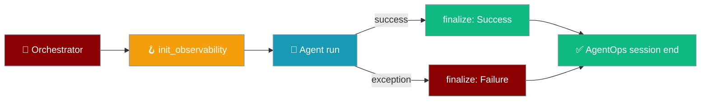
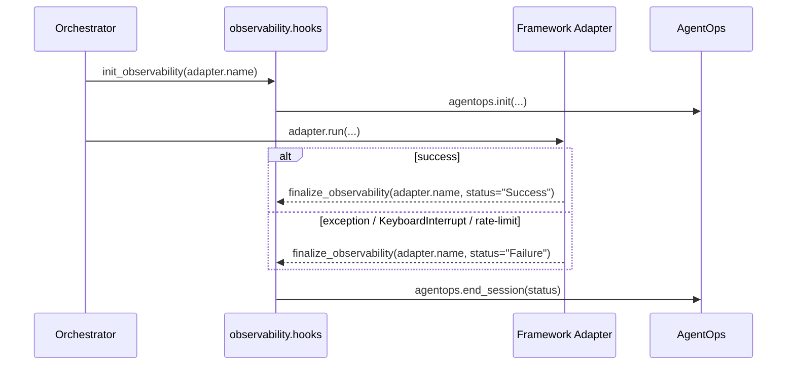
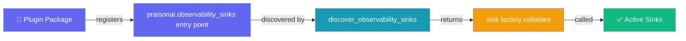

```python
from praisonaiagents import Agent

agent = Agent(
    name="observable-agent",
    instructions="Run with observability hooks for tracing.",
)
agent.start("Process this request and emit trace events.")
```


Observability Hooks provide a centralized entry and exit point for observability providers (AgentOps, future Langfuse, W&B) in PraisonAI and custom framework adapters.

The user starts an orchestrated run; init and finalize hooks emit traces to AgentOps and other providers.



`praisonai.observability.hooks.init_observability(framework_tag, *, tags=None)` and `finalize_observability(_framework_tag, *, status=...)` are **public hooks**. The orchestrator calls both automatically; custom framework adapters should use `observability_session()` as the recommended pattern.

---

## Quick Start

<Steps>
<Step title="Simple Usage">
```bash
# From https://app.agentops.ai
export AGENTOPS_API_KEY=...
```

```python
from praisonai.agents_generator import AgentsGenerator

# init_observability and finalize_observability are called for you
gen = AgentsGenerator("agents.yaml", "crewai", config_list=[...])
gen.generate_crew_and_kickoff()
```
</Step>

<Step title="With Configuration">
```python
from praisonai.framework_adapters.base import BaseFrameworkAdapter
from praisonai.observability.hooks import init_observability

class MyAdapter(BaseFrameworkAdapter):
    name = "myframework"

    def setup(self, *, framework_tag: str) -> None:
        # Add extra tags for this run
        init_observability(framework_tag, tags=["tenant=acme", "experiment=foo"])
```
</Step>

<Step title="Pair init with finalize in custom adapters">
```python
from praisonai.framework_adapters.base import BaseFrameworkAdapter
from praisonai.observability.hooks import observability_session

class MyAdapter(BaseFrameworkAdapter):
    name = "myframework"

    def run(self, *args, **kwargs):
        with observability_session(self.name, tags=["tenant=acme"]):
            return my_framework.execute(...)
```

`observability_session` calls `init_observability` on entry and `finalize_observability` on exit. Status is derived from `sys.exc_info()` automatically, so success/failure is tagged correctly with no boilerplate.

<AccordionGroup>
<Accordion title="Alternative: manual try/except pattern">
```python
from praisonai.framework_adapters.base import BaseFrameworkAdapter
from praisonai.observability.hooks import init_observability, finalize_observability

class MyAdapter(BaseFrameworkAdapter):
    name = "myframework"

    def setup(self, *, framework_tag: str) -> None:
        init_observability(framework_tag, tags=["tenant=acme"])

    def run(self, *args, **kwargs):
        try:
            result = my_framework.execute(...)
            return result
        except Exception:
            raise
        finally:
            import sys
            status = "Failure" if sys.exc_info()[0] is not None else "Success"
            finalize_observability(self.name, status=status)
```
</Accordion>
</AccordionGroup>
</Step>

<Step title="Branch on availability">
```python
from praisonai.observability.hooks import is_agentops_available

if is_agentops_available():
    ...  # do extra setup
```
</Step>
</Steps>

---

## How It Works

`init_observability(framework_tag, *, tags=None)` centralizes observability initialization:

- **Auto-call site:** orchestrator calls `init_observability(adapter.name)` immediately after `assert_framework_available(...)` and before `adapter.setup(...)`
- **AgentOps init guard:** `agentops.init(...)` only fires if both (a) `is_agentops_available()` returns true, and (b) `AGENTOPS_API_KEY` is set in the env. Init is centralised here — `agents_generator` no longer double-inits AgentOps (PR #2062).
- **Failure mode:** `ImportError` (no agentops) is logged at `DEBUG`; any other exception is logged at `WARNING` and never propagated
- **`is_agentops_available()`** lazy function — prefer over the removed eager `AGENTOPS_AVAILABLE` constant in this module

`finalize_observability(_framework_tag, *, status=...)` closes observability sessions symmetrically:

- **Auto-call site:** built-in adapters (`praisonai_adapter`, `crewai_adapter`, AutoGen v0.4, AG2) now wrap `run()`/`arun()` in a `try: ... finally:` block. `finalize_observability(self.name, status=status)` is called from that `finally`, with `status` derived from `sys.exc_info()`. AgentOps sessions are tagged `"Success"` on the happy path and `"Failure"` whenever an exception is propagating (including `KeyboardInterrupt`, LLM errors, rate limits, cancellation).
- **AgentOps end guard:** `agentops.end_session(...)` only fires if `agentops` is importable
- **Failure mode:** `ImportError` returns silently; any other exception is logged at `WARNING` and never propagated
- **Why symmetric calls matter:** without `finalize_observability`, AgentOps dashboard sessions stay stuck "in progress"

The hook also leaves room for future providers (the source already has placeholder comments for `_init_langfuse` and `_init_wandb`), so users may want to know the surface area.



---

## Configuration

### `init_observability`

| Parameter | Type | Default | Description |
|---|---|---|---|
| `framework_tag` | `str` | required | Primary tag (e.g. `"crewai"`, `"autogen_v4"`). Becomes the first entry in `default_tags` passed to `agentops.init`. |
| `tags` | `list[str] \| None` | `None` | Extra tags appended after `framework_tag`. |

### `finalize_observability`

| Parameter | Type | Default | Description |
|---|---|---|---|
| `_framework_tag` | `str` | required | Framework name for context (reserved for future observability providers — currently unused, but pass `framework_tag` for forward-compat). |
| `status` | `str` (keyword-only) | `"Success"` | Session status passed to `agentops.end_session(...)`. Conventional values: `"Success"`, `"Failure"`. |

### `observability_session`

| Parameter | Type | Default | Description |
|---|---|---|---|
| `framework_tag` | `str` | required | Framework tag passed to `init_observability` and `finalize_observability`. |
| `tags` | `list[str] \| None` | `None` | Extra tags forwarded to `init_observability`. |

Returns a context manager (`ContextManager[None]`). Status is auto-derived from `sys.exc_info()` — no `status` kwarg needed.

### `discover_observability_sinks`

| Signature | Returns | Description |
|---|---|---|
| `() -> list[Callable]` | List of factory callables | Returns entry-point-registered sink factories. Lazy + best-effort: broken plugins are logged at `DEBUG` and never break a run. |

---

## Third-party sink plugins

Third-party packages can register an observability sink factory under the `praisonai.observability_sinks` entry-point group. PraisonAI discovers them lazily via `discover_observability_sinks()` — broken plugins are logged at `DEBUG` and never break a run.



### Register a sink (plugin authors)

```toml
# pyproject.toml in your plugin package
[project.entry-points."praisonai.observability_sinks"]
my_sink = "my_package.sinks:my_sink_factory"
```

Your factory is a zero-arg (or framework-tag-aware) callable that returns a sink implementing the core SDK's `TraceSinkProtocol`.

### Discover registered sinks

```python
from praisonai.observability.hooks import discover_observability_sinks

for factory in discover_observability_sinks():
    sink = factory()
    ...
```

---

## Best Practices

<AccordionGroup>
<Accordion title="Use observability_session for custom adapters">
`observability_session` is the recommended pattern for custom adapters. It guarantees `finalize_observability` always runs — on success and on any failure — with the correct status derived from `sys.exc_info()`. This prevents AgentOps/other sessions from being orphaned in an "in progress" state on error, `KeyboardInterrupt`, or rate-limit paths.

```python
from praisonai.observability.hooks import observability_session

class MyAdapter(BaseFrameworkAdapter):
    def run(self, *args, **kwargs):
        with observability_session(self.name, tags=["tenant=acme"]):
            return my_framework.execute(...)
```
</Accordion>

<Accordion title="Status convention">
Use `status="Success"` for the happy path and `status="Failure"` in exception cases. The string is passed verbatim to `agentops.end_session(...)`; future providers may map other values. When using `observability_session`, status is derived automatically.
</Accordion>

<Accordion title="Use for run-scoped tags only">
The orchestrator calls `init_observability(adapter.name)` once per run. If you call it again from `setup()`, you'll re-init with your tags (last call wins for AgentOps). Use this for run-scoped tags only:

```python
def setup(self, *, framework_tag: str) -> None:
    # Good - adds run-specific context
    init_observability(framework_tag, tags=[
        f"tenant={self.tenant_id}",
        f"experiment={self.experiment_name}"
    ])
```
</Accordion>

<Accordion title="Don't import agentops directly">
Don't import `agentops` at the top of your adapter — gate it behind `is_agentops_available()` or rely on the hook to no-op silently:

```python
# ✅ Good - use the hook or check availability
from praisonai.observability.hooks import is_agentops_available, init_observability

if is_agentops_available():
    # Safe to do AgentOps-specific setup
    pass

# ❌ Bad - direct import can fail
import agentops  # May fail if not installed
```
</Accordion>

<Accordion title="Future-proof for new providers">
New providers (Langfuse, W&B, etc.) will be added inside `_init_<provider>` helpers in `praisonai/observability/hooks.py` — calling `init_observability(...)` will automatically pick them up; you don't need to update adapter code:

```python
# Future providers will be added automatically
def init_observability(framework_tag, *, tags=None):
    _init_agentops(framework_tag, tags or [])
    # _init_langfuse(framework_tag, tags)    # Future
    # _init_wandb(framework_tag, tags)       # Future
```
</Accordion>
</AccordionGroup>

---

## Related

<CardGroup cols={2}>
<Card title="AgentOps" icon="robot" href="/docs/observability/agentops">
  AgentOps integration documentation
</Card>
<Card title="Framework Adapter Plugins" icon="puzzle-piece" href="/docs/features/framework-adapter-plugins">
  How to create custom framework adapters
</Card>
<Card title="Custom Tracing" icon="plug" href="/docs/observability/custom-tracing">
  ContextTraceSink protocol and third-party sink plugins
</Card>
<Card title="Gateway Tracing Hook" icon="route" href="/docs/features/gateway-tracing-hook">
  Emit OpenTelemetry spans across each gateway pipeline stage
</Card>
</CardGroup>
