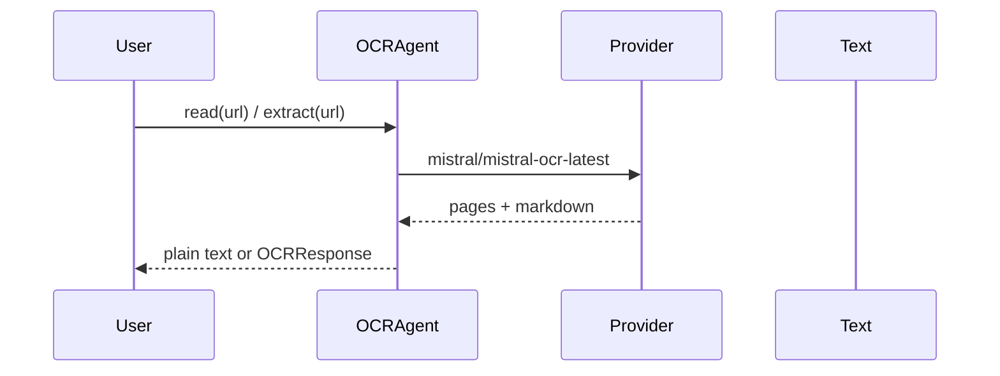

Extract text from PDFs and images with `OCRAgent` — pass a URL or base64 source and get markdown-ready text back.


<Note>Source must be a URL (`https://`) or base64-encoded document. Local file paths are not supported. Currently only Mistral (`mistral/mistral-ocr-latest`) is supported.</Note>

## Quick Start

<Steps>

<Step title="Extract text from a PDF">

```python
from praisonaiagents import Agent, OCRAgent

ocr = OCRAgent()
text = ocr.read("https://arxiv.org/pdf/2201.04234")

agent = Agent(name="Reader", instructions="Summarise documents clearly.")
summary = agent.start(f"Summarise this paper:\n\n{text[:4000]}")
```

</Step>

<Step title="Configure with OCRConfig">

```python
import os
from praisonaiagents import OCRAgent, OCRConfig

config = OCRConfig(
    pages=[0, 1],
    timeout=300,
    api_key=os.getenv("MISTRAL_API_KEY"),
)

ocr = OCRAgent(ocr=config)
result = ocr.extract("https://arxiv.org/pdf/2201.04234")

for page in result.pages:
    print(f"Page {page.index}: {page.markdown[:100]}")
```

</Step>

<Step title="Async extraction">

```python
import asyncio
from praisonaiagents import OCRAgent

async def main():
    ocr = OCRAgent()
    text = await ocr.aread("https://example.com/screenshot.png")
    print(text)

asyncio.run(main())
```

</Step>

</Steps>

## How It Works



| Method | Returns | Use when |
|--------|---------|----------|
| `read` / `aread` | `str` (markdown) | You only need plain text |
| `extract` / `aextract` | Full result with `pages` | You need per-page markdown or metadata |

## Configuration Options

<CardGroup cols={2}>
  <Card title="OCRAgent" icon="robot" href="/docs/sdk/reference/praisonaiagents/classes/OCRAgent">
    Agent class reference
  </Card>
  <Card title="OCRConfig" icon="sliders" href="/docs/sdk/reference/praisonaiagents/classes/OCRConfig">
    Configuration dataclass
  </Card>
</CardGroup>

| Option | Type | Default | Description |
|--------|------|---------|-------------|
| `include_image_base64` | `bool` | `False` | Include base64-encoded image bytes in the result |
| `pages` | `Optional[List[int]]` | `None` | Specific page indexes to extract (0-indexed) |
| `image_limit` | `Optional[int]` | `None` | Max images to process |
| `timeout` | `int` | `600` | Request timeout in seconds |
| `api_base` | `Optional[str]` | `None` | Override provider base URL |
| `api_key` | `Optional[str]` | `None` | Override provider API key |

## Common Patterns

<Tabs>

<Tab title="Specific pages">

```python
from praisonaiagents import OCRAgent

ocr = OCRAgent()
result = ocr.extract("https://example.com/large.pdf", pages=[0, 1, 2])
print(result.pages[0].markdown)
```

</Tab>

<Tab title="Image URL">

```python
from praisonaiagents import OCRAgent

ocr = OCRAgent()
text = ocr.read("https://example.com/screenshot.png")
print(text)
```

</Tab>

<Tab title="Batch loop">

```python
from praisonaiagents import OCRAgent

ocr = OCRAgent()
urls = [
    "https://example.com/doc1.pdf",
    "https://example.com/doc2.pdf",
]

for url in urls:
    print(ocr.read(url)[:500])
```

</Tab>

<Tab title="Async concurrency">

```python
import asyncio
from praisonaiagents import OCRAgent

async def extract_all(urls):
    ocr = OCRAgent()
    tasks = [ocr.aread(url) for url in urls]
    return await asyncio.gather(*tasks)

texts = asyncio.run(extract_all(["https://example.com/a.pdf", "https://example.com/b.pdf"]))
```

</Tab>

</Tabs>

## Providers

<CardGroup cols={2}>
  <Card title="Mistral OCR" icon="m" href="/docs/ocr/mistral">
    Provider setup and model options
  </Card>
</CardGroup>

## Best Practices

<AccordionGroup>

<Accordion title="Use HTTPS URLs or base64">
Local file paths are not supported — upload to a reachable URL or encode as base64 before calling `OCRAgent`.
</Accordion>

<Accordion title="Extract pages selectively for large PDFs">
Use `pages=[0, 1, 2]` via `OCRConfig` or method kwargs to limit cost and latency on multi-hundred-page documents.
</Accordion>

<Accordion title="Tune timeout for slow documents">
Default timeout is 600 seconds. Lower it for quick image OCR; raise it for large scanned PDFs.
</Accordion>

<Accordion title="API key precedence">
Pass `api_key` on `OCRConfig`, on `OCRAgent(...)`, or set `MISTRAL_API_KEY` in the environment — instance config wins over env vars.
</Accordion>

</AccordionGroup>

## Related

<CardGroup cols={2}>
  <Card title="Knowledge" icon="brain" href="/docs/features/knowledge">
    Index extracted text for retrieval
  </Card>
  <Card title="Tools" icon="wrench" href="/docs/concepts/tools">
    Give agents document-processing tools
  </Card>
</CardGroup>
